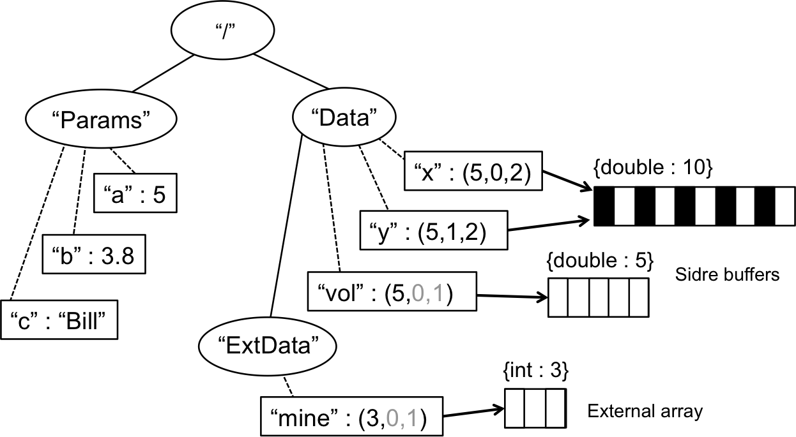

******************************************************
An introductory example
******************************************************

As an introduction to the core concepts in Sidre and how they work, we 
discuss a simple example in which we construct the data hierarchy
in the following figure:

Here, ovals represent Sidre Group objects. Each Group has a name (string
inside the oval), a single parent Group, and one or more child Groups 
(indicated by solid lines between ovals). Note that the "root" Group
(i.e., "/") has no parent. Each Group also owns one or more View objects.
Views are shown as rectangles and a dashed line connect each View to the 
Group that owns it.

A Sidre View object has a name (string inside the rectangle) and some data
associated with it. Here, we show various types of data that can be described 
by a View, including scalars, strings, and arrays (both "external" and 
living in Sidre Buffers). To keep the figure simple, we do not show any 
details of data description in the Views. However, for the array Views 
("x", "y", "vol", "mine"), we include a triple indicating the number of 
elements, offset, and stride for the View. These values are with respect 
to the data pointer that references the data associated with the View. Black
black values indictae those that are explicitly provided in the View 
description in the code example below; grey values are defaults that are
not provided in the code. Other aspects of View descriptions will 
become more clear when we show C++ code that constructs this data 
organization next. Sidre provides full C and Fortran APIs that can also 
be used to generate the same result.
 
.. code-block:: cpp

  // 'using' directives to simplify code
  using namespace asctoolkit;
  using namespace sidre;

  // Create Sidre datastore object and get root group
  DataStore* ds = new DataStore();
  Group* root = ds->getRoot();

  // Create group children of root group

  Group* params = root->createChildGroup("Params");
  Group* data = root->createChildGroup("Data");

  // Populate "Params" group with scalars

  params->createViewScalar("a", 5);
  params->createViewScalar("b", 3.8);
  params->createViewString("c", "Bill");

  // Populate "Data" group
  // 
  // 'x' and 'y' are two views into a shared Sidre buffer object
  // that holds 10 doubles. Each view is described by number of elements, 
  // offset, and stride into that data

  Buffer* buff = ds->createBuffer(sidre::DOUBLE_ID, 10)->allocate(); 
  data->createView("x", buff)->apply(sidre::DOUBLE_ID, 5, 0, 2);
  data->createView("y", buff)->apply(sidre::DOUBLE_ID, 5, 1, 2);

  // 'vol' is a view into a buffer that it does not share with another view.
  // in this case, the data can be allocated directly through the view object.

  data->createViewAndAllocate("vol", sidre::DOUBLE_ID, 5);

  // The "Data" group also contains a child group, which holds a pointer
  // to an externally owned integer array. although, Sidre does not own the
  // data, the data can still be described to Sidre.

  int* my_data = ...;

  Group* ext_data = data->createChildGroup("ExtData");
  mine = ext_data->createView("mine", my_data)->apply(sidre::INT_ID,3);

It is important to note that Sidre operations that create Buffers, Groups, 
and Views return a pointer to the object that is created. This allows chaining 
operations; for example::

  Buffer* buff = ds->createBuffer(sidre::DOUBLE_ID, 10)->allocate(); 

or::

  data->createView("x", buff)->apply(sidre::DOUBLE_ID, 5, 0, 2);

Similarly, many other Sidre operations return a pointer to the object on 
which the method is called, which enables similar operation chaining.

Lastly, we show a few instances of how to retrieve data items out of 
the hierarchy.

.. code-block:: cpp

  // Access items in "Params" group
  int a = params->getView("a")->getScalar():
  double b = params->getView("b")->getScalar():
  char* c = params->getView("c")->getString();

  // Access some items in "Data" group
  double* y = data->getView("y")->getArray();
  double* vol = data->getView("vol")->getArray();
  double* mine = data->getView("ExtData/mine")->getArray();
  
Before we note that Unix-like path syntax, using the slash ("/") delimiter,
is supported for traversing Sidre Group and View hierarchies. An example of
this if shown in the last line of the code example above. The getView()
method call retrieves the View named "mine" in the Group "ExtData" that is
a child of the "Data" Group. Similar path syntax can be used to retrieve 
Groups, create Groups and Views, etc. The assumption is that the character 
sequences before the first slash and those between two consecutive slashes are
Group names (describing parent-child relationships) and the name following
the last slash-delimiter is the name of a View.
