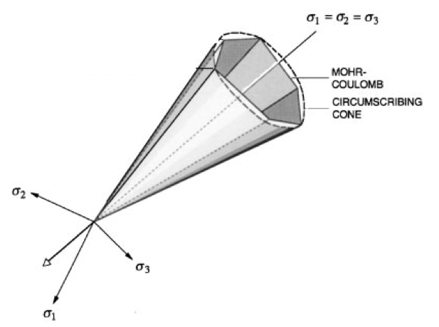
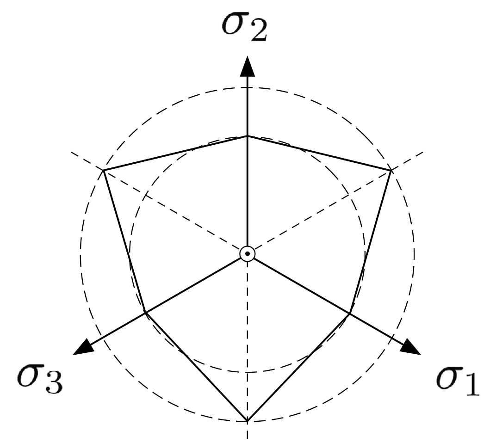
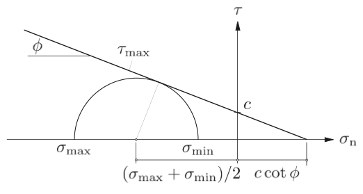
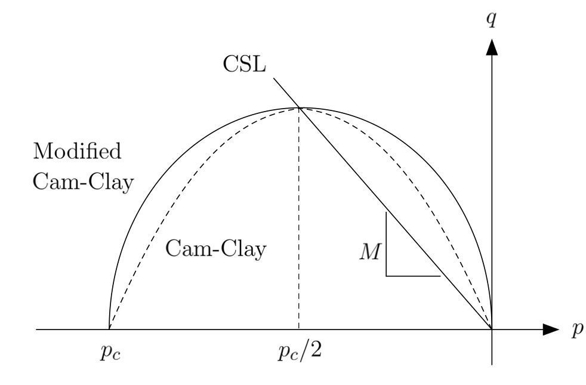
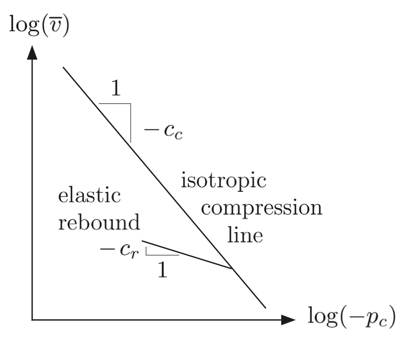

.. _TwoInvariantPlasticity:

############################################
Plasticity models
############################################

Two-invariant plasticity solid models
=========================================
Overview
-----------------
According to the `theory of plasticity  <https://en.wikipedia.org/wiki/Flow_plasticity_theory>`__, total strain :math:`\boldsymbol{\epsilon}` can be additively split into elastic (:math:`\boldsymbol{\epsilon}^e`) and plastic :math:`\boldsymbol{\epsilon}^p`) strains:

.. math::
   \boldsymbol{\epsilon} = \boldsymbol{\epsilon}^e + \boldsymbol{\epsilon}^p.

The plastic strain tensor is obtained from the flow rule: 

.. math::
   \dot{\boldsymbol{\epsilon}}^p=\dot{\lambda}\frac{\partial g}{\partial\boldsymbol{\sigma}},
   
in which :math:`\dot{\lambda} \geq 0` is the magnitude of plastic strain rate and :math:`g` is the plastic potential. The elastic strain is related to Cauchy stress tensor in rate form as:

.. math::
  \dot{\boldsymbol{\sigma}} = \tensor{C}^e \cdot \dot{\boldsymbol{\epsilon}}^e,

where :math:`\tensor{C}^e` is the fourth order elastic stiffness tensor. The Cauchy stress tensor is related to the total strain as

.. math::
  \dot{\boldsymbol{\sigma}} = \boldsymbol{C}^{ep} \cdot \dot{\boldsymbol{\epsilon}}, 
  
in which :math:`\tensor{C}^{ep}` is the fourth order elasto-plastic stiffness tensor.

Two-invariant plasticity models use the first invariant of the Cauchy stress tensor and the second invariant of the deviatoric stress tensor to describe the yield surface. The following two-invariant models are currently implemented in GEOSX:

`Drucker-Prager`_

`J2 plasticity`_

`Modified Cam-Clay`_

`Delft-Egg`_

Two-invariant decomposition 
----------------------------------
Here we use the following stress invariants to define the yield surface:  von Mises stress, :math:`q = \sqrt{3J_2} = \sqrt{3/2} \|\boldsymbol{s}\|` and mean normal stress :math:`p = I_1/3`. :math:`I_1` and :math:`J_2` are the first invariant of the stress tensor and second invariant of the deviatoric stress, defined as

.. math::
   I_1 = tr(\boldsymbol{\sigma})/3 \, , \quad J_2 = \frac{1}{2} \|\boldsymbol{s}\|^2 \, , \quad \boldsymbol{s}=\boldsymbol{\sigma}-p \boldsymbol{1} \, ,

in which :math:`\boldsymbol{1}` is the identity tensor. 

Similarly, we can define invariants of strain tensor, namely, volumetric strain :math:`\epsilon_v` and deviatoric strain :math:`\epsilon_s`.

.. math::
   \epsilon_v = tr(\boldsymbol{\epsilon}) \, , \quad   \epsilon_s = \sqrt{\frac{2}{3}} \| \boldsymbol{e}\|  \, , \, \quad \text{where} \, \quad \boldsymbol{e}=\boldsymbol{\epsilon}-\frac{1}{3} \epsilon_v \boldsymbol{1}.

Stress and strain tensors can then be recomposed from the invariants as:

.. math::
   \boldsymbol{\sigma} = p \, \boldsymbol{1} + \sqrt{\frac{2}{3}} q \, \hat{\boldsymbol{n}}

.. math::
   \boldsymbol{\epsilon} = \frac{1}{3} \epsilon_v \boldsymbol{1} + \sqrt{\frac{3}{2}}\epsilon_s \hat{\boldsymbol{n}}

in which :math:`\hat{\boldsymbol{n}} = \boldsymbol{e}/\|\boldsymbol{e}\|`.

Drucker-Prager 
-------------------
This model may be used to represent a solid material with plastic response to loading according to the `Drucker-Prager <https://en.wikipedia.org/wiki/Drucker%E2%80%93Prager_yield_criterion>`__ yield criterion below:

.. math::
   f (p,q) = q + B \, p - A = 0,

.. _druckerPragerYield:

   
   Mohr-Coulomb and Drucker-Prager yield surfaces in principal stress axes (Borja, 2002). 
   
The material behavior is linear elastic (see :ref:`LinearElasticIsotropic`) for :math:`f < 0`, and plastic for :math:`f =0`. The two material parameters :math:`A` and :math:`B` are derived by approximating the Mohr-Coulomb surface with a cone. Figure 1 shows the Mohr-Coulomb yield surface and circumscribing Drucker-Prager surface in principal stress space. The Drucker-Prager yield surface has a circular cross-section in the deviatoric plane that passes through the tension or compression corners of the Mohr-Coulomb yield surface, as shown in the Figure 2. The material parameters :math:`A` and :math:`B` are derived as:

.. math::
   A = \frac{6 \, c \, \cos\phi}{3 \pm \sin\phi} \, , \quad B=\frac{6  \, \sin\phi}{3 \pm \sin\phi}
   
where plus signs are for circles passing through the tension corners, and minus signs are for circles passing through tension corners. Also, :math:`\phi` and :math:`c` denote friction angle and cohesion, respectively, as defined by the Mohr-Coulomb failure envelope shown in Figure 3. In this code, :math:`A` and :math:`B` are named ``cohesionParameter`` and ``frictionParameter``, respectively. 

.. _deviatoricView:

   
   Mohr-Coulomb and Drucker-Prager yield surfaces on the deviatoric plane (Borja, 2013). 
   
.. _mohrCoulombEnvelope:

   
   The Mohr-Coulomb failure envelope (Borja, 2013).
   
We consider a plastic potential in the following form to determine the direction of plastic flow.

.. math::
   g (p,q) = q + b \, p - g_0= 0,

where :math:`g_0` is a constant and :math:`b \leq B` is the dilatancy parameter.  :math:`b = B` corresponds to associative flue rule, while for :math:`b <  B` non-associative flow is obtained. In the code, :math:`b` is named ``dilationParameter`` and is related to `dilation angle <https://en.wikipedia.org/wiki/Dilatancy_(granular_material)>`__  as:

.. math::
   b = \frac{6  \, \sin\psi}{3 \pm \sin\psi},
   
where :math:`\psi \leq \phi` is the dilation angle. If :math:`\psi > 0`, then the plastic flow is dilative.

A hardening rule is defined which determines how the yield surface will change as a result of plastic deformations. Here we use linear hardening for the cohesion parameter, :math:`A`, 

.. math::
   \dot{A}= h \, \dot{\lambda},
   
where :math:`h` is the hardening parameter. 

Parameters 
~~~~~~~~~~~~~~~~~~~~

The following attributes are supported:

.. include:: /coreComponents/fileIO/schema/docs/DruckerPrager.rst

Example
~~~~~~~~~~~~~~~

.. code-block:: xml

  <Constitutive>
    <DruckerPrager name="shale"
                              defaultDensity="2700"
                              defaultBulkModulus="1.0"
                              defaultShearModulus="1.0"
                              defaultTanFrictionAngle="0.5"
                              defaultTanDilationAngle="0.5"
                              defaultHardeningRate="0.0"
                              defaultCohesion="1.0" />
  </Constitutive>
  

J2 plasticity 
----------------------

J2 yield criterion can be obtained as a special case of the `Drucker-Prager`_ model by setting the friction and dilation angles to zero, i.e. :math:`\phi = \psi = 0`.

Modified Cam-Clay 
-----------------------

This model may be used to represent a solid material with plastic response to loading according to the `Modified Cam-Clay  (MCC) <https://en.wikipedia.org/wiki/Critical_state_soil_mechanics>`__ critical state model . This model is derived by setting :math:`\alpha = 1` in `Delft-Egg`_ model. The MCC yield function is defined as:

.. math::
  f = q^2 - M^2 \left[ p(p - p_c) \right] = 0 , 

where :math:`p_c` is the preconsolidation pressure, and :math:`M` is the slope of the critical state line (CSL).  :math:`M` can be related to the critical state friction angle :math:`\phi_{cs}` as

.. math::
   M = \frac{6 \sin \phi_{cs}}{3-\sin \phi_{cs}}.
    
Here :math:`f` represents the yield surface, as shown in Figure 4.

.. _CamClaypq:

   
   Cam-Clay yield surface in p-q space (Borja, 2013). 
   
Here we use a hyper-elastic constitutive law using the following elastic rate constitutive equation 

.. math::
  \dot{p} = - \frac{p}{c_r} \dot{\epsilon}^e_v,
  
where :math:`c_r > 0` is the elastic compressibility index. The tangential elastic bulk modulus is :math:`K=- \frac{p}{c_r}` and varies linearly with pressure. We assume a constant shear modulus, and can write stress invariants p and q as

.. math::
  p = p_0 \exp \left( \frac{\epsilon_{v0} - \epsilon_v^e}{c_r}\right) , \quad q = 3 \mu \epsilon_s^e,
  
where :math:`p_0` is the reference pressure and :math:`\epsilon_{v0}` is the reference volumetric strain. The hardening law is derived from the linear relationship between logarithm of specific volume and logarithm of preconsolidation pressure, as show in Figure 5. 

.. _CamClayHardening:

   
   Bilogarithmic hardening law derived from isotropic compression tests  (Borja, 2013). 

The hardening law describes evolution of the preconsolidation pressure :math:`p_c` as

.. math::
  \dot{p_c} = - \frac{tr(\dot{\boldsymbol{\epsilon}}^p)}{c_c-c_r} p_c,

where :math:`c_c` is the virgin compressibility index and we have :math:` 0 < c_r < c_c`.

Parameters
~~~~~~~~~~~~~~~~

The following attributes are supported:

.. include:: /coreComponents/fileIO/schema/docs/CamClay.rst

Example
~~~~~~~~~~~~~~~~~~~

.. code-block:: xml

  <Constitutive>
    <CamClay name="shale"
                              defaultDensity="2700"
                              defaultRefPressure="-90.0"
                              defaultRefStrainVol="-1e-4"
                              defaultShearModulus="5400.0"
                              defaultPreConsolidationPressure="-90.0"
                              defaultCslSlope="1.0"
                              defaultRecompressionIndex="0.018"
                              defaultVirginCompressionIndex="0.13" />
  </Constitutive>

Delft-Egg 
-----------------------
`Delft-Egg  <https://link.springer.com/chapter/10.1007%2F978-94-011-1046-4_10>`__  plasticity model is a generalization of the `Modified Cam-Clay`_ (MCC) model, with the yield function defined as 

.. math::
  f = q^2 - M^2 \left[ \alpha^2 \, p \left(\frac{2 \alpha}{\alpha+1} p_c -p \right) - \frac{\alpha^2 (\alpha-1)}{\alpha+1} p_c^2 \right] = 0 , 

where :math:`\alpha \geq 1` is the shape parameter. For :math:`\alpha = 1`, the MCC model will be derived with an ellipsoidal yield surface. For :math:`\alpha > 1`, the Delft-Egg model will be derived with an egg-shaped yield surface. The rest of the implementation follows the same procedure as `Modified Cam-Clay`_ model. 

Here we use a single implementation which is called Modified Cam-Clay and can accommodate both MCC and Delft-Egg models. 

Parameters
~~~~~~~~~~~~~~~~~~~~

The following attributes are supported:

.. include:: /coreComponents/fileIO/schema/docs/CamClay.rst

Example
~~~~~~~~~~~~~~~~~~~~~~~~~

.. code-block:: xml

  <Constitutive>
    <CamClay name="shale"
                              defaultDensity="2700"
                              defaultRefPressure="-90.0"
                              defaultRefStrainVol="-1e-4"
                              defaultShearModulus="5400.0"
                              defaultPreConsolidationPressure="-90.0"
                              defaultShapeParameter="1.1"
                              defaultCslSlope="1.0"
                              defaultRecompressionIndex="0.018"
                              defaultVirginCompressionIndex="0.13" />
  </Constitutive>
