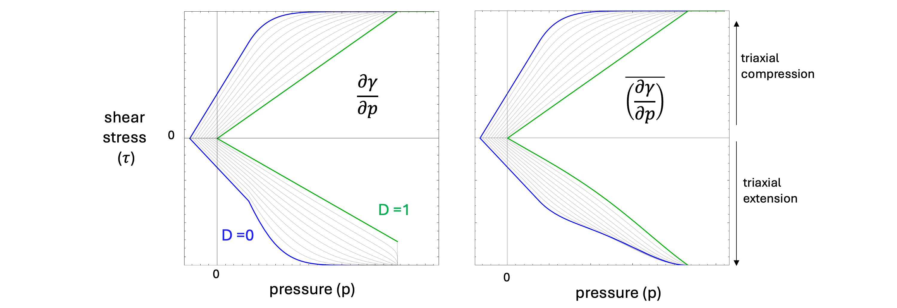

.. _CeramicDamageModel:

############################################
Ceramic Damage Model
############################################

Overview, Summary
========================
This damage model is intended for use with damage-field partitioning (DFG) within the
MPM solver, but can also be used without DFG by any solver. It is only appropriate for
schemes implementing explicit time integration. The model is really a hybrid plasticity/
damage model in the sense that we assume damaged material behaves like granular material
and hence follows a modified Mohr-Coulomb law. The modifications are that at low pressures,
the shape of the yield surface is modified to resemble a maximum principal stress criterion,
and at high pressures the shape converges on the von Mises yield surface. The damage
parameter results in softening of the deviatoric response i.e. causes the yield surface to
contract. Furthermore, damage is used to scale back tensile pressure: :math:`p = (1 - d) * p_{Trial}`.
:math:`p_{Trial}` is calculatd as :math:`p_{Trial} = -k * log(J)`, where the Jacobian J of the material motion is
integrated and tracked by this model.

Theory
========================
The following description is sourced from (:cite:t:`HomelEtAlInPrep`). 

The isotropic damage model is designed to capture key features of brittle
material strength while requiring few input parameters. The pressure-dependent
yield surface is defined by the tensile strength :math:`Y_t`, the unconfined
compressive strength :math:`Y_c`, and a high-pressure shear strength
:math:`Y_{\text{max}}`. The tensile and compressive strengths are perturbed by
Weibull scaling of the input parameters :math:`\overline{Y_t}` and
:math:`\overline{Y_c}`, respectively. The parameter :math:`Y_{\text{max}}`
represents the strength in the ductile limit and is not scaled by the Weibull
function.

.. math::

   Y_t = \overline{Y_t}
   \left(
     \frac{\overline{V}}{V}
     \frac{\log R}{\log(1/2)}
   \right)^{1/m},
   \qquad R \in (0,1]

.. math::

   Y_c = \overline{Y_c}
   \left(
     \frac{\overline{V}}{V}
     \frac{\log R}{\log(1/2)}
   \right)^{1/m},
   \qquad R \in (0,1]

If the scaled value of :math:`Y_c` exceeds :math:`Y_{\text{max}}`, which may occur
for small values of the random variable :math:`R` or when the element volume
:math:`V` is much smaller than the reference volume :math:`\overline{V}`, the
compressive strength is capped and rescaled. In this case, we set

.. math::
   Y_c \leftarrow 0.999\,Y_{\text{max}},
   \qquad
   Y_t \leftarrow \frac{\overline{Y_t}}{\overline{Y_c}}\,Y_{\text{max}}.

Perturbations of the yield surface resulting from these control points are shown
in :numref:`fig:damagemodel`b.

The isotropic damage model employs a **hyperelastic volumetric response** and a
**hyperelastic deviatoric response**, assuming linear elasticity and a
*radial return* plasticity algorithm :cite:`Zhou2006ExpandingRing`, with a yield
function that evolves according to a scalar damage variable. A simple piecewise
pressure-dependent strength function is defined, as illustrated in Fig. 1a. 

.. _fig:damageEnvelop:

.. figure:: ceramic_damage_piecewise.png
   :align: center
   :width: 75%

Yield surface for the isotropic damage model. (a) pressure dependent strength without third-invariant dependence
(:math:`\Gamma` = 1) defined by input values :math:`Y_{c}` and :math:`Y_{t}` , evolving with scalar damage 0 ≤ D ≤ 1 
TODO: INCORPORATE B AND WEIBULL SCALING (b) Weibull scaling of strength
through variation of Yt and Yc, subject to the limitation :math:`Y_{c}` < :math:`Y_{max}`, (c) initial yield surface in principal stress space for
D = [0, 0.5, 1.0] showing transition from maximum principal stress criterion at low pressure to shear criterion at high
pressure.

As damage accumulates, the material progressively
loses cohesive strength and transitions to a frictional response characterized
by a slope :math:`\mu` at low pressure. This slope also defines the
brittle–ductile transition pressure,

.. math::
   p_2 = \frac{Y_{\text{max}}}{\mu}.

.. math::

   Y = \frac{1}{\Gamma} Y_0
   =
   \frac{1}{\Gamma}
   \begin{cases}
     Y_{1,0}, & \text{if } p_0 < p \le p_1, \\
     Y_{2,0}, & \text{if } p_1 < p \le p_2, \\
     Y_{3,0}, & \text{if } p_2 < p.
   \end{cases}

where :math:`Y_1` linearly interpolates between the unconfined compressive and
tensile strength points, :math:`Y_2` is a blending function, and :math:`Y_3` is
the high-pressure, constant shear strength limit. The pressure-dependent shear
strength is necessary to account for the effects of friction on microcrack
surfaces in brittle materials; however, it is not sufficient to describe tensile
failure mechanisms at low confining stress, where a maximum-principal-stress
failure criterion is more appropriate.

Following :cite:`brannon2009kayenta`, to account for both low-pressure tensile
failure and high-pressure shear failure, a *third-invariant* dependence is
introduced that reduces the strength in triaxial compression (TXC) relative to
triaxial extension (TXE). The resulting yield strength is written as

.. math::
   Y = \frac{1}{\Gamma(\theta)}\,Y_0,

where :math:`\Gamma` is a function of the Lode angle :math:`\theta`.

.. _fig:damagemodel:

Figure 2: Meridional plane of the isotropic damage model yield surface showing triaxial
compression (TXC, top) and triaxial extension (TXE, bottom) strength.
**Left:** yield surface constructed with :math:`\psi` evaluated using the actual
derivative :math:`\partial Y_0/\partial p`.
**Right:** yield surface constructed with :math:`\psi` evaluated using the
smoothed derivative :math:`\overline{\partial Y_0/\partial p}`.

.. math::

   \theta = \frac{1}{3}\arcsin\!\left[
     \frac{-J_3}{2}\left(\frac{3}{J_2}\right)^{3/2}
   \right].

where the invariants of the stress deviator are

.. math::
   J_2 = \frac{1}{2}\,\mathrm{Tr}\!\left[\boldsymbol{S}^2\right],
   \qquad
   J_3 = \frac{1}{3}\,\mathrm{Tr}\!\left[\boldsymbol{S}^3\right],

with

.. math::
   \boldsymbol{S}
   = \boldsymbol{\sigma}
   - \frac{1}{3}\,\mathrm{Tr}\!\left[\boldsymbol{\sigma}\right]\boldsymbol{I}.

.. math::

   \Gamma =
   \frac{
     4\beta^2(1-\psi^2) + (2\psi - 1)^2
   }{
     (2\psi - 1)\sqrt{4\beta^2(1-\psi^2) + 5\psi^2 - 4\psi}
     + 2\beta(1-\psi^2)
   }.

where :math:`\beta = \cos\!\left(\theta + \frac{\pi}{6}\right)`. The TXC/TXE
strength ratio is scaled based on the slope of the pressure-dependent yield
surface.

.. math::

   \psi = \frac{1}{1+\frac{1}{3}\,\overline{\partial Y_0/\partial p}}.

For the model to produce a tensile strength consistent with the input parameter
:math:`Y_t`, it is necessary to define the interpolation functions
:math:`Y_1` and :math:`Y_2` in terms of a *scaled tensile strength* that accounts
for the :math:`\psi` ratio applied by the :math:`\Gamma` function in triaxial
extension. In addition, a constraint is imposed to ensure that the slope defined
by :math:`Y_t` and :math:`Y_c` is greater than the slope of the fully damaged
yield surface, :math:`\mu`.

.. math::

   Y_{t,0}
   =
   \min\!\left(
     \frac{1}{2}
     \left(
       -Y_c + \sqrt{Y_c}\sqrt{Y_c + 8Y_t}
     \right),
     \frac{3Y_c - \mu Y_c}{3 + \mu}
   \right),
   \qquad
   Y_{t,0} \in \left[\tfrac{1}{2}Y_t,\,2Y_t\right].

With this definition, the intercept of the linear undamaged yield surface is

.. math::

   p_0
   =
   -\frac{2 Y_c Y_{t,0}}
          {3\left(Y_c - Y_{t,0}\right)}.

The pressure-dependent branch of the undamaged yield surface is then defined as

.. math::

   Y_{1,0}
   =
   m_1\left(
     p - (1-\mathcal{D})\,p_0
   \right).

where the slope :math:`m_1` is defined as

.. math::

   m_1
   =
   (1-\mathcal{D})
   \frac{Y_c - Y_{t,0}}{Y_c/3 + Y_{t,0}/3}
   + \mathcal{D}\,\mu.

To smoothly interpolate between the points :math:`(p_1,y_1)` and
:math:`(p_2,y_2)`, we define the function :math:`h(p)` such that
:math:`h'(p_1)=m_1` and :math:`h'(p_2)=0`:

.. math::

   h\!\left(p; p_1, y_1, m_1, p_2, y_2\right)
   =
   (y_1 - y_2)
   \left(
     \frac{p - p_2}{p_1 - p_2}
   \right)^{\,m_1\frac{p_1 - p_2}{y_1 - y_2}}
   + y_2.

The interpolation branch of the undamaged yield surface is then given by

.. math::

   Y_{2,0}
   =
   h\!\left(p; p_1, y_1, m_1, p_2, y_2\right).

Here, :math:`y_1 = Y_c`, :math:`y_2 = Y_{\text{max}}`,
:math:`p_1 = Y_c/3`, and :math:`p_2 = Y_{\text{max}}/\mu`. This function
has slope :math:`m_1` at :math:`(p_1,y_1)` and slope
:math:`m_2 = 0` at :math:`(p_2,y_2)`.

However, when using :math:`\partial Y_{2,0}/\partial p` to evaluate
:math:`\psi`, the yield surface becomes discontinuous
at :math:`p=p_2` for :math:`\mathcal{D}=1`, where the slope is
non-smooth. To produce a continuous yield surface that transitions smoothly
from a maximum-principal-stress criterion at low pressure
(:math:`\mathcal{D}=0`) to a frictional shear surface at high pressure
(:math:`\mathcal{D}=1`), we therefore define

.. math::

   \overline{\partial Y_0/\partial p}
   =
   \begin{cases}
     m_1,
     & \text{if } p_0 < p \le p_1, \\[6pt]
     m_1\left(1 - 3\chi^2 + 2\chi^3\right),
     & \text{if } p_1 < p \le p_2, \\[6pt]
     0,
     & \text{if } p_2 < p.
   \end{cases}

where

.. math::
   \chi = \frac{p - p_1}{p_2 - p_1}.

This formulation is sufficient for the present solution, which employs a simple
pressure cutoff for the vertex treatment and a radial return algorithm. In
models with a different flow rule, it may be necessary to modify this approach
to ensure convexity of the yield surface for all values of :math:`p` and
:math:`\mathcal{D}`.

Implementation
========================

Graphite Small Strain Update Helper - Function Overview
========================
Updates the Cauchy stress (Voigt form) for a *small-strain, corotational* transversely-isotropic
(graphite-like) material over one time increment. Optionally enforces strength limits and evolves
damage / plastic strain when inelasticity is enabled.
Specifically, this function handles:

#. Anisotropic elasticity - Different stiffness along layers vs across layers
#. Pressure-dependent properties - Material gets stiffer under compression
#. Three types of plasticity - Distortional, in-plane, and coupled shear (see Theory Part II above) yield mechanisms for different stress modes 
#. Damage evolution - Tracks tensile cracking
#. Strain-softening - Material weakens with accumulated plastic strain

.. list-table:: The 10-Step Process
   :widths: 5 95
   :header-rows: 1

   * - Step
     - Description
   * - 1
     - **Set up geometry and compute strain rate:** Copy old stress state, compute unrotated velocity gradient, extract strain rate tensor D = sym(L)
   * - 2
     - **Update elastic properties based on pressure:** Unrotate material direction, compute old plane-normal stress and pressure, update elastic moduli (Ez, Ep, Gzp) based on pressure, update effective bulk/shear modulus and wave speed
   * - 3
     - **Compute trial stress (elastic predictor):** Compute trial stress using transversely isotropic elasticity
   * - 4
     - **Check for damage and update damage variable:** Check plane-normal stress for tensile failure, increment damage if σ_normal > failure_strength: d += Δt / (L/crack_speed), set d = 1.0 if strain-softening activated
   * - 5
     - **Decompose stress into anisotropic components:** σ1 (axial stress), σ2 (in-plane normal stress), σ4 (total in-plane stress), σ5 (weak-plane shear stress)
   * - 6
     - **Apply damage effects:** If fully damaged (d ≈ 1), remove tensile plane-normal stress and tensile distortional pressure; scale strengths by damage: S_effective = (1-d) × S
   * - 7
     - **Compute three pressure-dependent yield strengths:** For each mode (distortion yield, in-plane deviatoric yield, coupled shear yield), compute pressure-dependent strength, apply strain-hardening/softening, apply damage reduction
   * - 8
     - **Return map stresses to yield surfaces (plastic corrector):** Scale distortion deviatoric stress if yielded, scale in-plane deviatoric stress if yielded, scale coupled shear stress if yielded
   * - 9
     - **Reassemble final stress:** σ_new = σ_iso + σ_distortion_dev + σ_inplane_dev + σ_coupled_shear
   * - 10
     - **Update plastic strain and softening variables:** Compute plastic strain increment, rotate plastic strain to current configuration, update accumulated plastic strain, update relaxation parameter for strain-softening

Parameters, User Inputs
========================

.. include:: /coreComponents/schema/docs/CeramicDamage.rst

References
========================

.. bibliography::
   :style: plain
   :filter: docname in docnames
