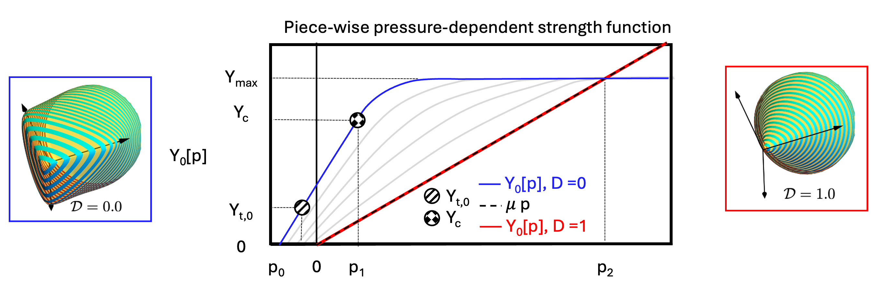
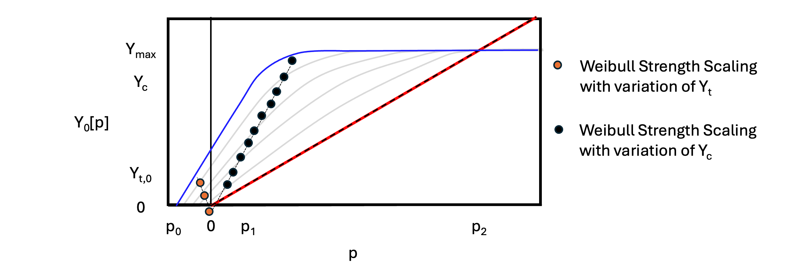

.. _Chiumenti:

############################################
Chiumenti
############################################

Overview, Summary
========================

Theory
========================
The following describes the linear hardening model of :cite:t:`test`. 
Also this: :cite:t:`brannon2009kayenta`

Strength
------------------------  

.. _fig:damageEnvelop:

Figure 1: Yield surface for the isotropic damage model. Pressure-dependent strength without third-invariant dependence
(:math:`\Gamma` = 1) defined by input values :math:`Y_{c}` and :math:`Y_{t}` , evolving with scalar damage 0 ≤ D ≤ 1 

.. _fig:strengthScaling:

Figure 2: Weibull scaling of strength through variation of Yt and Yc, subject to the limitation :math:`Y_{c}` < :math:`Y_{max}`.
pressure.

Damage-Dependent Strength
------------------------

.. math::
   p_2 = \frac{Y_{\text{max}}}{\mu}.

Implementation
========================

``smallStrainUpdateHelper`` Function Overview
------------------------

Updates the Cauchy stress (Voigt form) for a small-strain isotropic elastic material with a
pressure-dependent brittle yield surface and a scalar damage variable :math:`d \in [0,1]`.
The update uses an elastic predictor followed by a yield check and (if needed) a plastic return.
Damage contracts the yield surface (softening) and scales tensile pressure response through
a Jacobian-based pressure computation.

Specifically, this function handles:

#. Elastic trial stress update (via ElasticIsotropicUpdates)
#. Jacobian tracking and Jacobian-based pressure computation :math:`p=-K\ln(J)`
#. Pressure-dependent shear strength with optional third-invariant (Lode-angle) scaling
#. Yield detection and plastic return to the pressure-dependent yield surface
#. Damage evolution via either (a) time-to-failure or (b) energy regularization
#. Optional crack-tip stress concentration modifier
#. Diagnostic plastic strain update (hypoelastic-style)

.. list-table:: A 10-Step Process
   :widths: 5 95
   :header-rows: 1

   * - Step
     - Description
   * - 1
     - **Elastic predictor (trial stress):** Call ElasticIsotropicUpdates::smallStrainUpdate to overwrite the old stress with an elastic trial stress for the full strain increment.
   * - 2
     - **Update Jacobian:** Update the tracked Jacobian using volumetric strain increment,
       :math:`J \leftarrow J\,\exp(\Delta\varepsilon_{xx}+\Delta\varepsilon_{yy}+\Delta\varepsilon_{zz})`.
   * - 3
     - **Compute effective bulk in tension:** If :math:`J>1` (tension), use :math:`K_\mathrm{eff}=(1-d)K` so that unloading from a damaged tensile vertex smoothly approaches :math:`p\to0` as :math:`J\to1`.
   * - 4
     - **Compute trial pressure:** Compute pressure from the Jacobian,
       :math:`p_\mathrm{trial}=-K_\mathrm{eff}\ln(J)`.
   * - 5
     - **Scale strengths (porosity and strengthScale):** Compute
       :math:`Y_t = s\,Y_t^\mathrm{input}(1-\phi)` and :math:`Y_c = s\,Y_c^\mathrm{input}(1-\phi)`,
       enforce limits relative to :math:`Y_\max` and the implied TXC/TXE ratio.
   * - 6
     - **Set tensile vertex pressure:** Compute intact vertex pressure :math:`p_{\min,0}` from :math:`Y_c` and :math:`Y_{t0}` and scale by damage:
       :math:`p_{\min}=(1-d)p_{\min,0}`. If :math:`p_\mathrm{trial}<p_{\min}`, the state is treated as yielding at the vertex.
   * - 7
     - **Compute deviatoric invariants:** Decompose trial stress using twoInvariant::stressDecomposition to obtain deviatoric direction, von Mises magnitude, and compute :math:`J_2` and :math:`J_3`.
   * - 8
     - **Optional crack-tip stress concentration:** If enabled and distanceToCrackTip>0, compute a crack-tip stress concentration factor (stored in crackTipStressConcentration) using a fracture-process-zone radius based on toughness and nominal intact strength.
   * - 9
     - **Yield check and stress update:**
       If not yielding: recompose stress using the Jacobian-based pressure and keep the deviatoric trial state.
       If yielding: call plasticReturn to reconstruct stress on the yield surface (or at the vertex).
   * - 10
     - **Damage + diagnostics:**
       If energy criterion is enabled: iterate (fixed-point / bisection) on damage so dissipation matches :math:`G_c/\ell`, possibly activating surfaceFlag.
       Else: use time-to-failure update :math:`d \leftarrow \min(d + \Delta t / (\ell/c_\mathrm{crack}),\,1)`, applied below a brittle–ductile transition pressure.
       Update diagnostic plastic strain via computePlasticStrainIncrement.

.. raw:: html

   

``getStrength`` (Strength Evalutation) Function Overview
------------------------
This function computes the pressure-dependent shear strength :math:`Y(p,d)` used to decide yielding
and to perform the plastic correction. The strength is piecewise in pressure and may be scaled
by a third-invariant (Lode-angle) factor when ``thirdInvariantDependence==1``.
A crack-tip stress concentration factor can further reduce the effective continuum strength.

.. raw:: html

   

Parameters, User Inputs
========================

.. include:: /coreComponents/schema/docs/Chiumenti.rst

.. raw:: html

   

References
========================

.. bibliography::
   :style: plain
   :filter: docname in docnames

