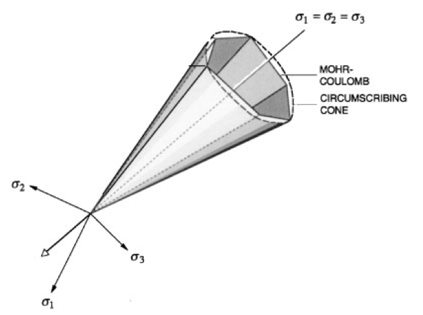
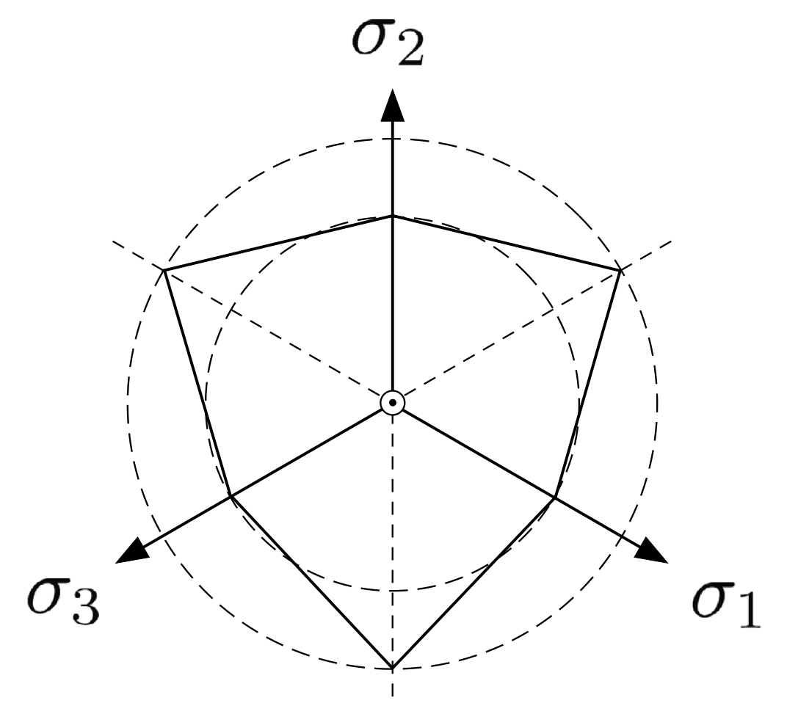
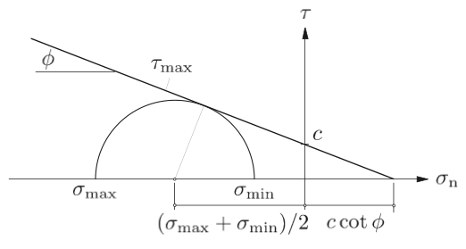

.. _DruckerPrager:

############################################
Model: Drucker-Prager
############################################

Overview
-------------------
This model may be used to represent a solid material with plastic response to loading according to the `Drucker-Prager <https://en.wikipedia.org/wiki/Drucker%E2%80%93Prager_yield_criterion>`__ yield criterion below:

.. math::
   f (p,q) = q + b \, p - a = 0 .

.. _druckerPragerYield:

   Mohr-Coulomb and Drucker-Prager yield surfaces in principal stress axes (Borja, 2002).

The material behavior is linear elastic (see :ref:`ElasticIsotropic`) for :math:`f < 0`, and plastic for :math:`f =0`.
The two material parameters :math:`a` and :math:`b` are derived by approximating the Mohr-Coulomb surface with a cone.
Figure 3 shows the Mohr-Coulomb yield surface and circumscribing Drucker-Prager surface in principal stress space.
The Drucker-Prager yield surface has a circular cross-section in the deviatoric plane that passes through the tension or compression corners of the Mohr-Coulomb yield surface, as shown in the Figure 4.
The material parameters :math:`a` and :math:`b` are derived as:

.. math::
   a = \frac{6 \, c \, \cos\phi}{3 \pm \sin\phi} \, , \quad b=\frac{6  \, \sin\phi}{3 \pm \sin\phi}

where plus signs are for circles passing through the tension corners, and minus signs are for circles passing through compression corners.
Also, :math:`\phi` and :math:`c` denote friction angle and cohesion, respectively, as defined by the Mohr-Coulomb failure envelope shown in Figure 5.
In GEOS, we use a compression corner fit (minus signs) to convert the user-specified friction angle and cohesion to :math:`a` and :math:`b`.

.. _deviatoricView:

   Mohr-Coulomb and Drucker-Prager yield surfaces on the deviatoric plane (Borja, 2013).

.. _mohrCoulombEnvelope:

   The Mohr-Coulomb failure envelope (Borja, 2013).

We consider a non-associative plastic potential to determine the direction of plastic flow.

.. math::
   g (p,q) = q + b' \, p ,

where :math:`b' \leq b` is the dilatancy parameter.  
Setting :math:`b' = b` leads to associative flow rule, while for :math:`b' <  b` non-associative flow is obtained.
The parameter :math:`b'` is related to `dilation angle <https://en.wikipedia.org/wiki/Dilatancy_(granular_material)>`__  as:

.. math::
   b' = \frac{6  \, \sin\psi}{3 \pm \sin\psi},

where :math:`\psi \leq \phi` is the dilation angle.
If :math:`\psi > 0`, then the plastic flow is dilative.
Again, we use a compression corner fit (minus sign).

A hardening rule is defined which determines how the yield surface will change as a result of plastic deformations.
Here we use linear hardening for the cohesion parameter, :math:`a`,

.. math::
   \dot{a}= h \, \dot{\lambda},

where :math:`h` is the hardening parameter. 
A positive hardening parameter will allow the cohesion to grow, shifting the cohesion intercept vertically on the q-axis.
A negative hardening parameter will cause the cohesion to shrink, though negative cohesion values are not allowed.
Once all cohesion has been lost, the cohesion will remain at zero, so the cone vertex is fixed at the origin. 
In either case, the friction and dilation angles remain constant.  
See the :ref:`DruckerPragerExtended <DruckerPragerExtended>` model for an alternative version of hardening behavior.

Parameters
~~~~~~~~~~~~~~~~~~~~

The following attributes are supported:

.. include:: /docs/sphinx/datastructure/DruckerPrager.rst

Example
~~~~~~~~~~~~~~~

.. code-block:: xml

  <Constitutive>
    <DruckerPrager name="drucker"
                              defaultDensity="2700"
                              defaultBulkModulus="1000.0"
                              defaultShearModulus="1000.0"
                              defaultFrictionAngle="30.0"
                              defaultDilationAngle="20.0"
                              defaultHardeningRate="0.0"
                              defaultCohesion="10.0" />
  </Constitutive>

.. _J2Plasticity:

Variant: J2 plasticity
~~~~~~~~~~~~~~~~~~~~~~~~

J2 yield criterion can be obtained as a special case of the Drucker-Prager model by setting the friction and dilation angles to zero, i.e. :math:`\phi = \psi = 0`.
