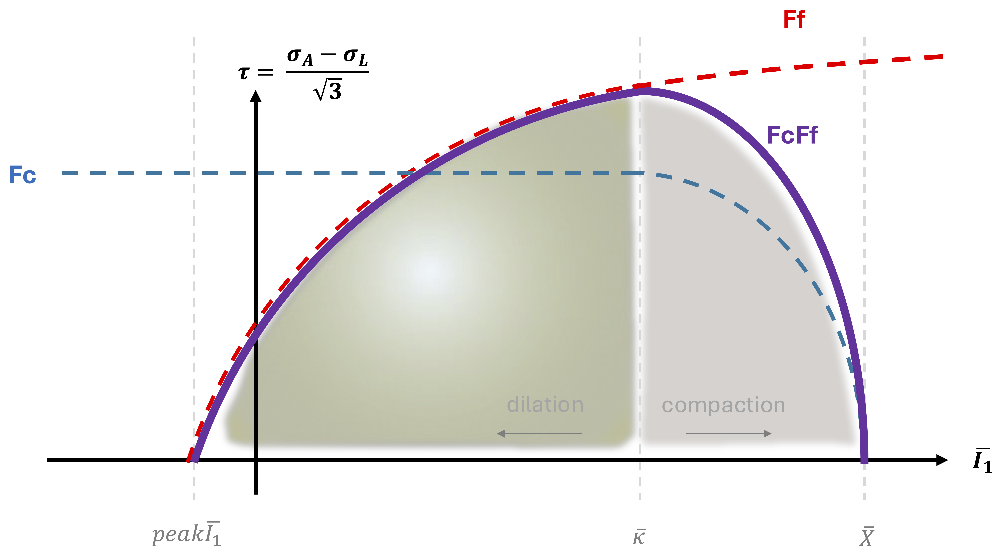
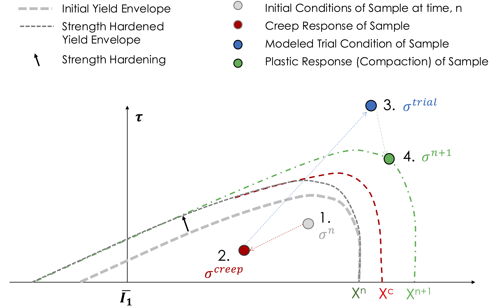
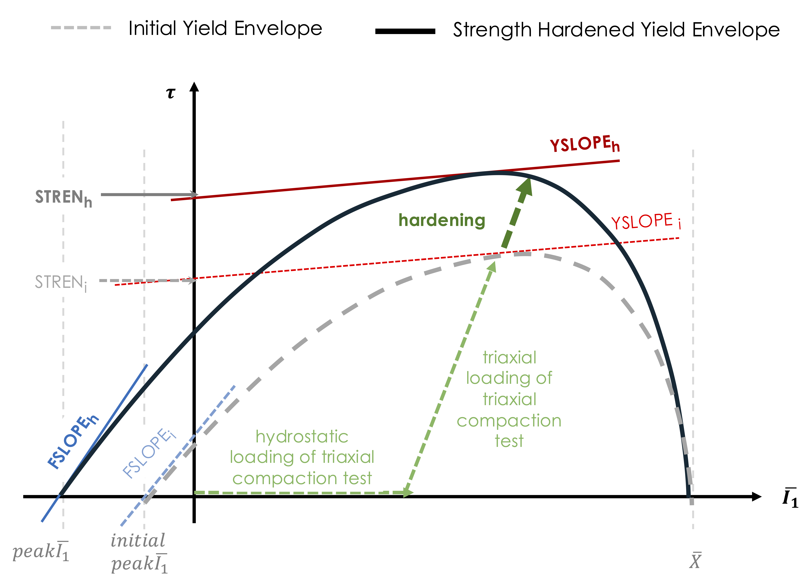

.. _Geomechanics Model:

############################################
Geomechanics Model (MPM Only)
############################################

Overview
========================
We present a geomechanics formulations that accounts for deformation of 
rock across both small and large time scales, through implementation of a time-scaled creep model. 
The geomechanics models can be used to capture rock response in multiple modes of loading with a single model parameterization.
This constitutive model is based on the
“Arenisca” model that was originally developed to predict the effect of
explosives used on drained and saturated sandstones for wellbore
completion technology (:cite:t:`Homel1` , :cite:t:`Homel2`). The Arenisca constitutive model
itself adapts functional forms for strength, compaction, and elasticity
from the Kayenta material model developed at Sandia National Labs
:cite:p:`Brannon1`, which was adapted from a prior Sandia geomechanical model
:cite:p:`schwer_and_murray_1994`.

In GEOS, we extended this model with additional features to
represent creep, strain hardening, and damage (see the Damage doc), as well as new empirical
model forms for the pressure-dependent shear modulus. With this
formulation, the model predicts the effects of inelastic creep, damage, and plasticity in 
different components of heterogenous rock. Parameterization can be done using data
from rate-independent compression tests and rate-dependent creep
experiments.  

Model Formulation
========================
The description below, plus parameter fits to organic-rich chalk can be found in (:cite:t:`Malenda1`).
The pressure-dependent shear strength establishes a yield surface created
through the product of the Drucker–Prager yield criterion
:math:`F_f` and a cap function :math:`F_c` (:cite:t:`Homel1` , :cite:t:`Homel2`). The surface is projected onto shear 
stress (:math:`\tau`; Eq. 1) versus pressure (:math:`p`), where :math:`F_f` is defined by Eq. 2.

(Equation 1)

.. math::
   \bar{\tau} = \frac{\bar{\sigma}_{\mathrm{axial}} - \bar{\sigma}_{\mathrm{lateral}}}{\sqrt{3}}

(Equation 2)

.. math::
   F_f = a_1 - \left[a_3 e^{-a_2 \bar{I}_1}\right] + \left[a_4 \bar{I}_1\right]

and the hydrostatic compressive stress is :math:`\bar{I}_1 = -I_1 = 3p`.  
Here, and throughout this work, the overline indicates a value that is
positive in compression. Parameters :math:`a_i` are empirical parameters
that reflect properties including the hydrostatic tensile strength and
the zero-pressure strength. The relations between these parameters and
the more intuitive input parameters are given in :cite:`Brannon1`.

The cap function (Eq. 3) accounts for the reduction in shear strength at
high pressure due to pore collapse. It is defined as a function of
volumetric plastic strain and captures the change in unloaded porosity.
The branch point, :math:`\bar{\kappa}`, is the hydrostatic stress above
which the cap function affects strength. The model uses a scaled
associative plastic flow rule, so the apex of the combined yield surface
(:math:`F_c F_f`) reflects the transition from dilation to compaction.
With porous compaction, :math:`\bar{X}` increases, which reflects
hardening of the material due to pore collapse. The combination of the
:math:`F_f` and :math:`F_c` yield criteria is shown in Figure 86. 

(Equation 3)

.. math::
   F_c =
   \begin{cases}
     \sqrt{1 - \left( \dfrac{\bar{I}_1 - \bar{\kappa}}{\bar{X} - \bar{\kappa}} \right)^2} & \text{for } \bar{\kappa} < \bar{I}_1 < \bar{X}, \\
     1 & \text{for } \bar{I}_1 \le \bar{\kappa}.
   \end{cases}

.. _yieldEnvelope:

   Yield envelope produced from combining the shear-limit function
   :math:`F_f` with a cap function :math:`F_c`, plotted in shear-stress
   (:math:`\tau`)–pressure (:math:`I_1 = 3\bar{p}`) space.
   :math:`\text{Peak}\,\bar{I}_1`, :math:`\bar{\kappa}`, and :math:`\bar{X}`
   are the tensile limit of :math:`I_1`, the branch point of :math:`F_c`,
   and an internal state variable that defines the hydrostatic compressive
   strength, respectively.

The elastic bulk modulus :math:`K` depends nonlinearly on the compressive
stress and :math:`\bar{I}_1`. The modulus :math:`K` allows for
elastic–plastic coupling through its dependence on volumetric plastic
strain :math:`\epsilon_v^p` (Eq. 4).

(Equation 4)

.. math::
   K = b_0
       + \left[b_1 \exp\!\left(\frac{-b_2}{\left|\bar{I}_1 - 1\right|}\right)\right]
       - \left[b_3 \exp\!\left(\frac{-b_4}{\left|\epsilon_v^p\right|}\right)\right]

The non-linear tangent shear modulus :math:`G` (Eq. 5) is defined in
terms of a pressure-dependent Poisson’s ratio :math:`\nu`:

(Equation 5)

.. math::
   G = \frac{3K\, (1 - 2\nu)}{2(1 + \nu)}

where :math:`\nu = g_1` at low pressures and is defined by Eq. 6 at high
pressures. For tensile states where :math:`\bar{I}_1 < 0`, we define
:math:`\nu = g_0`.

(Equation 6)

.. math::
   \nu = g_1 + g_2 \exp\!\left(\frac{g_3}{I_1}\right)

Solution Method
========================
The yield surface changes through strain hardening, damage, and
compaction, which evolve during each inelastic time step. Plastic strain
and stress at the start of the time step are used to compute elastic
properties. To model the behavior of organic-rich Ghareb chalk, we
incorporated creep into the solution algorithm as a relaxation of the
beginning-of-step stress state, as shown in Figure 87.
Deviatoric and volumetric creep relax during the start-of-step state
(path from point 1 to 2). An elastic trial stress is then computed
relative to the relaxed state based on the strain increment (path from
point 2 to 3). A plasticity return is computed through a consistency
bisection :cite:`Homel1a`, consistent with hardening, damage,
compaction, and failure mechanisms (path from point 3 to 4). Note that
creep, plastic hardening, and compaction occur simultaneously within
each time step. Time scaling of creep-rate parameters is applied based
on the ratio of the physical time modeled to the simulation time, which
allows for the solution of slow transient responses within a robust
explicit-dynamics framework. This approach is valid as long as the
time scales for creep deformation remain distinct from those associated
with elastic wave propagation, plastic deformation, and damage.

.. _yieldEnvelope2:

   Numerical solution approach to represent simulation creep,
   hardening, and compaction.

Volumetric Creep
========================
At the start of a time step, we compute the equilibrium porosity
(:math:`\varphi_e`) from the hydrostatic pressure (:math:`p`) and
temperature (:math:`T`) relative to the initial temperature
(:math:`T_0`) in Eq. 7. Although the samples were collected from a
near-surface outcrop, we assume the material is initially in equilibrium
with the previously overburdened state, with :math:`A` equal to a value
somewhat less than the initial porosity :math:`\varphi_0`. Here,
:math:`\alpha` and :math:`\beta` are fit to equilibrium
porosity–temperature data.

(Equation 7)

.. math::
   \varphi_e = A\, e^{-\left(\frac{p}{B}\right)^{D}}
               + \alpha (T - T_0)
               + \beta (T - T_0)^2

We also compute the unloaded porosity (:math:`\varphi_p`) from the
beginning-of-time-step volumetric plastic strain
(:math:`\varepsilon_v^{p,n}`) in Eq. 8 and from the initial porosity
(:math:`\varphi_0`) in Eq. 9, which accounts for the maximum achievable
compressive volumetric plastic strain :math:`p_3`. The creep rate
(:math:`d\varphi/dt`) is treated as a modified version of Athy’s law in
Eq. 10.

(Equation 8)

.. math::
   \varphi_p = 1 + e^{\,\varepsilon_v^{p,n}} \left(\varphi_0 - 1\right)

(Equation 9)

.. math::
   \varphi_0 = 1 - e^{-p_3}

(Equation 10)

.. math::
   \frac{d\varphi}{dt}
   = f(T, T_0)\,\hat{p}\,C\,(\varphi_p - \varphi_e)

We account for the temperature effect on creep with the Arrhenius term

(Equation 11)

.. math::
   f(T) = -\exp\!\left[-\frac{E_a^{\mathrm{vol}}}{R} \left(\frac{1}{T} - \frac{1}{T_0}\right)\right]

where :math:`E_a^{\mathrm{vol}}` is the activation energy for volumetric
creep and :math:`R` is the universal gas constant. The pressure
dependence of the equilibrium porosity leads to an increase in the creep
compaction rate with increasing pressure. This was found to
over-predict :math:`d\varphi/dt` observed in hydrostatic creep tests.
To correct for this, we introduce a modified pressure to be used in Eq. 10.

(Equation 12)

.. math::
   \hat{p} = \left(\frac{p}{G_{creep}}\right)^F,\quad (p > 0)

The post-creep porosity at a given pressure (:math:`\varphi_{p,c}`) is
computed in Eq. 13, after which we determine the creep-modified
beginning-of-step volumetric plastic strain (:math:`\varepsilon_v^{c,n}`)
using Eq. 14. Here, the creep-modified beginning-of-step state is
equivalent to the end-of-step value.

(Equation 13)

.. math::
   \varphi_{p,c} = \varphi_p + \frac{d\varphi}{dt}\,\Delta t

(Equation 14)

.. math::
   \varepsilon_v^{c,n}
   = \ln\!\left(\frac{\varphi_{p,c} - 1}{\varphi_0 - 1}\right)

Deviatoric Creep
========================
We apply a similar form to model shear relaxation, computing a maximum
equilibrium shear strain (:math:`\gamma_{eq}`) for a given level of
shear stress (:math:`\tau`) in Eq. 8. We then define a shear-strain
relaxation creep rate based on the difference between the current
plastic shear strain (:math:`\gamma_p`) and the equilibrium shear strain
(:math:`\gamma_{eq}`) in Eq. 9. As with the compaction creep, we limit
the creep shear-strain increment based on the current elastic shear
strain. The equilibrium shear strain is given by:

(Equation 15)

.. math::
   \gamma_{eq} = \dfrac{\tau}{2G}

where :math:`G` is the shear modulus. The increment in creep shear
strain is used to relax the deviatoric stress in Eq. 16. The relaxed
shear stress and relaxed pressure are treated as the beginning-of-step
stress for the subsequent updates. The values :math:`C_0` through
:math:`C_2` are deviatoric creep constants.

(Equation 16)

.. math::
      \gamma_{eq}
   = C_0\, \tau^{C_1}\,\bigl[1 + H (T - T_0)^2\bigr]

(Equation 17)

.. math::
   \frac{d\gamma_c}{dt}
   = \exp\!\left[
       -\frac{E_a^{\mathrm{dev}}}{R}
       \left(\frac{1}{T} - \frac{1}{T_0}\right)
     \right]
     C_2\,(\gamma_{eq} - \gamma_p)

(Equation 18)

.. math::
   \tau^{c,n}
   = \frac{\tau^{n}(\gamma_{eq} - \gamma_c)}{\gamma_{eq}}

Plasticity
========================
:math:`STREN_i` is the slope intercept at the top of the yield surface
(see Fig. 88) and defines the yield-surface parameters
:math:`a_i` in Eq. 2. The slope at the top of the yield surface
is defined by :math:`YSLOPE_i`, while the yield-surface slope at low
pressures is defined by :math:`FSLOPE_i`
(see Fig. 88). The quantities :math:`STREN_i`,
:math:`YSLOPE_i`, and :math:`FSLOPE_i` are user inputs and are fit to
match pressure-dependent yield stress from triaxial compression data.

Material hardening is incorporated through expansion of the yield
envelope based on exponential strain hardening (Eq. 19),
where :math:`\gamma^p` is the equivalent plastic shear strain. The
hardening parameter :math:`H` directly increases the shear strength
through Eq. 20.

(Equation 19)

.. math::
   H = K_h \left( 1 - e^{\,n_h \gamma^p} \right)

(Equation 20)

.. math::
   STREN_f = STREN_i + H

.. _hardened_envelop:

   Changes of the yield envelope parameters with hardening but no damage.

Damage
========================
Damage is incorporated through the Damage constitutive model package. 
Damage documentation can be found here:   - :ref:`Damage <DamageModel>`

Parameters, User Inputs
========================

.. include:: /coreComponents/schema/docs/Geomechanics.rst
.. .. include:: /coreComponents/schema/docs/GeomechanicsParameterTable.rst

References
========================

.. bibliography:: 
   :cited:
   :style: plain
