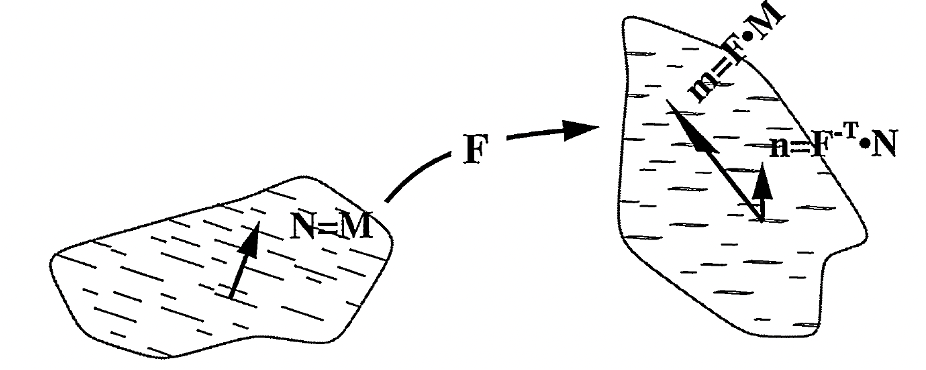
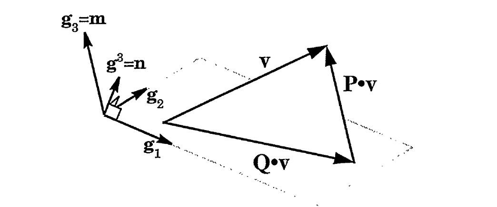
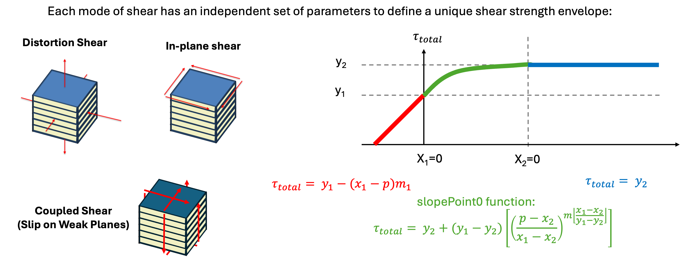

.. _GraphiteModel:

############################################
Graphite Model
############################################

Overview, Summary
========================
Transverse isotropy (TI) describes materials that have one preferred direction 
(like layered materials such as graphite or sedimentary rock). 
This axis of symmetry is represented by a unit vector N (the material normal). 
The key property is that the material's mechanical behavior is unchanged if you rotate 
it around this N direction.

To mathematically describe this symmetry, we use five fundamental building blocks 
called basis tensors {B₁, B₂, B₃, B₄, B₅}. These are constructed from projection 
operators P and Q that split any vector or tensor into parts along the preferred 
direction N and parts in the perpendicular plane. These five basis tensors can serve as
five independent "modes" of deformation: B₁ captures axial (along N) behavior, 
B₂ captures in-plane bulk behavior, B₃ captures the coupling between axial and 
transverse directions (Poisson effects), B₄ captures in-plane shear, and 
B₅ captures shear on planes containing N. 

Any transversely isotropic material property (like stiffness or compliance) 
can be expressed as a combination of these five basis tensors weighted by five 
scalar coefficients.This approach allows us to work directly in the laboratory 
coordinate system without needing to rotate to and from the material's natural 
coordinates, making computations far more efficient.

The following passages: (:cite:t:`Brannon2003BookDraft` , :cite:t:`Brannon1996ConfPaper` , :cite:t:`Brannon2018RotationBook`) are recommended for supplemental reading on TI materials.

Theory Part I: Transversely Isotropic (TI) Basis
========================
The following is summarized from  :cite:t:`Brannon1996ConfPaper`. For context of the TI basis, first consider some material with cracks of N orientation and fibers of M orientation. 
If N or M move with deformation, F, their new orientations will be n and m, respectively. :math:`n \approx m` for small distortions.

.. _cracked_material:

Now consider a second-order projector, P, and it’s dual projector Q, defined by dyads between m and n. Projectors P and Q can be used to decompose a vector (v) 
into parts in the direction of m and parts in the plane whose normal is parallel to n. 
The projection :math:`\mathbf{P} \cdot \mathbf{v}` is parallel to m while the projection :math:`\mathbf{Q} \cdot \mathbf{v}` is in the plan defined by n.

.. _p_and_q_projectors:

Assuming a base vector :math:`g_3` = m and it’s dual :math:`g^3` = 𝑛 , the actions of P and Q on any vector are. 

(Equation 1)

.. math::

   \mathbf{P} \cdot \mathbf{v} = \mathbf{m}(\mathbf{n} \cdot \mathbf{v}) = 
   \begin{Bmatrix}
   0 \\
   0 \\
   v^3
   \end{Bmatrix}

(Equation 2)

.. math::

   \mathbf{Q} \cdot \mathbf{v} = \mathbf{v} - \mathbf{m}(\mathbf{n} \cdot \mathbf{v}) = 
   \begin{Bmatrix}
   v^1 \\
   v^2 \\
   0
   \end{Bmatrix}

Any second-order tensor, A, can be decomposed into parts in the direction of m and in the plane, n, 
through five operators (B1 through B5) constructed with P and Q. 

(Equation 3a-e)

.. math::

   \mathbf{B}_1:\mathbf{A} \equiv \mathbf{P}(\mathbf{P}^T:\mathbf{A}) = 
   \begin{bmatrix}
   0 & 0 & 0 \\
   0 & 0 & 0 \\
   0 & 0 & A^3_3
   \end{bmatrix}

.. math::

   \mathbf{B}_2:\mathbf{A} \equiv \mathbf{Q}(\mathbf{Q}^T:\mathbf{A}) = 
   \begin{bmatrix}
   A^1_1 & 0 & 0 \\
   0 & A^2_2 & 0 \\
   0 & 0 & 0
   \end{bmatrix}

.. math::

   \mathbf{B}_3:\mathbf{A} \equiv \mathbf{P}(\mathbf{Q}^T:\mathbf{A}) + \mathbf{Q}(\mathbf{P}^T:\mathbf{A}) = 
   \begin{bmatrix}
   A^3_3 & 0 & 0 \\
   0 & A^3_3 & 0 \\
   0 & 0 & A^1_1 + A^2_2
   \end{bmatrix}

.. math::

   \mathbf{B}_4:\mathbf{A} \equiv \mathbf{P} \cdot \mathbf{A} \cdot \mathbf{Q} + \mathbf{Q} \cdot \mathbf{A} \cdot \mathbf{P} = 
   \begin{bmatrix}
   0 & 0 & A^1_3 \\
   0 & 0 & A^2_3 \\
   A^3_1 & A^3_2 & 0
   \end{bmatrix}

.. math::

   \mathbf{B}_5:\mathbf{A} \equiv \mathbf{Q} \cdot \mathbf{A} \cdot \mathbf{Q} = 
   \begin{bmatrix}
   A^1_1 & A^1_2 & 0 \\
   A^2_1 & A^2_2 & 0 \\
   0 & 0 & 0
   \end{bmatrix}

These five operators are the basis for five fourth-order tensors, B1 through B5.

(Equation 4a-e)

.. math::

   (\mathbf{B}_1)_{ijkl} &= P_{ij}P_{lk}
   
   (\mathbf{B}_2)_{ijkl} &= Q_{ij}Q_{lk}
   
   (\mathbf{B}_3)_{ijkl} &= P_{ij}Q_{lk} + Q_{ij}P_{lk}
   
   (\mathbf{B}_4)_{ijkl} &= P_{ik}Q_{lj} + Q_{ik}P_{lj}
   
   (\mathbf{B}_5)_{ijkl} &= Q_{ik}Q_{lj}

**Now for the transverse isotropic functions**, the goal is to deduce the laboratory 
components of TI tensors without having to perform a coordinate transformation between 
the material basis and the laboratory basis. A symmetric second-order tensor C is 
transversely isotropic if :math:`R_{pi}R_{qj}C_{ij} = C_{pq}` for any rotation R about a material axis of symmetry N. 
Due to the ease of use, the material matrix of such a tensor can be rewritten as algebraic expressions where :math:`c_q` and 
:math:`c_p` are scalars. Here, P and Q may be interpreted as second-order base tensors for the two-dimensional space of 
second-order tensors that are transversely isotropic about N.

(Equation 5)

.. math::

   \mathbf{C} = 
   \begin{bmatrix}
   c_q & 0 & 0 \\
   0 & c_q & 0 \\
   0 & 0 & c_p
   \end{bmatrix}

(Equation 6)

.. math::

   \mathbf{C} = c_p \mathbf{P} + c_q \mathbf{Q}

(Equation 7)

.. math::

   C_{ij} = c_p N_i N_j + c_q (\delta_{ij} - N_i N_j)

Now consider a fourth-order tensor H, that is double-symmetric if it’s cartesian components satisfy 
:math:`H_{ijkl} = H_{jikl} = H_{ijlk} = H_{klij}`. The material Euclidean Voigt components of a TI tensor are:

(Equation 8)

.. math::

   \begin{bmatrix}
   H_{11} & H_{12} & H_{13} & 0 & 0 & 0 \\
   H_{12} & H_{11} & H_{13} & 0 & 0 & 0 \\
   H_{13} & H_{13} & H_{33} & 0 & 0 & 0 \\
   0 & 0 & 0 & H_{44} & 0 & 0 \\
   0 & 0 & 0 & 0 & H_{66} & 0 \\
   0 & 0 & 0 & 0 & 0 & H_{66}
   \end{bmatrix}
   \quad \text{with} \quad H_{11} = H_{44} + H_{12}

When addressing problems with transverse symmetry, it is common to introduce a coordinate system aligned with 
the material directions. Instead of relying on such a coordinate transformation, we seek a direct representation 
of Eq. (8) that will later facilitate the integration of functions involving transversely isotropic tensors. 
This objective parallels the development of Eqs. (6 and 7) as a direct representation of Eq. (5). Just as the projectors 
P and Q provide a convenient basis for 
second-order transversely isotropic tensors, we now identify a set of five fourth-order basis tensors, {B1-B5}, 
that span the space of all 
double-symmetric fourth-order tensors that are transversely isotropic with respect to a given material vector N. 
Because this space is closed under linear combinations, any tensor H in the space can be expressed as a linear 
combination of the basis tensors with scalar coefficients {h1-h5}. Enforcing minor symmetry on the five tensors 
defined in Eq. (4) yields the following basis.

(Equation 9)

.. math::

   \mathbf{H}(\mathbf{N}) = \sum_{k=1}^{5} h_K \mathbf{B}_K(\mathbf{N})

Applying minor symmetry to the five tensors in Eq. (4) gives this basis:

(Equation 10a-e)

.. math::

   (\mathbf{B}_1)_{ijkl} &= N_i N_j N_k N_l
   
   (\mathbf{B}_2)_{ijkl} &= \delta_{ij}\delta_{kl} - N_i N_j \delta_{kl} - \delta_{ij} N_k N_l + N_i N_j N_k N_l
   
   (\mathbf{B}_3)_{ijkl} &= N_i N_j \delta_{kl} + N_k N_l \delta_{ij} - 2N_i N_j N_k N_l
   
   (\mathbf{B}_4)_{ijkl} &= \frac{1}{2}(N_i N_k \delta_{jl} + N_j N_l \delta_{ik} + N_i N_l \delta_{jk} + N_j N_k \delta_{il}) - 2N_i N_j N_k N_l

   (\mathbf{B}_5)_{ijkl} &= \delta_{ik}\delta_{jl} + \delta_{il}\delta_{jk} - (\delta_{ik} N_j N_l + \delta_{il} N_j N_k + \delta_{jk} N_i N_l + \delta_{jl} N_i N_k) + 2(N_i N_j N_k N_l)

Theory Part II: Strength Evolution
========================
In an isotropic Mohr–Coulomb case, a single pressure-dependent shear strength envelope is sufficient. 
In the TI formulation, shear strength is direction-dependent, so separate pressure-dependent strength 
envelopes are assigned to different shear modes, and the full yield surface emerges from their combined constraint.

Here, we use 3 pressure-dependent shear strengths for different shear modes .
1. Distortional shear strength (:math:`\tau_{distortion}`) - Governs general shear deformation
2. In-plane shear strength (:math:`\tau_{inplane}`) - Governs shear within the plane of layering
3. Coupled shear strength (:math:`\tau_{coupled}`) - Governs shear on planes

.. _shear_envelopes:

The distortion, in-plane, and coupled shear envelopes account for strengthscaling, strain hardening, and damage. 
y1 and y2 are scaled by :math:`strengthScale[k]` to support material/state-dependent strength scaling.

.. math::

    y1 = y1_0 \times strengthScale[k]\\
    y2 = y2_0 \times strengthScale[k]

A strain-hardening multiplier is then computed using a smoothed transition. This smoothly ramps 
the response between a baseline value (≈1) and a hardened value controlled by :math:`distortionStrainHardeningC0`, 
as the internal relaxation/state variable :math:`relaxation[k][q]` evolves from 0 to 1. 
The smoothStep avoids abrupt changes in strength that can cause nonphysical jumps in the stress update.

.. math::

   \text{strainHardeningMultiplier}
   = 1 + \left( \text{distortionStrainHardeningC0} - 1 \right)
     \, \mathrm{smoothStep}\!\left( \text{relaxation}[k][q], 0, 1 \right)

Damage/softening is applied in a way that reduces cohesion-like strength while blending the 
frictional slope toward a failed-material limit. We multiply y1 by damageMultiplier :math:`(d)` and strainHardeningMultiplier :math:`(H)`, 
so damage reduces the “peak”/cohesive part of the response while hardening can increase it.

.. math::
   \begin{gathered}
   & y_1 =  y_1 \times d \times H \\
   & y_2 = y_2 \times H \\
   & m_1 = d \times m_1 \times H + \left( 1 - d \right) \times \text{damagedMaterialFrictionalSlope}\\
   & m_1 = \max\!\left(m_1,\; \frac{y_2 - y_1}{x_2 - x_1}\right)
   \end{gathered}

The stress update accounts for anisotropic thermal stresses during a given temperature rate, :math:`\dot{T}`, by incorporating lateral and 
transverse thermal expansion (:math:`\alpha_L` and :math:`\alpha_T`, respectively) through the following:

.. math::

   \alpha^{\text{Dense}}_{ij}
   =
   \left( \alpha_L - \alpha_T \right)
   n_i \, n_j
   + \delta_{ij} \, \alpha_T

.. math::

   \Delta \sigma^{\text{Dense}}_{ij}
   \;+=\;
   \left(
      h_1 \, B^{(1)}_{ijpw}
      + h_2 \, B^{(2)}_{ijpw}
      + h_3 \, B^{(3)}_{ijpw}
      + h_4 \, B^{(4)}_{ijpw}
      + h_5 \, B^{(5)}_{ijpw}
   \right)
   \left(
      D_{pw}
      - \alpha^{\text{Dense}}_{pw} \, \dot{T}
   \right)
   \, \Delta t   

Additional Notes
========================

This is a damage model for modeling material failure in brittle materials and is intended for use with damage-field partitioning (DFG) within the
MPM solver, but can also be used without DFG by any solver. It is only appropriate for
schemes implementing explicit time integration. The model is a hybrid plasticity/
damage model in the sense that we assume damaged material behaves like granular material
and hence follows a modified Mohr-Coulomb law.

The modifications are that at low pressures,
the shape of the yield surface is modified to resemble a maximum principal stress criterion,
and at high pressures the shape converges on the von Mises yield surface. The damage
parameter results in softening of the deviatoric response i.e. causes the yield surface to
contract. Furthermore, damage is used to scale back tensile pressure: p = (1 - d) * :math:`p_{Trial}`.
:math:`p_{Trial}` is calculatd as :math:`p_{Trial}` = -k * log(J)`, where the Jacobian J of the material motion is
integrated and tracked by this model.

Implementation
========================

Graphite Small Strain Update Helper - Function Overview
========================
Updates the Cauchy stress (Voigt form) for a *small-strain, corotational* transversely-isotropic
(graphite-like) material over one time increment. Optionally enforces strength limits and evolves
damage / plastic strain when inelasticity is enabled.
Specifically, this function handles:

#. Anisotropic elasticity - Different stiffness along layers vs across layers
#. Pressure-dependent properties - Material gets stiffer under compression
#. Three types of plasticity - Distortional, in-plane, and coupled shear (see Theory Part II above) yield mechanisms for different stress modes 
#. Damage evolution - Tracks tensile cracking
#. Strain-softening - Material weakens with accumulated plastic strain

.. list-table:: The 10-Step Process
   :widths: 5 95
   :header-rows: 1

   * - Step
     - Description
   * - 1
     - **Set up geometry and compute strain rate:** Copy old stress state, compute unrotated velocity gradient, extract strain rate tensor D = sym(L)
   * - 2
     - **Update elastic properties based on pressure:** Unrotate material direction, compute old plane-normal stress and pressure, update elastic moduli (Ez, Ep, Gzp) based on pressure, update effective bulk/shear modulus and wave speed
   * - 3
     - **Compute trial stress (elastic predictor):** Compute trial stress using transversely isotropic elasticity
   * - 4
     - **Check for damage and update damage variable:** Check plane-normal stress for tensile failure, increment damage if σ_normal > failure_strength: d += Δt / (L/crack_speed), set d = 1.0 if strain-softening activated
   * - 5
     - **Decompose stress into anisotropic components:** σ1 (axial stress), σ2 (in-plane normal stress), σ4 (total in-plane stress), σ5 (weak-plane shear stress)
   * - 6
     - **Apply damage effects:** If fully damaged (d ≈ 1), remove tensile plane-normal stress and tensile distortional pressure; scale strengths by damage: S_effective = (1-d) × S
   * - 7
     - **Compute three pressure-dependent yield strengths:** For each mode (distortion yield, in-plane deviatoric yield, coupled shear yield), compute pressure-dependent strength, apply strain-hardening/softening, apply damage reduction
   * - 8
     - **Return map stresses to yield surfaces (plastic corrector):** Scale distortion deviatoric stress if yielded, scale in-plane deviatoric stress if yielded, scale coupled shear stress if yielded
   * - 9
     - **Reassemble final stress:** σ_new = σ_iso + σ_distortion_dev + σ_inplane_dev + σ_coupled_shear
   * - 10
     - **Update plastic strain and softening variables:** Compute plastic strain increment, rotate plastic strain to current configuration, update accumulated plastic strain, update relaxation parameter for strain-softening

Transversely Isotropic Trial Stress Update - Function Overview
========================
This is the elastic trial stress update (the "predictor" step) for transversely isotropic graphite. It:
1. Computes 5 stiffness coefficients (h1-h5) from engineering constants
2. Builds anisotropic thermal expansion tensor with different expansion along vs across layers
3. Computes stress increment using basis tensor decomposition
4. Returns trial stress.

.. list-table:: The 4-Step Process
   :widths: 5 95
   :header-rows: 1

   * - Step
     - Description
   * - 1
     - **Compute stiffness coefficients:** Calculate h1, h2, h3, h4, h5 from elastic moduli and Poisson ratios
   * - 2
     - **Build thermal expansion tensor:** Construct anisotropic thermal expansion α in material frame
   * - 3
     - **Compute stress increment:** Use transversely isotropic basis tensors (B1 through B5), apply to strain rate D, subtract thermal strain rate α × Ṫ, resulting in Δσ = C : (D - α⋅Ṫ) × Δt
   * - 4
     - **Update stress:** σ_new = σ_old + Δσ

Transversely Isotropic Plastic Strain Increment - Function Overview
========================
This function computes the plastic strain increment for a transversely isotropic material by decomposing the total strain increment into elastic and plastic parts using a hypoelastic formulation.

.. list-table:: The 6-Step Process
   :widths: 5 95
   :header-rows: 1

   * - Step
     - Description
   * - 1
     - **Compute stress increment:** Δσ = σ_new - σ_old
   * - 2
     - **Compute compliance coefficients:** Calculate s1, s2, s3, s4, s5 (inverse of stiffness)
   * - 3
     - **Compute elastic strain increment:** Δε_elastic = S : Δσ (using basis tensor decomposition)
   * - 4
     - **Compute total strain increment:** Δε_total = sym(L) × Δt = D × Δt
   * - 5
     - **Compute plastic strain increment:** Δε_plastic = Δε_total - Δε_elastic
   * - 6
     - **Convert to Voigt notation:** Apply factor of 2 to shear components

Transversely Isotropic Basis Tensors (B1-B5) - Function Overview
========================

These five functions compute the components of the transversely isotropic basis tensors 
(B1 through B5 from Eq. 10) that form a complete orthogonal basis for representing 4th-order 
tensors with transverse isotropy symmetry. These basis tensors are used to construct the 
stiffness and compliance tensors for graphite. An example calculation is shown for B1. 

.. code-block:: text

   real64 GraphiteUpdates::transverselyIsotropicB1( real64 const (& materialDirection)[3],
                                                    const int i,
                                                    const int j,
                                                    const int p,
                                                    const int w ) const
   { // Return B1_ijkl component, of the transversely isotropic basis tensor B1
     // described in Brannon's rotation/tensor book.

   	real64 B1 = materialDirection[i]*materialDirection[j]*materialDirection[p]*materialDirection[w];
   	return B1;
   }

Parameters, User Inputs
========================

.. include:: /coreComponents/schema/docs/Graphite.rst

References
========================

.. bibliography::
   :style: plain
   :filter: docname in docnames
