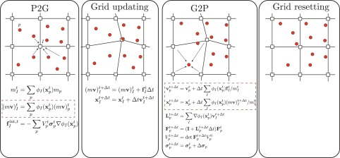

.. _mpm_theory_guide:

############################################
Material Point Method (MPM) – Quick Theory Guide
############################################

Overview
========================

The **Material Point Method (MPM)** is a numerical method for solving continuum mechanics problems involving large deformation, fracture, and multiphase interactions :cite:`sulsky1994, sulsky1995`.

It is a hybrid **Eulerian–Lagrangian method**:

- A Lagrangian description tracks material using moving particles.
- An Eulerian background grid is used to solve the governing equations :cite:`bardenhagen2004`.

This combination allows MPM to:

- Avoid mesh distortion (unlike FEM)
- Track deformation history
- Handle contact, fracture, and large strain problems robustly :cite:`homel2017`

Conceptual Representation
========================

MPM consists of two interacting systems:

**Material Points (Particles)**

- Carry physical state:
  
  - mass (``m``)
  - velocity (``v``)
  - stress (``σ``)
  - deformation gradient (``F``)

- Move with the material (Lagrangian)

**Background Grid**

- Fixed in space
- Used to:

  - compute gradients
  - solve equations of motion :cite:`bardenhagen2004`

MPM Algorithm (Explicit Form)
=============================

Figure 1) Visual of the MPM method from :cite:`chen1999localization`.

A standard explicit MPM time step consists of the following steps :cite:`sulsky1995, bardenhagen2004`:

1. Particle to Grid Mapping
---------------------------

Material point quantities are projected to grid nodes using shape functions:

.. math::

   M_i = \sum_p m_p N_i(\mathbf{x}_p)

.. math::

   \mathbf{P}_i = \sum_p m_p \mathbf{v}_p N_i(\mathbf{x}_p)

2. Solve Momentum Equation on Grid
----------------------------------

Newton’s second law is solved at grid nodes:

.. math::

   \mathbf{a}_i = \frac{\mathbf{f}_i^{\text{int}} + \mathbf{f}_i^{\text{ext}}}{M_i}

.. math::

   \mathbf{v}_i^{n+1} = \mathbf{v}_i^n + \mathbf{a}_i \Delta t

3. Grid to Particle Update
--------------------------

Update particle velocity and position:

.. math::

   \mathbf{v}_p^{n+1} = \sum_i \mathbf{v}_i^{n+1} N_i(\mathbf{x}_p)

.. math::

   \mathbf{x}_p^{n+1} = \mathbf{x}_p^n + \mathbf{v}_p^{n+1} \Delta t

4. Update Deformation and Stress
--------------------------------

Velocity gradient:

.. math::

   \mathbf{L}_p = \sum_i \mathbf{v}_i \nabla N_i

Deformation gradient update:

.. math::

   \mathbf{F}_p^{n+1} = (\mathbf{I} + \mathbf{L}_p \Delta t)\mathbf{F}_p^n

Stress is updated using a constitutive model (elastic, plastic, viscoplastic, or damage-based) :cite:`homel2017, crook2026`.

5. Reset Grid
--------------

- Grid is cleared each timestep
- Prevents mesh distortion accumulation
- Distinguishes MPM from FEM :cite:`sulsky1995`

Governing Equations
===================

MPM solves the continuum momentum equation:

.. math::

   \rho \frac{d\mathbf{v}}{dt} = \nabla \cdot \boldsymbol{\sigma} + \mathbf{b}

Where:

- ``ρ`` is density  
- ``σ`` is Cauchy stress  
- ``b`` is body force  

Explicit Time Integration
=========================

Most MPM solvers use explicit time integration.

The timestep is limited by a CFL-type stability condition :cite:`belytschko2013`:

.. math::

   \Delta t \leq \frac{l}{c}

Where:

- ``l`` is the characteristic grid size  
- ``c`` is the wave speed  

Advantages
==========

- Handles large deformation without remeshing  
- Naturally captures fracture and fragmentation  
- Supports history-dependent constitutive models :cite:`homel2017`  

Limitations
===========

- Computationally expensive  
- Stability constrained by timestep  
- Sensitive to interpolation and grid resolution :cite:`bardenhagen2004`  

Common Variants of MPM
======================

Several variants of the Material Point Method differ primarily in how information is transferred between particles and the grid. These choices affect numerical diffusion, stability, and accuracy.

.. list-table::
   :header-rows: 1
   :widths: 15 25 60

   * - Method
     - Acronym Meaning
     - Description
   * - PIC
     - Particle-in-Cell
     - Transfers particle velocity directly from grid velocities each timestep. This approach is very stable but introduces numerical diffusion, which can damp important physical features.
   * - FLIP
     - Fluid-Implicit-Particle
     - Updates particle velocities using changes in grid velocity rather than overwriting them. This reduces numerical diffusion compared to PIC but can introduce noise and instability.
   * - APIC
     - Affine Particle-in-Cell
     - Extends PIC by including affine (velocity gradient) information in particle updates, improving angular momentum conservation and reducing both noise and diffusion :cite:`jiang2015`.
   * - GIMP
     - Generalized Interpolation Material Point
     - Modifies interpolation functions to account for finite particle size, reducing cell-crossing errors and improving smoothness of the solution :cite:`bardenhagen2004`.

Summary
-------

- **PIC** → stable but diffusive  
- **FLIP** → less diffusive but noisier  
- **APIC** → improved accuracy and momentum conservation  
- **GIMP** → improved interpolation and reduced grid-crossing artifacts  

These variants are often combined or adapted depending on the application and desired balance between stability and accuracy.

Typical Applications
====================

- Geomechanics  
- Impact and penetration  
- Fragmentation and explosives  
- Fluid–structure interaction  
- Additive manufacturing  

Key Takeaways
=============

- MPM uses particles to carry state and a grid to solve equations  
- Hybrid formulation avoids mesh distortion  
- Explicit time integration introduces stability limits  
- Well-suited for extreme deformation problems  

References
========================

.. bibliography:: 
   :cited:
   :style: plain
