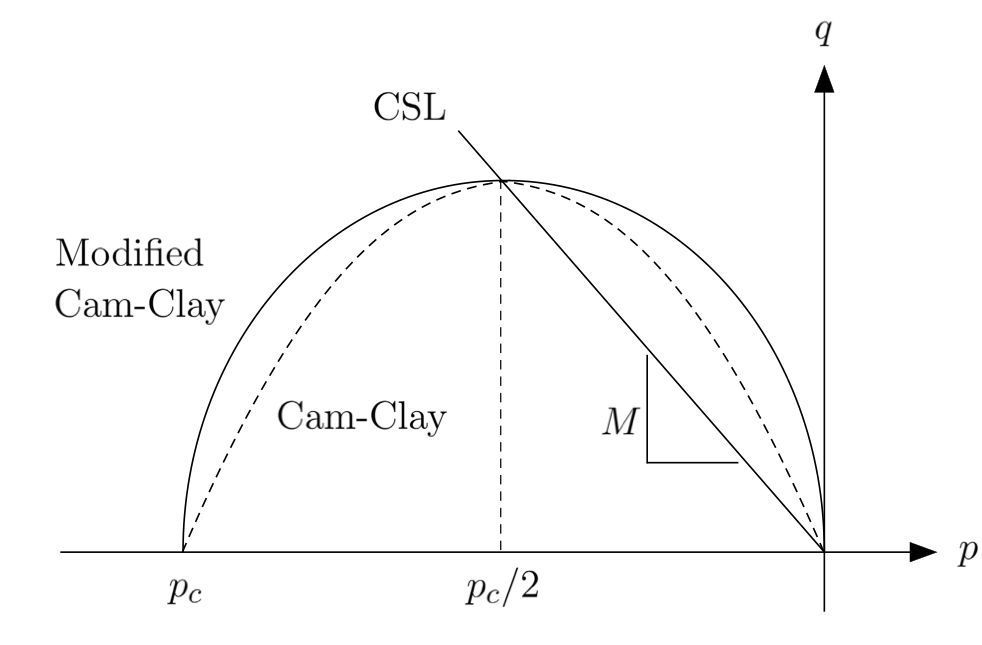
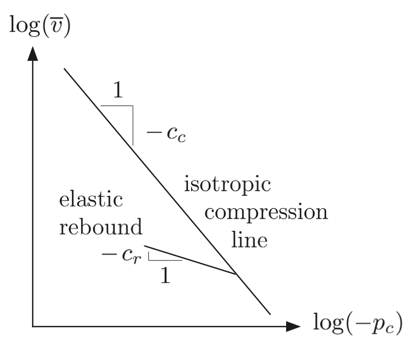

.. _ModifiedCamClay:

=========================
Model: Modified Cam-Clay
=========================

This model may be used to represent a solid material with plastic response to loading according to the `Modified Cam-Clay  (MCC) <https://en.wikipedia.org/wiki/Critical_state_soil_mechanics>`__ critical state model.  The MCC yield function is defined as:

.. math::
  f = q^2 + M^2 p(p - p_c) = 0 , 

where :math:`p_c` is the preconsolidation pressure, and :math:`M` is the slope of the critical state line (CSL).  :math:`M` can be related to the critical state friction angle :math:`\phi_{cs}` as

.. math::
   M = \frac{6 \sin \phi_{cs}}{3-\sin \phi_{cs}}.
    
Here :math:`f` represents the yield surface, as shown in Figure 6.

.. _CamClaypq:

   
   Cam-Clay and Modified Cam-Clay yield surfaces in p-q space (Borja, 2013). 
   
Here we use a hyper-elastic constitutive law using the following elastic rate constitutive equation 

.. math::
  \dot{p} = - \frac{p}{c_r} \dot{\epsilon}^e_v,
  
where :math:`c_r > 0` is the elastic compressibility index. The tangential elastic bulk modulus is :math:`K=- \frac{p}{c_r}` and varies linearly with pressure. We assume a constant shear modulus, and can write stress invariants p and q as

.. math::
  p = p_0 \exp \left( \frac{\epsilon_{v0} - \epsilon_v^e}{c_r}\right) , \quad q = 3 \mu \epsilon_s^e,
  
where :math:`p_0` is the reference pressure and :math:`\epsilon_{v0}` is the reference volumetric strain. The hardening law is derived from the linear relationship between logarithm of specific volume and logarithm of preconsolidation pressure, as show in Figure 7. 

.. _CamClayHardening:

   
   Bilogarithmic hardening law derived from isotropic compression tests  (Borja, 2013). 

The hardening law describes evolution of the preconsolidation pressure :math:`p_c` as

.. math::
  \dot{p_c} = - \frac{tr(\dot{\boldsymbol{\epsilon}}^p)}{c_c-c_r} p_c,

where :math:`c_c` is the virgin compressibility index and we have :math:`0 < c_r < c_c`.

Parameters
~~~~~~~~~~~~~~~~

The supported attributes will be documented soon.

Example
~~~~~~~~~~~~~~~~~~~

.. code-block:: xml

  <Constitutive>
    <ModifiedCamClay name="mcc"
                     defaultDensity="2700"
                     defaultRefPressure="-1.0"
                     defaultRefStrainVol="0"
                     defaultShearModulus="200.0"
                     defaultPreConsolidationPressure="-1.5"
                     defaultCslSlope="1.2"
                     defaultRecompressionIndex="0.002"
                     defaultVirginCompressionIndex="0.003" />
  </Constitutive>

