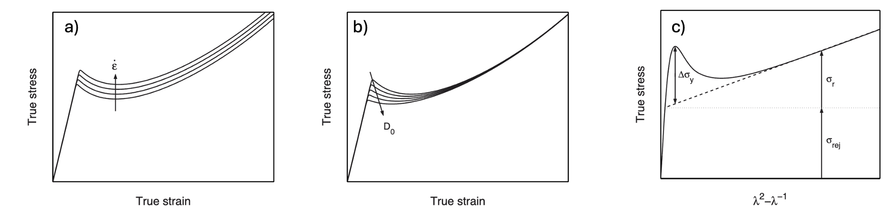
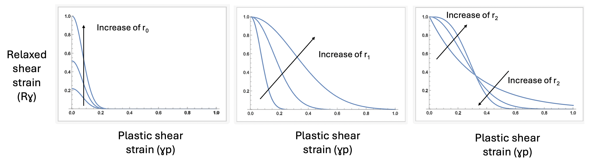
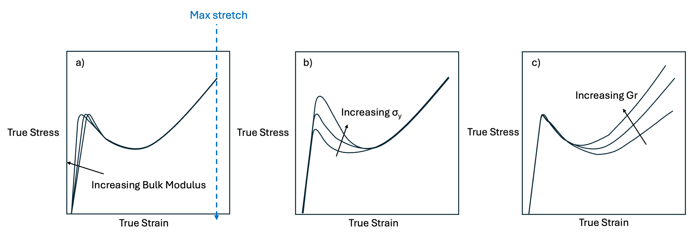

.. _StrainHardeningPolymer:

############################################
Strain Hardening Polymer (MPM Only)
############################################

Overview of Model Formulation
========================
This description of the Strain Hardening Polymer Model is sourced from :cite:t:`Klompen2005` and references within.
In the constitutive model used, a distinction is made concerning the contribution
of secondary interactions between polymer chains, that determine the (visco-)
elastic properties at small deformations and plastic flow, and the entangled polymer
network that governs strain hardening.

Accordingly, the total Cauchy stress :math::'\sigma' is decomposed in a driving stress
:math::'\sigma_s', and a hardening stress :math::'\sigma_H':

.. math::

   \sigma = \sigma_s + \sigma_H

Hardening is modelled with a neo-Hookean relation such that :math:`G_r` is a strain hardening modulus and :math:`\tilde{B}^d` is the deviatoric part of the isochoric left Cauchy-Green deformation tensor. 

.. math::

   \sigma_H = G_r +  \tilde{B}^d

The driving stress is decomposed into a deviatoric part :math:`\boldsymbol{\sigma}^{d}_{s}` and a hydrostatic part :math:`\boldsymbol{\sigma}^{h}_{s}`:

.. math::

   \boldsymbol{\sigma}^{d}_{s} = G\,\tilde{\mathbf{B}}^{e}_{d},
   \qquad
   \boldsymbol{\sigma}^{h}_{s} = \kappa\,(J-1)\,\mathbf{I},

where :math:`G` is the shear modulus, :math:`\tilde{\mathbf{B}}^{e}_{d}` the deviatoric part of the isochoric elastic left Cauchy–Green tensor, :math:`\kappa` the bulk modulus, :math:`J` the volume-change factor, and :math:`\mathbf{I}` the identity tensor. The evolution of :math:`J` and :math:`\tilde{\mathbf{B}}^{e}` is

.. math::

   \dot{J} = J\,\operatorname{tr}(\mathbf{D}),
   \qquad
   \stackrel{\circ}{\tilde{\mathbf{B}}^{e}}
   = (\mathbf{D}^{d}-\mathbf{D}^{p})\cdot\tilde{\mathbf{B}}^{e}
     + \tilde{\mathbf{B}}^{e}\cdot(\mathbf{D}^{d}-\mathbf{D}^{p}),

where :math:`\stackrel{\circ}{\tilde{\mathbf{B}}^{e}}` denotes the Jaumann rate of :math:`\tilde{\mathbf{B}}^{e}`, :math:`\mathbf{D}^{d}` is the deviatoric part of the rate-of-deformation tensor, and :math:`\mathbf{D}^{p}` its plastic part.

A non-Newtonian flow rule with a stress-dependent Eyring viscosity relates the plastic deformation rate to the deviatoric driving stress:

.. math::

   \mathbf{D}^{p} = \frac{\boldsymbol{\sigma}^{d}_{s}}{2\,\eta(T,p,\bar{\tau},D)}.

The viscosity depends strongly on the equivalent stress :math:`\bar{\tau}` and is extended to include pressure dependence (:math:`\mu`) and intrinsic strain softening (:math:`D`):

.. math::

   \eta(T,p,\bar{\tau},D)
   = A_{0}(T)\,\tau_{0}\,
     \exp\!\Bigl(\tfrac{\mu\,p}{\tau_{0}}\Bigr)\,
     \frac{\bar{\tau}/\tau_{0}}{\sinh\!\bigl(\bar{\tau}/\tau_{0}\bigr)}\,
     \exp(-D),

with the temperature-dependent prefactor

.. math::

   A_{0}(T) = A_{0}\,\exp\!\Bigl(\tfrac{\Delta U}{R\,T}\Bigr),

where :math:`A_{0}` is a constant, :math:`\Delta U` the activation energy, :math:`R` the gas constant, and :math:`T` the
 absolute temperature. The characteristic stress, pressure, and von Mises-type equivalent stress are

.. math::

   \tau_{0} = \frac{k\,T}{V^{*}},\qquad
   p = -\tfrac{1}{3}\operatorname{tr}(\boldsymbol{\sigma}),\qquad
   \bar{\tau} = \sqrt{\tfrac{1}{2}\,\operatorname{tr}\!\bigl(\boldsymbol{\sigma}^{d}_{s}\cdot\boldsymbol{\sigma}^{d}_{s}\bigr)}.

with :math:`V^{*}` the activation volume and :math:`k` Boltzmann’s constant.

The intrinsic strain softening is represented by the structural parameter :math:`D`,
which evolves from an initial value :math:`D_{0}` to an equilibrium value
:math:`D_{\infty} > D_{0}` with increasing equivalent plastic strain
:math:`\bar{\gamma}_{p}`, thereby strongly reducing the viscosity :math:`\eta`.
In general form,

.. math::

   D(\bar{\gamma}_{p}) = D_{\infty}\,R_{\gamma}(\bar{\gamma}_{p}),

where :math:`R_{\gamma}` increases monotonically from an initial value
:math:`R_{\gamma}(0)\le 1` to :math:`1` with equivalent plastic strain. The
equivalent plastic strain rate is defined as

.. math::

   \dot{\bar{\gamma}}_{p} \;=\; \sqrt{\,2\,\mathrm{tr}\!\bigl(\mathbf{D}^{p}\cdot\mathbf{D}^{p}\bigr)}\,,

with :math:`\mathbf{D}^{p}` the plastic part of the rate-of-deformation tensor.

In the specific (first-order, phenomenological) evolution, :math:`D` represents the density of shear-transformation sites inferred
from PALS measurements. Since the initial value
:math:`D_{0}=D_{\infty}\,R_{\gamma}(0)` depends on thermal history, a new
:math:`D_{0}` must be determined for each sample with a different history (via
PALS or numerical fitting).

.. _strain_hardening_rates_initial_shear_transform_site_densities:

   A) Change of stress versus strain with different strain rates. B) Evolution of shear
   transformation site density versus plastic strain for different initial densities. C)
   Stress–strain curves translated into :math:`\sigma_{\mathrm{rej}}` (flow stress of the fully
   rejuvenated state), :math:`\Delta\sigma_{y}` (yield drop), and :math:`\sigma_{r}` (strain-hardening stress).

Relaxation Term
-------------------------------------------------------------
Softening with magnitude of plastic deviatoric strain (material is plastically incompressible, so this equals the magnitude of the total strain).
This is the effect of loss of strength with plastic deformation.

.. math::

   R_{\gamma}\!\left(\gamma_{p};\, r_{0}, r_{1}, r_{2}\right)
   \;=\; r_{0}\,\exp\!\left[-\left(\frac{\gamma_{p}}{r_{1}}\right)^{r_{2}}\right]

.. only:: html

   .. raw:: html

      

.. _strain_hardening_r0_r1_r2:

   Changes in relaxation terms. 

Hardening Term
-------------------------------------------------------------
Hardening is defined to depend on the maximum principal stretch (:math:`\lambda_{\max}`).  So there is hardening in uniaxial stress compaction because of Poisson expansion (:math:`\lambda_2=\lambda_3` will be max stretch).

.. math::

   \sigma_H(G_r, \lambda)
   =
   G_r \left( \lambda^{2} - \lambda^{-1} \right)

.. _strain_hardening_k_sigmay_Gr:

   Changes with hardening.

Model Implementation
========================
First, we store the trial stress for computing the plastic strain increment. 

.. code-block:: cpp

  real64 trialStress[6] = { 0 };
  LvArray::tensorOps::copy< 6 >( trialStress, stress);

This essentially creates:

.. math::

   \sigma_i^{\text{trial}} = \sigma_i, \quad i = 1,\dots,6

Then we decompose the trial stress into pressure (P) and 
Von Mises (Q) stress invarients.

.. code-block:: cpp

  real64 trialP;
  real64 trialQ;
  real64 deviator[6] = { 0 };
  twoInvariant::stressDecomposition( trialStress,
                                     trialP,
                                     trialQ,
                                     deviator );

twoInvariant::stressDecomposition is defined in InvariantDecompositions.hpp. The function decomposes a stress tensor (Voigt notation) into volumetric stress, 
into deviatoric stress, and the deviator (or the unit orientation of the deviatoric part). To explore that file, you'll want to navigate to it through:

.. code-block:: cpp

  GEOS/src/coreComponents/constitutive/solid/InvariantDecompositions.hpp

The following section computes the unrotated state needed to evaluate the constitutive model
in the material frame. This involves extracting the rotation, unrotating the plastic strain,
and computing the right stretch tensor from the deformation gradient. 

.. code-block:: cpp

   real64 rotationTranspose[3][3];
   LvArray::tensorOps::transpose< 3, 3 >( rotationTranspose, beginningRotation );

The steps below remove the rigid-body rotation from both the deformation gradient and the plastic strain tensor so the 
constitutive model operates in the material (unrotated) configuration. By computing the unrotated plastic strain, unrotated deformation gradient,
and finally the principal stretches and directions from the right stretch tensor, the model isolates the true material deformation needed 
for subsequent yield, hardening, and damage computations.

.. only:: html

   .. raw:: html

      

Step 1: Compute the rotation tensor transpose
-------------------------------------------------------------

The tensor ``beginningRotation`` stores the rotation :math:`R` from the polar decomposition
of the deformation gradient. Its transpose :math:`R^{\mathsf{T}}` is computed and stored in
``rotationTranspose``. This is required because the constitutive model operates on **unrotated** quantities.

.. math::
   R^{\mathsf{T}} = R^{-1}

.. code-block:: cpp

   real64 oldPlasticStrain[6] = { 0 };
   LvArray::tensorOps::copy< 6 >( oldPlasticStrain, m_plasticStrain[k][q] );
   oldPlasticStrain[3] *= 0.5;
   oldPlasticStrain[4] *= 0.5;
   oldPlasticStrain[5] *= 0.5;

.. only:: html

   .. raw:: html

      

Step 2: Extract the plastic strain tensor and convert to tensor form
-------------------------------------------------------------

``m_plasticStrain[k][q]`` is stored in engineering-strain Voigt notation.  
The shear components (indices 3–5) must be halved to convert from engineering shear
to tensorial shear strain. This produces ``oldPlasticStrain`` in true tensor form.

.. math::
   \epsilon_{12} = \tfrac{1}{2}\gamma_{12}

.. code-block:: cpp

   real64 unrotatedOldPlasticStrain[6] = { 0 };
   LvArray::tensorOps::Rij_eq_AikSymBklAjl< 3 >( unrotatedOldPlasticStrain,
                                                 rotationTranspose,
                                                 oldPlasticStrain );

.. only:: html

   .. raw:: html

      

Step 3: Unrotate the plastic strain
-------------------------------------------------------------

The following unrotates the plastic strain tensor and produces the plastic strain in the material configuration.

.. math::
   \epsilon^{p,\text{unrot}} = R^{\mathsf{T}}\, \epsilon^p \, R

.. code-block:: cpp

   unrotatedOldPlasticStrain[3] *= 2.0;
   unrotatedOldPlasticStrain[4] *= 2.0;
   unrotatedOldPlasticStrain[5] *= 2.0;

.. only:: html

   .. raw:: html

      

Step 4: Return to engineering shear strain
-------------------------------------------------------------

After unrotation, the tensorial shear strains are converted back to engineering form:

.. math::
   \gamma_{12} = 2\,\epsilon_{12}

.. code-block:: cpp

   real64 unrotatedDeformationGradient[3][3] = { { 0 } };
   LvArray::tensorOps::Rij_eq_AikBkj< 3, 3, 3 >( unrotatedDeformationGradient,
                                                 rotationTranspose,
                                                 m_deformationGradient[k] );

.. only:: html

   .. raw:: html

      

Step 5: Compute the unrotated deformation gradient
-------------------------------------------------------------

The deformation gradient is unrotated using the following. This isolates the **right stretch tensor** contained in :math:`F^{\text{unrot}}`.

.. math::
   F^{\text{unrot}} = R^{\mathsf{T}} F

.. code-block:: cpp

   real64 U[6] = { 0.0 };
   LvArray::tensorOps::denseToSymmetric< 3 >( U, unrotatedDeformationGradient );

.. only:: html

   .. raw:: html

      

Step 6: Extract the symmetric right stretch tensor and Compute principal stretches and directions
-------------------------------------------------------------

The symmetric tensor :math:`U` is extracted from the unrotated deformation gradient,
representing the **right stretch** from the polar decomposition:

.. math::
   F = R\,U

.. code-block:: cpp

   real64 stretch[3] = { 0 };
   real64 eigenVectors[3][3] = { { 0 } };
   LvArray::tensorOps::symEigenvectors< 3 >( stretch, eigenVectors, U );

Eigen-decomposition of :math:`U` gives:

- :math:`\lambda_i` → principal stretches (in ``stretch``)  
- corresponding eigenvectors → principal directions (in ``eigenVectors``)

This completes the calculation of the unrotated, principal-stretch representation of the deformation.
Then we find the largest eigenvalues and compare them to the maximum allowable 
failure stretch, which is temperature dependent via the ``thermalSoftening`` function

.. code-block:: cpp

   real64 failureStretch = m_maximumStretch * StrainHardeningPolymerUpdates::thermalSoftening(m_temperature[k], m_maximumStretchT0, m_maximumStretchA, m_maximumStretchB );     

.. only:: html

   .. raw:: html

      

Step 7: Damage check based on maximum principal stretch
-------------------------------------------------------------

The array ``stretch`` contains the three principal stretches
:math:`\lambda_i`. The loop computes the maximum principal stretch

.. math::

   \lambda_{\max} = \max_{i=1,2,3} \lambda_i.

If this maximum stretch exceeds the prescribed failure stretch
:math:`\lambda_{\mathrm{fail}} = \texttt{failureStretch}`, the material
point is marked as fully damaged:

.. math::

   \texttt{m_damage}[k][q] = 1
   \quad\text{if}\quad
   \lambda_{\max} > \lambda_{\mathrm{fail}}.

This corresponds to complete loss of load-carrying capacity at that
integration point.

.. only:: html

   .. raw:: html

      

Step 8: Parameters for the return-to-yield iteration
-------------------------------------------------------------

The variables ``tol`` and ``maxEvals`` set the numerical controls for
the iterative return-to-yield algorithm used later in the update:

.. math::

   \texttt{tol} = 10^{-10}, \qquad \texttt{maxEvals} = 100.

A fixed-point iteration is currently used, but the comments note that a
Newton solver may be more efficient and robust.

.. only:: html

   .. raw:: html

      

Step 9 – Apply thermal-softening to the plasticity parameters
-------------------------------------------------------------

We incorporate a temperature dependence of thermal softening for the yield strength, 
strain hardening slope, and shear softening magnitude through the thermalSoftening function defined below.

The previous-step yield strength is stored as

.. math::

   \sigma_{y}^{\text{old}} = \texttt{m_yieldStrength}[k].

The updated yield-strength components are decomposed into three parts:
a base yield strength, a strain-hardening term, and a shear-softening
term, each scaled by the thermal-softening function
:math:`s_\theta(T; T_0, A, B)`:

.. math::

   \sigma_{y}(T)
   &= \sigma_{T0} \;
      \times s_\theta\bigl(T; T_0, \sigma_A, \sigma_B), \\[4pt]
   G_r(T)
   &= G_{T0} \;
      \times s_\theta\bigl(T; T_0, G_{r,A}, G_{r,B}), \\[4pt]
   r_0(T)
   &= r_{0,T0} \;
      \times s_\theta\bigl(T; T_0, r_{0,A}, r_{0,B}).

where 

.. math::

   s_\theta = 1 + \frac{\texttt{parameter}_A}{1 + \exp\!\bigl(\texttt{parameter}_B\,(T - T_0)\bigr)}

Here :math:`T_k = \texttt{m_temperature}[k]` is the material-point
temperature, and each parameter :math:`(T_0, A, B)` defines the
temperature dependence of one contribution via the :math:`s_\theta` function below. 

.. code-block:: cpp

   real64 StrainHardeningPolymerUpdates::thermalSoftening( const real64 & T,
                                                           const real64 & T0,
                                                           const real64 & A,
                                                           const real64 & B
   ) const 
   { 
     if (std::abs(A) > 1.e-16)
     {
       return 1. + A / (1. + std::exp( B * (T-T0) ) );
     }
     else
     {
       return 1.;
     } 
   }

These quantities (``yield0``, ``strainHardeningSlope``, and
``shearSofteningMagnitude``) will later be combined to form the updated
yield strength used in the plastic return.

.. only:: html

   .. raw:: html

      

Step 10: We then conduct a fixed-point iteration to find plastic strain and consistent return to updated yield surface
-------------------------------------------------------------

For this, we make a workspace to hold the current unrotated plastic strain and a workspace 
to accumulate how much strain is added during the step

.. code-block:: cpp

   real64 unrotatedTempPlasticStrain[6] = { 0 };
   real64 plasticStrainIncrement[6] = { 0 };

Next, we  do a  fixed-point iteration to find plastic strain and consistent
return to the updated yield surface. We:

1. copy the old, unrotated plastic strain into the temporary plastic strain variable.
2. and we add the plastic strain increment from the previous iteration (starting with zero).
3. iteratively compute the magnitude of the plastic strain tensor, :math:`\gamma_p` for each component in the plastic strain tensor.

.. code-block:: cpp

   LvArray::tensorOps::copy< 6 >(unrotatedTempPlasticStrain, unrotatedOldPlasticStrain);
   LvArray::tensorOps::add< 6 >(unrotatedTempPlasticStrain, plasticStrainIncrement);

   real64 gamma_p = 0.0;
   for( int i = 0; i < 6; i++ )
   {
     gamma_p += 0.5*( 1 + (i < 3) ) * unrotatedTempPlasticStrain[i] * unrotatedTempPlasticStrain[i];
   }
   gamma_p = sqrt( gamma_p );

:math:`\gamma_p` begins = to :math:`r_0` and decays with plastic shear strain to allow for plastic softening.

The yield surface evolves with plastic softening and stretch hardening as described in :cite:p:`Klompen2005`.

.. math::

   \sigma_{\gamma}(\gamma_p, r_0, r_1, r_2)
   = r_0  \, \exp\!\left( \max\!\left( -\,\left( \frac{\gamma_p}{r_1} \right)^{r_2},\; -16 \right) \right)

.. math::

   \sigma_H(G_r, \lambda)
   =
   G_r \left( \lambda^{2} - \lambda^{-1} \right)

.. code-block:: cpp

      real64 gamma_by_r1_to_r2 = std::pow( gamma_p / r_{1}, r_{2} );

      real64 plasticSoftening = shearSofteningMagnitude * std::exp( std::max( -1.0 * gamma_by_r1_to_r2, -16.0 ) );

      real64 stretchHardening = strainHardeningSlope * ( maximumStretch * maximumStretch - 1.0 / maximumStretch );

.. math::

   \sigma_{\mathrm{y}} \;=\; \sigma_{Y0} \;+\; \sigma_{\gamma} \;+\; \sigma_H

.. code-block:: cpp

   yieldStrength = m_initialYield + plasticSoftening + stretchHardening;

Within the iteration, we check the yield funciton to ensure the trial vonMises stress is beyond the yield strength. 
If it is, we reconstruct the stress. Recall that previously, we decomposed the trial stress into pressure (P) and
Von Mises (Q) stress invarients. 

.. math::

   \sigma_{ij} \;\longrightarrow\; p,\; q,\; s_{ij}

Now that we have computing the new yield point and accounted for hardening/softening, we need to reassemble the final stress tensor:

.. math::

   \sigma^{\text{new}}_{ij}
   = s^{\text{new}}_{ij}
     - p^{\text{new}} \, \delta_{ij}

.. code-block:: cpp

   real64 stressTemp[6] = {0};
   if( trialQ > yieldStrength )
   {
     real64 stressTemp[6] = {0};
     twoInvariant::stressRecomposition( trialP,
                                        m_yieldStrength[k],
                                        deviator,
                                        stressTemp ); ...
   }

Note that the twoInvariant::stressRecomposition is defined in InvariantDecompositions.hpp. The function decomposes a stress tensor (Voigt notation) into volumetric stress, 
into deviatoric stress, and the deviator (or the unit orientation of the deviatoric part). To explore that file, you'll want to navigate to it through:

.. code-block:: cpp

  GEOS/src/coreComponents/constitutive/solid/InvariantDecompositions.hpp

We increment plastic strain by first copying the updated stress in stressIncrement, and subtracting the trial stress

.. code-block:: cpp

   real64 unrotatedNewPlasticStrain[6] = { 0 };
   LvArray::tensorOps::copy< 6 >(unrotatedNewPlasticStrain, unrotatedOldPlasticStrain);
   LvArray::tensorOps::add< 6 >(unrotatedNewPlasticStrain, plasticStrainIncrement);

Then we compute the plastic strain increment from the stress difference through the 
StrainHardeningPolymerUpdates::computePlasticStrainIncrement function which converts the stress change into an elastic strain response and
 subtracts it from the total increment to get the increment that must be plastic. 
   
.. math::

   \Delta \varepsilon^{p}
   \;=\;
   \Delta \varepsilon^{\text{total}}
   \;-\;
   \Delta \varepsilon^{\text{elastic}}

We check if the yield strength has converged. If it has, we finalize the plastic strain in the rotated frame, update the stress and then exit. 

.. code-block:: cpp

        if(abs(m_yieldStrength[k] - oldYieldStrength) < tol)
        {
         //convert unrotated plastic strain back to tensor form
          unrotatedNewPlasticStrain[3] *= 0.5; 
          unrotatedNewPlasticStrain[4] *= 0.5;
          unrotatedNewPlasticStrain[5] *= 0.5;
          real64 newPlasticStrain[6] = { 0 };
         //rotate the tensor back to the global frame
          LvArray::tensorOps::Rij_eq_AikSymBklAjl< 3 >(newPlasticStrain, endRotation, unrotatedNewPlasticStrain);
         // convert the shear component 
          newPlasticStrain[3] *= 2.0;
          newPlasticStrain[4] *= 2.0;
          newPlasticStrain[5] *= 2.0;
         //cope/save the converged strain and update stress with the converged value
          LvArray::tensorOps::copy< 6 >(m_plasticStrain[k][q], newPlasticStrain);
          LvArray::tensorOps::copy< 6 >(stress, stressTemp);
          return;
        }

Otherwise, we set the old yield strength to the current yield strength and continue the iteration.

Parameters, User Inputs
========================

.. .. include:: /coreComponents/schema/docs/StrainHardeningPolymerParameterTable.rst
.. include:: /coreComponents/schema/docs/StrainHardeningPolymer.rst

References
==========

.. bibliography::
   :style: plain
   :filter: docname in docnames
