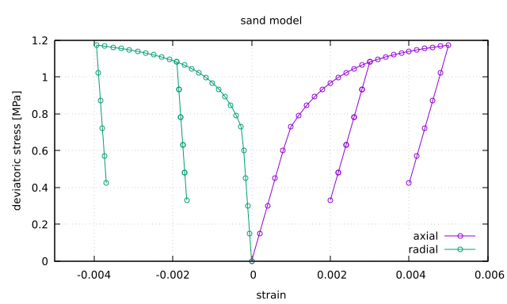

.. _TriaxialDriver:

Triaxial Driver
===============

.. contents:: Table of Contents
    :depth: 3

Introduction
------------

When calibrating solid material parameters to experimental data, it can be a hassle to launch a full finite element simulation to mimic experimental loading conditions.  Instead, GEOS provides a ``TriaxialDriver`` allowing the user to run loading tests on a single material point.  This makes it easy to understand the material response and fit it to lab data.  The driver itself is launched like any other GEOS simulation, but with a particular XML structure:

.. code-block:: sh

   ./bin/geosx -i myTest.xml

XML Structure
-------------
A typical XML file to run the triaxial driver will have the following key elements.  We present the whole file first, before digging into the individual blocks.

.. literalinclude:: ../../../unitTests/constitutiveTests/testTriaxial_druckerPragerExtended.xml
  :language: xml

The first thing to note is that the XML structure is identical to a standard GEOS input deck.  In fact, once the constitutive block is calibrated, one could start adding solver and discretization blocks to the same file to create a proper field simulation.  This makes it easy to go back and forth between calibration and simulation.

The ``TriaxialDriver`` is added as a ``Task``, a particular type of executable event often used for simple actions.  It is added as a ``SoloEvent`` to the event queue.  This leads to a trivial event queue, since all we do is launch the driver and then quit.

Internally, the triaxial driver uses a simple form of time-stepping to advance through the loading steps, allowing for both rate-dependent and rate-independent models to be tested. This timestepping is handled independently from the more complicated time-stepping pattern used by physics ``Solvers`` and coordinated by the ``EventManager``.  In particular, in the XML file above, the ``maxTime`` parameter in the ``Events`` block is an event manager control, controlling when/if certain events occur.  Once launched, the triaxial driver internally determines its own max time and timestep size using a combination of the strain function's time coordinates and the requested number of loadsteps.  It is therefore helpful to think of the driver as an instantaneous *event* (from the event manager's point of view), but one which has a separate, internal clock.

The key parameters for the TriaxialDriver are:

.. include:: /coreComponents/schema/docs/TriaxialDriver.rst

.. note::

   GEOS uses the *engineering* sign convention where compressive stresses and strains are *negative*.
   This is one of the most frequent issues users make when calibrating material parameters, as
   stress- and strain-like quantities often need to be negative to make physical sense.  You may note in the
   XML above, for example, that ``stressFunction`` and ``strainFunction`` have negative values for
   a compressive test.

Test Modes
----------
The most complicated part of the driver is understanding how the stress and strain functions are applied in different testing modes.  The driver mimics laboratory core tests, with loading controlled in the
axial and radial directions. These conditions may be either strain-controlled or stress-controlled, with the user providing time-dependent functions to describe the loading.  The following table describes the available test modes in detail:

+--------------------+-------------------------+--------------------------+---------------------------+
| **mode**           | **axial loading**       | **radial loading**       | **initial stress**        |
+--------------------+-------------------------+--------------------------+---------------------------+
| ``strainControl``  | axial strain controlled | radial strain controlled | isotropic stress using    |
|                    | with ``axialControl``   | with ``radialControl``   | ``initialStress``         |
+--------------------+-------------------------+--------------------------+---------------------------+
| ``stressControl``  | axial stress controlled | radial stress controlled | isotropic stress using    |
|                    | with ``axialControl``   | with ``radialControl``   | ``initialStress``         |
+--------------------+-------------------------+--------------------------+---------------------------+
| ``mixedControl``   | axial strain controlled | radial stress controlled | isotropic stress using    |
|                    | with ``axialControl``   | with ``radialControl``   | ``initialStress``         |
+--------------------+-------------------------+--------------------------+---------------------------+

Note that a classical triaxial test can be described using either the ``stressControl`` or ``mixedControl`` mode.  We recommend using the ``mixedControl`` mode when possible, because this almost always leads to well-posed loading conditions.  In a pure stress controlled test, it is possible for the user to request that the material sustain a load beyond its intrinsic strength envelope, in which case there is no feasible solution and the driver will fail to converge.  Imagine, for example, a perfectly plastic material with a yield strength of 10 MPa, but the user attempts to load it to 11 MPa.  

A volumetric test can be created by setting the axial and radial control functions to the same time history function.  Similarly, an oedometer test can be created by setting the radial strain to zero. 

The user should be careful to ensure that the initial stress set via the ``initialStress`` value is consistent any applied stresses set through axial or radial loading functions.  Otherwise, the material may experience sudden and unexpected deformation at the first timestep because it is not in static equilibrium.

Output Format
-------------
The ``output`` key is used to identify a file to which the results of the simulation are written.  If this key is omitted, or the user specifies ``output="none"``, file output will be suppressed.  The file is a simple ASCII format with a brief header followed by test data:

.. code:: sh

  # column 1 = time
  # column 2 = axial_strain
  # column 3 = radial_strain_1
  # column 4 = radial_strain_2
  # column 5 = axial_stress
  # column 6 = radial_stress_1
  # column 7 = radial_stress_2
  # column 8 = newton_iter
  # column 9 = residual_norm
  0.0000e+00  0.0000e+00 0.0000e+00 0.0000e+00 -1.0000e+00 -1.0000e+00 -1.0000e+00 0.0000e+00 0.0000e+00
  1.6000e-01 -1.6000e-04 4.0000e-05 4.0000e-05 -1.1200e+00 -1.0000e+00 -1.0000e+00 2.0000e+00 0.0000e+00
  3.2000e-01 -3.2000e-04 8.0000e-05 8.0000e-05 -1.2400e+00 -1.0000e+00 -1.0000e+00 2.0000e+00 0.0000e+00
  ...

This file can be readily plotted using any number of plotting tools.  Each row corresponds to one timestep of the driver, starting from initial conditions in the first row.

We note that the file contains two columns for radial strain and two columns for radial stress.  For an isotropic material, the stresses and strains along the two radial axes will usually be identical.  We choose to output this way, however, to accommodate both anisotropic materials and true-triaxial loading conditions.  In these cases, the stresses and strains in the radial directions could potentially differ.

These columns can be added and subtracted to produce other quantities of interest, like mean stress or deviatoric stress.  For example, we can plot the output produce stress / strain curves (in this case for a plastic rather than simple elastic material):

   Stress/strain behavior for a plastic material.

In this plot, we have reversed the sign convention to be consistent with typical experimental plots.  Note also that the ``strainFunction`` includes two unloading cycles, allowing us to observe both plastic loading and elastic unloading.

Model Convergence
-----------------

The last two columns of the output file contain information about the convergence behavior of the material driver.  In ``triaxial`` mode, the mixed nature of the stress/strain control requires using a Newton solver to converge the solution.  This last column reports the number of Newton iterations and final residual norm.  Large values here would be indicative of the material model struggling (or failing) to converge.  Convergence failures can result from several reasons, including:

1. Inappropriate material parameter settings
2. Overly large timesteps
3. Infeasible loading conditions (i.e. trying to load a material to a physically-unreachable stress point)
4. Poor model implementation

We generally spend a lot of time vetting the material model implementations (#4).  When you first encounter a problem, it is therefore good to explore the other three scenarios first.  If you find something unusual in the model implementation or are just really stuck, please submit an issue on our issue tracker so we can help resolve any bugs.

Unit Testing
------------

The development team also uses the Triaxial Driver to perform unit testing on the various material models within GEOS.  The optional argument ``baseline`` can be used to point to a previous output file that has been validated  (e.g. against analytical or experimental benchmarks).  If such a file is specified, the driver will perform a loading run and then compare the new results against the baseline.  In this way, any regressions in the material models can be quickly identified.

Developers of new models are encouraged to add their own baselines to ``src/coreComponents/constitutive/unitTests``. Adding additional tests is straightforward:

1. Create a new xml file for your test in ``src/coreComponents/constitutive/unitTests``.  There are several examples is this directory already to use as a template.  We suggest using the naming convention ``testTriaxial_myTest.xml``, so that all triaxial tests will be grouped together alphabetically.  Set the ``output`` file to ``testTriaxial_myTest.txt``, and run your test.  Validate the results however is appropriate.

2. This output file will now become your new baseline.  Replace the ``output`` key with ``baseline`` so that the driver can read in your file as a baseline for comparison.  Make sure there is no remaining ``output`` key, or set ``output=none``, to suppress further file output.  While you can certainly write a new output for debugging purposes, during our automated unit tests we prefer to suppress file output.  Re-run the triaxial driver to confirm that the comparison test passes.

3. Modify ``src/coreComponents/constitutive/unitTests/CMakeLists.txt`` to enable your new test in the unit test suite.  In particular, you will need to add your new XML file to the existing list in the ``gtest_triaxial_xmls`` variable:

.. code:: sh

  set( gtest_triaxial_xmls
       testTriaxial_elasticIsotropic.xml
       testTriaxial_druckerPragerExtended.xml
       testTriaxial_myTest.xml
     )

4. Run ``make`` in your build directory to make sure the CMake syntax is correct

5. Run ``ctest -V -R Triax`` to run the triaxial unit tests.  Confirm your test is included and passes properly.

If you run into troubles, do not hesitate to contact the development team for help.
