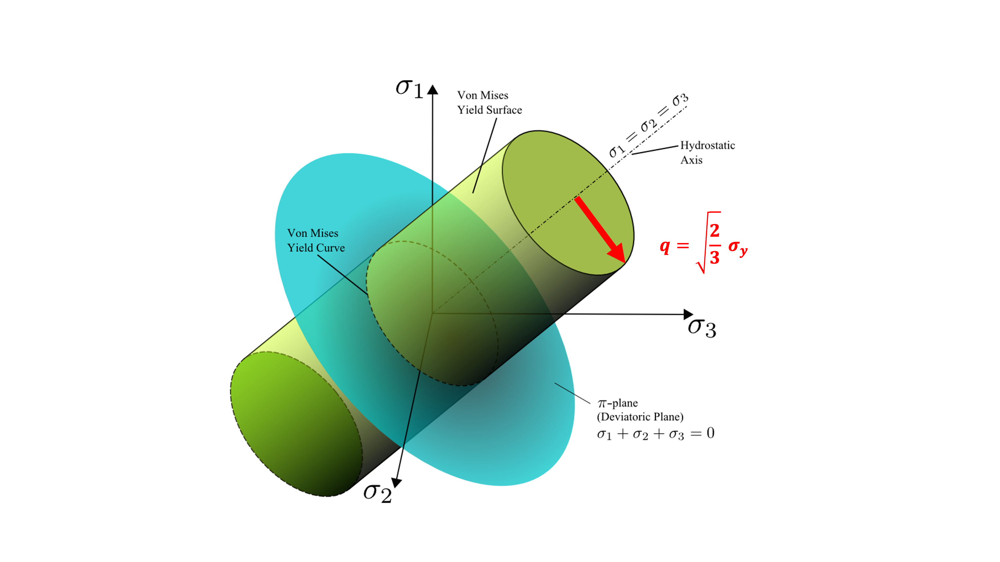

.. _VonMisesJModel:

############################################
Von Mises J Model
############################################

Overview, Summary
========================
The Von Mises (J2) plasticity material model is built on top of an isotropic elastic base class, and 
gets the per-element state needed (yield strength, deformation gradient, velocity gradient, and plastic strain) 
so it can be called efficiently from device/kernel code. In the main small-strain update, pressure is computed from 𝐽=det(F) via p = -KlnJ.
The deviatoric stress is updated hypoelastically from the symmetric part of the unrotated velocity gradient, 
D. Then the trial von Mises measure, Q, is checked against the element’s yield strength. If yielding occurs, stress is projected back to the yield surface. 
When plasticity happens, the plastic strain increment is estimated as “total strain increment minus elastic strain increment” (using the stress increment plus K and G).
Plastic strain is rotated between frames for consistency, stores it, and the updated stress is saved.

Inputs are yield strenght per element, deformation gradient (F), velocity gradient (L), plastic strain and elastic moduli (K, G).
Primary outputs include the updated Cauchy stress, plastic strain if yielding occurs, and elastic stiffness for the MPM Solver. 
Elastic stiffness is either returned as a 6x6 isotropic Hooke matrix or as K and G.

Theory
========================

VonMisesJ plasticity is a two-invariant J2 (von Mises) model in which the
deviatoric stress magnitude controls yielding, while the pressure is updated
from the volumetric deformation. Part of this theory is derived from the `Two-Invariant Models documentation page <https://geosx-geosx.readthedocs-hosted.com/en/latest/coreComponents/constitutive/docs/solid/Plasticity.html#two-invariant-models>`_ . The Cauchy stress (:math:`\sigma`) is decomposed into mean
stress (pressure, p) and deviatoric stress (s) as:

.. math::
   \boldsymbol{\sigma} = -p\,\boldsymbol{1} + \boldsymbol{s}, \qquad
   p = -\frac{1}{3}\,\mathrm{tr}(\boldsymbol{\sigma}), \qquad
   \boldsymbol{s} = \boldsymbol{\sigma} + p\,\boldsymbol{1}.

The von Mises equivalent stress (called ``Q`` in the implementation) is defined by:

.. math::
   q = \sqrt{3J_2} = \sqrt{\frac{3}{2}} \|\boldsymbol{s}\|, \qquad
   J_2 = \frac{1}{2}\boldsymbol{s}:\boldsymbol{s}.

.. _VonMisesEnvelope:

Figure 1: Annotated Von Mises Yield Envelope in the p-q plane. Source:  :cite:t:`VonMisesYieldCriterionWiki`.

Yielding is governed by the J2 criterion

.. math::
   f(q) = q - \sigma_y \le 0,

where :math:`\sigma_y` is the (per-element) yield strength.

**Volumetric (pressure) update.**
The pressure is computed from the deformation gradient determinant
:math:`J = \det(\boldsymbol{F})` using a logarithmic volumetric law

.. math::
   p = -K \ln J,

where :math:`K` is the bulk modulus.

**Deviatoric (hypoelastic) update.**
The deviatoric stress is advanced hypoelastically using the symmetric part of the
(unrotated) velocity gradient :math:`\boldsymbol{D}=\tfrac{1}{2}(\boldsymbol{L}+\boldsymbol{L}^T)`
with its deviatoric part :math:`\boldsymbol{D}^{\prime}`:

.. math::
   \Delta \boldsymbol{s} = 2G\,\Delta t\,\boldsymbol{D}^{\prime},

where :math:`G` is the shear modulus and :math:`\Delta t` is the time increment.
The trial stress is then formed as

.. math::
   \boldsymbol{\sigma}_\text{trial} = -p\,\boldsymbol{1} + \left(\boldsymbol{s}^n + \Delta \boldsymbol{s}\right).

**Radial return (plastic correction).**
If :math:`q_\text{trial} > \sigma_y`, the deviatoric stress is projected back to the
yield surface by preserving the deviatoric direction and scaling its magnitude:

.. math::
   \hat{\boldsymbol{n}} = \frac{\boldsymbol{s}_\text{trial}}{\|\boldsymbol{s}_\text{trial}\|}, \qquad
   \boldsymbol{s}^{n+1} = \sqrt{\frac{2}{3}}\,\sigma_y\,\hat{\boldsymbol{n}}, \qquad
   \boldsymbol{\sigma}^{n+1} = -p\,\boldsymbol{1} + \boldsymbol{s}^{n+1}.

Otherwise, :math:`\boldsymbol{\sigma}^{n+1}=\boldsymbol{\sigma}_\text{trial}`.

**Plastic strain update (stored state).**
When yielding occurs, the increment in plastic strain is computed from the strain
and stress increments by subtracting an elastic strain increment computed from
:math:`K` and :math:`G`:

.. math::
   \Delta\boldsymbol{\epsilon}^p = \Delta\boldsymbol{\epsilon} - \Delta\boldsymbol{\epsilon}^e.

The elastic increment :math:`\Delta\boldsymbol{\epsilon}^e` is reconstructed from the
stress increment using volumetric and deviatoric parts consistent with isotropic
elasticity. The plastic strain tensor is stored as a history variable and rotated
between frames for objectivity.

.. raw:: html

   

Implementation
========================
There are 10 helper/update functions, with one being the core implementation (the rotated smallStrainUpdate_StressOnly) and the others acting as wrappers, variants, or supporting utilities (computePlasticStrainIncrement).
Because smallStrainUpdate_StressOnly and computePlasticStrainIncrement together they fully determine the material’s physical response, (while the other functions merely wrap, route, or expose this behavior to the solver),
these two functions are detailed further below.

.. list-table:: Helper Functions Overview
   :widths: 50 50
   :header-rows: 1

   * - Type
     - Helper Functions and Overloads
   * - **Elastic helpers**  
     - - getElasticStiffness – builds the isotropic elastic stiffness (6×6 or via ops) 
       - getElasticStrain – declared but intentionally not implemented (errors out)
   * - **No-state (elastic-only) small-strain helpers (3 overloads)**
     - - smallStrainNoStateUpdate_StressOnly (not implemented)
       - smallStrainNoStateUpdate (returns full 6×6 stiffness)
       - smallStrainNoStateUpdate (returns DiscretizationOps)
   * - **Stateful small-strain update helpers (2 and 2 overloads)**
     - - smallStrainUpdate_StressOnly (non-rotation aware - not implemented) 
       - smallStrainUpdate_StressOnly (rotation aware - main implementation) 
       - smallStrainUpdate (stress + full 6×6 stiffness) 
       - smallStrainUpdate (stress + DiscretizationOps)
   * - **Plasticity helper** 
     - - computePlasticStrainIncrement – computes :math:`\Delta\boldsymbol{\epsilon}^p = \Delta\boldsymbol{\epsilon} - \Delta\boldsymbol{\epsilon}^e`

.. raw:: html

   

Small Strain Update Stress Only - Function Overview
=============================================

Updates the Cauchy stress (Voigt form) for the ``VonMisesJ`` constitutive model over one time increment
using a **corotational, hypoelastic deviatoric** update and an **exact volumetric pressure** update.
If inelasticity is enabled, the update enforces a **J2 (von Mises) yield surface** via a radial return
and updates the stored plastic strain.

Specifically, this helper handles:

#. **Volumetric response from deformation gradient:** compute pressure from :math:`J=\det(\boldsymbol{F})`
   using :math:`p=-K\ln J`.
#. **Deviatoric hypoelasticity in a corotational frame:** form the strain-rate tensor
   :math:`\boldsymbol{D}=\mathrm{sym}(\boldsymbol{L}^{*})`, extract its deviatoric part, and drive
   the deviatoric stress increment.
#. **J2 plasticity:** compute the trial von Mises equivalent stress :math:`q_\mathrm{trial}` and apply
   radial return if :math:`q_\mathrm{trial}>\sigma_y`.
#. **Plastic strain evolution:** update :math:`\Delta\boldsymbol{\varepsilon}^p
   = \Delta\boldsymbol{\varepsilon} - \Delta\boldsymbol{\varepsilon}^e` and rotate plastic strain
   between frames for objectivity. Call computePlasticStrainIncrement if yielding.
#. **Elastic tangent stiffness output:** provide isotropic elastic stiffness either as a full 6×6 matrix
   or as :math:`(K,G)` via isotropic discretization operations.

.. list-table:: The 8-Step Process
   :widths: 5 95
   :header-rows: 1

   * - Step
     - Description

   * - 1
     - **Load old state:** Copy the previous Cauchy stress :math:`\boldsymbol{\sigma}^n` (Voigt form) and
       decompose into invariants :math:`(p^n, q^n)` and a deviatoric direction (via
       ``twoInvariant::stressDecomposition``). The old deviatoric stress magnitude is scaled consistently
       with the code’s invariant convention.

   * - 2
     - **Compute exact pressure from volumetric deformation:** Compute :math:`J=\det(\boldsymbol{F})`
       and set :math:`p^{n+1}=-K\ln(J)` (with :math:`K` the bulk modulus).

   * - 3
     - **Form corotational strain rate:** Compute the inverse rotation :math:`\boldsymbol{R}_n^T` from
       ``beginningRotation`` and unrotate the velocity gradient
       :math:`\boldsymbol{L}^{*}=\boldsymbol{R}_n^T\boldsymbol{L}`. Then compute the strain-rate tensor
       :math:`\boldsymbol{D}=\tfrac{1}{2}(\boldsymbol{L}^{*}+(\boldsymbol{L}^{*})^T)`.

   * - 4
     - **Extract deviatoric strain rate:** Remove the volumetric part
       :math:`\boldsymbol{D}^{\prime}=\boldsymbol{D}-\tfrac{1}{3}\mathrm{tr}(\boldsymbol{D})\,\boldsymbol{1}`.

   * - 5
     - **Elastic predictor (trial stress):** Compute the deviatoric stress increment
       :math:`\Delta\boldsymbol{s}=2G\,\Delta t\,\boldsymbol{D}^{\prime}` and form the trial Cauchy stress
       :math:`\boldsymbol{\sigma}_\mathrm{trial} = -p^{n+1}\boldsymbol{1} + (\boldsymbol{s}^n + \Delta\boldsymbol{s})`.

   * - 6
     - **Optional early exit:** If ``disableInelasticity`` is enabled, save
       :math:`\boldsymbol{\sigma}^{n+1}=\boldsymbol{\sigma}_\mathrm{trial}` and return.

   * - 7
     - **J2 yield check and radial return:** Decompose :math:`\boldsymbol{\sigma}_\mathrm{trial}` to get
       :math:`(p_\mathrm{trial}, q_\mathrm{trial})`. If :math:`q_\mathrm{trial} \le \sigma_y`, accept the
       trial stress. If :math:`q_\mathrm{trial} > \sigma_y`, project the deviatoric part back to the yield
       surface by preserving deviatoric direction and setting its magnitude to :math:`\sigma_y`
       (radial return), producing :math:`\boldsymbol{\sigma}^{n+1}`.

   * - 8
     - **Update plastic strain state (if yielded):** Call computePlasticStrainIncrement and compute the stress increment due to plastic correction,
       reconstruct an elastic strain increment using :math:`K` and :math:`G`, and update
       :math:`\Delta\boldsymbol{\varepsilon}^p = \Delta\boldsymbol{\varepsilon} - \Delta\boldsymbol{\varepsilon}^e`.
       Add the increment to the stored plastic strain in the **unrotated** frame, then rotate the updated
       plastic strain into the end-of-step frame using ``endRotation`` and store it. Finally, save the
       updated stress.

.. raw:: html

   

Compute Plastic Strain Increment - Function Overview
====================================================

Computes the **plastic strain increment** (Voigt form) for the ``VonMisesJ`` model over one time increment
using the hypoelastic assumption that

.. math::
   \Delta\boldsymbol{\varepsilon}^p
   = \Delta\boldsymbol{\varepsilon} - \Delta\boldsymbol{\varepsilon}^e,

where the elastic strain increment :math:`\Delta\boldsymbol{\varepsilon}^e` is reconstructed from the
**stress increment** and the isotropic elastic moduli :math:`K` (bulk modulus) and :math:`G` (shear modulus).
This helper is used after a plastic correction (radial return) to update the stored plastic strain.

Specifically, this helper handles:

#. **Invariant decomposition of the stress increment:** decompose :math:`\Delta\boldsymbol{\sigma}` into a
   mean part :math:`\Delta p` and deviatoric part/direction.
#. **Elastic strain reconstruction (volumetric + deviatoric):** compute :math:`\Delta\boldsymbol{\varepsilon}^e`
   from :math:`\Delta p`, :math:`\Delta q`, and the deviatoric direction using :math:`K` and :math:`G`.
#. **Numerical safeguards:** skip volumetric/deviatoric contributions if :math:`K` or :math:`G` are near zero.
#. **Plastic increment output:** set :math:`\Delta\boldsymbol{\varepsilon}^p = \Delta\boldsymbol{\varepsilon} - \Delta\boldsymbol{\varepsilon}^e`.

.. list-table:: The 5-Step Process
   :widths: 5 95
   :header-rows: 1

   * - Step
     - Description

   * - 1
     - **Inputs:** Take the total strain increment :math:`\Delta\boldsymbol{\varepsilon}` (Voigt) and the
       stress increment :math:`\Delta\boldsymbol{\sigma}` (Voigt), along with elastic moduli
       :math:`K =` ``m_bulkModulus[k]`` and :math:`G =` ``m_shearModulus[k]``.

   * - 2
     - **Decompose stress increment into invariants:** Use ``twoInvariant::stressDecomposition`` on
       :math:`\Delta\boldsymbol{\sigma}` to obtain the mean part :math:`\Delta p` (stored in ``trialP``),
       the von Mises measure :math:`\Delta q` (stored in ``trialQ``), and a deviatoric direction vector
       for the increment (``stressIncrementDeviator``).

   * - 3
     - **Construct isostatic stress increment vector:** Build the purely volumetric Voigt vector
       :math:`\Delta\boldsymbol{\sigma}_\mathrm{iso} = \Delta p\,\boldsymbol{1}`
       by setting the normal components to :math:`\Delta p` and the shear components to zero.

   * - 4
     - **Reconstruct elastic strain increment:** For each Voigt component :math:`i`, accumulate
       :math:`\Delta\boldsymbol{\varepsilon}^e_i` from:
       
       - **Volumetric part (if** :math:`K>10^{-12}` **):**
         :math:`\Delta\boldsymbol{\varepsilon}^e \leftarrow \Delta\boldsymbol{\varepsilon}^e
         + \frac{1}{3K}\Delta\boldsymbol{\sigma}_\mathrm{iso}`

       - **Deviatoric part (if** :math:`G>10^{-12}` **):** scale the deviatoric direction using the invariant
         measure :math:`\Delta q` and add a :math:`1/(2G)` contribution.

       The implementation applies a factor :math:`(1+(i\ge 3))` to account for Voigt shear conventions
       (shear components require a factor of 2 between tensorial and engineering forms).

   * - 5
     - **Compute plastic strain increment:** Set
       :math:`\Delta\boldsymbol{\varepsilon}^p = \Delta\boldsymbol{\varepsilon} - \Delta\boldsymbol{\varepsilon}^e`
       by copying ``strainIncrement`` into ``plasticStrainIncrement`` and subtracting the reconstructed
       ``elasticStrainIncrement``.

.. raw:: html

   

Parameters, User Inputs
========================

.. include:: /coreComponents/schema/docs/VonMisesJ.rst  

References
========================

.. bibliography::
   :style: plain
   :filter: docname in docnames
