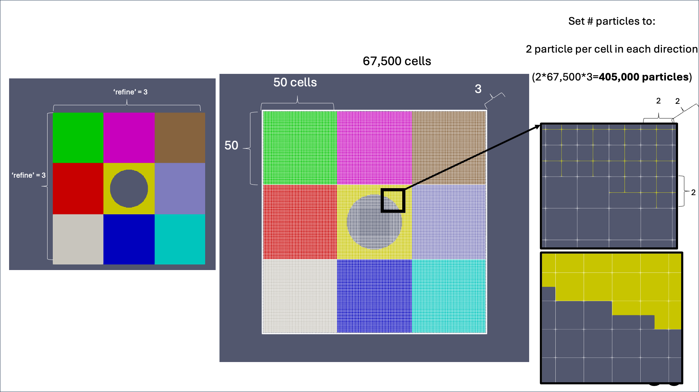

.. _pfw_input:

############################################
pfw_input
############################################

Overview
========================

A ``pfw_input`` file defines a complete GEOS-MPM simulation setup for use with the Particle File Writer workflow. 
**It acts as the main user-facing configuration file**, where the user specifies the computational domain, mesh resolution, runtime settings, solver parameters, boundary conditions, geometry objects, and material definitions. 
The ``particleFileWriter.py`` script reads this file, generates the material particle file, creates the GEOS XML input, and optionally prepares and submits the batch job.

In practice, a ``pfw_input`` file is usually organized into the following parts:

- simulation control and runtime settings
- domain and discretization
- batch and execution settings
- GEOS-MPM solver parameters
- deformation / boundary condition settings
- geometry object definitions
- material definitions

The following sections are explained in terms of a simple example. 
The example provided is a simple plate-impact setup in which two plates, each containing a hole, move toward one another.

- :ref:`Basic File Structure <pfw_input_basic_file_structure>`
- :ref:`Simulation Control <pfw_input_simulation_control>`
- :ref:`Domain and Discretization <pfw_input_domain_and_discretization>`
- :ref:`Batch Parameters <pfw_input_batch_parameters>`
- :ref:`GEOS MPM Parameters <pfw_input_geos_mpm_parameters>`
- :ref:`Boundary and Deformation Settings <pfw_input_boundary_and_deformation_settings>`
- :ref:`Geometry Object Definitions <pfw_input_geometry_object_definitions>`
- :ref:`Material Definitions <pfw_input_material_definitions>`
- :ref:`Complete Example <pfw_input_complete_example>`

:ref:`Back to top <pfw_input>`

.. raw:: html

   

.. _pfw_input_basic_file_structure:

Basic File Structure
--------------------

A ``pfw_input`` file is a standard Python script. It typically begins by importing the geometry-object utilities and any supporting Python modules needed to define the simulation.

.. code-block:: python

   import pfw_geometryObjects as geom
   import numpy as np
   from sklearn.neighbors import KDTree

The main user-defined data structure is the ``pfw`` dictionary:

.. code-block:: python

   pfw = {} 

This dictionary stores the simulation parameters that will later be read by ``particleFileWriter.py``. The ``pfw`` dictionary contains the user’s simulation inputs. 
These values are read by ``particleFileWriter.py``, which compares them against a predefined parameter list, applies default values where needed, and uses them to 
build the simulation input files.Each entry in ``pfw`` corresponds to a setting used to define the geometry, runtime, solver behavior, or output configuration.

The script is set up such that users can define intermediate variables and perform calculations before assigning values into ``pfw``. 
This allows simulation parameters to be computed programmatically rather than hard-coded.

For example:

.. code-block:: python

   domainWidth = 10.0
   refine = 6
   cpp = 15

   pfw["xpar"] = refine
   pfw["nI"] = pfw["xpar"] * cpp

.. raw:: html

   <h4><u>Notes</u></h4>

- A ``pfw_input`` file is executable Python, so users can compute values programmatically rather than entering only fixed constants.
- The ``pfw`` dictionary is the main interface between the input file and the Particle File Writer workflow.

:ref:`Back to top <pfw_input>`

.. raw:: html

   

.. _pfw_input_simulation_control:

Simulation Control
------------------

This section defines high-level runtime behavior for the setup.

.. code-block:: python

   pfw["runDebug"] = True
   stopTime = 0.1

Here:

- ``runDebug`` enables debug-style execution behavior. It is commonly used for short test cases or early setup validation.
- ``stopTime`` defines the total physical simulation time used later in the file

In this example, the simulation is configured as a debug run with a short total runtime of ``0.1``. It is often defined as a standalone variable first, then reused for ``endTime``, ``plotInterval``, and ``restartInterval``.

:ref:`Back to top <pfw_input>`

.. raw:: html

   

.. _pfw_input_domain_and_discretization:

Domain and Discretization
-------------------------

This section defines the computational domain size, grid partitioning, grid resolution, and particles-per-cell settings.

- ``xpar``, ``ypar``, and ``zpar`` define the partitioning of the domain across MPI ranks.

- ``nI``, ``nJ``, and ``nK`` define the number of grid cells in each direction.

- ``ppc`` controls the number of particles per cell.

- ``refine`` controls how many domain partitions are created in each direction (via ``xpar``, ``ypar``, ``zpar``).

- ``cpp`` (cells per partition) defines how many grid cells are contained within each partition.

  - Separating ``refine`` (number of partitions) from ``cpp`` (cells per partition), rather than specifying cells per domain directly, allows independent control of parallel decomposition and grid resolution.
  - This makes it possible to adjust computational cost, scaling behavior, and numerical resolution without coupling them to a single parameter.
  - A visual of this is below (Figure 1).

- The choice ``nK = 3`` is consistent with a plane strain setup.

- In this example, ``domainLength`` is chosen so that the grid cells are approximately cubic. The setup uses a square domain in ``x`` and ``y`` with a thin out-of-plane extent chosen so that the cells remain cubic.

.. code-block:: python

   refine = 6
   cpp = 15

   pfw["xpar"] = refine
   pfw["ypar"] = refine
   pfw["zpar"] = 1

   pfw["nI"] = pfw["xpar"] * cpp
   pfw["nJ"] = pfw["ypar"] * cpp
   pfw["nK"] = 3
   pfw["ppc"] = 2

The domain dimensions are then defined:

.. code-block:: python

   domainWidth = 10.0
   domainHeight = domainWidth
   domainLength = domainWidth * (pfw["nK"] - 2) / (pfw["nI"] - 2)

and the domain bounds are assigned:

.. code-block:: python

   pfw["xmin"] = -0.5 * domainWidth
   pfw["xmax"] =  0.5 * domainWidth
   pfw["ymin"] = -0.5 * domainHeight
   pfw["ymax"] =  0.5 * domainHeight
   pfw["zmin"] = -0.5 * domainLength
   pfw["zmax"] =  0.5 * domainLength

Figure 1: Example of how refine and cpp are used in creating grid cells.

:ref:`Back to top <pfw_input>`

.. raw:: html

   

.. _pfw_input_batch_parameters:

Batch Parameters
----------------

This section defines the job-execution settings used when launching the simulation.
- In this example, the number of cores is computed directly from the partition counts.
- The node count is based on an assumed 36 cores per node.
- Some workflows compute ``mNodes`` automatically in ``particleFileWriter.py``, but this example sets it explicitly in the input file.

These parameters specify:

- whether the run should be treated as a batch job
- the requested wall time
- the total number of MPI cores
- the number of compute nodes
- whether the job should be automatically submitted

.. code-block:: python

   pfw["mBatch"] = True
   pfw["mWallTime"] = "12:00:00"
   pfw["mCores"] = pfw["xpar"] * pfw["ypar"] * pfw["zpar"]
   pfw["mNodes"] = int(np.ceil(float(pfw["mCores"]) / 36.))
   pfw["mSubmitJobs"] = True

.. raw:: html

   <h4><u>A few things to consider when submitting jobs on SLURM</u></h4>

- ``mCores`` and ``mNodes`` directly determine how many compute resources are requested from the scheduler. Larger values increase parallelism but also increase allocation cost.
- On SLURM systems, usage is typically charged in **core-hours** (number of cores × wall time), so both ``mCores`` and ``mWallTime`` impact how much of your allocation is consumed.
- Over-requesting resources (too many cores or too long a wall time) can increase queue wait times and reduce overall throughput.
- Under-requesting resources may cause the simulation to run slowly or terminate early if it exceeds the requested wall time.
- Users should aim to balance runtime and resource usage by selecting a reasonable number of cores and a wall time that is sufficient but not excessive.
- It is often helpful to start with smaller test runs (e.g., with ``runDebug=True``) to estimate runtime and scaling behavior before submitting large production jobs.

:ref:`Back to top <pfw_input>`

.. raw:: html

   

.. _pfw_input_geos_mpm_parameters:

GEOS MPM Parameters
-------------------

This section defines the GEOS-MPM solver settings and output intervals.

- ``endTime``, ``plotInterval``, and ``restartInterval`` are often derived from a shared ``stopTime`` variable.
- ``planeStrain = 1`` indicates a two-dimensional plane strain style setup represented in a thin 3-cell domain.
- ``cpdiDomainScaling`` and ``contactGapCorrection`` affect particle-domain behavior and contact treatment.
- ``frictionCoefficient`` controls sliding resistance during contact.

These settings define how long the simulation runs, how often results are written, how the equations of motion are solved in time, and how particles interact during contact.

- **Total runtime:**

  - Controlled by ``endTime``. This is the physical simulation time.

- **Output frequency:**
  - Controlled by ``plotInterval`` and ``restartInterval``. These determine how often results (e.g., VTK files) and restart files are written during the simulation. (How often we save results. This will affect how long your run takes. Too frequent, and we can hit inode limits. Too sparce, and we can miss important physics.)

- **Integration method:**

  - Controlled by ``timeIntegrationOption``. This defines how the equations of motion are advanced in time. In this example, ``ExplicitDynamic`` mmeans the solution is updated step-by-step using the current state without solving a global system of equations. Explicit dynamics updates particle motion directly from forces at each timestep, making it efficient for large, highly dynamic problems but requiring small timesteps for stability.

- **Timestep behavior:**

  - Controlled by ``initialDt`` and ``cflFactor``. These determine the size of each timestep and how it adapts for stability. In explicit methods, the timestep must be small enough to satisfy stability limits (CFL condition). 
  
  - The CFL (Courant–Friedrichs–Lewy) condition defines a stability limit on the timestep based on the grid spacing and material wave speed. It ensures that information does not propagate more than one grid cell per timestep.

  - The parameter ``cflFactor`` is a safety multiplier applied to this limit. The actual timestep is computed as:

    .. math::

       \Delta t = \text{cflFactor} \times \frac{\Delta x}{c}

    where ``\Delta x`` is the grid spacing and ``c`` is the material wave speed.

  - Smaller values of ``cflFactor`` improve stability but increase computational cost. Typical values range from 0.1 to 0.5, with 0.25 being a common conservative choice.

- **Contact-related solver options:**
  
  - Parameters such as ``frictionCoefficient`` and ``contactGapCorrection`` control how particles interact when they come into contact, including sliding resistance and how small gaps are handled numerically.

- **Numerical method options:**  
  
  - ``cpdiDomainScaling`` controls how particle domains are scaled or interpreted in CPDI-based formulations, which can affect stability and accuracy during large deformation.

- **Contact-related solver options:**  

  - Parameters such as ``frictionCoefficient`` and ``contactGapCorrection`` control how particles interact when they come into contact, including sliding resistance and how small gaps are handled numerically.

- **Diagnostics / performance:**  

  - ``solverProfiling`` enables optional profiling of the solver to measure where computational time is spent. This is mainly used for debugging and performance tuning.

.. code-block:: python

   # --- total runtime ---
   pfw["endTime"] = stopTime
   
   # --- output frequency ---
   pfw["plotInterval"] = stopTime / 200
   pfw["restartInterval"] = stopTime / 20
   
   # --- integration method ---
   pfw["timeIntegrationOption"] = "ExplicitDynamic"
   
   # --- timestep behavior ---
   pfw["cflFactor"] = 0.25
   pfw["initialDt"] = 1e-16
   
   # --- model assumptions ---
   pfw["planeStrain"] = 1
   
   # --- numerical method options ---
   pfw["cpdiDomainScaling"] = 1
   
   # --- diagnostics / performance ---
   pfw["solverProfiling"] = 0
   
   # --- contact-related solver options ---
   pfw["contactGapCorrection"] = 1
   pfw["frictionCoefficient"] = 0.25

:ref:`Back to top <pfw_input>`

.. raw:: html

   

.. _pfw_input_boundary_and_deformation_settings:

Boundary and Deformation Settings
---------------------------------

This section defines how the six faces of the computational domain behave and whether time-dependent boundary or deformation histories are prescribed.
Implementation of and further details on these parameters can be found in the SolidMechanicsMPM.cpp and .hpp files.

In the plate collision example, we have:

.. code-block:: python

   pfw["boundaryConditionTypes"] = [1, 1, 1, 1, 1, 1] #[-x, +x, -y, +y, -z, +z]
   pfw["prescribedBcTable"] = 0
   pfw["prescribedBoundaryFTable"] = 0
   pfw["fTableInterpType"] = 0

=====

Boundary condition types
^^^^^^^^^^^^^^^^^^^^^^^^

The parameter ``boundaryConditionTypes`` is a list of six integers defining the behavior of each domain face in the following order:

- ``x-``, ``x+``, ``y-``, ``y+``, ``z-``, ``z+``

Each entry must be one of:

- ``0`` = **Outflow**: Allows material to leave the domain freely with minimal constraint, with no reflection or imposed motion at the boundary.
- ``1`` = **Symmetry**: Prevents motion normal to the boundary while allowing tangential motion, effectively mirroring the domain across that face.
- ``2`` = **Moving**: Applies a prescribed motion or velocity to the boundary, allowing it to drive deformation of the domain.
- ``3`` = **Contact**: Treats the boundary as a contact surface where particles can interact, including friction and separation.

If not specified, all six values default to ``0`` (Outflow).

Use ``boundaryConditionTypes`` when each face has a fixed role throughout the simulation.  
For example:

.. code-block:: python

   pfw["boundaryConditionTypes"] = [1, 1, 1, 1, 1, 1] #[-x, +x, -y, +y, -z, +z]

assigns symmetry conditions to all faces.

=====

Time-dependent boundary-condition tables
^^^^^^^^^^^^^^^^^^^^^^^^^^^^^^^^^^^^^^^^

The flag ``prescribedBcTable`` controls whether boundary-condition *types* change over time:

- ``0`` → Use fixed values from ``boundaryConditionTypes``  
- ``1`` → Read a time-dependent ``bcTable``  

When enabled, each row of ``bcTable`` must contain:

.. code-block:: text

   [time, bc_xminus, bc_xplus, bc_yminus, bc_yplus, bc_zminus, bc_zplus]

with:

- nonnegative time values  
- integer boundary-condition entries  
- values between ``0`` and ``3``  

This option is only needed when the type of boundary condition itself changes during the simulation. Most problems do not require this.

=====

Deformation-gradient tables (F-table)
^^^^^^^^^^^^^^^^^^^^^^^^^^^^^^^^^^^^^

The flags ``prescribedBoundaryFTable`` and ``prescribedFTable`` control whether the domain deformation is prescribed through a time-dependent deformation gradient ``F``.
The ``fTable`` prescribes the time evolution of the deformation gradient, allowing the simulation to be driven by imposed deformation (strain-controlled loading) rather than applied forces.
Use an ``fTable`` when you want to prescribe a controlled loading path (e.g., compression or expansion) rather than relying on object motion.

- ``prescribedBoundaryFTable = 1``  
  Applies a global deformation to the domain boundaries

- ``prescribedFTable = 1``  
  Applies a deformation history for triply periodic simulations

- If both are ``0``  
  No deformation table is used

When enabled, an ``fTable`` must be provided. Each row has the form:

.. code-block:: text

   [time, Fxx, Fyy, Fzz]

The solver requires:

- monotonically increasing time  
- positive deformation values  
- an initial undeformed state, typically ``[0, 1, 1, 1]``  

The table is interpolated in time and used to update the domain deformation and velocity gradient during the simulation (see below).

=====

F-table interpolation
^^^^^^^^^^^^^^^^^^^^^

The parameter ``fTableInterpType`` controls how the deformation table is interpolated between time points (below). Smoother interpolation (cosine or quintic) produces more gradual loading transitions, which can improve numerical stability for some problems.

- ``0`` = linear  
- ``1`` = cosine  
- ``2`` = quintic polynomial  

In this example linear interpolation would be used if an ``fTable`` were active.

.. code-block:: python

   pfw["fTableInterpType"] = 0

:ref:`Back to top <pfw_input>`

.. raw:: html

   

.. _pfw_input_geometry_object_definitions:

Geometry Object Definitions
---------------------------

This section defines the simulation geometry using objects from :doc:`pfw_geometryObjects.py <pfw_geometryObjects>`. Please refer to this page for further details on how objects are created.

.. code-block:: python

   crop = 1.0

   plate1 = geom.box(
       'plate1',
       [pfw["xmin"], crop * pfw["ymin"], pfw["zmin"]],
       [0, crop * pfw["ymax"], pfw["zmax"]],
       [100, 0, 0], 0, 0, 0
   )

   plate2 = geom.box(
       'plate2',
       [0, crop * pfw["ymin"], pfw["zmin"]],
       [pfw["xmax"], crop * pfw["ymax"], pfw["zmax"]],
       [-100, 0, 0], 0, 0, 0
   )

   hole = geom.cylinder(
       'hole',
       [0, 0, pfw["zmin"]],
       [0, 0, pfw["zmax"]],
       2,
       [0, 0, 0], 0, 0, 0
   )

   plateWithHole1 = geom.difference(plate1, hole)
   plateWithHole2 = geom.difference(plate2, hole)

   pfw["objects"] = [plateWithHole1, plateWithHole2]

- This example creates:

  - A left plate moving in the positive ``x`` direction

  - A right plate moving in the negative ``x`` direction

    - The plate motion is imposed through the object velocity vectors.

  - A cylindrical hole through the center using ``difference`` such that two final plate objects formed by subtracting the hole from each plate

    - This is a simple example of using object-based geometry construction directly in the input file.
    - The resulting geometry is assigned to ``pfw["objects"]``.

:ref:`Back to top <pfw_input>`

.. raw:: html

   

.. _ElasticIsotropic:

.. _pfw_input_material_definitions:

Material Definitions
--------------------

This section defines the constitutive material models used by the simulation.

In this example, a single material named ``aluminum`` is defined using the ``ElasticIsotropic`` constitutive model (accessible here :doc:`ElasticIsotropic`). 
The name ``"aluminum"`` is user-defined and serves as a label that is referenced by geometry objects, while the 
underlying behavior of the material is governed by the ``ElasticIsotropic`` model. The provided parameters 
(density, bulk modulus, and shear modulus) correspond to typical aluminum properties and are passed into the 
constitutive model, which then defines how the material responds to deformation through its internal equations 
of state.

.. code-block:: python

   pfw["materials"] = ["aluminum"]
   pfw["materialPropertyString"] = """
   <ElasticIsotropic
       name="aluminum"
       defaultDensity="2700"
       defaultBulkModulus="70.0e8"
       defaultShearModulus="24.0e8"/>
   """

The ``materials`` list defines the available material names, and the XML-style ``materialPropertyString`` provides 
the constitutive model block that will be inserted directly into the GEOS input file.

- Geometry objects reference materials by index, not by name. The index corresponds to the position in 
  ``pfw["materials"]``.
- In this example, both plates use material index ``0``, which corresponds to ``"aluminum"``.
- The material definition string is passed through directly into the GEOS XML input without modification.

:ref:`Back to top <pfw_input>`

.. raw:: html

   

.. _pfw_input_complete_example:

Complete Example
----------------

The complete ``pfw_input`` file for this plate-impact example is shown below.

.. code-block:: python

   # -*- coding: utf-8 -*-
   import pfw_geometryObjects as geom
   import numpy as np
   from sklearn.neighbors import KDTree

   pfw = {}
   pfw["runDebug"] = True
   stopTime = 0.1

   # ----------------------------------- DOMAIN ---------------------------------------------------------------------------------
   refine = 6
   cpp = 15
   pfw["xpar"] = refine
   pfw["ypar"] = refine
   pfw["zpar"] = 1

   pfw["nI"] = pfw["xpar"] * cpp
   pfw["nJ"] = pfw["ypar"] * cpp
   pfw["nK"] = 3
   pfw["ppc"] = 2

   domainWidth = 10.0
   domainHeight = domainWidth
   domainLength = domainWidth * (pfw["nK"] - 2) / (pfw["nI"] - 2)

   pfw["xmin"] = -0.5 * domainWidth
   pfw["xmax"] =  0.5 * domainWidth
   pfw["ymin"] = -0.5 * domainHeight
   pfw["ymax"] =  0.5 * domainHeight
   pfw["zmin"] = -0.5 * domainLength
   pfw["zmax"] =  0.5 * domainLength

   # ----------------------------------- BATCH PARAMETERS --------------------------------------------------------
   pfw["mBatch"] = True
   pfw["mWallTime"] = "12:00:00"
   pfw["mCores"] = pfw["xpar"] * pfw["ypar"] * pfw["zpar"]
   pfw["mNodes"] = int(np.ceil(float(pfw["mCores"]) / 36.))
   pfw["mSubmitJobs"] = True

   # ----------------------------------- GEOSX MPM SOLVER PARAMETERS ------------------------------------------------
   pfw["endTime"] = stopTime
   pfw["plotInterval"] = stopTime / 200
   pfw["restartInterval"] = stopTime / 20

   pfw["timeIntegrationOption"] = "ExplicitDynamic"
   pfw["cflFactor"] = 0.25
   pfw["initialDt"] = 1e-16
   pfw["planeStrain"] = 1

   pfw["solverProfiling"] = 0
   pfw["cpdiDomainScaling"] = 1
   pfw["contactGapCorrection"] = 1
   pfw["frictionCoefficient"] = 0.25

   # Deformation
   pfw["prescribedBcTable"] = 0
   pfw["boundaryConditionTypes"] = [1, 1, 1, 1, 1, 1]

   pfw["prescribedBoundaryFTable"] = 0
   pfw["fTableInterpType"] = 0

   # ----------------------------------- GEOMETRY OBJECTS ------------------------------------------------------------

   plate1 = geom.box('plate1', [pfw["xmin"], crop*pfw["ymin"], pfw["zmin"]], [0, crop*pfw["ymax"], pfw["zmax"]], [100, 0, 0], 0, 0, 0)
   plate2 = geom.box('plate2', [0, crop*pfw["ymin"], pfw["zmin"]], [pfw["xmax"], crop*pfw["ymax"], pfw["zmax"]], [-100, 0, 0], 0, 0, 0)
   hole = geom.cylinder('hole', [0, 0, pfw["zmin"]], [0, 0, pfw["zmax"]], 2, [0, 0, 0], 0, 0, 0)
   plateWithHole1 = geom.difference(plate1, hole)
   plateWithHole2 = geom.difference(plate2, hole)

   pfw["objects"] = [plateWithHole1, plateWithHole2]

   # ----------------------------------- MATERIAL PROPERTIES ----------------------------------------------------------------
   pfw["materials"] = ["aluminum"]
   pfw["materialPropertyString"] = """
   <ElasticIsotropic
       name="aluminum"
       defaultDensity="2700"
       defaultBulkModulus="70.0e8"
       defaultShearModulus="24.0e8"/>
   """

:ref:`Back to top <pfw_input>`
