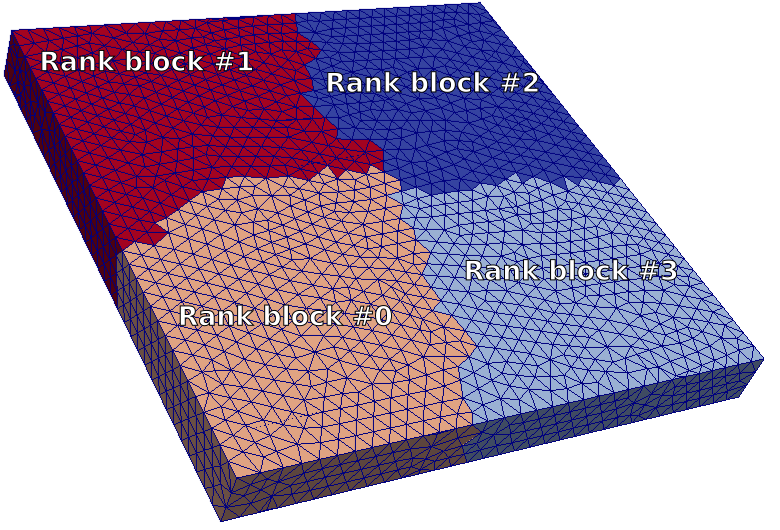

======================
VTM file format import
======================

The VTM file format
-------------------
VTM is a file format maintained by `Kitware/VTK`_
It has this features

- Can make references to mesh parts stored in the `VTU file format`_
- Each make part can contains its own scalar/tensor fields
- Readable with Paraview_
 
Usage of the VTM files in GEOSX
-------------------------------
One goal of GEOSX is to propose effective algorithms to solve PDE using MPI.
To optimize the mesh loading and the memory management, the mesh can be divided beforehand
in rank blocks. Next figure shows a simple mesh divied in 4 mesh blocks.

.. class:: center 

.. class:: center 

A simple mesh divided in 4 mesh blocks

The rank blocks
---------------
A rank block will be loaded by one MPI rank. A rank block may contains several independent
mesh blocks. 

The mesh blocks
---------------
A mesh block could describe for instance:

- A set of polyhedrons describing a unit (such as reservoir, overburden, aquifer...)
- A set of polygons describing faults or fractures or boundaries.
- A set of lines describing a well path.

VTM file syntax
---------------
This sample shows an example of what a VTM file look likes for a domain with:

- One aquifer
- One reservoir
- One Discrete Fault Netword (DFN)
- One injection well
- One production well

divided in 4 rank blocks.

.. code-block:: xml

   <VTKFile type="vtkMultiBlockDataSet" version="1.0" byte_order="LittleEndian" header_type="UInt32    " compressor="vtkZLibDataCompressor">
     <vtkMultiBlockDataSet>
       <Block name="RANK_0" index="0">
          <DataSet index="0" name="aquifer" file="rank0_aquifer.vtu"/>
          <DataSet index="1" name="reservoir" file="rank0_reservoir.vtu"/>
          <DataSet index="2" name="DFN" file="rank0_DFN.vtu"/>
          <DataSet index="3" name="injection_well" file="rank0_injection_well.vtu"/>
          <DataSet index="4" name="production_well" file="rank0_production_well.vtu"/>
      </Block>
       <Block name="RANK_1" index="1">
          <DataSet index="0" name="aquifer" file="rank1_aquifer.vtu"/>
          <DataSet index="1" name="reservoir" file="rank1_reservoir.vtu"/>
          <DataSet index="2" name="DFN" file="rank1_DFN.vtu"/>
          <DataSet index="3" name="injection_well" file="rank1_injection_well.vtu"/>
          <DataSet index="4" name="production_well" file="rank1_production_well.vtu"/>
       </Block>
       <Block name="RANK_2" index="2">
          <DataSet index="0" name="aquifer" file="rank2_aquifer.vtu"/>
          <DataSet index="1" name="reservoir" file="rank2_reservoir.vtu"/>
          <DataSet index="2" name="DFN" file="rank2_DFN.vtu"/>
          <DataSet index="3" name="injection_well" file="rank2_injection_well.vtu"/>
          <DataSet index="4" name="production_well" file="rank2_production_well.vtu"/>
       </Block>
       <Block name="RANK_3" index="3">
          <DataSet index="0" name="aquifer" file="rank3_aquifer.vtu"/>
          <DataSet index="1" name="reservoir" file="rank3_reservoir.vtu"/>
          <DataSet index="2" name="DFN" file="rank3_DFN.vtu"/>
          <DataSet index="3" name="injection_well" file="rank3_injection_well.vtu"/>
          <DataSet index="4" name="production_well" file="rank3_production_well.vtu"/>
       </Block>
     </vtkMultiBlockDataSet>
   </VTKFile>

Each VTU file follows the classical syntax of the `VTU file format`_. Please note
that the each VTU file can contains properties that can be read by GEOSX (work in progress)

Building VTM file
-----------------

You can easily write VTU files or VTM files using the `VTK toolkit`_. We also provide
another library called PAMELA_ that can convert your mesh to the VTM file format
supported by GEOSX. At the moment, PAMELA supports:

- the `.msh` format
- the `.mesh` format
- the `Eclipse grid` formats

Supported elements
------------------

VTM file format and GEOSX both support hybrid meshes. You can use these polyhedrons :

- Tetrahedron
- Hexahedron
- Wedges
- Pyramids

and these polygons:

- Triangles
- Quadrangles

Use a VTM file within GEOSX
---------------------------

To use the VTM file format ins GEOSX, you need to provide the path to it in the XML command
file

.. code-block:: xml

   <Mesh>
     <MeshFile name="CubePyr"
               file="cube_pyr.vtm"/>
   </Mesh>

To define ElementRegions and CellBlocks within GEOSX, you have to write this instruction

.. code-block:: xml

   <ElementRegions>
     <ElementRegion name="aquifer" cellBlocks="HEX TETRA WEDGE PYR" numericalMethod="FE1" material="water" materialList="water rock"/>
   </ElementRegions>

You have to refer in :code:`name` the same name of the region as it is defined in the VTM
file format. Values in code:`cellBlocks` are list of elements within the region.

To apply boundary conditions or initial conditions, you may use 

.. code-block:: xml

   <Dirichlet name="initialPressure"
                  initialCondition="1"
                  setNames="all"
                  objectPath="ElementRegions/elementRegions/aquifer/cellBlockSubRegions/HEX"
                  fieldName="pressure"
                  dataType="real64"
                  scale="1e3"/>

if you want to apply the initial pressure on all the hexahedron the of the region aquifer.

.. _`Kitware/VTK` : https://www.vtk.org/
.. _`VTK toolkit` : https://www.vtk.org/
.. _`VTU file format` : www.vtk.org/VTK/img/file-formats.pdf
.. _`.msh` : http://gmsh.info
.. _`.mesh` : https://people.sc.fsu.edu/~jburkardt/data/medit/medit.html
.. _`PAMELA` : https://github.com/GEOSX/PAMELA
.. _Paraview : https://www.paraview.org/
