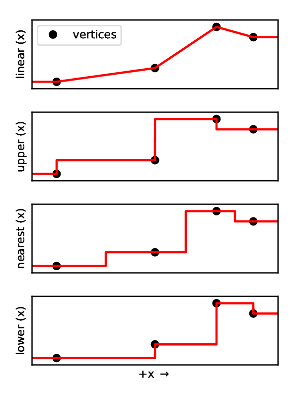

.. _FunctionManager:

Functions 
===============================================================================

Functions are the primary avenue for specifying values that change in space, time, or any other dimension.
These are specified in the ``Functions`` block, and may be referenced by name throughout the rest of the .xml file.
For example:

.. code-block:: xml

  <Functions>
    <TableFunction name="q"
                   inputVarNames="time"
                   coordinates="0 60 1000"
                   values="0 1 1" />
  </Functions>
  <FieldSpecifications>
    <SourceFlux name="sourceTerm"
                objectPath="ElementRegions/Region1/block1"
                scale="0.001"
                functionName="q"
                setNames="{source}"/>
  </FieldSpecifications>

Function Inputs and Application
-------------------------------------------------------------------------------

The inputs to each function type are specified via the ``inputVarName`` attribute.
These can either be the name of an array (e.g. "Pressure") or the special keyword "time" (time at the beginning of the current cycle).
If any of the input variables are vectors (e.g. "referencePosition"), the components will be given as function arguments in order.

In the .xml file, functions are referenced by name.
Depending upon the application, the functions may be applied in one of three ways:

1. Single application: 
   The function is applied to get a single scalar value.
   For example, this could define the flow rate applied via a BC at a given time.

2. Group application: 
   The function is applied to a (user-specified) ManagedGroup of size N.
   When called, it will iterate over the inputVarNames list and build function inputs from the group's wrappers.
   The resulting value will be a wrapper of size N.
   For example, this could be used to apply a user-defined constitutive relationship or specify a complicated boundary condition.

3. Statistics mode:
   The function is applied in the same manner as the group application, except that the function will return an array that contains the minimum, average, and maximum values of the results.

Function Types
-------------------------------------------------------------------------------

There are three types of functions available for use: ``TableFunction``, ``SymbolicFunction``, and ``CompositeFunction``.
**Note: the symbolic and composite function types are currently only available for x86-64 systems.** 

TableFunction
^^^^^^^^^^^^^^^^^^^^^^^^^^^^

A table function uses a set of pre-computed values defined at points on a structured grid to represent an arbitrary-dimensional function.
Typically, the axes of the table will represent time and/or spatial dimensions; however, these can be applied to represent phase diagrams, etc.

.. include:: /docs/sphinx/datastructure/TableFunction.rst

1D Table
*************

For 1D tables, the function may be defined using the coordinates and values attributes.
These represent the location of the grid nodes (ordered from smallest to largest) and the function values at those points, respectively.
For example, the following function defines a simple ramp function with a rise-time of 60 seconds:

.. code-block:: xml

  <TableFunction name="q"
                 inputVarNames="time"
                 coordinates="0 60 1000"
                 values="0 1 1" />

ND Table
*************

For ND tables, the grid coordinates and values may be defined using a set of .csv files.
The ``coordinateFiles`` attribute specifies the file names that define the coordinates for each axis.
The values in each coordinate file must be comma-delimited and ordered from smallest to largest.
The dimensionality of the table is defined by the number of coordinate files (coordinateFiles="x.csv" would indicate a 1D table, coordinateFiles="x.csv y.csv z.csv t.csv" would indicate a 4D table, etc.).
The ``voxelFile`` attribute specifies name of the file that defines the value of the function at each point along the grid.
These values must be comma-delimited (line-breaks are allowed) and be specified in Fortran order, i.e., column-major order (where the index of the first dimension changes the fastest, and the index of the last dimension changes slowest).

The following would define a simple 2D function ``c = a + 2*b``:

.. code-block:: xml

  <TableFunction name="c"
                 inputVarNames="a b"
                 coordinateFiles="a.csv b.csv"
                 voxelFile="c.csv" />

- a.csv: "0, 1"
- b.csv: "0, 0.5, 1"
- c.csv: "0, 1, 1, 2, 2, 3"

Interpolation Methods
************************

There are four interpolation methods available for table functions.
Within the table axes, these will return a value:

- linear: using piecewise-linear interpolation
- upper: equal to the value of the next table vertex
- nearest: equal to the value of the nearest table vertex
- lower: equal to the value of the previous table vertex

Outside of the table axes, these functions will return the edge-values.
The following figure illustrates how each of these methods work along a single dimension, given identical table values:

Table Generation Example
**************************

The following is an example of how to generate the above tables in Python:

.. code-block:: python

  import numpy as np

  # Define table axes
  a = np.array([0.0, 1.0])
  b = np.array([0.0, 0.5, 1.0])

  # Generate table values (note: the indexing argument is important)
  A, B = np.meshgrid(a, b, indexing='ij')
  C = A + 2.0*B

  # Write axes, value files
  np.savetxt('a.csv', a, fmt='%1.2f', delimiter=',')
  np.savetxt('b.csv', b, fmt='%1.2f', delimiter=',')
  values = np.reshape(C, (-1), order='F')
  np.savetxt('c.csv', values, fmt='%1.2f', delimiter=',')

SymbolicFunction
^^^^^^^^^^^^^^^^^^^^^^^^^^^^

This function leverages the symbolic expression library mathpresso to define and evaluate functions.
These functions are processed using an x86-64 JIT compiler, so are nearly as efficient as natively compiled C++ expressions.

.. include:: /docs/sphinx/datastructure/SymbolicFunction.rst

The ``variableNames`` attribute defines a set of single-character names for the inputs to the symbolic function.
There should be a definition for each scalar input and for each component of a vector input.
For example if ``inputVarName="time, ReferencePosition"``, then ``variableNames="t, x, y, z"``.
The ``expression`` attribute defines the symbolic expression to be executed.
Aside from the following exceptions, the syntax mirrors python:

- The function string cannot contain any spaces
- The power operator is specified using the C-style expression (e.g. pow(x,3) instead of x**3)

The following would define a simple 2D function ``c = a + 2*b``:

.. code-block:: xml

  <SymbolicFunction name="c"
                    inputVarNames="a b"
                    variableNames="x y"
                    expression="x+(2*y)"/>

CompositeFunction
^^^^^^^^^^^^^^^^^^^^^^^^^^^^

This function is derived from the symbolic function.
However, instead of using the time or object as inputs, it is used to combine the outputs of other functions using a symbolic expression.

.. include:: /docs/sphinx/datastructure/CompositeFunction.rst

The ``functionNames`` attribute defines the set of input functions to use (these may be of any type, and may each have any number of inputs).
The ``variableNames`` attribute defines a set of single-character names for each function.
The ``expression`` attribute defines the symbolic expression, and follows the same rules as above.
The ``inputVarNames`` attribute is ignored for this function type.

The following would define a simple 1D table function ``f(t) = 1 + t``, a 3D symbolic function ``g(x, y, z) = x**2 + y**2 + z**2``, and a 4D composite function ``h = sin(f(t)) + g(x, y, z)``:

.. code-block:: xml

  <Functions>
    <TableFunction name="f"
                   inputVarNames="time"
                   coordinates="0 1000"
                   values="1 1001" />

    <SymbolicFunction name="g"
                      inputVarNames="ReferencePosition"
                      variableNames="x y z"
                      expression="pow(x,2)+pow(y,2)+pow(z,2)"/>

    <CompositeFunction name="h"
                       inputVarNames="ignored"
                       functionNames="f g"
                       variableNames="x y"
                       expression="sin(x)+y"/>
  </Events>

