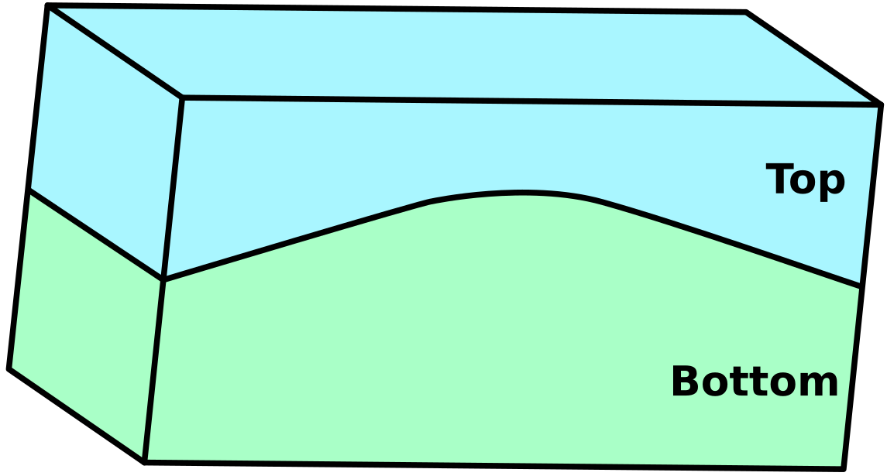
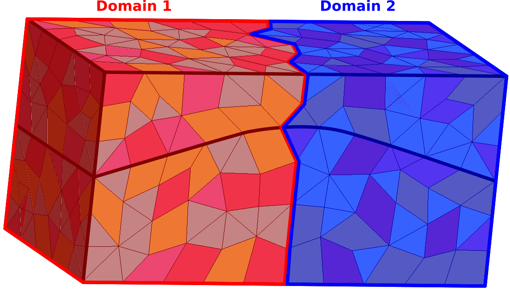
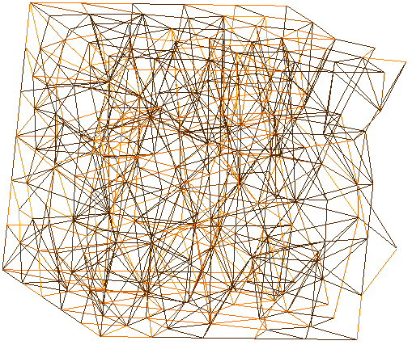
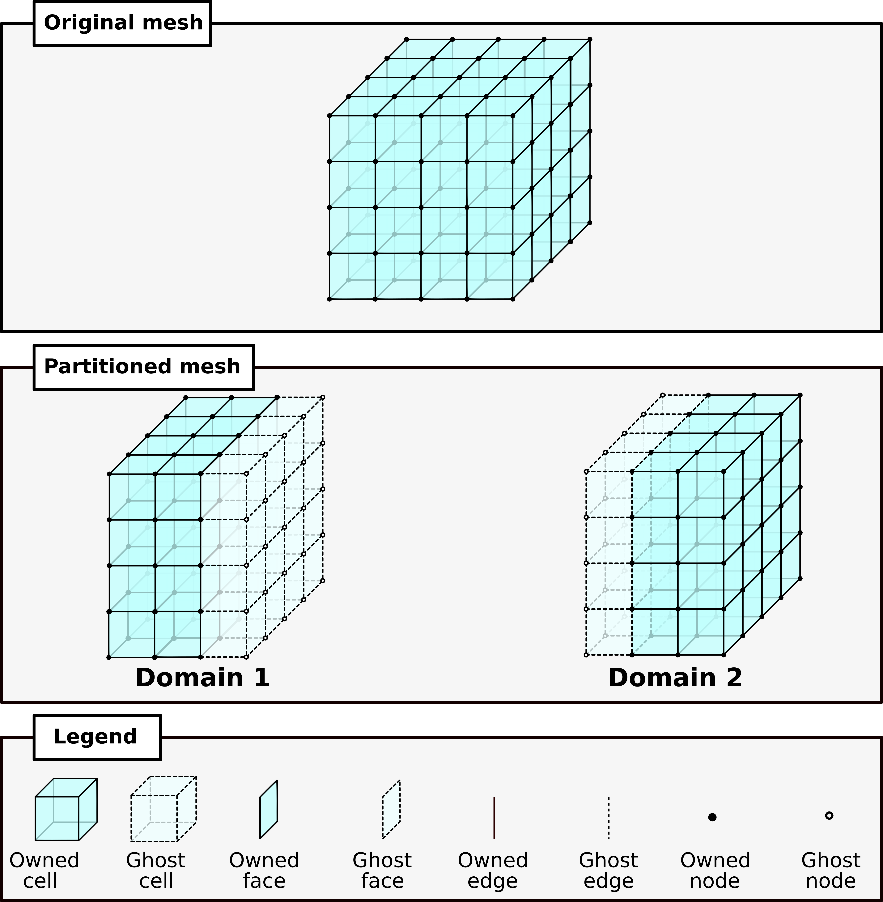
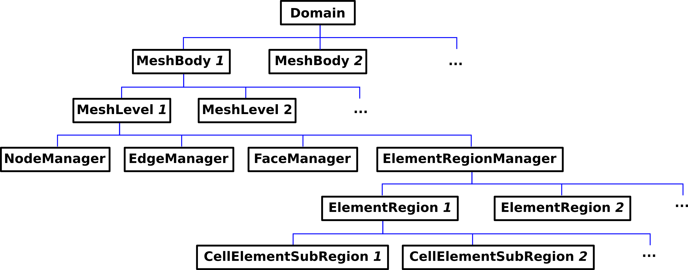

============
Meshes
============

This section describes how meshes are handled.
We first briefly describe how meshes are stored within GEOSX, 
in order to clarify how the user can interact with mesh data.

There are then two options for generating a mesh.  GEOSX can internally
generate simple (Cartesian) meshes.  For more complex geometries, we support
a number of mesh import file formats.  This latter options allows one to work
with unstructured mesh data and a variety of element types.

************************
Mesh Data Structure
************************

GEOSX proposes a hierarchical class structure to store the mesh. To illustrate it, we present a example
of a model with two regions (Top and Bottom).

This model can be meshed with different types of polyhedra. Here, the model is meshed with pyramids,
tetrahedra, hexahedra and wedges

.. image:: ../../../coreComponents/mesh/docs/mesh_multi.png

Them, the mesh can be partitioned into two ``DomainPartition``, not necessarily the same than the two regions
(Top and Bottom).

Each ``DomainPartition`` is handle by the ``DomainPartition`` class in GEOSX. Each MPI process will have its own 
instance of a ``DomainPartition``.
A ``DomainPartition`` can contain several ``MeshBody`` (used for defining independent physical bodied). A ``MeshBody``
can contain several ``MeshLevel``
(use for multi level computations). For the clarity of this example, we assume than there is only one
``MeshBody`` and one ``MeshLevel``.

A ``MeshLevel`` contains several managers that handle the whole mesh data structure.

- ``NodeManager`` handles the nodes
- ``EdgeManager`` handles the edges
- ``FaceManager`` handles the facets
- ``ElementRegionManager`` handles the different regions and the polyhedra that compose them

The NodeManager
===============

The ``NodeManager`` contains all the informations relative to the nodes of the ``MeshLevel`` and of the
``DomainPartition`` it belongs. Its size is equal to the number of nodes on this ``DomainPartition``/``MeshLevel``.

The EdgeManager
===============

In GEOSX, one edge is defined as a segment between two nodes.
The ``EdgeManager`` contains all the informations relative to the edges of the ``MeshLevel`` and of the
``DomainPartition`` it belongs. Its size is equal to the number of edges on this ``DomainPartition``/``MeshLevel``.

Next picture depicts the edges of the ``DomainPartition 1`` in the mesh.

The FaceManager
===============

In GEOSX, one face is defined as the interface between two polyhedra. 
The ``FaceManagers`` contains all the informations relative to the faces of the ``MeshLevel`` and of the
``DomainPartitions`` it belongs. Its size is equal to the number of faces on this ``DomainPartition``/``MeshLevel``.

The ElementRegionManager
========================

The ``ElementRegionManager`` handles the physical regions of the ``DomainPartition``/``MeshLevel`` it belongs, and
its polyhedra. A physical region is called an ``ElementRegion`` in GEOSX. In the example presented
above, the ``ElementRegionManager`` of one ``DomainPartition``/``MeshLevel`` manage two instances of ``ElementRegion`` (one corresponding to
the Bottom region, and one corresponding to the Top region).

The cell geometry is actually stored in the ``CellElementSubRegion``. An ``ElementRegion`` can contain
several ``CellElementSubRegion``, usually, one for each element type. In the example, there is four
distinct elements types (hexahedra, tetrahedra, wedges and pyramids). As a consequence, one ``ElementRegion``
will contain four different ``CellElementSubRegion`` instances.

Ghosting structure
==================

To ease the communication between the ``DomainPartition`` across the MPI processes, GEOSX compute ghost elements.

.. warning::
  Asking for the size of the ``NodeManager``, ``EdgeManager``, ``FaceManager`` or a ``CellElementSubRegion``
  will return the number of owned elements plus ghost elements.

The complete mesh data structure is shown in the next picture.

************************
Internal Mesh Generation
************************

The Internal Mesh Generator allows one to quickly build simple cartesian grids and divide
them into several regions.  The following is an example XML ``<Mesh>`` block:

.. code-block:: xml

  <Mesh>
    <InternalMesh name="mesh"
                  elementTypes="C3D8"
                  xCoords="0, 1"
                  yCoords="0, 1"
                  zCoords="0, 2, 6"
                  nx="1"
                  ny="1"
                  nz="2, 4"
                  cellBlockNames="cb1 cb2"/>
  </Mesh>

- ``name`` the name of the mesh body
- ``elementTypes`` the type of the elements that will be generated.
- ``xCoord`` List of ``x`` coordinates of the boundaries of the ``CellBlocks``
- ``yCoord`` List of ``y`` coordinates of the boundaries of the ``CellBlocks``
- ``zCoord`` List of ``z`` coordinates of the boundaries of the ``CellBlocks``
- ``nx`` List containing the number of cells in ``x`` direction within the ``CellBlocks``
- ``ny`` List containing the number of cells in ``y`` direction within the ``CellBlocks``
- ``nz`` List containing the number of cells in ``z`` direction within the ``CellBlocks``
- ``cellBlockNames`` List containing the names of the ``CellBlocks``

The previous sample of XML file will generate a vertical beam with two ``CellBlocks``
(one in red and one in blue in the following picture)

.. image:: ../../../coreComponents/mesh/docs/beam.png

**************************
Using an External Mesh
**************************

Supported Formats
=================

GEOSX provides features to run simulations on unstructured meshes.
It uses PAMELA_ to read the external meshes and its API to write
it into the GEOSX mesh data structure.

The supported mesh format are:

- The GMSH_ file format (.msh v2).
- The MEDIT_ file format (.mesh)
- The ECLIPSE file formats (.egrid, .grdecl)

The supported mesh elements are, for volume elements:

- 4 nodes tetrahedra
- 5 nodes pyramids
- 6 nodes wedges
- 8 nodes hexahedra

The mesh can be divided in several regions.
These regions are intended
to support different physics or to define different constitutive properties.

- For the GMSH file format, the regions are defined using the `elementary geometrical tags`_
  provided by GMSH
- For the MEDIT file format, the regions are defined using the tag of the element
- For the ECLIPSE file formats, the regions have to be first defined using the ECLIPSE software

Importing the Mesh
==================

Several blocks are involved to import an external mesh into GEOSX, defined in the XML input file.
These are the ``<Mesh>`` block and the ``<ElementRegions>`` block.

The mesh block has the following syntax.

.. code-block:: xml

  <Mesh>
    <PAMELAMeshGenerator name="MyMeshName"
                         file="/path/to/the/mesh/file.msh"/>
  </Mesh>

We strongly advice to use absolute path to the mesh file.

GEOSX uses ``ElementRegions`` to support different physics, or to define different constitutive properties.
An ``ElementRegion`` is defined as a set of ``CellBlocks``.
A ``CellBlock`` is an ensemble of elements with the same element geometry.

.. image:: mesh.svg

In the example presented above, the mesh is is composed of two regions (*Region 0* and *Region 1*).
Each region contains 3 ``CellBlocks``.

The ``ElementRegions`` are defined as below :

.. code-block:: xml

  <ElementRegions>
    <ElementRegion name="Top" cellBlocks="0_HEX 0_WEDGE 0_TETRA" materialList="water rock"/>
    <ElementRegion name="Bot" cellBlocks="1_HEX 1_WEDGE 1_TETRA" materialList="water rock"/>
  </ElementRegions>

You have to use the following syntax to declare your ``CellBlocks`` :

.. code-block:: none

  indexOfTheRegionWithinTheMesh_typeOfTheElement

The keywords for the element types are :

- TETRA
- WEDGE
- PYR
- HEX

.. _PAMELA: https://github.com/GEOSX/PAMELA
.. _GMSH: http://gmsh.info
.. _MEDIT: https://people.sc.fsu.edu/~jburkardt/data/medit/medit.html
.. _`elementary geometrical tags`: http://gmsh.info/doc/texinfo/gmsh.html#MSH-file-format-version-2
