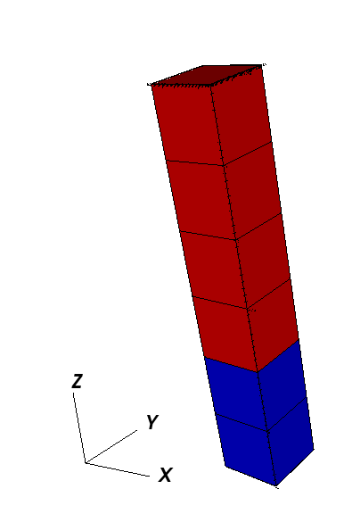
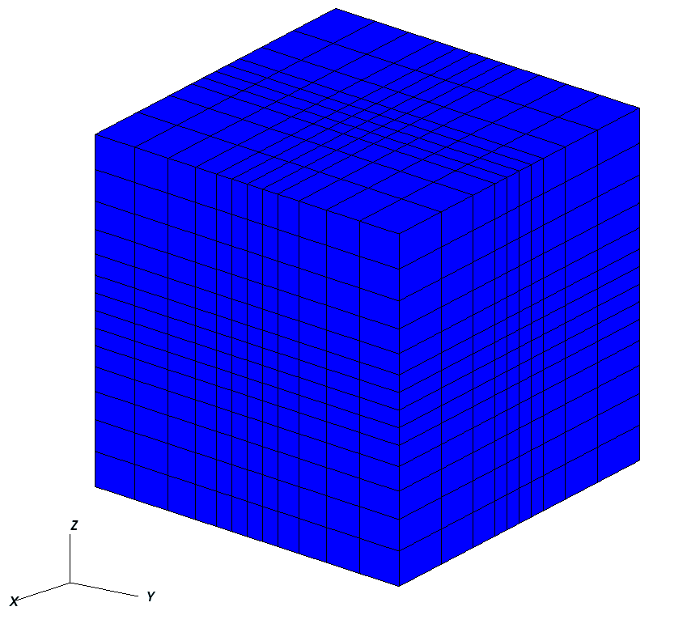
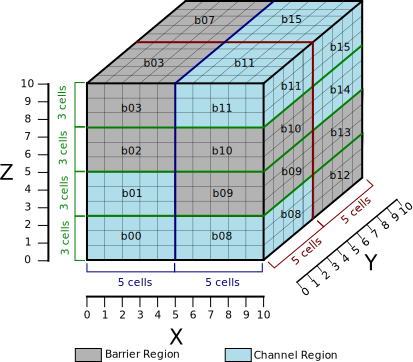
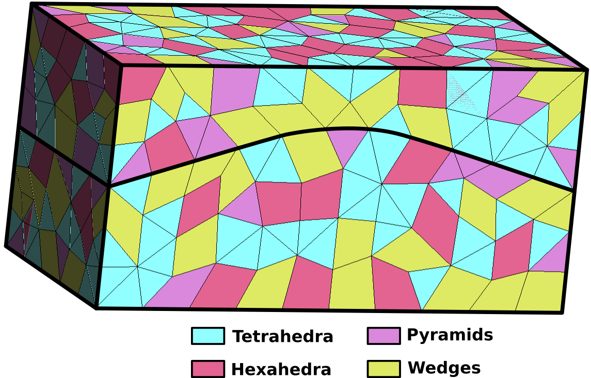

.. _Meshes:

============
Meshes
============

The purpose of this document is to explain how users and developers interact with mesh data.
This section describes how meshes are handled and stored in GEOS.

There are two possible methods for generating a mesh:
either by using GEOS's internal mesh generator (for Cartesian meshes only),
or by importing meshes from various common mesh file formats.
This latter options allows one to work with more complex geometries,
such as unstructured meshes comprised of a variety of element types (polyhedral elements).

************************
Internal Mesh Generation
************************

Basic Example
=================

The Internal Mesh Generator allows one to quickly build simple cartesian grids and divide
them into several regions.  The following attributes are supported in the input block for InternalMesh:

.. include:: /docs/sphinx/datastructure/InternalMesh.rst

The following is an example XML ``<mesh>`` block, which will generate a vertical beam with two ``CellBlocks`` (one in red and one in blue in the following picture).

.. code-block:: xml

  <Mesh>
    <InternalMesh name="mesh"
                  elementTypes="{ C3D8 }"
                  xCoords="{ 0, 1 }"
                  yCoords="{ 0, 1 }"
                  zCoords="{ 0, 2, 6 }"
                  nx="{ 1 }"
                  ny="{ 1 }"
                  nz="{ 2, 4 }"
                  cellBlockNames="{ cb1, cb2 }"/>
  </Mesh>

- ``name`` the name of the mesh body
- ``elementTypes`` the type of the elements that will be generated.
- ``xCoord`` List of ``x`` coordinates of the boundaries of the ``CellBlocks``
- ``yCoord`` List of ``y`` coordinates of the boundaries of the ``CellBlocks``
- ``zCoord`` List of ``z`` coordinates of the boundaries of the ``CellBlocks``
- ``nx`` List containing the number of cells in ``x`` direction within the ``CellBlocks``
- ``ny`` List containing the number of cells in ``y`` direction within the ``CellBlocks``
- ``nz`` List containing the number of cells in ``z`` direction within the ``CellBlocks``
- ``cellBlockNames`` List containing the names of the ``CellBlocks``

.. _Mesh_bias:

Mesh Bias
===========

The internal mesh generator is capable of producing meshes with element sizes that vary smoothly over space.
This is achieved by specifying ``xBias``, ``yBias``, and/or ``zBias`` fields.
(Note: if present, the length of these must match ``nx``, ``ny``, and ``nz``, respectively, and each individual value must be in the range (-1, 1).)

For a given element block, the average element size will be

.. math::
   dx_{average}[i] = \frac{xCoords[i+1]-xCoords[i]}{nx[i]},

the element on the left-most side of the block will have size

.. math::
   dx_{left}[i] = (1 + xBias[i]) \cdot dx_{average}[i],

and the element on the right-most side will have size

.. math::
   dx_{right}[i] = (1 - xBias[i]) \cdot dx_{average}[i].

The following are the two most common scenarios that occur while designing a mesh with bias:

1. The size of the block and the element size on an adjacent region are known.  Assuming that we are to the left of the target block, the appropriate bias would be:

.. math::
   xBias[i] = 1 - \frac{nx[i] \cdot dx_{left}[i+1]}{xCoords[i+1]-xCoords[i]}

2. The bias of the block and the element size on an adjacent region are known.  Again, assuming that we are to the left of the target block, the appropriate size for the block would be:

.. math::
   xCoords[i+1]-xCoords[i] = \frac{nx[i] \cdot dx_{left}[i+1]}{1 - xBias[i]}

The following is an example of a mesh block along each dimension, and an image showing the corresponding mesh.  Note that there is a core region of elements with zero bias, and that the transitions between element blocks are smooth.

.. literalinclude:: ../../../../inputFiles/solidMechanics/sedov_with_bias.xml
  :language: xml
  :start-after: <!-- SPHINX_MESH_BIAS -->
  :end-before: <!-- SPHINX_MESH_BIAS_END -->

Advanced Cell Block Specification
==================================
It's possible to generate more complex ``CellBlock`` using the ``InternalMeshGenerator``.
For instance, the staircase example is a model which is often used in GEOS as an integrated
test. It defines ``CellBlocks`` in the three directions to generate a staircase-like model
with the following code.

.. code-block:: xml

  <Mesh>
    <InternalMesh name="mesh1"
                  elementTypes="{C3D8}"
                  xCoords="{0, 5, 10}"
                  yCoords="{0, 5, 10}"
                  zCoords="{0, 2.5, 5, 7.5, 10}"
                  nx="{5, 5}"
                  ny="{5, 5}"
                  nz="{3, 3, 3, 3}"
                  cellBlockNames="{cb-0_0_0, cb-1_0_0, cb-0_1_0, cb-1_1_0,
                                   cb-0_0_1, cb-1_0_1, cb-0_1_1, cb-1_1_1,
                                   cb-0_0_2, cb-1_0_2, cb-0_1_2, cb-1_1_2,
                                   cb-0_0_3, cb-1_0_3, cb-0_1_3, cb-1_1_3}"/>
  </Mesh>

  <ElementRegions>
     <CellElementRegion name="Channel"
                    cellBlocks="{cb-1_0_0, cb-0_0_0, cb-0_0_1, cb-0_1_1, cb-0_1_2, cb-1_1_2, cb-1_1_3, cb-1_0_3}"
                    materialList="{fluid1, rock, relperm}"/>
     <CellElementRegion name="Barrier"
                    cellBlocks="{cb-0_1_0, cb-1_1_0, cb-1_1_1, cb-1_0_1, cb-1_0_2, cb-0_0_2, cb-0_0_3, cb-0_1_3}"
                    materialList="{}"/>
  </ElementRegions>

Thus, the generated mesh will be :

Note that ``CellBlocks`` are ordered following the natural IJK logic, with indices increasing first in I (x-direction), then in J (y-direction) and last in K (z-direction).

.. _ExternalMeshUsage:

**************************
Using an External Mesh
**************************

Supported Formats
=================

GEOS provides features to run simulations on unstructured meshes.
It uses VTK_ to read the external meshes and its API to write
it into the GEOS mesh data structure.

The supported mesh elements for volume elements consist of the following:

- 4-node tetrahedra,
- 5-node pyramids,
- 6-node wedges,
- 8-node hexahedra,
- n-gonal prisms (n = 7, ..., 11).

The mesh can be divided in several regions.
These regions are intended to support different physics
or to define different constitutive properties.
By default, we use the ``attribute`` field to define the regions.

.. _ImportingExternalMesh:

Importing the Mesh
==================

Importing regions
*****************

Several blocks are involved to import an external mesh into GEOS, defined in the XML input file.
These are the ``<Mesh>`` block and the ``<CellElementRegions>`` block.

The mesh block has the following syntax:

.. code-block:: xml

  <Mesh>
    <VTKMesh
      name="MyMeshName"
      logLevel="1"
      file="/path/to/the/mesh/file.vtk"
      regionAttribute="myAttribute" />
  </Mesh>

..note::
  We advise users to use absolute path to the mesh file, and recommend the use of a ``logLevel``
  of 1 or more to obtain some information about the mesh import, including the list of regions that
  are imported with their names, which is particularly useful to fill the field of the
  ``CellElementRegions`` block (see below). Some information about the imported surfaces is also provided.

GEOS uses ``ElementRegions`` to support different physics or to define different constitutive properties.
The ``ElementRegions`` block can contain several ``CellElementRegion`` blocks. A ``CellElementRegion``
is defined as a set of cell-blocks, which are sets of elements with the same element
geometry, defined within the ``cellBlocks`` attribute.

The naming of cell-blocks depends on if the mesh contains a data array which has the
same value as the ``regionAttribute`` of the ``VTKMesh`` (which is ``attribute`` by default).
This attribute is used to define regions in the vtu file and assign the cells to a given region.

For now, loaded regions has the following limitations:
- The ``regionAttribute`` can only refer to integer values (no texts),
- Each element can belong to only one region.

In GEOS, there are three different ways to select ``cellBlocks`` in a ``CellElementRegion``:

- Using a list of the desired ``regionAttribute`` values.
  I.e. ``"{ 1, 2 }"`` selects all the cell-blocks of the ``regionAttribute`` 1 and 2.

- Using a list of the exact cell-blocks names from the mesh to contain in this CellElementRegion.
  I.e. ``{ 1_tetrahedra, 1_pyramid, 1_hexahedra, 2_tetrahedra, 2_pyramid, 2_hexahedra }``

- Using a list of `fnmatch patterns <https://metacpan.org/pod/File::FnMatch>`_ to match cell-block names to add them in this ``CellElementRegion``.
  I.e. ``{ * }`` selects every elements, ``{ 1_* }`` selects the ``{ 1_tetrahedra, 1_pyramid, 1_hexahedra }`` cell-blocks.

In the example presented above, the mesh is is composed of two regions. Each region contains 4 element types.

- If the vtu file contains an attribute equals to the ``regionAttribute`` of the ``VTKMesh``,
  then all ``cellBlock`` are named with this convention: ``regionAttribute_elementType``. Let's assume that
  the top region of the exemple above has ``myAttribute`` to 1, and that the bottom region has ``myAttribute`` to 2,

  * If we want the ``CellElementRegion`` to contain all the cells, we write:

  ..  code-block:: xml

    <!-- Method one: Use `*` to match all cellBlock names automatically. 
                     "{ [1-2]_* }" would have an equivalent result (range selection). -->
    <ElementRegions>
      <CellElementRegion
        name="MyRegion"
        cellBlocks="{ * }"
        materialList="{ water, rock }" />
    </ElementRegions>
    
    <!-- Method two: Use `1, 2` to target the mesh regions. -->
    <ElementRegions>
      <CellElementRegion
        name="MyRegion"
        cellBlocks="{ 1, 2 }"
        materialList="{ water, rock }" />
    </ElementRegions>

    <!-- Method three: manually name all cell-blocks. -->
    <ElementRegions>
      <CellElementRegion
        name="MyRegion"
        cellBlocks="{ 1_hexahedra, 1_wedges, 1_tetrahedra, 1_pyramids, 2_hexahedra, 2_wedges, 2_tetrahedra, 2_pyramids }"
        materialList="{ water, rock }" />
    </ElementRegions>

  * If we want two ``CellElementRegion`` with the top and bottom regions separated, we write:

  .. code-block:: xml

    <!-- Method one: Use the `regionAttribute` to select region '1' in 'Top' region, and region '2' in 'Bot' region. -->
    <ElementRegions>
      <CellElementRegion
        name="Top"
        cellBlocks="{ 1 }"
        materialList="{ water, rock }"/>
      <CellElementRegion
        name="Bot"
        cellBlocks="{ 2 }"
        materialList="{ water, rock }" />
    </ElementRegions>

    <!-- Method two: Use `cellBlocks` for the same purpose, but by matching the name patterns. -->
    <ElementRegions>
      <CellElementRegion
        name="Top"
        cellBlocks="{ 1_* }"
        materialList="{ water, rock }"/>
      <CellElementRegion
        name="Bot"
        cellBlocks="{ 2_* }"
        materialList="{ water, rock }" />
    </ElementRegions>

    <!-- Method three: manually name the cell-blocks in the same regions. -->
    <ElementRegions>
      <CellElementRegion
        name="Top"
        cellBlocks="{ 1_hexahedra, 1_wedges, 1_tetrahedra, 1_pyramids }"
        materialList="{ water, rock }"/>
      <CellElementRegion
        name="Bot"
        cellBlocks="{ 2_hexahedra, 2_wedges, 2_tetrahedra, 2_pyramids }"
        materialList="{ water, rock }" />
    </ElementRegions>

- If the vtu file does not contain any region attribute field, then all the cells are grouped in a single
  region, and cellBlock names consist of just the cell types (hexahedra, wedges, tetrahedra, etc).
  Then in the exemple above, the ``ElementRegions`` can be defined as bellow:

.. code-block:: xml

  <!-- Method one: Use `*` to match all cellBlock names automatically.  -->
  <ElementRegions>
    <CellElementRegion
      name="MyRegion"
      cellBlocks="{ * }"
      materialList="{ water, rock }" />
  </ElementRegions>

  <!-- Exemple two: manually name the desired cell-blocks. -->
  <ElementRegions>
    <CellElementRegion
      name="MyRegion"
      cellBlocks="{ hexahedra, wedges, tetrahedra, pyramids }"
      materialList="{ water, rock }" />
  </ElementRegions>

  <!-- Exemple three: Use only the tetrahedric cell-blocks on this region (see the warning below) -->
  <ElementRegions>
    <CellElementRegion
      name="MyRegion"
      cellBlocks="{ tetrahedra }"
      materialList="{ water, rock }" />
  </ElementRegions>

.. warning::

  **All** the imported ``cellBlocks`` must be included in one (and only one) of the ``CellElementRegion``.
  Even if some cells are meant to be inactive during the simulation, they still have to be
  included in a ``CellElementRegion`` (this ``CellElementRegion`` should
  simply not be included as a targetRegion of any of the solvers involved in the simulation).

The ``cellBlocks`` element types are :

- `hexahedra <https://en.wikipedia.org/wiki/Hexahedron>`_
- `tetrahedra <https://en.wikipedia.org/wiki/Tetrahedron>`_
- `wedges <https://en.wikipedia.org/wiki/Triangular_prism>`_
- `pyramids <https://en.wikipedia.org/wiki/Square_pyramid>`_
- `pentagonalPrisms <https://en.wikipedia.org/wiki/Pentagonal_prism>`_
- `hexagonalPrisms <https://en.wikipedia.org/wiki/Hexagonal_prism>`_
- `heptagonalPrisms <https://en.wikipedia.org/wiki/Heptagonal_prism>`_
- `octagonalPrisms <https://en.wikipedia.org/wiki/Octagonal_prism>`_
- `nonagonalPrisms <https://en.wikipedia.org/wiki/Enneagonal_prism>`_
- `decagonalPrisms <https://en.wikipedia.org/wiki/Decagonal_prism>`_
- `hendecagonalPrisms <https://en.wikipedia.org/wiki/Hendecagonal_prism>`_
- `polyhedra <https://en.wikipedia.org/wiki/Polyhedron>`_

An example of a ``vtk`` file with all the physical regions defined is used in :ref:`TutorialFieldCase`.

Importing surfaces
******************

Surfaces are imported through point sets in GEOS. This feature is only supported using the ``vtk`` file format.
In the same way than the regions, the surfaces of interests can be defined using the `physical entity names`.
The surfaces are automatically imported in GEOS if they exist in the ``vtk`` file.
Within GEOS, the point set will have the same name than the one given in the file. This name can be used
again to impose boundary condition.

For instance, if a surface is named "Bottom" and the user wants to
impose a Dirichlet boundary condition of 0 on it, it can be easily done using this syntax:

.. code-block:: xml

  <FieldSpecifications>
    <FieldSpecification
      name="zconstraint"
      objectPath="nodeManager"
      fieldName="Velocity"
      component="2"
      scale="0.0"
      setNames="{ Bottom }"/>
  </FieldSpecifications>

The name of the surface of interest appears under the keyword ``setNames``. Again, an example of a ``vtk`` file
with the surfaces fully defined is available within :ref:`TutorialFieldCase` or :ref:`ExampleIsothermalHystInjection`.

.. _VTK: https://vtk.org
