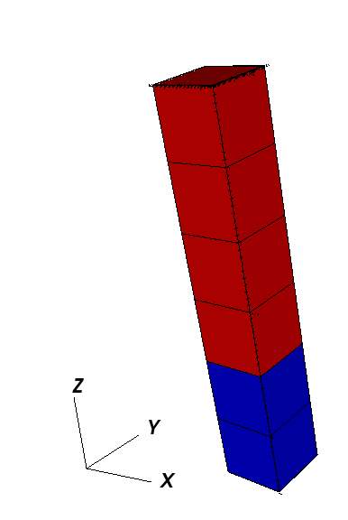

Mesh Block
===============================================================================

The Mesh Block let you define the way the a mesh body is built.
There are two options :

Using the Internal Mesh Generator
---------------------------------

Syntax
^^^^^^

The Internal Mesh Generator stands for building cartesian grids (either 1D, 2D or 3D) and divide
it in several regions.

.. code-block:: xml

  <Mesh>
    <InternalMesh name="mesh"
                  elementTypes="C3D8"
                  xCoords="0, 1"
                  yCoords="0, 1"
                  zCoords="0, 2, 6"
                  nx="1"
                  ny="1"
                  nz="2, 4"
                  cellBlockNames="cb1 cb2"/>
  </Mesh>

- ``name`` the name of the mesh body
- ``elementTypes`` the type of the elements that will be generated.
- ``xCoord`` List of ``x`` coordinates of the boundaries of the ``CellBlocks``
- ``yCoord`` List of ``y`` coordinates of the boundaries of the ``CellBlocks``
- ``zCoord`` List of ``z`` coordinates of the boundaries of the ``CellBlocks``
- ``nx`` List containing the number of cells in ``x`` direction within the ``CellBlocks``
- ``ny`` List containing the number of cells in ``x`` direction within the ``CellBlocks``
- ``nz`` List containing the number of cells in ``x`` direction within the ``CellBlocks``
- ``cellBlockNames`` List containing the names of the ``CellBlocks``

Example
^^^^^^^

The previous sample of XML file will generate a vertical beam with two ``CellBlocks``
(one in red and one in blue in the following picture)

