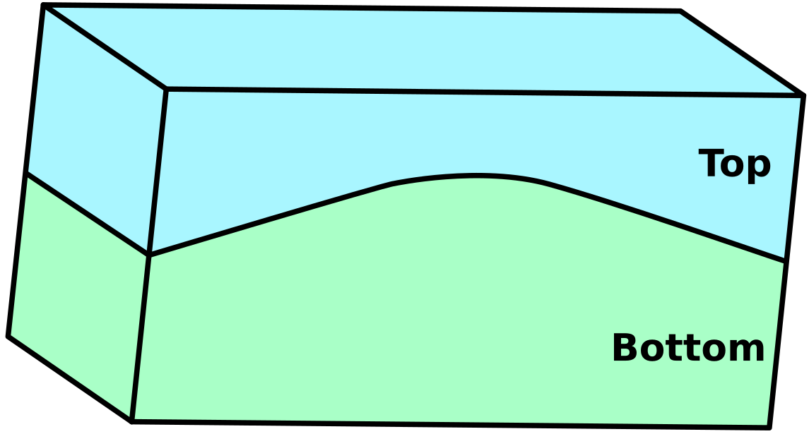

===================
Mesh Infrastructure
===================

GEOSX uses a hierarchical class structure to store the mesh.
To illustrate it, we show a model with two regions (Top and Bottom) (:numref:`modelFig`).

.. _modelFig:

   Example of a model with two regions

This model can be meshed with different types of polyhedra.
Here, the model is meshed with pyramids,
tetrahedra, hexahedra and wedges (:numref:`meshPolyFig`).

.. _meshPolyFig:
.. figure:: ../../../coreComponents/mesh/docs/mesh_multi.png
   :align: center
   :width: 500
   :figclass: align-center

   Model meshed with different cell types

This mesh can then be split across different computational nodes.
The resulting split consists of several ``DomainPartition`` of the mesh (here, two).
These partitions are not necessarily identical to the two regions (Top and Bottom) (:numref:`domainPartFig`).

.. _domainPartFig:
.. figure:: ../../../coreComponents/mesh/docs/mesh_domain.png
   :align: center
   :width: 500
   :figclass: align-center

   Mesh partioned in two ``DomainPartition``

Each ``DomainPartition`` is handled by the ``DomainPartition`` class in GEOSX.
Each MPI process has its own instance of a ``DomainPartition``.

A ``DomainPartition`` can contain several ``MeshBody``.
A ``MeshBody`` is a partition of the mesh assigned to a specific set of physical laws.
For instance, we could imagine a ``MeshBody`` where we only want to solve for flow 
and not for elasticity, while in another area, we would have a ``MeshBody`` where both solvers are used.
A ``MeshBody`` can contain several ``MeshLevel``.
``MeshLevel`` objects are used to define levels in multi level computations.

For clarity here, we assume that there is only one ``MeshBody`` and one ``MeshLevel``.

A ``MeshLevel`` contains several managers that handle the mesh data structure.

- ``NodeManager`` handles the nodes,
- ``EdgeManager`` handles the edges,
- ``FaceManager`` handles the facets,
- ``ElementRegionManager`` handles the different regions and the polyhedra that compose them.

NodeManager
===============

The ``NodeManager`` contains information on all nodes (vertices)
of the ``MeshLevel`` and of the
``DomainPartition`` it belongs to.
Its size is equal to the number of nodes in this ``DomainPartition``/``MeshLevel``.

EdgeManager
===============

In GEOSX, an edge is a segment between two nodes.
The ``EdgeManager`` contains information on all edges
of the ``MeshLevel`` and of the ``DomainPartition`` it belongs to.
Its size is equal to the number of edges in this ``DomainPartition``/``MeshLevel``.

The following picture shows the edges of the ``DomainPartition 1`` in the mesh:

.. figure:: ../../../coreComponents/mesh/docs/edges_domain1.png
   :align: center
   :width: 300
   :figclass: align-center

FaceManager
===============

In GEOSX, a face is the interface between two polyhedra. 
The ``FaceManagers`` contains informations on all faces of the ``MeshLevel`` and of the
``DomainPartitions`` it belongs to. 
Its size is equal to the number of faces in this ``DomainPartition``/``MeshLevel``.

ElementRegionManager
========================

The ``ElementRegionManager`` handles all polyhedral elements of the ``DomainPartition``/``MeshLevel`` it belongs to.
An ``ElementRegion`` in GEOSX is thus a collection of polyhedral elements managed by an ``ElementRegionManager``. 
In the example above, the ``ElementRegionManager`` of one ``DomainPartition``/``MeshLevel`` manages two ``ElementRegion`` instances: one corresponding to the Bottom region, and one corresponding to the Top region.

The element geometry information is stored in the ``CellElementSubRegion``.
An ``ElementRegion`` can contain several ``CellElementSubRegion``.
There is one such ``CellElementSubRegion`` for each element type.
In our example, there are four distinct elements types (hexahedra, tetrahedra, wedges and pyramids).
As a consequence, our ``ElementRegion`` will contain four different ``CellElementSubRegion`` instances:
one for all hexahedra, one for all tetrahedra, one for all wedges, one for all pyramids.

Ghosting structure
==================

To ease the communication between ``DomainPartition`` objects across MPI processes,
GEOSX computes ghost elements.
Ghost elements provide an overlap between two adjacents ``DomainPartition`` objects.
From now on, we will distinguish between *owned* elements (that belong to the domain)
and *ghost* elements (than belong to the neighboring domain).

.. figure:: ../../../coreComponents/mesh/docs/split.png
   :align: center
   :width: 700
   :figclass: align-center

.. warning::
  Asking for the size of the ``NodeManager``, ``EdgeManager``, ``FaceManager`` or a ``CellElementSubRegion``
  will return the number of owned elements plus the number of ghost elements.

The complete mesh data structure is shown in the next picture.

.. image:: ../../../coreComponents/mesh/docs/diag.png

