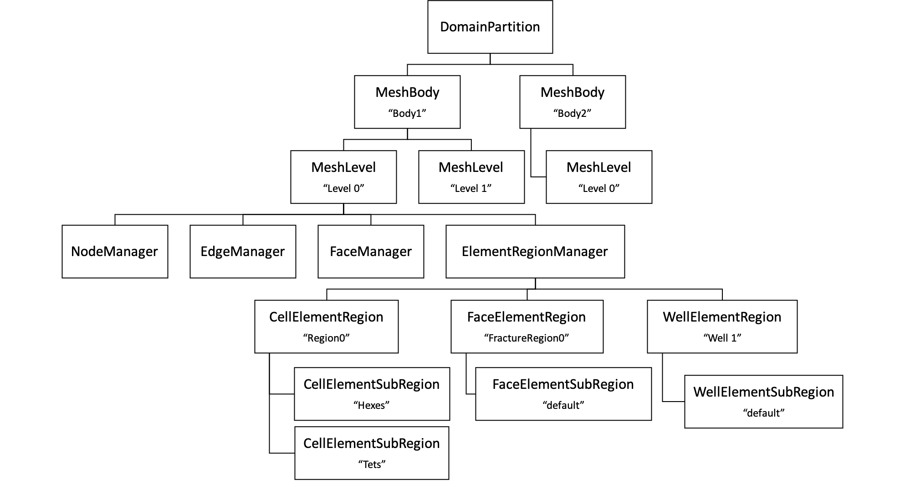

.. _meshDeveloperGuide:

********************
GEOSX Mesh Hierarchy
********************

In GEOSX, the mesh structure consists of a hierarchy of classes intended to separate data and 
functionality into related classes that assist in the definition of a discretized body, as well as
providing some encapsulation for each topological type.
Each class in the mesh hierarchy represents a distinct topological object, such as a nodes, edges, 
faces, elements, etc.
To understand the role of each class, it is helpful to view an object instantiation hierarchy.
The object instantiation hierarchy differs from a "class hierarchy" in that it seeks to illustrate 
how instantiations of each class relate to each other in the data hierarchy rather than how each class
type relates to each other in an inheritance diagram. 

    
    Object Instantiation Hierarchy for the Mesh Objects.

DomainPartition
===============   
In :numref:`MeshObjectInstantiationHierarchy` the top level object ``DomainPartition`` represents 
a partition of the decomposed physical domain.
Typically, there will be a unique ``DomainPartition`` for every MPI rank, but hypothetically, 
there may be more than one ``DomainPartition`` in cases where the ranks are overloaded.
Currently GEOSX does not support overloading multiple ``DomainPartition``'s onto a rank, although
this may be a future option if its use is properly motivated.

MeshBody
========
The ``MeshBody`` represents a topologically distinct mesh body.
For instance if a simulation of two separate spheres was required, then one option would be to have
both spheres as part of a single mesh body, while another option would be to have each sphere be 
a individual body...topologically distinct from the other sphere.
While not currently utilized in GEOSX, the intent is to have the ability to handle the bodies
in a multi-body mesh on an individual basis.
For instance, when conducting high resolution crush simulations of granular materials (i.e. sand),
it may be advantagous to represent each particle as a ``MeshBody``.

MeshLevel
=========
The ``MeshLevel`` is intended to facilitate the representation of a multi-level discretization of a ``MeshBody``.
In current practice, the code utilizes a single ``MeshLevel`` until such time as we 
implement a proper multi-level mesh capability.
The ``MeshLevel`` contains the main components that compose a discretized mesh in GEOSX.

Topological Mesh Objects
========================
Each of the "Manager" objects are responsible for holding child objects, data, and providing functionality
specific to a single topological object.
Each topological object that is used to define a discretized mesh has a "Manager" to allow for simple
traversal over the hierarchy, and to provide modular access to data.
As such, the ``NodeManager`` manages data for the "nodes", the ``EdgeManager`` manages data for the edges,
and the ``FaceManager`` holds data for the faces.
Additionally each manager contains index maps to the other types objects that are connected to the 
objects in that manager.
For instance, the ``FaceManager`` contains a downward pointing map that gives the nodes that comprise each
face in the mesh. 
Similarly the ``FaceManager`` contains an upward pointing map that gives the elements that are connected
to a face.

ElementRegionManager
--------------------
The element data structure is significantly more complicated than the other Managers.
While the other managers are "flat" across the ``MeshLevel``, the element data structure seeks to provide
a hierarchy in order to define groupings of the physical problem, as well as collecting discretization of 
similar topology.
At the top of the element branch of the hierarchy is the ``ElementRegionManager``.
The ``ElementRegionManager`` holds a collection of instantiations of ``ElementRegionBase`` children.

ElementRegion
^^^^^^^^^^^^^
Conceptually the ``ElementRegion``'s are used to defined a region of the problem domain where a 
``PhysicsSolver`` will be applied.
An ``ElementRegion`` also has a list of materials allocated at each quadrature point across the entire 
region.
One example of the utility of the ``ElementRegion`` is the case of the simulation of the mechanics 
and flow within subsurface reservoir with an overburden.
We could choose to partition the body into two ``ElementRegion``'s, one being the reservoir, and one for the 
overburden. 
The mechanics solver would be applied to the entire problem, while the flow problem would be applied only 
to the reservoir region.

ElementSubRegion
^^^^^^^^^^^^^^^^
Each ``ElementRegion`` holds some number of ``ElementSubRegion``'s. 
The ``ElementSubRegion`` is meant to hold all the element topologies present in an ``ElementSubRegion`` 
in their own groups. 
For instance, for a ``CellElementRegion``, there may be a ``CellElementSubRegion`` for Hexahedral elements,
a separate ``CellElementSubRegion`` for Tetrahedral elements…etc.
In general, most of the element field data is stored at the ``ElementSubRegion`` group level, although 
there may be more data moved to the ``ElementRegion`` level when there is a single data entry per element.

InterObjectRelations/Maps
-------------------------
A summary of the maps in each object are take from the source as:

NodeManager
^^^^^^^^^^^

.. literalinclude:: ../NodeManager.hpp
   :language: c++
   :start-after: //START_SPHINX_INCLUDE_01
   :end-before: //END_SPHINX_INCLUDE_01

.. literalinclude:: ../NodeManager.hpp
   :language: c++
   :start-after: //START_SPHINX_INCLUDE_02
   :end-before: //END_SPHINX_INCLUDE_02

Accessing Managers
==================
Access to managers is supported thtrou
