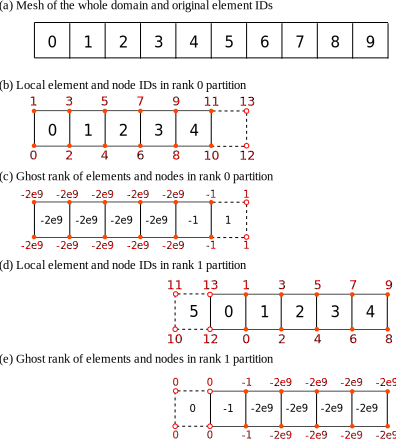
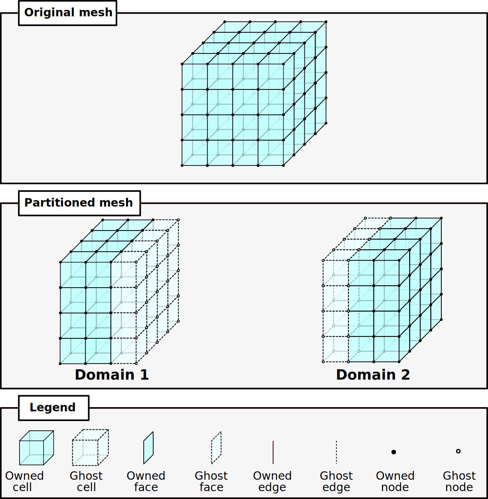

.. _SpatialPartitioning:

###############################################################################
Parallel Partitioning
###############################################################################

Parallel GEOS simulations involves multiple ``partitions`` and there are ``ghost`` objects in each partition. 
Users need to understand these concepts to effectively design models and visualize results.

Partition and ghosting : simple examples
=========================================

A model, or more strictly, a computational domain, is stored in a distributed fashion among many processors. 
In the following simple example, the computational domain has 10 cells and the simulation involves two processors.
The first processor, "partition 0" ("0" is called the "rank" of the processor) owns the first five cells (0 to 4) while "partition 1" owns 5 to 9. 
When the whole domain is divided into partitions, each partition will number the cells and other objects such as nodes, faces, and edges in the partition . 
Therefore, in both partitions, the cells IDs start from zero. 
Element 0 in partition 1 is cell 5 (or the sixthc cell) of the original domain. 
In parallel computing, each partition does not only need to know information about its own cells, 
but it also needs to know information about some cells owned by the neighbor partitions if these cells are directly connected to objects in this partition. 
For example, cell 0 in partition 1 (i.e. cell 5 in the original whole domain) is connected to cell 4 in partition 0. 
Therefore, partition 0 will keep a copy of this cell (including the data associated with this cell) which is synchronized with the corresponding information in the partition that actually owns this cell.

In summary, a partition owns a number of cells and other objects (e.g. faces) and also keeps copies of objects from neighbor partitions. 
Partitioning is automatically handled by GEOS once the user specifies how the domain should be divided.

The following figure show the partitioning of a simple mesh. 
Real nodes appear as solid red circles in the owning partition and ghost nodes are shown as hollow circles.

This concept of ghosting and communications between owned cells and ghost cells can also be applied to the
other types of elements in GEOS (Faces, Edges, Nodes).
The next figure summarizes the way nodes, edges, faces and cells are ghosted.

Specifying partitioning pattern
=================================

Cartesian partitioning
-----------------------
In the command line to run GEOS, the user can specify the partitioning pattern by adding the following switches:

  * ``-x, --x-partitions`` - Number of partitions in the x-direction
  * ``-y, --y-partitions`` - Number of partitions in the y-direction
  * ``-z, --z-partitions`` - Number of partitions in the z-direction

Graph-based partitioning
---------------------------

The Graph-based partitioning is used only when importing exernal meshes using the ``VTKMesh``
(see :ref:`TutorialFieldCase` section for more details using external meshes).
While importing themesh, ``vtk`` computes the graph of connectivity between all the volume elements of the mesh.
The partitioning is then done using whether a KD-tree or the PTSCOTCH_, METIS_, PARMETIS_ libraries.
The graph is not weighted so the expected result is as mesh divided in ``n`` parts,
with ``n`` being the number of MPI ranks used for simulation containing a similar amount of cells.

Ghost ranks
===============
Each object (node, edge, face, or cell) has a ``ghost rank`` attribute, stored in the ``ghostRank`` field. 
If a object does not appear in any other partition as a ghost, its ghost rank is a large negative number, -2.14e9 in a typical system.
If a object is real (owned by the current partition) but exists in other partitions as ghosts, its ghost rank is -1.
The ghost rank of a ghost object is the rank of the partition that owns the corresponding real object.

Considerations for visualization
=================================
In VisIt, a partition is called a ``domain``. 
The ID of a domain is the rank of the corresponding partition in GEOS plus one.
VisIt would display all elements/objects regardless if they are real or ghosts.
As information about a ghost is synchronized with the real object, VisIt just overlaying the same images on top of each other.
The user would not perceive the overlapping between partitions unless the models are shown as semi-transparent entities.
Note that if ghosts are not hidden, results from a ``query`` operation, such as summation of variable values, would be wrong due to double-counting.
Therefore, it is a good practice or habit to hide ghost objects using ghostRank as a filter. 

If the visualization method involves interpolation, such as interpolating a zonal field into a nodal field or generating contours, 
the interpretation near partition boundaries is not accurate.

.. _METIS: http://glaros.dtc.umn.edu/gkhome/metis/metis/overview
.. _PARMETIS: http://glaros.dtc.umn.edu/gkhome/metis/parmetis/overview
.. _PTSCOTCH: https://www.labri.fr/perso/pelegrin/scotch/