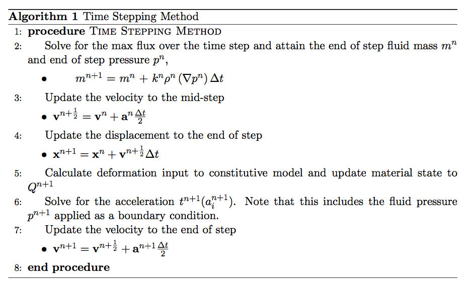
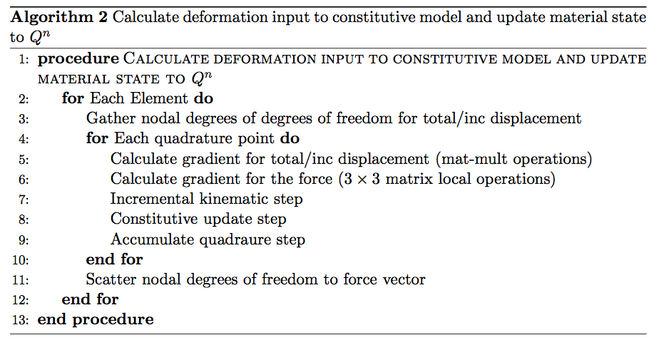

###############################################################################
About: GEOSX Solid Mechanics Proxy App
###############################################################################

.. _about-proxy:

About the proxy
===================

The proxy is designed as a platform to exercise the most computationally intensive
kernel of the GEOSX physics solver package. The package solves the three
dimensional equations of motion

.. math::

  \nabla \mathbf{T} + \rho \left(\mathbf{b} - \ddot{\mathbf{x}} \right) = 0.

Here :math:`\mathbf{T}` corresponds to the Cauchy-Stress tensor, :math:`\rho`
corresponds to the density in the current configuration, :math:`\mathbf{b}` is the body force,
and :math:`\mathbf{x}` represents a particle's current position. The physics package uses a finite element
spatial discretization along with a Newmark-Beta method to propagate the solution forward in time.
The full time-stepping method requires having the following input available

* :math:`\mathbf{x}^{n}`- Nodal displacement at time-step :math:`t^n`
* :math:`\mathbf{v}^{n}` - Nodal velocity field at time-step :math:`t^n`
* :math:`\mathbf{a}^{n}` - Nodal acceleration field at time-step :math:`t^n`
* :math:`Q^{n}` - The material states in volume elements (including stress :math:`\mathbf{T}^{n}`) at time-step :math:`t^n`
* :math:`m^{n}` - The fluid mass in flow elements at time-step :math:`t^n`
* :math:`w^{n}(\mathbf{x})` is the aperture (i.e. fracture opening)
* :math:`p^{n} (\mathbf{x}, m^n, \rho_0)` is the fluid pressure in flow elements at time-step :math:`t^n` typically defined as a function of the density (mass/Volume) and some reference density.

The scheme additionally requires input from an equation stemming from lubrication theory
but we omit derivation of the algorithm for brevity. The algorithm is described in the following procedure

The primary purpose of the proxy is to create an environment to explore
different strategies to carryout the most computationally component of the solver
(procedure 5). Procedure 5 is carried out as follows

One strategy to vary performance is to investigate which data structures are best
suited to store nodal degrees of freedom and cell centered values. Discretized values
of the total/incremental displacement and force are stored as nodal values for
each spatial coordinate, :math:`x,y,z`, and thus have the option to be stored as either
an array of objects or object of arrays. An array of objects would store the values are triplets

.. math::

  [x_0, y_0, z_0, x_1, y_1, z_1, \dots ]

while an object of arrays layout would store the nodal degrees of freedom as
as three separate arrays

.. math::

   [x_0, x_1, x_2, x_3, \dots ] \\
   [y_0, y_1, y_2, y_3, \dots ] \\
   [z_0, z_1, z_2, z_3, \dots ]

Shape function derivatives, which are needed in the fifth step of algorithm 2,
may be stored as either as an object of arrays or array of objects with respect to the
dimension index. More precisely storing as an array of objects would take the form of

.. math::
  \text{dNdX[elem][quad][dof][dim]}

while storing as an object of arrays would take the form of

.. math::
  \text{dNdX_x[elem][quad][dof]} \\
  \text{dNdX_y[elem][quad][dof]} \\
  \text{dNdX_z[elem][quad][dof]}

In addition, the proxy has the capability to compute shape function derivatives
within the kernel reliving the need of additional storage. Computation of the shape function derivatives
may either be done from scratch for each element; or by carrying out a pre-computation step
in which the basis functions are evaluated at quadrature points with respect to the parent element
(we refer to this as partial assembly).

At the time of writing, GEOSX employs a :math:`\mathbb{Q}^1` three-dimensional
finite element method and a two point gaussian quadrature rule, thus dim = 3, noQuadPoints = 8,
noBasisFun = 8.

Overview of the Code
=================================
The proxy is designed to be self-contained and does not depend on GEOSX's build
system.

**Drivers**

The proxy contains two main drivers ``ArrayOfObjects.cpp`` and ``ObjectOfArrays.cpp``.
The former will store nodal degrees of freedom and shape function derivatives as
an array of objects while the later will store the data in the object of arrays format.
The drivers are responsible for allocating memory, calling the methods
to generate a mesh and shape function derivatives.

**Kernels**

The header ``SolidMechanicsLagrangianFEM_kernels.hpp`` contains variations of the
the most computationally intensive kernel. In particular, there are three main kernel
types

* ``Monolithic Kernel`` ::  Will carry out the kinematic, constitutive update, and integration step in a single kernel. Shape functions are assumed to be precomputed.

* ``Shape function calculation`` :: Same as above but shape functions derivatives are calculated inside the kernel.

* ``Three kernel update`` :: Splits the kinematic, constitutive update, and integration step into three kernels. Shape function derivatives are assumed to be precomputed.

**Layout**

At the heart of the proxy is the ``Layout.hpp`` header which enables users to change
data layouts at compile time. The following are the included preprocessors in the layout header.
If no preprocessors are defined the proxy will use run the monolithic kernel by default while GEOSX will use
the internal solver.

* ``EXTERNAL_KERNELS`` - If defined, GEOSX will use kernels from the proxy.

* ``ARRAY_OF_OBJECTS_LAYOUT`` - If defined, GEOSX will store nodal degrees of freedom
and shape function derivatives as array of objects.

* ``OBJECT_OF_ARRAYS_LAYOUT`` - If defined, GEOSX will store nodal degrees of freedom
and shape function derivatives as an object of arrays.

* ``STRUCTURED_GRID`` - Enables/disables random enumeration of elements on a grid. If defined the kernel will not use an element to node list
and calculate the location of the nodes on each invocation of the kernel.

* ``THREE_KERNEL_UPDATE`` - Enables/disables using three kernels to carryout the kinematic, constitutive update, and integration step.

* ``COMPUTE_SHAPE_FUN`` - Enables/disables calling a kernel which computes shape function derivatives.

* ``PRE_COMPUTE_P`` - If enabled, a pre-computation step will be taken which stores the evaluation of the shape
function derivatives at the quadrature points with respect to the parent coordinate system.

* ``USE_GPU`` - If CUDA is available the kernel will be offloaded to the device.

The layout header also has the ability to change whether the element index is the slowest or fastest index
for structures which the element index plays a role. The following preprocessors will either assume
the element index is the fastest (stride one) or slowest index (longest stride).

* ``SHAPE_FUN_FAST_INDEX_ELEM`` - If defined, the element index is assumed to have unit stride for shape function derivative data structure.

* ``STRESS_FUN_FAST_INDEX_ELEM`` - If defined, the element index is assumed to have unit stride for data structure holding the discretization of the stress tensor.

**Mesh Generation**

The header ``meshGen.hpp`` contains functions to generate a structured mesh on the
bi-unit cube. The function ``meshGen`` will return a list of vertices and the element
to node connectivity list. To introduce some indirection the elements are enumerated
in a random manner. The ``Layout.hpp`` header holds a macro to toggle randomization
off/on of the enumeration of the elements. If there is not a random enumeration the
the kernel will calculate element to node connectivity at kernel run time.

**Shape Functions**
The header ``ShapeFun.hpp`` stores various functions to compute shape functions.
For :math:`\mathbb{Q}^1` basis functions, GEOSX chooses the parent space to be ``[0,1]``
and thus the one dimensional basis functions are

.. math::

  \{1 - x, x \}

The three dimensional version are constructed by taking the tensor product of the
shape functions.

**Matrix Math**

In between gathers and scatters, most of the computations within the kernel are done
as local operations with `3 \times 3` matrices. To simplify and make the code more
compact the header ``Matrix_Math.hpp`` contains a variety of free functions to carryout
matrix algebra for :math:`3 \times 3` matrices.

Results
=================================

Future work
=================================
In its current state, the solid mechanics Lagrangian FEM MiniApp only exercises
the most computational kernel in PhysicsPackage1. Potential avenues would be to
extract additional kernels to carryout the full time-stepping scheme along with
boundary conditions.
