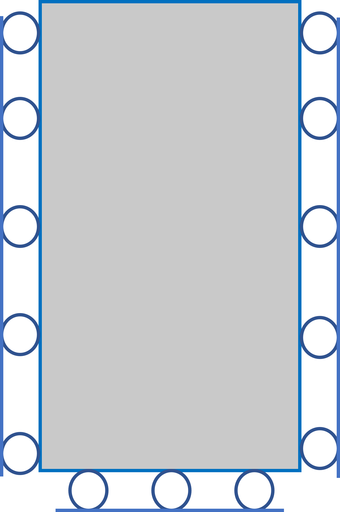
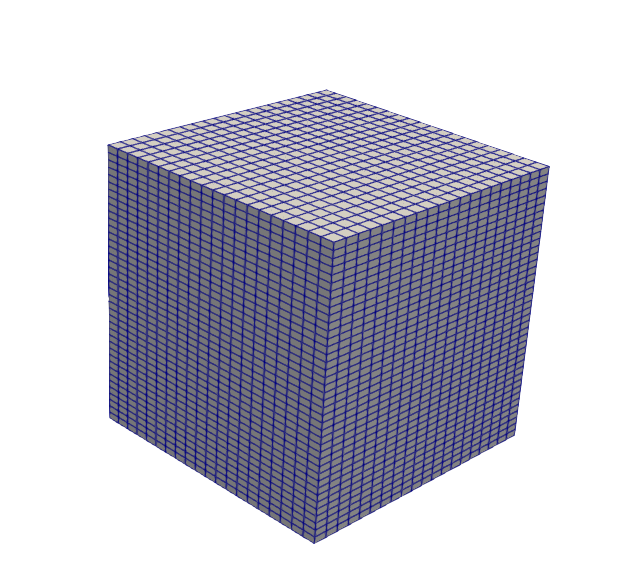
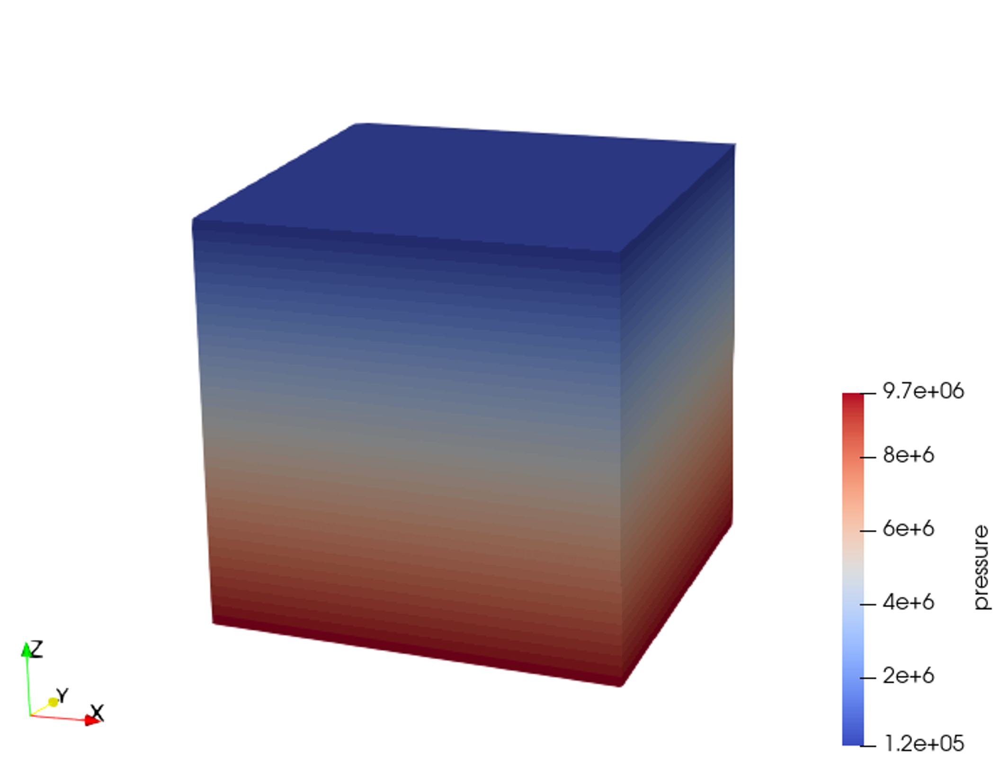
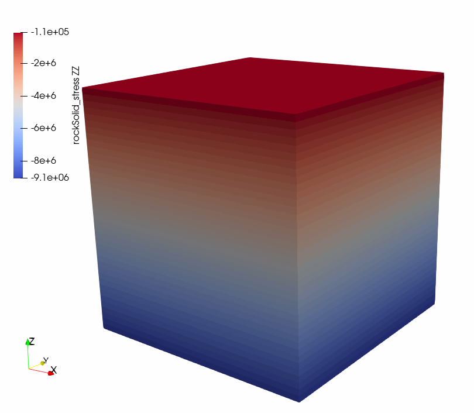

.. _gravityinducedhydrostaticinitialization:

#################################################################################
 Model Initialization: Hydrostatic and Mechanical Equilibrium
#################################################################################

**Context**

Prior to simulating underground operations, it is necessary to run a few steps of a fully coupled geomechanical simulation to reach the equilibrium state. In this example, we perform a gravity-only stress initialization for a reservoir with a hydrostatic in-situ pressure. The problem is solved using a single-phase poromechanics solver (see :ref:`PoroelasticSolver`) and the HydrostaticEquilibrium initialization procedure (see :ref:`EquilibriumInitialCondition`) in GEOS to predict the initial state of stress with depth in the reservoir, subject to the reservoir rock properties and the prevailing hydrostatic pressure condition. This way, the poromechanical model is initialized at mechanical equilibrium and all displacements are set to zero after initialization. We verify numerical results obtained by GEOS against an analytical equation (Eaton's equation).

**Input file**

The xml input files for the test case are located at:

.. code-block:: console

  inputFiles/initialization/gravityInducedStress_initialization_base.xml
  inputFiles/initialization/gravityInducedStress_initialization_benchmark.xml

A Python script for post-processing the simulation results is provided:

.. code-block:: console

  src/coreComponents/physicsSolvers/multiphysics/docs/gravityInducedStressInitialization/gravityInitializationFigure.py

------------------------------------------------------------------
Description of the Case
------------------------------------------------------------------

We model the in-situ state of stress of a subsurface reservoir subject to a gravity-only induced stress and hydrostatic in-situ pressure condition. The domain is homogenous, isotropic and isothermal. The domain is subject to roller boundary conditions on lateral surfaces and at the base of the model, while the top of the model is a free surface.

.. _problemSketch1InitializationTest:

   Sketch of the problem 

We set up and solve a PoroMechanics model to obtain the gradient of total stresses (principal stress components) across the domain due to gravity effects and hydrostatic pressure only. These numerical predictions are compared with the analytical solutions derived from `Eaton et al. (1969, 1975) <https://onepetro.org/SPEATCE/proceedings/75FM/All-75FM/SPE-5544-MS/138715>`__

For this example, we focus on the ``Mesh``,
the ``Constitutive``, and the ``FieldSpecifications`` tags.

------------------------------------------------------------------
Mesh
------------------------------------------------------------------

The following figure shows the mesh used for solving this poromechanical problem:

.. _problemSketch2InitializationTest:

   Generated mesh 

The mesh was created with the internal mesh generator and parametrized in the ``InternalMesh`` XML tag. 
It contains 20x20x40 eight-node brick elements in the x, y, and z directions respectively. 
Such eight-node hexahedral elements are defined as ``C3D8`` elementTypes, and their collection forms a mesh
with one group of cell blocks named here ``cellBlockNames``.

.. literalinclude:: ../../../../../../inputFiles/initialization/gravityInducedStress_initialization_benchmark.xml
    :language: xml
    :start-after: <!-- SPHINX_MESH -->
    :end-before: <!-- SPHINX_MESH_END -->

------------------------
Poro-Mechanics Solver
------------------------

For the initialization test, a hydrostatic pore pressure is imposed on the system. This is done using the Hydrostatic Equilibrium tag under Field Specifications. We then define a poro-mechanics solver called here poroSolve. 
This solid mechanics solver (see :ref:`SolidMechanicsLagrangianFEM`) called ``lagSolve`` is based on the Lagrangian finite element formulation. 
The problem is run as ``QuasiStatic`` without considering inertial effects. 
The computational domain is discretized by ``FE1``, defined in the ``NumericalMethods`` section.
We use the ``targetRegions`` attribute to define the regions where the poromechanics solver is applied.
Since we only have one cellBlockName type called ``Domain``, the poromechanics solver is applied to every element of the model. 
The flow solver for this problem (see :ref:`SinglePhaseFlow`) called ``SinglePhaseFlow`` is discretized by ``fluidTPFA``, defined in the ``NumericalMethods`` section.

.. literalinclude:: ../../../../../../inputFiles/initialization/gravityInducedStress_initialization_base.xml
    :language: xml
    :start-after: <!-- SPHINX_POROMECHANICSSOLVER -->
    :end-before: <!-- SPHINX_POROMECHANICSSOLVER_END -->

.. literalinclude:: ../../../../../../inputFiles/initialization/gravityInducedStress_initialization_base.xml
    :language: xml
    :start-after: <!-- SPHINX_NUMERICAL -->
    :end-before: <!-- SPHINX_NUMERICAL_END -->

------------------------------
Constitutive Laws
------------------------------

A homogeneous domain with one solid material is assumed, and its mechanical and fluid properties are specified in the ``Constitutive`` section: 

.. literalinclude:: ../../../../../../inputFiles/initialization/gravityInducedStress_initialization_base.xml
    :language: xml
    :start-after: <!-- SPHINX_MATERIAL -->
    :end-before: <!-- SPHINX_MATERIAL_END -->

As shown above, in the ``CellElementRegion`` section, 
``rock`` is the solid material in the computational domain and ``water`` is the fluid material. 
Here, Porous Elastic Isotropic model ``PorousElasticIsotropic`` is used to simulate the elastic behavior of ``rock``.
As for the solid material parameters, ``defaultDensity``, ``defaultPoissonRatio``, ``defaultYoungModulus``, ``grainBulkModulus``, ``defaultReferencePorosity``, and ``permeabilityComponents`` denote the rock density, Poisson ratio, Young modulus, grain bulk modulus, porosity, and permeability components respectively. In additon, the fluid property (``water``) of density, viscosity, compressibility and viscosibility are specified with ``defaultDensity``, ``defaultViscosity``, ``compressibility``, and ``viscosibility``. 
All properties are specified in the International System of Units.

------------------------------
Stress Initialization Function
------------------------------

In the ``Tasks`` section, ``SinglePhasePoromechanicsInitialization`` tasks are defined to initialize the model by calling the poro-mechanics solver ``poroSolve``. This task is used to determine stress gradients through designated densities and established constitutive relationships to maintain mechanical equilibrium and reset all initial displacements to zero following the initialization process.  

.. literalinclude:: ../../../../../../inputFiles/initialization/gravityInducedStress_initialization_base.xml
    :language: xml
    :start-after: <!-- SPHINX_TASKS -->
    :end-before: <!-- SPHINX_TASKS_END -->
    
The initialization is triggered into action using the ``Event`` management section, where the ``soloEvent`` function calls the task at the target time (in this case -1e10s).
 
.. literalinclude:: ../../../../../../inputFiles/initialization/gravityInducedStress_initialization_benchmark.xml
    :language: xml
    :start-after: <!-- SPHINX_EVENTS -->
    :end-before: <!-- SPHINX_EVENTS_END -->

The ``PeriodicEvent`` function is used here to define recurring tasks that progress for a stipulated time during the simuation. We also use it in this example to save the vtkOuput results.

.. literalinclude:: ../../../../../../inputFiles/initialization/gravityInducedStress_initialization_base.xml
    :language: xml
    :start-after: <!-- SPHINX_OUTPUT -->
    :end-before: <!-- SPHINX_OUTPUT_END -->

We use Paraview to extract the data from the vtkOutput files at the initialization time, and then use a Python script to read and plot the stress and pressure gradients for verification and visualization.

-----------------------------------
Initial and Boundary Conditions
-----------------------------------

The next step is to specify fields, including:

  - The initial value (hydrostatic equilibrium),
  - The boundary conditions (the displacement control of the outer boundaries have to be set).

In this problem, all outer boundaries of the domain are subject to roller constraints except the top of the model, left as a free surface.  

These boundary conditions are set up through the ``FieldSpecifications`` section.

.. literalinclude:: ../../../../../../inputFiles/initialization/gravityInducedStress_initialization_base.xml
    :language: xml
    :start-after: <!-- SPHINX_BC -->
    :end-before: <!-- SPHINX_BC_END -->

The parameters used in the simulation are summarized in the following table.

+------------------+-------------------------+------------------+--------------------+
| Symbol           | Parameter               | Unit             | Value              |
+==================+=========================+==================+====================+
| :math:`E`        | Young Modulus           | [MPa]            | 100                |
+------------------+-------------------------+------------------+--------------------+
| :math:`v`        | Poisson Ratio           | [-]              | 0.25               |
+------------------+-------------------------+------------------+--------------------+
| :math:`\rho_b`   | Bulk Density            | [kg/m\ :sup:`3`] | 2500               |
+------------------+-------------------------+------------------+--------------------+
| :math:`\phi`     | Porosity                | [-]              | 0.375              |
+------------------+-------------------------+------------------+--------------------+
| :math:`K_s`      | Grain Bulk Modulus      | [Pa]             | 10\ :sup:`27`      |
+------------------+-------------------------+------------------+--------------------+
| :math:`\kappa`   | Permeability            | [m\ :sup:`2`]    | 10\ :sup:`-12`     |
+------------------+-------------------------+------------------+--------------------+
| :math:`\rho_f`   | Fluid Density           | [kg/m\ :sup:`3`] | 1000               |
+------------------+-------------------------+------------------+--------------------+
| :math:`c_f`      | Fluid compressibility   | [Pa\ :sup:`-1`]  | 4.4x10\ :sup:`-10` |
+------------------+-------------------------+------------------+--------------------+
| :math:`\mu`      | Fluid viscosity         | [Pa s]           | 10\ :sup:`-3`      |
+------------------+-------------------------+------------------+--------------------+

---------------------------------
Inspecting Results
---------------------------------

In the example, we request vtk output files for time-series (time history). We use paraview to visualize the outcome at the time 0s.
The following figure shows the final gradient of pressure and of the effective vertical stress after initialization is completed.

.. _problemInitializationPressure:

   Simulation result of pressure

.. _problemInitializationStressZZ:

   Simulation result of effective vertical stress

The figure below shows the comparison between the total stress computed by GEOS(marks) and with an analytical solutions (solid lines). Note that, because of the use of an isotropic model, the minimum and maximul horizontal stresses are equal.

.. plot:: coreComponents/physicsSolvers/multiphysics/docs/gravityInducedStressInitialization/gravityInitializationFigure.py

------------------------------------------------------------------
To go further
------------------------------------------------------------------

**Feedback on this example**

For any feedback on this example, please submit a `GitHub issue on the project's GitHub page <https://github.com/GEOS-DEV/GEOS/issues>`_.
