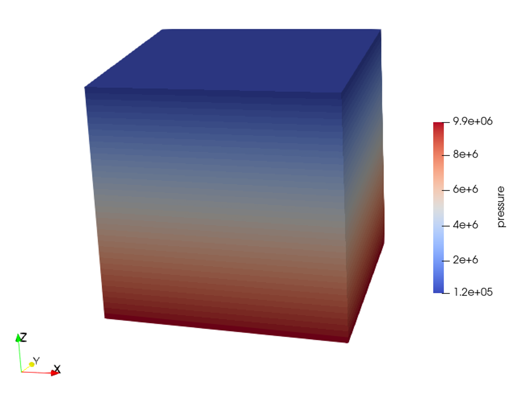
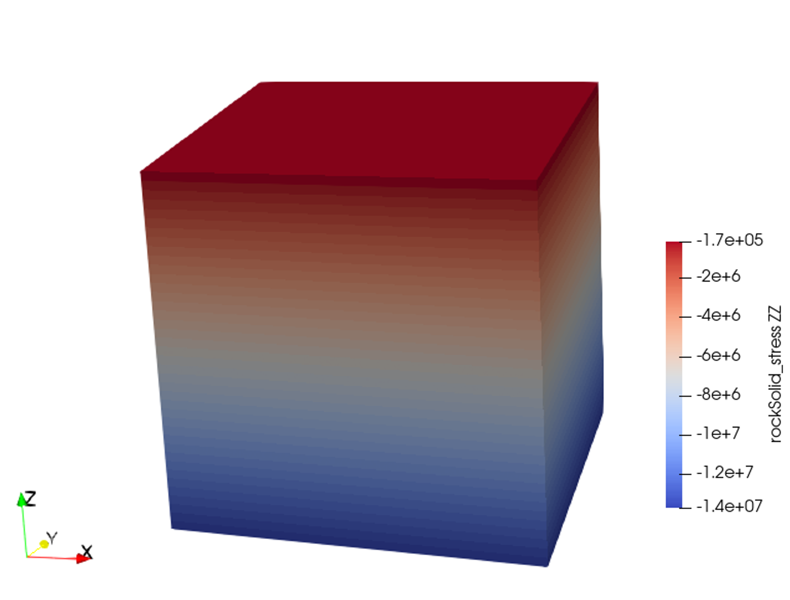

.. _userdefinedstressinitialization:

#################################################################################
 Model Initialization: User Defined Tables
#################################################################################

**Context**

This example uses the same reservoir model as the gravity-induced hydrostatic stress initialization case (see :ref:`gravityinducedhydrostaticinitialization`). Instead of using the gravity based equilibrium initialization procedure, we collect the interpretated stress and pore pressure gradients for a reservoir and then request the simulator to perform an initialization with the provided pressure and stresses in every element in the model. The problem is solved by using the single-phase poromechanics solver (see :ref:`PoroelasticSolver`) in GEOS.

**Input file**

The xml input files for the test case are located at:

.. code-block:: console

  inputFiles/initialization/userdefinedStress_initialization_base.xml
  inputFiles/initialization/userdefinedStress_initialization_benchmark.xml

This example also uses a set of table files located at:

.. code-block:: console

  inputFiles/initialization/userTables/

Last, a Python script for post-processing the results is provided:

.. code-block:: console

  src/coreComponents/physicsSolvers/multiphysics/docs/userTableStressInitialization/tableInitializationFigure.py

-------------------------------------
Stress Initialization Table Functions
-------------------------------------

The major distinction between this "user-defined" initialization and the "gravity-based" initialization is that in the user-defined case, the user provides the following additional information:

  - The distribution of effective stresses and pore pressure across the domain, with their gradients assumed constant along the depth in this example. We use a table function (see :ref:`FunctionManager`) to specify pressure and stress conditions throughout the area.

This is shown in the following tags under the ``FieldSpecifications`` section below

.. literalinclude:: ../../../../../../inputFiles/initialization/userdefinedStress_initialization_base.xml
    :language: xml
    :start-after: <!-- SPHINX_USER_TABLES -->
    :end-before: <!-- SPHINX_USER_TABLES_END -->

The tables for ``sigma_xx``, ``sigma_yy``, ``sigma_zz`` and ``init_pressure`` are listed under the ``Functions`` section as shown below.

.. literalinclude:: ../../../../../../inputFiles/initialization/userdefinedStress_initialization_base.xml
    :language: xml
    :start-after: <!-- SPHINX_FUNCTIONS -->
    :end-before: <!-- SPHINX_FUNCTIONS_END -->
    
The required input files: x.csv, y.csv, z.csv, effectiveSigma_xx.csv, effectiveSigma_yy.csv, effectiveSigma_zz.csv, and porePressure.csv are generated based on the expected stress-gradients in the model.

A Python script to generate these files is provided:

.. code-block:: console

  src/coreComponents/physicsSolvers/multiphysics/docs/userTableStressInitialization/genetrateTable.py

In addition to generating the files listed above, the script prints out the corresponding fluid density and rock density based on the model parameters provided. These values are then input into the ``defaultDensity`` parameter of the ``CompressibleSinglePhaseFluid`` and ``ElasticIsotropic`` tags respectively, as shown below:

.. literalinclude:: ../../../../../../inputFiles/initialization/userdefinedStress_initialization_base.xml
    :language: xml
    :start-after: <!-- SPHINX_Modify_Density -->
    :end-before: <!-- SPHINX_Modify_Density_END -->

.. literalinclude:: ../../../../../../inputFiles/initialization/userdefinedStress_initialization_base.xml
    :language: xml
    :start-after: <!-- SPHINX_Modify_FluidDensity -->
    :end-before: <!-- SPHINX_Modify_FluidDensity_END -->

---------------------------------
Inspecting Results
---------------------------------

In the example, we request vtk output files for time-series (time history). We use paraview to visualize the outcome at the time 0s.
The following figure shows the final gradient of pressure and of the effective vertical stress after initialization is completed.

.. _problemInitializationPres:

   Simulation result of pressure

.. _problemInitializationSZZ:

   Simulation result of effective vertical stress

The figure below shows the comparisons between the numerical predictions (marks) and the corresponding user-provided stress gradients. Note that anisotropic horizontal stresses are obtained through this intialization procedure; however, mechanical equilibrium might not be guaranteed, especially for the heterogeneous models.

.. plot:: coreComponents/physicsSolvers/multiphysics/docs/userTableStressInitialization/tableInitializationFigure.py

------------------------------------------------------------------
To go further
------------------------------------------------------------------

**Feedback on this example**

For any feedback on this example, please submit a `GitHub issue on the project's GitHub page <https://github.com/GEOS-DEV/GEOS/issues>`_.
