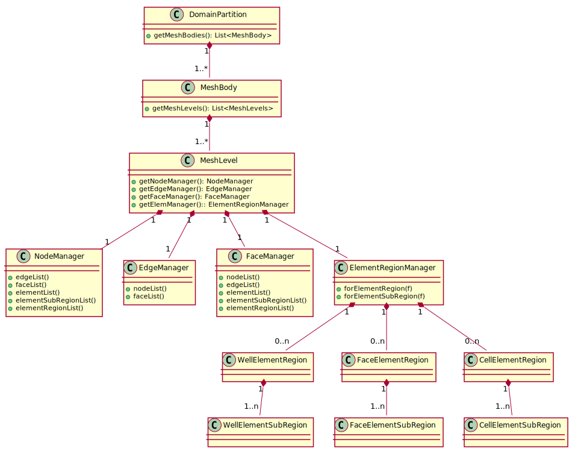

# Summary

GEOS is a simulation framework focused on implementing tightly-coupled multi-physics problems with an initial emphasis subsurface reservoir applications.
Specifically, GEOS provides implementations for studying carbon sequestration, geothermal energy, hydrogen storage, and similar problems, and allows developers to easily extend or add new formulations to the suite of capabilities.
The unique aspect of GEOS that differentiates it from existing reservoir simulators is the ability to provide tightly-coupled compositional flow, poromechanics, faults and fractures, and thermal effects.

# Statement of need

The increasing threat of climate change has resulted in an increased focus on mitigating carbon emissions into the atmosphere.
Carbon Capture and Storage (CCS) of generated CO2 in subsurface reservoirs and saline aquifers is one of the most important technologies required to meet global climate goals. 
Given the 2050 net-zero GHG goals, CO2 storage capacities required to offset emissions is orders of magnitude greater than current levels.(reference needed)
One factor in the evaluation of CO2 storage sites are the risks associated with the injection of liquefied CO2 in the subsurface.
GEOS seeks to provide the community with an open-source tool that is capable of simulating the complex coupled physics that occurs when liquefied CO2 is injected into a subsurface reservoir. 
Thus, GEOS is a freely available tool that may be used to evaluate reservoir integrity through various failure mechanisms such as caprock failure, fault leakage, and wellbore failure.
Additionally GEOS provides the potential to estimate seismic events induced by CO2 injection.

# Infrastructure Components 

The computational core of GEOS is written in c++17, and includes a Python3 interface that allows for the integration of the simulation capabilities into complex python workflows 
The c++ infrastructure provides components to isolate the domain science developer from the majority of common computer science tasks. 
The components of the infrastructure includes a data hierarchy, a discrete mesh data structure, a physics package interface, MPI communications tools, degree-of-freedom management, IO facilities, etc.
The data repository defines a `Wrapper` class to hold anything from data arrays to arbitrary objects, and a `Group` class that serves as a container to form a hierarchy.
Drawing an analogy with a standard folder/file hierarchy, the `Group` class can be thought of as a "Folder" as it holds other `Group`'s as well as a collection of `Wrapper` objects. 
The `Wrapper` can be thought of as a "File" as it contains the relevant data that is stored in the repository.

The mesh interface is built on top of the data repository as a collection of managers for each mesh object type. 
A physical body is 

{ width=20% }

assist in the implementation of methods to solve constraint equations on complex unstructured grids.

that incorporate other tools such as machine learning components or geological modeling tools.

 such as a discrete mesh data structure, MPI communications tools, degree-of-freedom management, IO facilities, etc.

The performance portability strategy applies LLNL's suite of portability tools RAJA[@Beckingsale:2019], CHAI[@CHAI:2023], and Umpire[@Beckingsale:2020].
Through this strategy GEOS has been successfully run on platforms ranging from GPU-based Exa-scale systems such as ORNL/Frontier down to CPU-based laptops.
Additionally GEOS may be executed on HPC cloud resources.

Single dollars ($) are required for inline mathematics e.g. $f(x) = e^{\pi/x}$

Double dollars make self-standing equations:

$$\Theta(x) = \left\{\begin{array}{l}
0\textrm{ if } x < 0\cr
1\textrm{ else}
\end{array}\right.$$

You can also use plain \LaTeX for equations
\begin{equation}\label{eq:fourier}
\hat f(\omega) = \int_{-\infty}^{\infty} f(x) e^{i\omega x} dx
\end{equation}
and refer to \autoref{eq:fourier} from text.

# Citations

Citations to entries in paper.bib should be in
[rMarkdown](http://rmarkdown.rstudio.com/authoring_bibliographies_and_citations.html)
format.

If you want to cite a software repository URL (e.g. something on GitHub without a preferred
citation) then you can do it with the example BibTeX entry below for @fidgit.

For a quick reference, the following citation commands can be used:
- `@author:2001`  ->  "Author et al. (2001)"
- `[@author:2001]` -> "(Author et al., 2001)"
- `[@author1:2001; @author2:2001]` -> "(Author1 et al., 2001; Author2 et al., 2002)"

# Figures

Figures can be included like this:

and referenced from text using \autoref{fig:example}.

Figure sizes can be customized by adding an optional second parameter:
{ width=20% }

# Acknowledgements

This work performed under the auspices of the U.S. Department of Energy by Lawrence Livermore National Laboratory under Contract DE-AC52-07NA27344

This research was supported by the Exascale Computing Project (ECP), Project Number: 17-SC-20-SC, a collaborative effort of two DOE organizations - the Office of Science and the National Nuclear Security Administration, responsible for the planning and preparation of a capable exascale ecosystem, including software, applications, hardware, advanced system engineering and early testbed platforms, to support the nation's exascale computing imperative.

FC-MAELSTROM statement...

# References