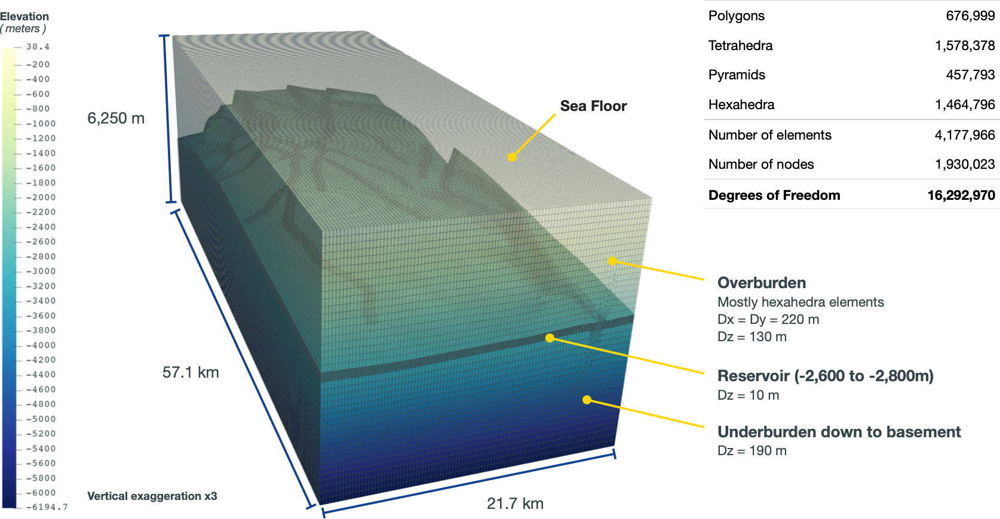

# Summary

GEOS is a simulation framework focused on implementing tightly-coupled multi-physics problems with an initial emphasis subsurface reservoir applications.
The version of GEOS described here should be considered a separate work form the previous version of GEOS referred to in [@Settgast:2017].
Specifically, GEOS provides implementations for studying carbon sequestration, geothermal energy, hydrogen storage, and similar problems, and allows developers to easily extend or add new formulations to the suite of capabilities.
The unique aspect of GEOS that differentiates it from existing reservoir simulators is the ability to provide tightly-coupled compositional flow, poromechanics, faults and fractures, and thermal effects.
Extensive documentation for GEOS is available at https://geosx-geosx.readthedocs-hosted.com/en/latest. 

# Statement of need

The increasing threat of climate change has resulted in an increased focus on mitigating carbon emissions into the atmosphere.
Carbon Capture and Storage (CCS) of CO2 in subsurface reservoirs and saline aquifers is one of the most important technologies required to meet global climate goals. 
Given the 2050 net-zero GHG goals, CO2 storage capacities required to offset emissions is orders of magnitude greater than current levels.(reference needed)
One factor in the evaluation of CO2 storage sites are the containment risks associated with the injection of liquefied CO2 in the subsurface.
The primary goal of GEOS is to provide the global community with an open-source tool that is capable of simulating the complex coupled physics that occurs when liquefied CO2 is injected into a subsurface reservoir. 
Thus, GEOS is freely available and focused on the simulation of reservoir integrity through various failure mechanisms such as caprock failure, fault leakage, and wellbore failure.
Additionally GEOS provides the potential to estimate seismic events induced by CO2 injection.

# C++ Infrastructure Components 

The core c++17 infrastructure provides components to perform common computer science tasks typically required for solving differential equations using a spatially discrete method. 
The components of the infrastructure provided by GEOS include a data hierarchy, a discrete mesh data structure, a mesh based MPI communications interface, degree-of-freedom management, IO services, and a physics package interface.

The data repository forms an object hierarchy through the definition of a `Wrapper` class and a `Group` class. 
Drawing an analogy with a classical folder/file hierarchy, the `Group` is analogous to a "Folder" as it holds other `Group`'s as well as a collection of `Wrapper` objects, while the `Wrapper` is a container for any arbitrary object (e.g. scalar, array, class, etc.).
The mesh data structure is built on top of the data repository as a collection of "object managers" for each mesh object type (e.g. node, edge, face, element).
The management of distributed memory parallelism is done through a MPI, and the execution of distributed memory parallelism typically requires minimal consideration from the physics package developer.

GEOS is intended to be a generic multi-physics simulation platform.
As such, single physics packages are developed and tested independent of other physics packages. 
When coupling one or more single physics capabilities together to create a couple physics package, the strategy can be described as a monolithic linear system with an underlying block structure corresponding where the row/col of the block corresponds with a set of constraint equations/degrees-of-freedom associated with a physics package.
the diagonal blocks result from each single physics package contributions to its own boundary value problem.
The off-diagonal blocks represent the coupling between physics packages and are typically filled through one of several options, such as through the coupled physics package, or through a callback mechanism in the single physics package which adds the off-diagonal contributions to the single-physics kernels.

To solve linear systems, GEOS maintains a generic linear algebra interface (LAI) capable of wrapping various linear algebra packages.
However as a matter of practice, the primary linear algebra package used for the great majority of GEOS simulations is LLNL's hypre[@hypre].
For multi-physics problems involving the solution of a linear system, GEOS exclusively relies on hypre's implementation a multi-grid reduction preconditioning strategy as presented by [@BUI:2020],[@BUI:2021114111].

In addition to its c++ core, the the GEOS team provides a Python3 interface that allows for the integration of the simulation capabilities into complex python workflows involving components unrelated to GEOS.
The Python3 interface provides data exchange between GEOS simulations and the Python driver, as well as allowing the Python layer to call specific GEOS packages outside of standard GEOS c++ workflow.

The performance portability strategy utilized by GEOS applies LLNL's suite of portability tools RAJA[@Beckingsale:2019], CHAI[@CHAI:2023], and Umpire[@Beckingsale:2020].
The RAJA performance portability layer provides portable kernel launching and wrappers for reductions, atomics, and local/shared memory to achieve performance on both CPU and GPU hardware.
The combination of CHAI/Umpire provides memory motion management for platforms with heterogeneous memory spaces (i.e. host memory and device memory).
Through this strategy GEOS has been successfully run on platforms ranging from GPU-based Exa-scale systems to CPU-based laptops with minimal loss of performance due to platform changes.

# Applications
The development of GEOS targets multi-physics simulations of subsurfaces reservoirs.
To date GEOS has been used to simulate problems relevant to CO2 storage, enhanced geothermal systems, hydrogen storage, and both conventional and unconventional oil and gas extraction.
Often these simulations involve coupling between compositional multiphase flow and transport, poroelasticity, thermal transport, and interactions with faults and fractures.

The coupling strategy applied in GEOS is to require the capability of a tightly coupled monolithic system as a baseline capability.
In cases where such tight coupling is not required, one may decompose the monolithic system into blocks and apply a sequential coupling approach.

<!--
+-------------------+------------+----------+----------+
| Header 1          | Header 2   | Header 3 | Header 4 |
|                   |            |          |          |
+:=================:+:==========:+:========:+:========:+
| row 1, column 1   | column 2   | column 3 | column 4 |
+-------------------+------------+----------+----------+
| row 2             | cells span columns               |
+-------------------+------------+---------------------+
| row 3             | cells      | - body              |
+-------------------+ span rows  | - elements          |
| row 4             |            | - here              |
+===================+============+=====================+
| Footer                                               |
+===================+============+=====================+
-->

| Nodes | Ranks | DoF/rank | $\Large \frac{\text{Newton iter}}{\text{timestep}}$ | $\Large \frac{\textbf{GMRES iter}}{\textbf{Newton iter}}$ | Setup   [s]  | Solve   [s] | Efficiency |
| :---: | :---: | :------: |                    :-------------:                       |      :-------------:       | :-----:          | :---:           | ----------: |
| 2     | 72    | 226K     |                          7.5                             |           30.3             |  6,709           |  13,725         |      100%   |
| 4     | 144   | 113K     |                          7.5                             |           30.9             |  3,816           |  7,479          |      90%    |
| 8     | 288   | 56.6K    |                          7.6                             |           30.9             |  2,290           |  4,296          |      78%    |
| 16    | 576   | 28.3K    |                          7.6                             |           31.2             |  1,699           |  2,234          |      65%    |
Table 1: Strong scaling on LLNL/Quartz (Intel Xeon E5-2695 v4)

| Nodes | Ranks | DoF/rank | Newton   iterations   per timestep    (avg.) | GMRES   iterations   per Newton    (avg.)  | Setup   [s]  | Solve   [s] | Efficiency |
| ---:  | ---:  |--------: | :-------: | :-------: | :-----: |  -----: | ----------: |
| 4     | 16    |   1,018K |    7.7    |   44.3    |  2,830  |  4,364  |      100%   |
| 8     | 32    |   509K   |    7.5    |   46.2    |  1,834  |  3,636  |      66%    |
| 16    | 64    |   255K   |    7.5    |   45.6    |  1,473  |  3,775  |      3%     |
Table 2: Strong scaling on LLNL/Lassen (NVIDIA V100)

{ width=80% }

# Acknowledgements

This work performed under the auspices of the U.S. Department of Energy by Lawrence Livermore National Laboratory under Contract DE-AC52-07NA27344

This research was supported by the Exascale Computing Project (ECP), Project Number: 17-SC-20-SC, a collaborative effort of two DOE organizations - the Office of Science and the National Nuclear Security Administration, responsible for the planning and preparation of a capable exascale ecosystem, including software, applications, hardware, advanced system engineering and early testbed platforms, to support the nation's exascale computing imperative.

FC-MAELSTROM statement...

# References
