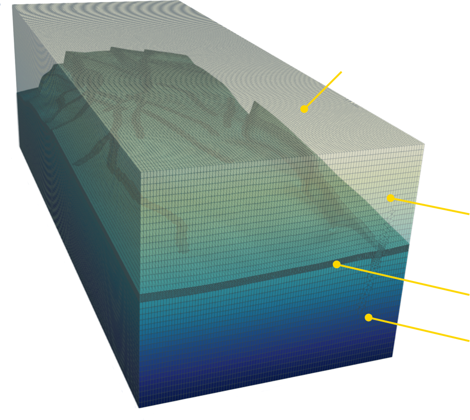

# Summary

GEOS is a simulation framework focused on implementing solution methods for tightly-coupled multi-physics problems with an initial emphasis subsurface reservoir applications.
Specifically, GEOS provides implementations for studying carbon sequestration, geothermal energy, hydrogen storage, and similar problems.
The unique aspect of GEOS that differentiates it from existing reservoir simulators is the ability to provide tightly-coupled compositional flow, poromechanics, faults and fractures, and thermal effects.
Extensive documentation for GEOS is available at https://geosx-geosx.readthedocs-hosted.com/en/latest. 
Note that the version of GEOS described here should be considered a separate work form the previous version of GEOS referred to in [@Settgast:2017].

# Statement of need

The increasing threat of climate change has resulted in an increased focus on mitigating carbon emissions into the atmosphere.
Carbon Capture and Storage (CCS) of CO2 in subsurface reservoirs and saline aquifers is one of the most important technologies required to meet global climate goals. 
Given the 2050 net-zero GHG goals, CO2 storage capacities required to offset emissions is orders of magnitude greater than current levels.(reference needed)
One factor in the evaluation of CO2 storage sites are the containment risks associated with the injection of liquefied CO2 in the subsurface.
The primary goal of GEOS is to provide the global community with an open-source tool that is capable of simulating the complex coupled physics that occurs when liquefied CO2 is injected into a subsurface reservoir. 
Thus, GEOS is freely available and focused on the simulation of reservoir integrity through various failure mechanisms such as caprock failure, fault leakage, and wellbore failure.

# C++ Infrastructure Components 

The core c++17 infrastructure provides common computer science capabilities typically required for solving differential equations using a spatially discrete method. 
The components of the infrastructure provided by GEOS include a data hierarchy, a discrete mesh data structure, a mesh based MPI communications interface, degree-of-freedom management, IO services, and a physics package interface.

The GEOS data repository forms an object hierarchy analogous with a classical folder/file hierarchy, where the "folder" is a `Group` object and the "file" is a `Wrapper` that is a container for any arbitrary object (e.g. scalar, array, class, etc.).
The mesh data structure is built on top of the data repository as a collection of "object managers" for each mesh object type (e.g. node, edge, face, element).
The management of distributed memory parallelism is done through a MPI, and the execution of distributed memory parallelism typically requires minimal consideration from the physics package developer.

GEOS is intended to be a generic multi-physics simulation platform.
The physics package interface in GEOS is intended to encapsulate the application of a numerical method to the solution of a collection of governing equations.
When implementing a package for a set of coupled physics equations, each individual physics package is first developed as a stand-alone capability. 
Then the single physics capabilities are utilized together in a coupled physics package.
The strategy for coupled physics can be described in terms of a monolithic linear system with an underlying block structure corresponding where the row/col of the block corresponds with a set of constraint equations/degrees-of-freedom associated with a single physics package, with the row being the constraint equation, and the column corresponding to the degree-of-freedom.
Using this representation, the diagonal blocks of the matrix contain contributions for each single physics package to its own boundary value problem, while the off-diagonal blocks represent the coupling between physics packages.
The coupled physics package is often responsible for providing the specific contributions of the off-diagonal/coupling blocks.

To solve these linear systems, GEOS maintains a generic linear algebra interface (LAI) capable of wrapping various linear algebra packages.
However, the primary linear algebra package used for the great majority of GEOS simulations is LLNL's hypre[@hypre].
For multi-physics problems involving the solution of a coupled linear system, GEOS exclusively relies on hypre's implementation a multi-grid reduction preconditioning strategy as presented by [@BUI:2020],[@BUI:2021114111].

The performance portability strategy utilized by GEOS applies LLNL's suite of portability tools RAJA[@Beckingsale:2019], CHAI[@CHAI:2023], and Umpire[@Beckingsale:2020].
The RAJA performance portability layer provides portable kernel launching and wrappers for reductions, atomics, and local/shared memory to achieve performance on both CPU and GPU hardware.
The combination of CHAI/Umpire provides memory motion management for platforms with heterogeneous memory spaces (i.e. host memory and device memory).
Through this strategy GEOS has been successfully run on platforms ranging from GPU-based Exa-scale systems to CPU-based laptops with minimal loss of performance due to platform changes.

In addition to its c++ core, the the GEOS team provides a Python3 interface that allows for the integration of the simulation capabilities into complex python workflows involving components unrelated to GEOS.
The Python3 interface provides data exchange between GEOS simulations and the Python driver, as well as allowing the Python layer to call specific GEOS packages outside of standard GEOS c++ workflow.

# Applications
To date GEOS has been used to simulate problems relevant to CO2 storage, enhanced geothermal systems, hydrogen storage, and both conventional and unconventional oil and gas extraction.
Often these simulations involve coupling between compositional multiphase flow and transport, poroelasticity, thermal transport, and interactions with faults and fractures.

As an example of a field case where GEOS has been applied, we present a simulation of CO2 storage at a large real-world storage site.
Figure \ref{RW_mesh} illustrates the computational mesh and relevant problem size and physical dimensions.
A strong scaling study is shown....maybe we just show a result image instead of a scaling study?

{ width=30% }
{ width=30% }

As an example of the weak scalability of GEOS on exascale systems, we present two weak scaling studies on a simple wellbore geometry using the exascale Frontier supercomputer located at Oak Ridge National Laboratory.
The results from the weak scaling study (Figure \ref{fig:Frontier_Mechanics}) shows flat scaling of the GEOS processes (assembly/field synchronization) up to 16,384 MPI ranks and 81.3e9 degrees-of-freedom (1/4 of Frontier).
There is a moderate decrease in efficiency with the application of the hypre preconditioner setup and solve, but given the complexity of those algorithms this level of scaling efficiency is expected.
The compositional flow study presented in Figure \ref{fig:Frontier_CMPF} shows similarly good weak scaling. 

{ width=30% }
{ width=30% }

# Acknowledgements

This work performed under the auspices of the U.S. Department of Energy by Lawrence Livermore National Laboratory under Contract DE-AC52-07NA27344

This research was supported by the Exascale Computing Project (ECP), Project Number: 17-SC-20-SC, a collaborative effort of two DOE organizations - the Office of Science and the National Nuclear Security Administration, responsible for the planning and preparation of a capable exascale ecosystem, including software, applications, hardware, advanced system engineering and early testbed platforms, to support the nation's exascale computing imperative.

Partial funding was provided by TotalEnergies and Chevron through the FC-MAELSTROM project.

# References
