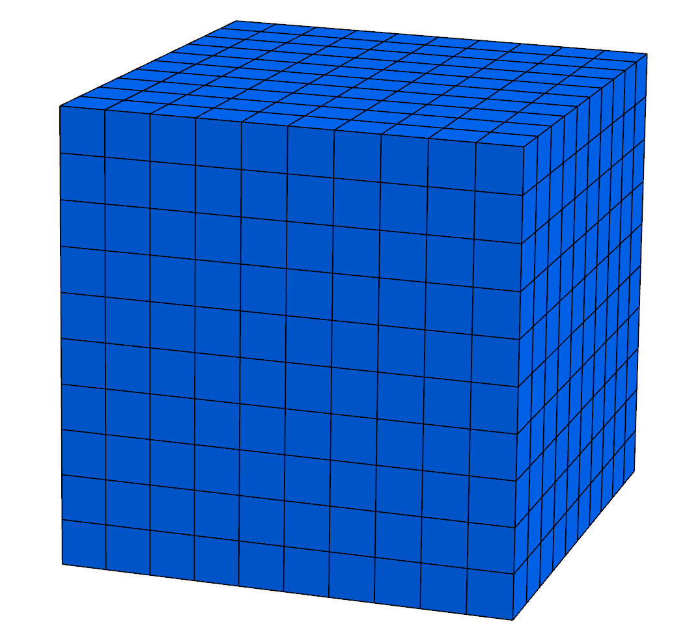

###############################
Data sets examples
###############################

===============
Introduction
===============

GEOSX comes with a suite of simple data sets to get you started.
We explore simple data sets with different geometrical objects.
All meshes will be imported from external files using PAMELA as the importer.

Cube made of hexahedral elements
=====================================

This example consists of a simple sugar-cube stack of size 10x10x10.

Problem description
------------------------------------

We propagate fluid from one vertical face of a cube to the opposite side.
The displacement is single phase, compressible, subject to gravity forces.
We use GEOSX to compute the pressure inside each grid block.

Looking at the XML file
------------------------------------

We are going to inspect blocks in the following XML file:
``src\CoreComponents\physicsSolvers\integratedTests\singlePhaseFlow\pamela_test\3D_10x10x10_compressible_pamela_hex_gravity.xml``

The file contains a number of XML blocks.
We will describe the most important of them.

Solver specification
^^^^^^^^^^^^^^^^^^^^^^^^^^^^^^

Here, we specify the type of solver (``singlePhaseTPFA``),
the ``gravityVector``,
the tolerances of the Newton and Krylov iterations,
and the maximum number of iterations.

.. code-block:: xml

  <Solvers
    gravityVector="0.0,0.0,-9.81">
    <SinglePhaseFlow name="SinglePhaseFlow"
                          verboseLevel="0"
                          gravityFlag="1"
                          fluidName="water"
                          solidName="rock"
                          discretization="singlePhaseTPFA"
                          targetRegions="Domain">
      <SystemSolverParameters name="SystemSolverParameters"
                              krylovTol="1.0e-10"
                              newtonTol="1.0e-6"
                              maxIterNewton="8"/>
    </SinglePhaseFlow>
  </Solvers>

Mesh specification
^^^^^^^^^^^^^^^^^^^^^^^^^^^^^^

Now, we specify the source of our mesh.
In this example, the mesh is imported using PAMELA from
an existing file called ``cube_10x10x10_hex.msh``.

.. code-block:: xml

  <Mesh>
      <PAMELAMeshGenerator name="CubeHex"
          file="cube_10x10x10_hex.msh"/>
  </Mesh>

The mesh looks like this:

Events specification
^^^^^^^^^^^^^^^^^^^^^^^^^^^^^^

In this code block, we control the time stepping mechanisms used by the different
elements of the solver.
Three controls are in place:
 - a solver time step of 1 second, even if the solver could converge with longer time-steps,
 - an output time step of 1 second: a new pressure field is written out every second,
 - a restart file with an infinite frequency (ie. no restart is requested)

.. code-block:: xml

  <Events maxTime="100">
    <!-- This event is applied every cycle, and overrides the
    solver time-step request -->
    <PeriodicEvent name="solverApplications"
                   forceDt="1"
                   target="/Solvers/SinglePhaseFlow" />

    <!-- This event is applied every 1.0s.  The targetExactTimestep
    flag allows this event to request a dt modification to match an
    integer multiple of the timeFrequency. -->
    <PeriodicEvent name="outputs"
                   timeFrequency="1"
                   targetExactTimestep="1"
                   target="/Outputs/siloWellPump" />

    <PeriodicEvent name="restarts"
                   timeFrequency="1e99"
                   targetExactTimestep="0"
                   target="/Outputs/sidreRestart"
                   endTime="-1"/>
  </Events>

Numerical methods
^^^^^^^^^^^^^^^^^^^^^^^^^^^^^^
We are going to use a two-point flux approximation scheme for our grid.

.. code-block:: xml

  <NumericalMethods>
    <FiniteVolume>
      <TwoPointFluxApproximation name="singlePhaseTPFA"
                                 fieldName="pressure"
                                 boundaryFieldName="facePressure"
                                 coefficientName="permeability"/>
    </FiniteVolume>

  </NumericalMethods>

Element Regions
^^^^^^^^^^^^^^^^^^^^^^^^^^^^^^

This block defines regions.
Here, the entire field is one region called ``Domain``,
and contains ``water`` and ``rock`` only.

.. code-block:: xml

  <ElementRegions>
    <ElementRegion name="Domain" cellBlocks="0_HEX" materialList="water rock"/>
  </ElementRegions>

Constitutive model
^^^^^^^^^^^^^^^^^^^^^^^^^^^^^^

The physical properties of the two elements that exist in our field
(water and rock) are specified here.

.. code-block:: xml

  <Constitutive>
    <CompressibleSinglePhaseFluid name="water"
                                  referencePressure="0.0"
                                  referenceDensity="1000"
                                  compressibility="1e-9"
                                  referenceViscosity="0.001"
                                  viscosibility="0.0"/>
    <PoreVolumeCompressibleSolid name="rock"
                                 referencePressure="0.0"
                                 compressibility="1e-9"/>
  </Constitutive>

Field Specifications
^^^^^^^^^^^^^^^^^^^^^^^^^^^^^^

We specify the following properties all throughout the model (homogeneous):
  - permeability in the x-direction: ``permx``, constant value of 2.0e-14 m\ :sup:`2` (20 mD), and is considered the 0\ :sup:`th` component of the ``permeability`` vector,
  - permeability in the y-direction: ``permy``, constant value of 2.0e-14 m\ :sup:`2` (20 mD),
  - permeability in the z-direction: ``permz``, constant value of 2.0e-14 m\ :sup:`2` (20 mD),
  - porosity: ``referencePorosity``, constant value of 0.05,

.. code-block:: xml

  <FieldSpecifications>
    <FieldSpecification name="permx"
               component="0"
               initialCondition="1"
               setNames="all"
               objectPath="ElementRegions/elementRegions/Domain/cellBlockSubRegions/0_HEX"
               fieldName="permeability"
               scale="2.0e-14"/>

    <FieldSpecification name="permy"
               component="1"
               initialCondition="1"
               setNames="all"
               objectPath="ElementRegions/elementRegions/Domain/cellBlockSubRegions/0_HEX"
               fieldName="permeability"
               scale="2.0e-14"/>

    <FieldSpecification name="permz"
               component="2"
               initialCondition="1"
               setNames="all"
               objectPath="ElementRegions/elementRegions/Domain/cellBlockSubRegions/0_HEX"
               fieldName="permeability"
               scale="2.0e-14"/>

    <FieldSpecification name="referencePorosity"
               initialCondition="1"
               setNames="all"
               objectPath="ElementRegions/elementRegions/Domain/cellBlockSubRegions/0_HEX"
               fieldName="referencePorosity"
               scale="0.05"/>

    <FieldSpecification name="initialPressure"
               initialCondition="1"
               setNames="all"
               objectPath="ElementRegions/elementRegions/Domain/cellBlockSubRegions/0_HEX"
               fieldName="pressure"
               scale="1e3"/>
    <FieldSpecification name="boundaryPressure"
               objectPath="faceManager"
               fieldName="facePressure"
               scale="1.1e3"
               setNames="left"/>
  </FieldSpecifications>

Running GEOSX
------------------------------------

The command to run GEOSX is

``path/to/geosx -i path/to/this/xml_file.xml``

The console should display initialization messages,
and then step into the simulation with the specified time-step increments.

All results are written in a format compatible with `VisIt
<https://wci.llnl.gov/simulation/computer-codes/visit/>`_.
