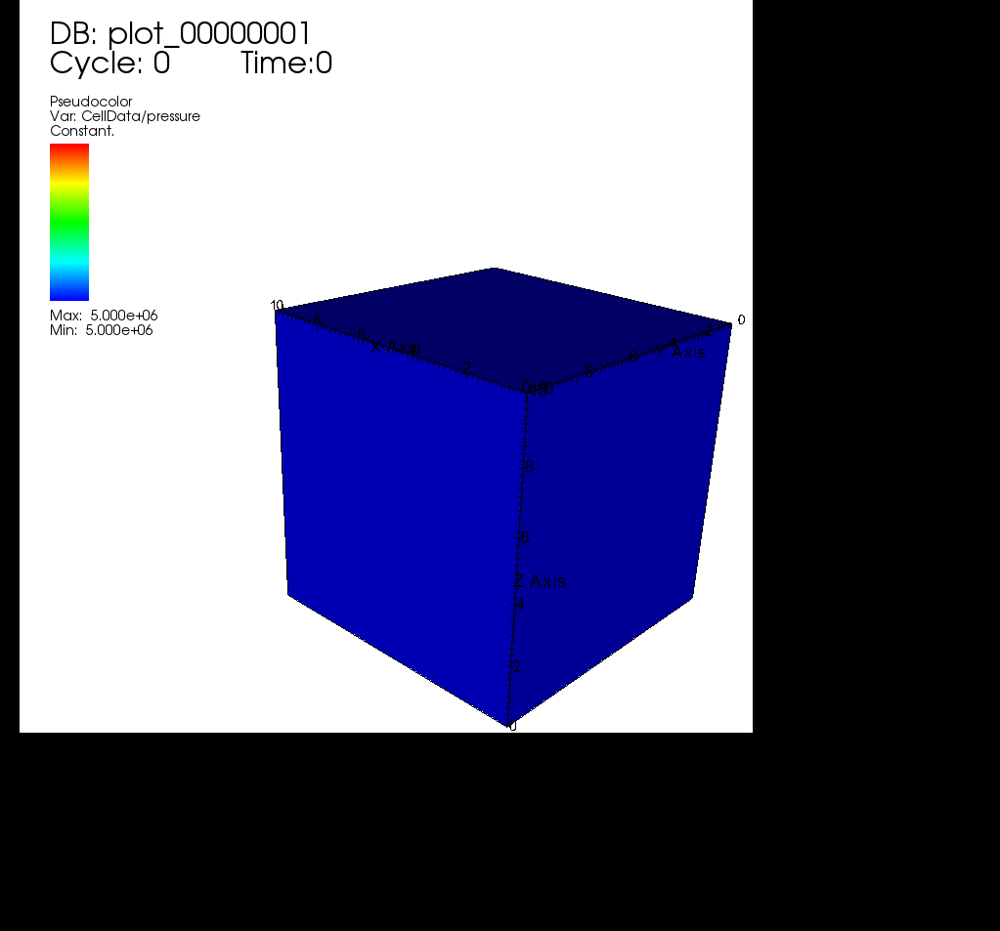

.. _1_SinglePhase:

###############################
Single Phase Flow example
###############################

This example will use the single flow solver (see :ref:`SinglePhaseFlow`) from GEOSX on a cube test case. A pressure source term will be set in the top corner block and a sink pressure term will be set in the bottom corner block.

Building the input XML file
^^^^^^^^^^^^^^^^^^^^^^^^^^^^
Building the input XML file, it will require the definition of the following XML tags:

 #. :ref:`Solver <Solver_tag>`
 #. :ref:`Mesh <Mesh_tag>`
 #. :ref:`Geometry <Geometry_tag>`
 #. :ref:`Events <Events_tag>`
 #. :ref:`NumericalMethods <NumericalMethods_tag>`
 #. :ref:`ElementRegions <ElementRegions_tag>`
 #. :ref:`Constitutive <Constitutive_tag>`
 #. :ref:`FieldSpecifications <FieldSpecifications_tag>`
 #. *Functions*
 #. *Partition*
 #. :ref:`Outputs <Outputs_tag>`

Let us open the XML file by putting the header,

.. code-block:: xml

   <?xml version="1.0" ?>
   <!--# # -->
   <Problem xmlns:xsi="http://www.w3.org/2001/XMLSchema-instance" xsi:noNamespaceSchemaLocation="geos_v0.0.xsd">

.. _Solver_tag:

Solvers tag
------------

Specifying the Solvers tag, the space discretization will be handle by a standard Two-Point Flux approximation. This is done using ``singlePhaseTPFA`` value for the discretization node.

.. code-block:: xml

     <Solvers
                gravityVector="0.0, 0.0, -9.81">
  
      <SinglePhaseFlow name="SinglePhaseFlow"
                       verboseLevel="1"
                       gravityFlag="1"
                       fluidName="water"
                       solidName="rock"
                       discretization="singlePhaseTPFA"
                       targetRegions="Domain">
      <SystemSolverParameters krylovTol="1.0e-10"
                              newtonTol="1.0e-6"
                              maxIterNewton="8"/>
      </SinglePhaseFlow>
     </Solvers>

.. _Mesh_tag:

Mesh tag 
-------------
GEOSX  allows you to either internally build your mesh or import it from a compatible format thanks to PAMELA (see :ref:`2_ImportingExternalMesh`). For this test case, let us go with the internally generated with a 10x10x10 uniform regular mesh

.. code-block:: xml

   <Mesh>
    <InternalMesh name="mesh"
                  elementTypes="C3D8" 
                  xCoords="0, 10"
                  yCoords="0, 10"
                  zCoords="0, 10"
                  nx="10"
                  ny="10"
                  nz="10"
                  cellBlockNames="cb"/>
  </Mesh>

.. _Geometry_tag:

Geometry tag
-----------------
On the Geometry side, we will define and name our boxes for source and sink pressure terms. 

.. code-block:: xml

   <Geometry>
    <Box name="all" xMin="-0.01, -0.01, -0.01" xMax="10.01,10.01,10.01"/>
    <Box name="source" xMin="-0.01, -0.01, -0.01" xMax="1.01, 1.01, 1.01"/>
    <Box name="sink"   xMin="8.99, 8.99, 8.99" xMax="10.01, 10.01, 10.01"/>
   </Geometry>

One could also define surfaces on which to specified a Dirichlet bud condition.

.. _Events_tag:

Events tag
---------------
The Event tag includes the final time of our simulation under ``maxTime`` node. Under *PeriodicEvent* embededd tags, we can set:

 #. which solver has to be called (among the child tag defined under the above mentinoned *Solver* tag) with its initial time step defined as the ``forceDt`` node value.
 #. under which ``timeFrequency`` will we need to output results (targeting the settings defined under some child tag of the below explained *Output* tag).

.. code-block:: xml

  <Events maxTime="1e3">

    <PeriodicEvent name="solverApplications"
                   forceDt="1e1"
                   target="/Solvers/SinglePaseFlow" />

    <PeriodicEvent name="outputs"
                   timeFrequency="2e1"
                   targetExactTimestep="1"
                   target="/Outputs/siloOutput" />
  </Events>

.. _NumericalMethods_tag:

NumericalMethods tag
------------------------

The two-point flux approximation, which was aforementioned under the *Solver>SinglePhaseFlow* child tag as the value of ``discretization`` node, is defined there. 

.. code-block:: xml

  <NumericalMethods>
    <FiniteVolume>
      <TwoPointFluxApproximation name="singlePhaseTPFA"
                                 fieldName="pressure"
                                 boundaryFieldName="facePressure"
                                 coefficientName="permeability"/>
    </FiniteVolume>

  </NumericalMethods>

Here the ``boundaryFieldName`` node specifies that for Dirichlet boundary conditions the face located value is considered. The ``coefficientName`` node refers to the field which has to be considered in the stencil computation. 

.. _ElementRegions_tag:

Element Regions tag
---------------------

This block defines regions.
Here, the entire field is one region called ``Domain``,
and contains ``water`` and ``rock`` only.

.. code-block:: xml

  <ElementRegions>
    <ElementRegion name="Domain" cellBlocks="cb" materialList="water rock"/>
  </ElementRegions>

.. _Constitutive_tag:

Constitutive tag
---------------------

The physical properties of ``water`` and ``rock`` elements can be found and set under this tag.

.. code-block:: xml

  <Constitutive>
   <CompressibleSinglePhaseFluid name="water"
                                 referencePressure="0.0"
                                 referenceDensity="1000"
                                 compressibility="1e-9"
                                 referenceViscosity="0.001"
                                 viscosibility="0.0"/>
    <PoreVolumeCompressibleSolid name="rock"
                                 referencePressure="0.0"
                                 compressibility="1e-9"/>
  </Constitutive>

.. _FieldSpecifications_tag:

FieldSpecifications tag
---------------------------
Here, fields such as porosity, permeability, source and sink terms or initial field values are specified. Our test case exhibits an anisotropic homogeneous permeability which components are so that:
  - permeability in the x-direction: ``permx``, constant value of 1.0e-12 m\ :sup:`2` (100 mD), and is considered the 0\ :sup:`th` component of the ``permeability`` vector,
  - permeability in the y-direction: ``permy``, constant value of 1.0e-12 m\ :sup:`2` (100 mD),
  - a lower permeability in the z-direction: ``permz``, constant value of 1.0e-15 m\ :sup:`2` (10 mD)

The ``setNames`` node value specifies the geometric zone where the value should be applied.

.. code-block:: xml

  <FieldSpecifications>
    <FieldSpecification name="permx"
			component="0"
			initialCondition="1"
			setNames="all"
			objectPath="ElementRegions/Domain/cb"
			fieldName="permeability"
			scale="1e-12"/>
    <FieldSpecification name="permy"
			component="1"
			initialCondition="1"
			setNames="all"
			objectPath="ElementRegions/Domain/cb"
			fieldName="permeability"
			scale="1e-12"/>
    <FieldSpecification name="permz"
			component="2"
			initialCondition="1"
			setNames="all"
			objectPath="ElementRegions/Domain/cb"
			fieldName="permeability"
			scale="1e-15"/>

which is followed by all the other field initializations. Please note the change in ``component`` node value as we are dealing with a permeability diagonal tensor.

The other field to be specified are initial pressure, source and sink term pressure,

.. code-block:: xml

   <FieldSpecification name="initialPressure"
                       initialCondition="1"
                       setNames="all"
                       objectPath="ElementRegions/Domain/cb"
                       fieldName="pressure"
                       scale="5e6"/>

   <FieldSpecification name="sourceTermPressure"
                       objectPath="ElementRegions/Domain/cb"
                       fieldName="pressure"
                       scale="1e7"
                       setNames="source"/>

    <FieldSpecification name="sinkTerm"
                        objectPath="ElementRegions/Domain/cb"
                        fieldName="pressure"
                        scale="2e5"
                        setNames="sink"/>

And finally, we specify a constant homogeneous porosity for the whole domain as,

.. code-block:: xml

   <FieldSpecification name="referencePorosity"
			initialCondition="1"
			setNames="all"
			objectPath="ElementRegions/Domain/cb"
			scale="0.1"
			fieldName="referencePorosity"/>

   </FieldSpecifications>

Here we leave ``Functions`` and ``Partition`` tags unspecified as the description of their use are detailed in (TODO ref)

.. code-block:: xml

  <Functions>
  </Functions>

  <Partitions>
  </Partitions>

.. _Outputs_tag:

Outputs tag
----------------
In order to get the results from simulation stored, we specify path to the output directory:

.. code-block:: xml

   <Outputs>
    <Silo name="siloOutput" />
   </Outputs>

An this conclude our XML setting file build. Let us close it and run it now

.. code-block:: xml

   </Problem>

Runnning GEOSX
^^^^^^^^^^^^^^^^
The command to run GEOSX is

``path/to/geosx -i path/to/this/xml_file.xml``

Note that all paths for files included in the XML file are relative to this XML file. While running GEOSX, it will log status info in the console output.

For internal mesh generation,

  .. code-block:: sh

                  GEOS must be configured to use Python to use parameters, symbolic math, etc. in input files
                  Adding Solver of type SinglePhaseFlow, named SinglePhaseFlow
                  Adding Mesh: InternalMesh, mesh
                  Adding Geometric Object: Box, all
                  Adding Geometric Object: Box, source
                  Adding Geometric Object: Box, sink
                  Adding Event: PeriodicEvent, solverApplications
                  Adding Event: PeriodicEvent, outputs
                  Adding Output: Silo, siloOutput
                  Adding Object ElementRegion named Domain

The time iteration are then logged until the end of the simulation

  .. code-block:: sh

                  Running simulation
                  Time: 0s, dt:0s, Cycle: 0
                  Time: 0s, dt:10s, Cycle: 1
                  Attempt: 0, Newton: 0, R = 1407.81
                  Attempt: 0, Newton: 1, R = 0.400114
                  Attempt: 0, Newton: 2, R = 0.00085387
                  Attempt: 0, Newton: 3, R = 6.23344e-07
                  ...
                  Time: 990s, dt:10s, Cycle: 100
                  Attempt: 0, Newton: 0, R = 0.33595
                  Attempt: 0, Newton: 1, R = 2.07127e-05
                  Attempt: 0, Newton: 2, R = 2.82288e-09
                  Cleaning up events

                  init time = 0.63475s, run time = 2.9198s

Visualization of results
^^^^^^^^^^^^^^^^^^^^^^^^^

All results are written in a format compatible with `VisIt
<https://wci.llnl.gov/simulation/computer-codes/visit/>`_.

For instance, here are reported diagonal pressure profile from sink to source blocks with the time being increased (on the left) and the 3D plot of the transient pressure gradient to the linear solution (on the right)

.. image:: ../img/1_plot_single_phase.png
   :width: 400px

