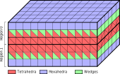

*****************************
Working with an external mesh
*****************************

Supported formats
=================

GEOSX provides features to run simulations on unstructured meshes.
It uses PAMELA_ to read the external meshes and its API to write
it into the GEOSX mesh data structure.

The supported mesh format are:

- The GMSH_ file format (.msh v2).
- The MEDIT_ file format (.mesh)
- The ECLIPSE file formats (.egrid, .grdecl)

Requirements
============

Supported cell types
--------------------

The supported mesh elements are, for volume elements:

- 4 nodes tetrahedra
- 5 nodes pyramids
- 6 nodes wedges
- 8 nodes hexahedra

Mesh organization
-----------------

The mesh can be divided in several regions.
These regions are intended
to support different physics or to define different constitutive properties.

- For the GMSH file format, the regions are defined using the `elementary geometrical tags`_
  provided by GMSH
- For the MEDIT file format, the regions are defined using the tag of the element
- For the ECLIPSE file formats, the regions have to be first defined using the ECLIPSE software

Input an external mesh into GEOSX
=================================

Several blocks are involved to import an external mesh into GEOSX, defined in the XML input file.
For more information on the organization of the XML input files, please see the related documentation page.

The Mesh block
--------------

The mesh block has the following syntax.

.. code-block:: xml

  <Mesh>
    <PAMELAMeshGenerator name="MyMeshName"
                         file="/path/to/the/mesh/file.msh"/>
  </Mesh>

We strongly recommand to use absolute path to the mesh file.

Defining *ElementRegions*
------------------------

GEOSX uses *ElementRegions* to support different physics, or to define different constitutive properties.
An *ElementRegion* is defined as a set of *CellBlocks*.
A *CellBlock* is an ensemble of elements with the same element geometry.

In the example presented above, the mesh is is composed of two regions (*Region 0* and *Region 1*).
Each region contains 3 *CellBlocks*.

The *ElementRegions* are defined as below :

.. code-block:: xml

  <ElementRegions>
    <ElementRegion name="Top" cellBlocks="0_HEX 0_WEDGE 0_TETRA" materialList="water rock"/>
    <ElementRegion name="Bot" cellBlocks="1_HEX 1_WEDGE 1_TETRA" materialList="water rock"/>
  </ElementRegions>

You have to use the following syntax to declare your *CellBlocks* :

.. code-block:: txt

  indexOfTheRegionWithinTheMesh_typeOfTheElement

The keywords for the element types are :

- TETRA
- WEDGE
- PYR
- HEX

To specify a field to a *CellBlock*, you have to specify the path to it as described in.

.. _PAMELA: https://github.com/GEOSX/PAMELA
.. _GMSH: http://gmsh.info
.. _MEDIT: https://people.sc.fsu.edu/~jburkardt/data/medit/medit.html
.. _`elementary geometrical tags`: http://gmsh.info/doc/texinfo/gmsh.html#MSH-file-format-version-2
