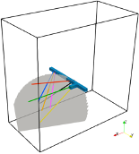
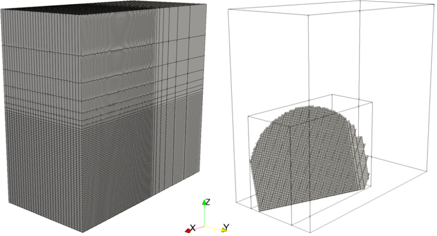

.. _egsCollabExperiment3:

#################################################################################
 Simulation of Chilled-water Injection at EGS Collab Testbed 2 
#################################################################################

**Context**

Here we model the chilled-water injection that occurred at EGS Collab Testbed 2 as part of experiment 3.

The simulations are performed with GEOS thermal single-phase flow solver. The mass and energy conservation equations
are discretized using a finite-volume methods with using a two-point flux approximation and an upwinding scheme for 
all fluid properties.

**Input file**

The xml input files for the test case are located at:

.. code-block:: console

  inputFiles/thermalSinglePhaseFlowFractures/egsCollab_thermalFlow/egsCollab_thermalFlow_base.xml
  inputFiles/thermalSinglePhaseFlowFractures/egsCollab_thermalFlow/egsCollab_thermalFlow_injection_200yInit_base.xml
  inputFiles/thermalSinglePhaseFlowFractures/egsCollab_thermalFlow/egsCollab_thermalFlow_injection_coarse.xml

------------------------------------------------------------------
Description of the case
------------------------------------------------------------------

We consider a 148.375 m x 75 m x 143.375 m domain and we employ a system of coordinates with origin in {0,0,0}. 
The drift and battery alcove are represented by the two rectangular prismatic regions highlighted in blue in the figure.

.. _problemSketchEGSCollab:

   Sketch of the problem 

A single embedded planar fracture is considered (i.e., shaded surface in Fig. 1). The fracture unit normal vector is n={0.3569123763,0.9123044601,0.2007837838} 
and its center is in {100, 37.5, 30}. The fracture location and orientation are consistent with the microseismic data collected during flow testing.

------------------------------------------------------------------
Mesh and embedded fracture geometry
------------------------------------------------------------------

.. _meshEGSCollab:

------------------------------------------------------------------
Flow solver
------------------------------------------------------------------

------------------------------------------------------------------
Constitutive laws
------------------------------------------------------------------

------------------------------------------------------------------
Initial and boundary conditions
------------------------------------------------------------------

------------------------------------------------------------------
Results
------------------------------------------------------------------

.. _initialTempEGSCollab:
.. figure:: intialTemperature.png
   :align: center
   :width: 500
   :figclass: align-center

.. _finalTempEGSCollab:
.. figure:: 35days_temperature.png
   :align: center
   :width: 500
   :figclass: align-center   

**Feedback on this example**

For any feedback on this example, please submit a `GitHub issue on the project's GitHub page <https://github.com/GEOS-DEV/GEOS/issues>`_.