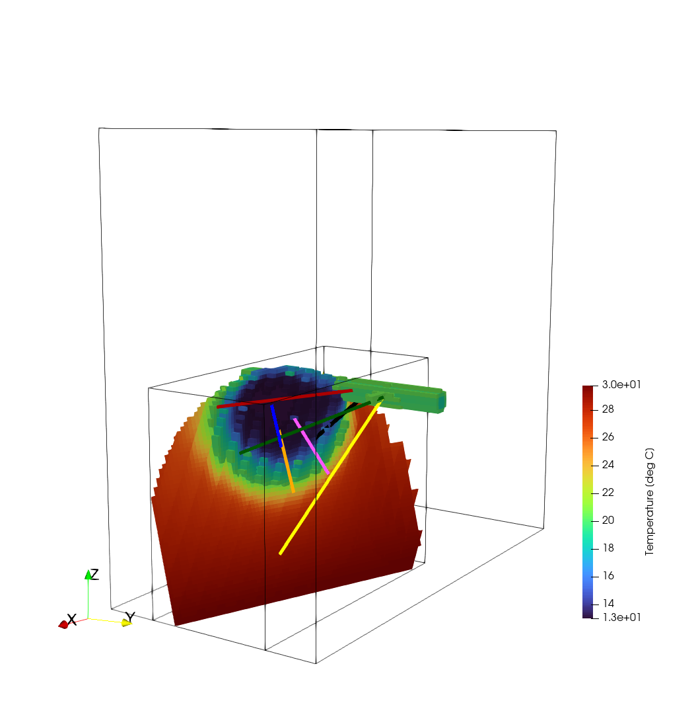

.. _egsCollabExperiment3:

#################################################################################
 Simulation of Chilled-water Injection at EGS Collab Testbed 2 
#################################################################################

**Context**

Here we model the chilled-water injection that occurred at EGS Collab <https://www.energy.gov/eere/geothermal/egs-collab>_ Testbed 2.

The simulations are performed with GEOS thermal single-phase flow solver. The mass and energy conservation equations
are discretized using a finite-volume methods with using a two-point flux approximation and an upwinding scheme for 
all fluid properties.

**Input file**

The xml input files for the test case are located at:

.. code-block:: console

  inputFiles/thermalSinglePhaseFlowFractures/egsCollab_thermalFlow/egsCollab_thermalFlow_base.xml
  inputFiles/thermalSinglePhaseFlowFractures/egsCollab_thermalFlow/egsCollab_thermalFlow_injection_200yInit_base.xml
  inputFiles/thermalSinglePhaseFlowFractures/egsCollab_thermalFlow/egsCollab_thermalFlow_injection_coarse.xml

------------------------------------------------------------------
Description of the case
------------------------------------------------------------------

We consider a 148.375 m x 75 m x 143.375 m domain and we employ a system of coordinates with origin in {0,0,0}. 
The drift and battery alcove are represented by the two rectangular prismatic regions highlighted in blue in the figure.

.. _problemSketchEGSCollab:

   Sketch of the problem 

A single embedded planar fracture is considered (i.e., shaded surface in Fig. 1). The fracture unit normal vector is n={0.3569123763,0.9123044601,0.2007837838} 
and its center is in {100, 37.5, 30}. The fracture location and orientation are consistent with the microseismic data collected during flow testing. Finally, injection well TU, 
production wells TC and TN and monitoring wells AMU, AML, DMU, DML are also considered as shown in the Figure.

------------------------------------------------------------------
Mesh and embedded fracture geometry
------------------------------------------------------------------

The domain is discretized, in space, using a 68 x 30 x 65  structured mesh, for a total of 132600 elements in the rock matrix. 
The fracture is generated internally using the `EmbeddedSurfaceGenerator`. The resulting meshes for both the rock matrix and 
the fracture are shown in the figure below.

.. _meshEGSCollab:
.. figure:: egsCollabMesh.png
   :align: center
   :width: 500
   :figclass: align-center

------------------------------------------------------------------
Boundary conditions
------------------------------------------------------------------

Pressure and temperature Dirichlet boundary conditions are considered at the top boundary (z = 143.375 m), i.e., p_top=2 MPa and T_top=23.0153 °C.  
The temperature gradient is –0.0488 °C/m whereas hydrostatic pore pressure distribution is assumed. The drift and the alcove are assumed to have constant pressure and temperature. 
Thus, Dirichlet boundary conditions are considered for both, i.e., T_drift=18.5 °C and T_alcove=20.637 °C. 

------------------------------------------------------------------
Flow solver
------------------------------------------------------------------

------------------------------------------------------------------
Constitutive laws
------------------------------------------------------------------

------------------------------------------------------------------
Initial conditions
------------------------------------------------------------------

To compute the initial distribution of pressure and temperature prior to 
the chilled-water injection, we run a simulation for 200 years considering 
the Dirichlet boundary conditions described in the previous paragraph. The computed 
initial temperature field is illustrated in the Figure below.

.. _initialTempEGSCollab:

------------------------------------------------------------------
Chilled-water injection
------------------------------------------------------------------

.. _finalTempEGSCollab:

**Feedback on this example**

For any feedback on this example, please submit a `GitHub issue on the project's GitHub page <https://github.com/GEOS-DEV/GEOS/issues>`_.