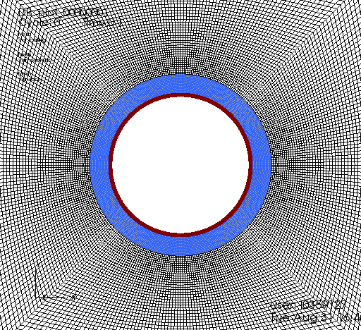

.. _AdvancedExampleCasedElasticWellbore:

####################################################
Cased elastic wellbore problem
####################################################

------------------------------------------------------------------
Problem description
------------------------------------------------------------------

This example uses the solid mechanic solver for solving a cased wellbore problem subjected to a pressure test. The problem geometry is composed a steel casing, a cement sheath and rock formation. Isotropic linear elastic behavior is assumed for all the three materials. The casing-cement and cement-rock contact interfaces are supposed to be perfect.

Analytical results of radial and hoop stresses, :math:`\sigma_{rr}` and :math:`\sigma_{\theta\theta}`, in casing, cement sheath and rock can be expressed as:

.. math::
   \sigma_{rr} = ( 2.0 * \lambda + 2.0 * G ) * A - \frac{2.0 * G * B}{r^2}
   \sigma_{\theta\theta} = ( 2.0 * \lambda + 2.0 * G ) * A + \frac{2.0 * G * B}{r^2}

where :math:`\lambda` and :math:`G` are the Lamé moduli, :math:`r` is the radial coordinate
- :math:`A` and :math:`B` are piecewise constants that can be obtained by solving the boundary and interface conditions as detailed in the benchmark script.

**Input file**

This tutorial uses no external input files and everything required is
contained within a single GEOSX input file.
The xml input file for this test case is located at:

.. code-block:: console

  src/coreComponents/physicsSolvers/solidMechanics/benchmarks/CasedElasticWellbore.xml

------------------------------------------------------------------
Preparing the input file
------------------------------------------------------------------

All inputs for this case are contained inside a single XML file.
In this example, we would focus our attention on the ``Solvers``, ``Mesh`` and ``Constitutive`` tags.

Solvers: setup the quasi-static elastic solver
-----------------------------------------------------------

Only the solid mechanic ``SolidMechanicsLagrangianSSLE`` solver is required for solving this linear elastic problem. Note that the ``name`` attribute of these solvers is
chosen by the user and is not imposed by GEOSX. In this solver, the three regions and three materials associated to casing, cement sheath and rock are defined by ``targetRegions`` and ``solidMaterialNames``.  

.. literalinclude:: src/coreComponents/physicsSolvers/solidMechanics/benchmarks/CasedElasticWellbore.xml
  :language: xml
  :start-after: <!-- SPHINX_SolidMechanicsSolver -->
  :end-before: <!-- SPHINX_SolidMechanicsSolverEnd -->

Mesh: define a cased wellbore
--------------------------------------------------------------------

The internal wellbore mesh generator ``InternalWellbore`` is employed to define a cased wellbore. The radii of the casing cylinder, the cement sheath cylinder and the far-field boundary of the surrounding rock formation are defined by a vector ``radius``. In the tangent direction, we define a ``theta`` angle from 0 to 360 degree for full geometry. Note that half and quarter of the geometry can be defined by a ``theta`` angle from 0 to 180 or 90 degree, respectively. The trajectory of the well is defined by ``trajectory``. In this example, we consider a vertical wellbore with a single element in the vertical direction. The ``autoSpaceRadialElems`` parameters allows optimizing the element size from local zone around the wellbore to the far-field zone. In this examle we active the auto spacing option only for the rock formation. The ``useCartesianOuterBoundary`` is to transform the far-field boundary to a squared shape that eases the imposition of the boundary conditions. The ``cellBlockNames`` and ``elementTypes`` defines the regions and related element types associated to casing, cement sheath and rock. 
 
.. literalinclude:: src/coreComponents/physicsSolvers/solidMechanics/benchmarks/CasedElasticWellbore.xml
  :language: xml
  :start-after: <!-- SPHINX_WellboreMesh -->
  :end-before: <!-- SPHINX_WellboreMeshEnd -->

   Mesh for simulating a cased wellbore

Constitutives: define steel, cement and rock properties
--------------------------------------------------------------------

Isotropic linear elastic constitutive behavior is considered for all the three materials. Note that the default density is useless for this case.

.. literalinclude:: src/coreComponents/physicsSolvers/solidMechanics/benchmarks/CasedElasticWellbore.xml
  :language: xml
  :start-after: <!-- SPHINX_Material -->
  :end-before: <!-- SPHINX_MaterialEnd -->

FieldSpecifications: define boundary conditions
--------------------------------------------------------------------

Far-field boundary are fixed in displacement. The normal traction on the inner face of the casing is defined by ``Traction`` field specification. The nodeset generated by the internal wellbore generator for the inner face is ``rneg``. The traction type for defining a casing test pressure that is normal to the casing inner face is ``normal``. The negative sign of the scale value is because of the negative sign convention for compressional stress.

.. literalinclude:: src/coreComponents/physicsSolvers/solidMechanics/benchmarks/CasedElasticWellbore.xml
  :language: xml
  :start-after: <!-- SPHINX_BoundaryConditions -->
  :end-before: <!-- SPHINX_BoundaryConditionsEnd -->

Results & Benchmark
---------------------------------

A good agreement between the GEOSX results and analytical results is shown in the figure below

.. figure:: validation.png
   :align: center
   :width: 1000
   :figclass: align-center

   Comparing GEOSX results with analytical solution

.. plot::

	import numpy as np
	import matplotlib.pyplot as plt

	def main():
		# Input geometric parameters
		r_casing_in  = 0.1 # meter
		r_casing_out = 0.106
		r_hole       = 0.133

		# Material properties
		G_casing = 80.8e9 # Pa
		K_casing = 175e9
		lambda_casing = K_casing - 2.0/3.0 * G_casing

		G_cement = 6.45e9
		K_cement = 10.3e9
		lambda_cement = K_cement - 2.0/3.0 * G_cement

		G_rock = 4.16667e9
		K_rock = 5.5556e9

		# Loading
		# Pressure applied on the inner face of the casing
		P0 = -10.0 # MPa

		# Analytical results
		# Rigidity of the casing-cement-rock system
		rigidity = np.array([ [r_casing_out, 1.0/r_casing_out, -r_casing_out, -1.0/r_casing_out, 0.0],
				              [2.0*(lambda_casing+G_casing), -2.0*G_casing/r_casing_out/r_casing_out, -2.0*(lambda_cement+G_cement), 2.0*G_cement/r_casing_out/r_casing_out, 0.0],
				              [0.0, 0.0, r_hole, 1.0/r_hole, -1.0/r_hole],
				              [0.0, 0.0, 2.0*(lambda_cement+G_cement), -2.0*G_cement/r_hole/r_hole, 2.0*G_rock/r_hole/r_hole],
				              [2.0*(lambda_casing+G_casing), -2.0*G_casing/r_casing_in/r_casing_in, 0.0, 0.0, 0.0] ])

		# Vector of force
		force = np.array([ 0.0, 0.0, 0.0, 0.0, P0 ])

		# Compute the coefficients describing the closed-form solutions of stress/strain
		vectorCoefficientAB = np.dot( np.linalg.inv( rigidity ), force )
		coeffA_cement = vectorCoefficientAB[2]
		coeffB_cement = vectorCoefficientAB[3]

		# Radial coordinate
		r_anal = np.arange( r_casing_out, r_hole, 0.01 * ( r_hole - r_casing_out ) )

		# Radial and hoop (tangent) stresses
		tmpVal1 = ( 2.0 * lambda_cement + 2.0 * G_cement ) * coeffA_cement
		tmpVal2 = 2.0 * G_cement * coeffB_cement / r_anal / r_anal

		sig_rr_anal = tmpVal1 - tmpVal2
		sig_tt_anal = tmpVal1 + tmpVal2

		# GEOSX results
		# Stresses are extracted along x-axis 
		# where radial stress coincides with stress_11 
		# and hoop stress coincides with stress_22

		# Radial stress, coordinates
		r_geosx, sig_rr_geosx = [], []

		for line in open('stress_11.curve', 'r' ):
			if not ( line.strip().startswith( "#" ) or line.strip()=='' ):
				values = [ float(s) for s in line.split() ]
				rVal = values[0]
				sigVal = values[1]*1e-6 # convert to MPa

				r_geosx.append( rVal )
				sig_rr_geosx.append( sigVal )

		# Tangent stress
		sig_tt_geosx = []
		for line in open( 'stress_22.curve', 'r' ):
			if not ( line.strip().startswith( "#" ) or line.strip()=='' ):
				values = [ float(s) for s in line.split() ]
				sigVal = values[1]*1e-6 # convert to MPa

				sig_tt_geosx.append( sigVal )

		# Plots
		fig = plt.figure( figsize=[ 13, 5 ] )

		plt.subplot( 121 )
		plt.plot( r_geosx, sig_rr_geosx, 'ko', label='GEOSX result' )
		plt.plot( r_anal, sig_rr_anal,  'k', linewidth=2, label='Analytic' )
		plt.xlim( r_casing_out, r_hole )
		plt.xlabel( "r (m)" )
		plt.ylabel( "Radial stress (MPa)" )

		plt.subplot( 122 )
		plt.plot( r_geosx, sig_tt_geosx, 'ko', label='GEOSX result' )
		plt.plot( r_anal, sig_tt_anal,  'k', linewidth=2, label='Analytic' )
		plt.xlim( r_casing_out, r_hole )
		plt.xlabel( "r (m)" )
		plt.ylabel( "Hoop stress (MPa)" )

		plt.legend()
		plt.show()

	if __name__ == "__main__":
		main()

------------------------------------------------------------------
To go further
------------------------------------------------------------------

**Feedback on this example**

This concludes the cased wellbore example.
For any feedback on this example, please submit a `GitHub issue on the project's GitHub page <https://github.com/GEOSX/GEOSX/issues>`_.
