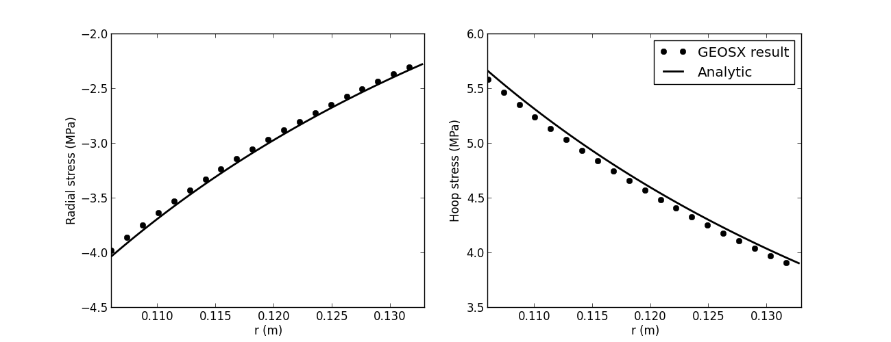

.. _TutorialCasedElasticWellbore:

####################################################
Cased elastic wellbore problem
####################################################

------------------------------------------------------------------
Problem description
------------------------------------------------------------------

This example uses the solid mechanic solver (:ref:`SolidMechanicsLagrangianSSLE`) for solving a cased wellbore problem subjected to a pressure test. The problem geometry is composed a steel casing, a cement sheath and rock formation. Isotropic linear elastic behavior is assumed for all the three materials. The casing-cement and cement-rock contact interfaces are supposed to be perfect.

**Objectives**

This tutorial shows you how to:

  - Construct meshes for cased wellbore problems using the internal mesh generator,
  - Define a multi-region and multi-material problem,
  - Define a traction on a curved boundary,
  - Extracting radial and hoop stresses around a wellbore,
  - Benchmarking the numerical results using analytical solutions.

**Input file**

The xml input file is located at:

.. code-block:: console

  src/coreComponents/physicsSolvers/solidMechanics/benchmarks/CasedElasticWellbore.xml

**Benchmark script**

The benchmark script is located at:

.. code-block:: console

  scripts/postProcessing/wellboreAnalyticalResultsForBenchmarking/CasedElasticWellbore.py

------------------------------------------------------------------
Preparing the input file
------------------------------------------------------------------

Solver
--------------------------------------------------------------------

.. literalinclude:: src/coreComponents/physicsSolvers/solidMechanics/benchmarks/CasedElasticWellbore.xml
  :language: xml
  :start-after: <!-- SPHINX_SolidMechanicsSolver -->
  :end-before: <!-- SPHINX_SolidMechanicsSolverEnd -->

Mesh
--------------------------------------------------------------------

.. literalinclude:: src/coreComponents/physicsSolvers/solidMechanics/benchmarks/CasedElasticWellbore.xml
  :language: xml
  :start-after: <!-- SPHINX_WellboreMesh -->
  :end-before: <!-- SPHINX_WellboreMeshEnd -->

.. image:: mesh.png

Materials
--------------------------------------------------------------------

.. literalinclude:: src/coreComponents/physicsSolvers/solidMechanics/benchmarks/CasedElasticWellbore.xml
  :language: xml
  :start-after: <!-- SPHINX_Material -->
  :end-before: <!-- SPHINX_MaterialEnd -->

Boundary conditions
--------------------------------------------------------------------

.. literalinclude:: src/coreComponents/physicsSolvers/solidMechanics/benchmarks/CasedElasticWellbore.xml
  :language: xml
  :start-after: <!-- SPHINX_BoundaryConditions -->
  :end-before: <!-- SPHINX_BoundaryConditionsEnd -->

Results & Benchmark
---------------------------------

