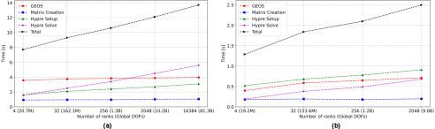

.. _PerformanceBenchmarks:

########################
Performance Benchmarks
########################

====================================
Wellbore problem scaling on Frontier
====================================
.. _wellboreProblemScaling:
The simple wellbore problem described here was used to test the weak scaling of GEOS on the `Frontier supercomputer <https://www.olcf.ornl.gov/frontier/>`_ at Oak Ridge National Laboratory.
The hardware details of the Frontier system are described in the `Frontier User Guide <https://docs.olcf.ornl.gov/systems/frontier_user_guide.html>`_.

The wellbore problem consists of a single wellbore with an internal radius of 0.057m, a casing thickness of 0.006m, with varying length and number elements depending level in the scaling study.
There are 6 levels of scaling summarized in the table below.
The number of ranks used for each level is dependent on the physics solver applied, as the number of degrees of freedom in the problem changes.

+-------+------+------+-------+----------------+
| Level |  nr  |  nt  |  nz   |      nelem     |
+=======+======+======+=======+================+
| 1     |   33 |   64 |  391  |        825,792 |
+-------+------+------+-------+----------------+
| 2     |   33 |   64 |  3125 |      6,600,000 |
+-------+------+------+-------+----------------+
| 3     |   66 |  128 |  6250 |     52,800,000 |
+-------+------+------+-------+----------------+
| 4     |  132 |  256 | 12500 |    422,400,000 |
+-------+------+------+-------+----------------+
| 5     |  264 |  512 | 25000 |  3,379,200,000 |
+-------+------+------+-------+----------------+
| 6     |  528 | 1024 | 50000 | 27,033,600,000 |
+-------+------+------+-------+----------------+

An image of the wellbore geometry is give below:

.. .. figure:: /coreComponents/physics/docs/Wellbore.png
..    :align: center
..    :width: 500
..    :figclass: align-center

The scaling results for mechanics, and separately compositional flow applied to the wellbore problem are shown below.

