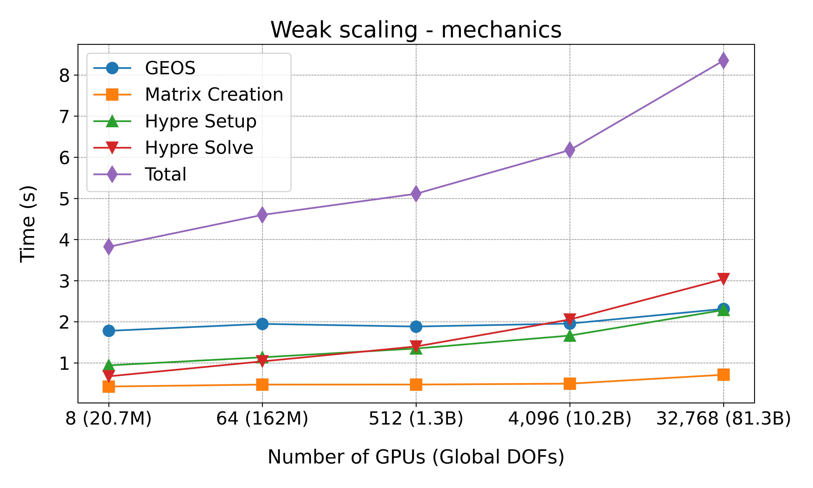
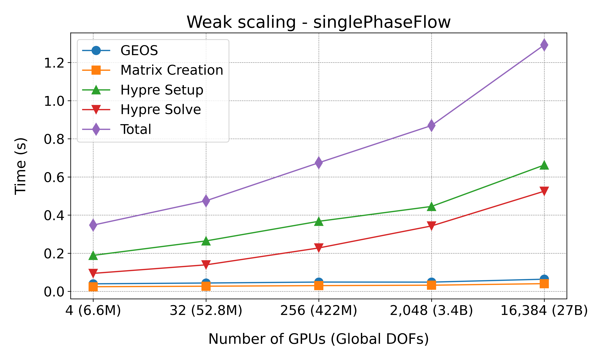
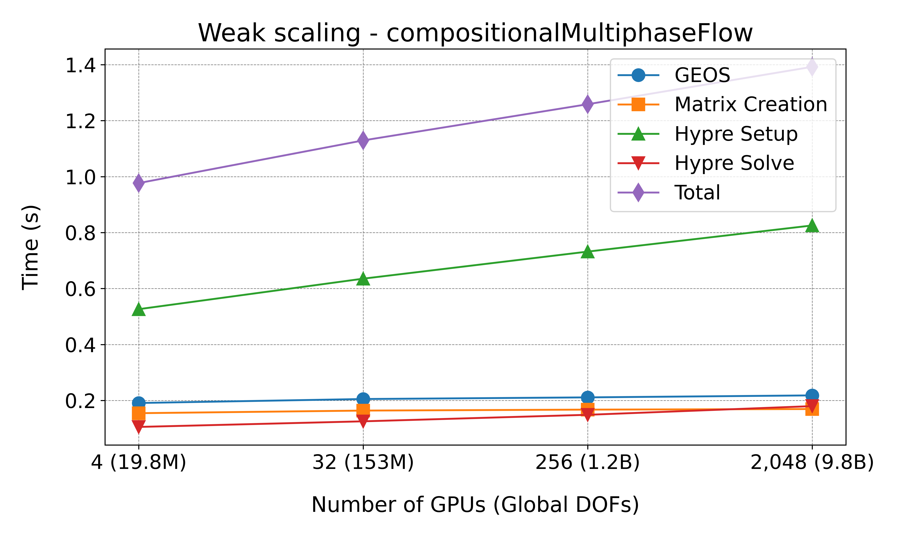

.. _PerformanceBenchmarks:

########################
Performance Benchmarks
########################

====================================
Wellbore problem scaling on Frontier
====================================
.. _wellboreProblemScaling:

The wellbore problem described here was used to test the weak scaling of GEOS on the
`Frontier supercomputer <https://www.olcf.ornl.gov/frontier/>` at Oak Ridge National
Laboratory. The hardware details of the Frontier system are described in the `Frontier
User Guide <https://docs.olcf.ornl.gov/systems/frontier_user_guide.html>`_.

The wellbore problem consists of a single wellbore with an internal radius of 0.057m, a
casing thickness of 0.006m, with varying length and number elements depending level in the
scaling study. There are 6 levels of scaling summarized in the table below. The number of
ranks used for each level is dependent on the physics solver applied, as the number of
degrees of freedom in the problem changes.

+-------+------+------+-------+----------------+
| Level |  nr  |  nt  |  nz   |      nelem     |
+=======+======+======+=======+================+
| 1     |   33 |   64 |  391  |        825,792 |
+-------+------+------+-------+----------------+
| 2     |   33 |   64 |  3125 |      6,600,000 |
+-------+------+------+-------+----------------+
| 3     |   66 |  128 |  6250 |     52,800,000 |
+-------+------+------+-------+----------------+
| 4     |  132 |  256 | 12500 |    422,400,000 |
+-------+------+------+-------+----------------+
| 5     |  264 |  512 | 25000 |  3,379,200,000 |
+-------+------+------+-------+----------------+
| 6     |  528 | 1024 | 50000 | 27,033,600,000 |
+-------+------+------+-------+----------------+

An image of the wellbore geometry is give below:

.. .. figure:: /coreComponents/physics/docs/Wellbore.png
..    :align: center
..    :width: 500
..    :figclass: align-center

The scaling results for the wellbore problem applied to different physics models on the
Frontier supercomputer are shown below:

Mechanics
---------

   Weak scaling results for the mechanics model on Frontier.

Single Phase Flow
-----------------

   Weak scaling results for the single phase flow model on Frontier.

Compositional Multiphase Flow
-----------------------------

   Weak scaling results for the compositional multiphase flow model on Frontier.

.. _wellboreRunning:

Running the Performance Study
-----------------------------

To execute a performance study across different GPU configurations and problem levels for
the wellbore problem on the Frontier supercomputer, follow these steps:

Prerequisites
~~~~~~~~~~~~~
Ensure you have access to the Frontier system and that you have access to a valid job
allocation account. For detailed instructions on system access and environment setup,
refer to the `Frontier User Guide
<https://docs.olcf.ornl.gov/systems/frontier_user_guide.html>`_.

Directory Structure
~~~~~~~~~~~~~~~~~~~
The input files for different problem levels and configurations are organized under
``${GEOS_DIR}/inputFiles/wellboreECP/``. Each physical problem (e.g.,
``mechanics``, ``compositionalMultiphaseFlow``, ``singlePhaseFlow``) has its own directory
containing multiple levels of problem refinement as described in the table above.

Dispatching Jobs
~~~~~~~~~~~~~~~~
Use the ``dispatch.py`` script to automate the setup and submission of jobs for different
levels of problem refinement and physics models.

**Usage:**

.. code-block:: bash

    python3 dispatch.py --acount [account_id] --binary [path_to_binary] --model [model_type] --levels
    [specific_levels_to_run] --caliper [def]

- **--account**: Account name for running jobs on compute nodes.
- **--binary**: Path to the geos executable.
- **--model**: Physics model type, such as ``mechanics``, ``singlePhaseFlow`` or ``compositionalMultiphaseFlow``.
- **--levels**: (optional) Specific levels to run, e.g., ``1 3 5``. If omitted, all levels
  are run.
- **--caliper**: (optional) Turn on profiling with `caliper <https://software.llnl.gov/Caliper/>`_.

**Example:**

.. code-block:: bash

    python3 dispatch.py --binary /path/to/geos --model mechanics --levels 1 2 3

This command launches jobs for levels 1, 2, and 3 under the mechanics problem configuration.

Analyzing Output
~~~~~~~~~~~~~~~~
After job completion, utilize the ``postprocess.py`` script to extract and plot performance metrics from the output files.

**Usage:**

.. code-block:: bash

    python3 postprocess.py --model [model_type] --levels [specific_levels_to_plot]

- **--model**: Physics model type, such as ``mechanics``, ``singlePhaseFlow`` or ``compositionalMultiphaseFlow``.
- **--levels**: (optional) Specific levels to plot, e.g., ``2 3 4 5``. If omitted, results
  for all available levels are plotted.

**Example:**

.. code-block:: bash

    python3 postprocess.py --model mechanics --levels 2 3 4 5

This command parses the latest output files in the mechanics directory, selected by the
highest ``[jobID]``. It matches files with the pattern
``[machine_name]-[jobID]-[model_type]-geom[level].out``, extracting average
execution times per non-linear step for the following phases: GEOS, matrix creation, Hypre
setup, and Hypre solve.

Note
~~~~
The job scripts designed for Frontier are likely compatible with other Slurm-based
systems, making them reusable across different high-performance computing environments
with minimal adjustments.
