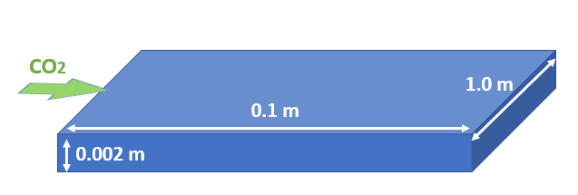
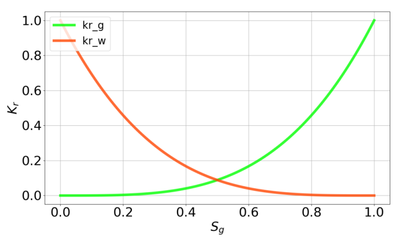

.. _buckleyLeverettProblem:

#################################################################################
 Verification of CO:sub:`2` Core Flood Experiment with Buckley-Leverett Solution
#################################################################################

**Context**

In this example, we simulate a CO:sub:`2` core flood experiment, which characterizes immiscible transport of two phase
flow (CO:sub:`2` and water) through porous media `(Ekechukwu et al., 2022) <https://arxiv.org/pdf/2203.05021.pdf>`__. This problem is solved using the multiphase flow solver in GEOSX to obtain the temporal evolution of saturation profiles along flow direction, which are verified against the Buckley-Leverett analytical solution `(Arabzai and Honma, 2013)  <http://bulletin.soe.u-tokai.ac.jp/english_vol38/20_25.pdf>`__.

**Input file**

The xml input files for the test case are located at:

.. code-block:: console

  inputFiles/compositionalMultiphaseFlow/benchmarks/buckleyLeverettProblem/buckleyLeverett_base.xml

.. code-block:: console
  inputFiles/compositionalMultiphaseFlow/benchmarks/buckleyLeverettProblem/buckleyLeverett_benchmark.xml

Table files and a python script for post-processing the simulation results are also provided:

.. code-block:: console

  inputFiles/compositionalMultiphaseFlow/benchmarks/buckleyLeverettProblem/buckleyLeverett_table

.. code-block:: console

  src/docs/sphinx/advancedExamples/validationStudies/carbonStorage/buckleyLeverett/buckleyLeverettFigure.py

------------------------------------------------------------------
Description of the case
------------------------------------------------------------------

We model the immiscible displacement of brine by CO:sub:`2` in a quasi one-dimensional domain to mimic the CO:sub:`2` core flood experiment, as shown below. The entire domain is assumed to be horizontal, homogeneous, isotropic and isothermal. Prior to injection, the domain is fully saturated with brine. To resemble the analytical example, super critical CO:sub:`2` is injected on the inlet and a constant flow rate is imposed. To meet the requirements of immiscible transport in one-dimensional domain, valuable assumptions include linear and horizontal flow, incompressible and immiscible phases, negligible capillary pressure and gravitational force, and the absence of poromechanical effect. Upon injection, saturation front of the injected phase (super critical CO:sub:`2`) forms a sharp leading edge and advances with time. 

.. _problemSketchBuckleyLeverett:

   Sketch of the problem 

In this example, we set up and solve a multiphase flow model to obtain the spatial and temporal solutions of phase saturation and pore pressure across the domain upon injection. Saturation profiles along flow direction are evaluated and compared with the corresponding analytical solutions `(Arabzai and Honma, 2013)  <http://bulletin.soe.u-tokai.ac.jp/english_vol38/20_25.pdf>`__. 

The power law type of Brooks-Corey relations are hereby used to describe gas :math:`k_{rg}` and water :math:`k_{rw}` relative permeabilities: 

.. math::
   k_{rg} = {k_{rg}}^{0} { {S_g}^{\star} }^{n_g}

.. math::
   k_{rw} = {k_{rw}}^{0} { {S_w}^{\star} }^{n_w}

where :math:`{k_{rg}}^{0}` and :math:`{k_{rw}}^{0}` are the maximum relative permeability of gas and water phase respectively; :math:`n_g` and :math:`n_w` are the Corey exponents; dimensionless volume fraction (saturation) of gas phase :math:`{S_g}^{\star}` and water phase :math:`{S_w}^{\star}` are given as:

.. math::
   {S_g}^{\star} = \frac{ S_g - S_{gr} }{1 - S_{gr} - S_{wr} }

.. math::
   {S_w}^{\star} = \frac{ S_w - S_{wr} }{1 - S_{gr} - S_{wr} }

where :math:`S_{gr}` and :math:`S_{wr}` are the residual gas and water saturation; 

According to Buckley–Leverett theory, with constant fluid viscosity, fractional flow of gas phase :math:`f_g` can be expressed as: 

.. math::
   f_g = \frac {\frac{k_{rg}}{\mu_g}} { \frac{k_{rg}}{\mu_g} + \frac{k_{rw}}{\mu_w}}

where :math:`\mu_g` and :math:`\mu_w` represent the viscosity of gas and water phase respectively, which are assumed to be constant in this study.

The position of a particular saturation is given as a function of injection time :math:`t` and the value of the derivative :math:`\frac{df_g}{dS_g}` at that saturation:

.. math::
   x_{S_g} = \frac {Q_T t } { A \phi} {(\frac{df_g}{dS_g})_{S_g}}

where :math:`Q_T` is the total flow rate, :math:`A` is the area of the cross-section in the core sample, :math:`\phi` is the rock porosity. In addition, the abrupt saturation front is determined based on the tangent point on the fractional flow curve. 

For this example, we focus on the ``Mesh``,
the ``Constitutive``, and the ``FieldSpecifications`` tags.

------------------------------------------------------------------
Mesh
------------------------------------------------------------------

The mesh used in the study was created with the internal mesh generator as parametrized in the ``InternalMesh`` XML tag. 
The structured mesh contains 1000 x 1 x 1 eight-node brick elements in the x, y, and z directions respectively. 
Such eight-node hexahedral elements are defined as ``C3D8`` elementTypes, and their collection forms a mesh
with one group of cell blocks named here ``cellBlock``. The width of the domain should be large enough to ensure the formation of one-dimension flow.

.. literalinclude:: ../../../../../../../inputFiles/compositionalMultiphaseFlow/benchmarks/buckleyLeverettProblem/Buckley_Leverett_benchmark.xml
    :language: xml
    :start-after: <!-- SPHINX_MESH -->
    :end-before: <!-- SPHINX_MESH_END -->

------------------------------------------------------------------
Flow solver
------------------------------------------------------------------

The isothermal immiscible simulation is performed by the GEOSX general-purpose multiphase
flow solver. The multiphase flow solver, a solver of type ``CompositionalMultiphaseFVM`` called here ``compflow`` (more information on these solvers at :ref:`CompositionalMultiphaseFlow`) is defined in the XML block **CompositionalMultiphaseFVM**:

.. literalinclude:: ../../../../../../../inputFiles/compositionalMultiphaseFlow/benchmarks/buckleyLeverettProblem/buckleyLeverett_base.xml
    :language: xml
    :start-after: <!-- SPHINX_SOLVER -->
    :end-before: <!-- SPHINX_SOLVER_END -->

We use the ``targetRegions`` attribute to define the regions where the flow solver is applied.
Here, we only simulate fluid flow in one region named as ``region``. We specify the discretization method (``fluidTPFA``, defined in the ``NumericalMethods`` section), and the initial reservoir temperature (``temperature="300"``).

------------------------------
Constitutive laws
------------------------------

This benchmark example involves an immiscible, incompressible, two-phase model, whose fluid rheology and permeability are specified in the ``Constitutive`` section. The best approach to represent this fluid behavior in GEOSX is to use the **DeadOilFluid** model in GEOSX.

.. literalinclude:: ../../../../../../../inputFiles/compositionalMultiphaseFlow/benchmarks/buckleyLeverettProblem/buckleyLeverett_base.xml
    :language: xml
    :start-after: <!-- SPHINX_MATERIAL -->
    :end-before: <!-- SPHINX_MATERIAL_END -->

Constant fluid densities and viscosities are given in the external tables for both phases.
The formation volume factors are set to 1 for incompressible fluids. 
The relative permeability for both phases are modelled with the power law correlations ``BrooksCoreyRelativePermeability`` (more information at :ref:`BrooksCoreyRelativePermeability`), as shown below. Capillary pressure is neglected throughout this work.

.. _problemRelativePermBuckleyLeverett:

   Relative permeabilities of both phases

All constitutive parameters such as density, viscosity, and permeability are specified in the International System of Units.

------------------------------
Time history function
------------------------------

In the ``Tasks`` section, ``PackCollection`` tasks are defined to collect time history information from fields. 
Either the entire field or specified named sets of indices in the field can be collected. 
In this example, ``phaseVolumeFractionCollection`` is specified to output the time history of phase saturations ``fieldName="phaseVolumeFraction"`` across the computational domain.

.. literalinclude:: ../../../../../../../inputFiles/compositionalMultiphaseFlow/benchmarks/buckleyLeverettProblem/buckleyLeverett_base.xml
    :language: xml
    :start-after: <!-- SPHINX_TASKS -->
    :end-before: <!-- SPHINX_TASKS_END -->

This task is triggered using the ``Event`` manager with a ``PeriodicEvent`` defined for the recurring tasks. 
GEOSX writes one file named after the string defined in the ``filename`` keyword and formatted as a HDF5 file (saturationHistory.hdf5). The TimeHistory file contains the collected time history information from specified time history collector.
This file includes datasets for the simulation time, element center, and the time history information for both phases.
A Python script is prepared to read and plot any specified subset of the time history data for verification and visualization. 

-----------------------------------
Initial and boundary conditions
-----------------------------------

The next step is to specify fields, including:

  - The initial value (the pore pressure and phase saturation have to be initialized)
  - The boundary conditions (fluid injection rate and controls on the fluid outlet have to be set)

In this example, the domain is initially saturated with brine with a uniform pressure field. 
The ``component`` attribute of the **FieldSpecification** XML block must use the order in which the ``phaseNames`` have been defined in the **DeadOilFluid** XML block. 
In other words, ``component=0`` is used to initialize the gas global component fraction and ``component=1`` is used to initialize the water global component fraction, because we previously set ``phaseNames="{gas, water}"`` in the **DeadOilFluid** XML block. 

A mass injection rate ``SourceFlux`` (``scale="-0.00007"``) of pure CO:sub:`2` (``component="0"``) is applied at the fluid inlet, which is named as ``source``. The value given for ``scale`` is :math:`Q_T \rho_g`. Pressure and compostion controls at the fluid outlet (named as ``sink``) should also be specified. The ``setNames="{ source }`` and ``setNames="{ sink }"`` are defined using the **Box** XML tags of the **Geometry** section.

These boundary conditions are set up through the ``FieldSpecifications`` section.

.. literalinclude:: ../../../../../../../inputFiles/compositionalMultiphaseFlow/benchmarks/buckleyLeverettProblem/buckleyLeverett_base.xml
    :language: xml
    :start-after: <!-- SPHINX_BC -->
    :end-before: <!-- SPHINX_BC_END -->

The parameters used in the simulation are summarized in the following table, which are specified in the
``Constitutive`` and ``FieldSpecifications`` sections. 

+----------------------+--------------------------------------+------------------+--------------------+
| Symbol               | Parameter                            | Unit             | Value              |
+======================+======================================+==================+====================+
| :math:`{k_{rg}}^{0}` | Max Relative Permeability of Gas     | [-]              | 1.0                |
+----------------------+--------------------------------------+------------------+--------------------+
| :math:`{k_{rw}}^{0}` | Max Relative Permeability of Water   | [-]              | 1.0                |
+----------------------+--------------------------------------+------------------+--------------------+
| :math:`n_g`          | Corey Exponent of Gas                | [-]              | 3.5                |
+----------------------+--------------------------------------+------------------+--------------------+
| :math:`n_w`          | Corey Exponent of Water              | [-]              | 3.5                |
+----------------------+--------------------------------------+------------------+--------------------+
| :math:`S_{gr}`       | Residual Gas Saturation              | [-]              | 0.0                |
+----------------------+--------------------------------------+------------------+--------------------+
| :math:`S_{wr}`       | Residual Water Saturation            | [-]              | 0.0                |
+----------------------+--------------------------------------+------------------+--------------------+
| :math:`\phi`         | Porosity                             | [-]              | 0.2                |
+----------------------+--------------------------------------+------------------+--------------------+
| :math:`\kappa`       | Matrix Permeability                  | [m\ :sup:`2`]    | 9.0*10\ :sup:`-13` |
+----------------------+--------------------------------------+------------------+--------------------+
| :math:`\mu_g`        | Gas Viscosity                        | [Pa s]           | 2.3*10\ :sup:`-5`  |
+----------------------+--------------------------------------+------------------+--------------------+
| :math:`\mu_w`        | Water Viscosity                      | [Pa s]           | 5.5*10\ :sup:`-4`  |
+----------------------+--------------------------------------+------------------+--------------------+
| :math:`Q_T`          | Total Flow Rate                      | [m\ :sup:`3`/s]  | 2.5*10\ :sup:`-7`  |
+----------------------+--------------------------------------+------------------+--------------------+
| :math:`D_L`          | Domain Length                        | [m]              | 0.1                |
+----------------------+--------------------------------------+------------------+--------------------+
| :math:`D_W`          | Domain Width                         | [m]              | 1.0                |
+----------------------+--------------------------------------+------------------+--------------------+
| :math:`D_T`          | Domain Thickness                     | [m]              | 0.002              |
+----------------------+--------------------------------------+------------------+--------------------+

---------------------------------
Inspecting results
---------------------------------

We request VTK-format output files and use Paraview to visualize the results.
The following figure shows the distribution of phase saturations and pore pressure in the computational domain at :math:`t=70 s`.

.. _problemBuckleyLeverettContour:
.. figure:: contour.PNG
   :align: center
   :width: 500
   :figclass: align-center

   Simulation results of phase saturations and pore pressure

Two following dimensionless terms are defined when comparing the numerical solution with the analytical solutions: 

.. math::
   t_{\star} = \frac {Q_T t } { A D_L \phi}

.. math::
   x_d = \frac { x_{S_g} } { D_L }

The figure below compares the results from GEOSX (dashed curves) and the corresponding analytical solution (solid curves) for the change of gas saturation (:math:`S_g`) and water saturation (:math:`S_w`) along the flow direction. As shown, GEOSX reliably captures the immiscible transport of two phase flow (CO:sub:`2` and water) and matches well with the analytical solutions in the formation and progress of abrupt fronts in the saturation profiles. 

.. plot:: docs/sphinx/advancedExamples/validationStudies/carbonStorage/buckleyLeverett/buckleyLeverettFigure.py

------------------------------------------------------------------
To go further
------------------------------------------------------------------

**Feedback on this example**

For any feedback on this example, please submit a `GitHub issue on the project's GitHub page <https://github.com/GEOSX/GEOSX/issues>`_.
