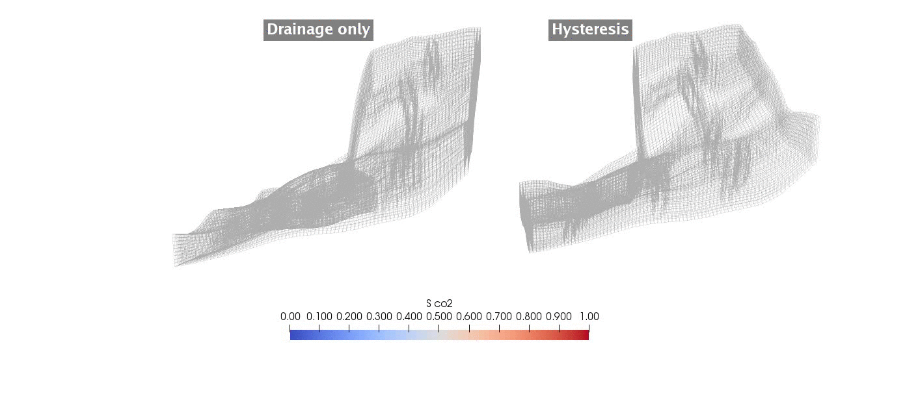
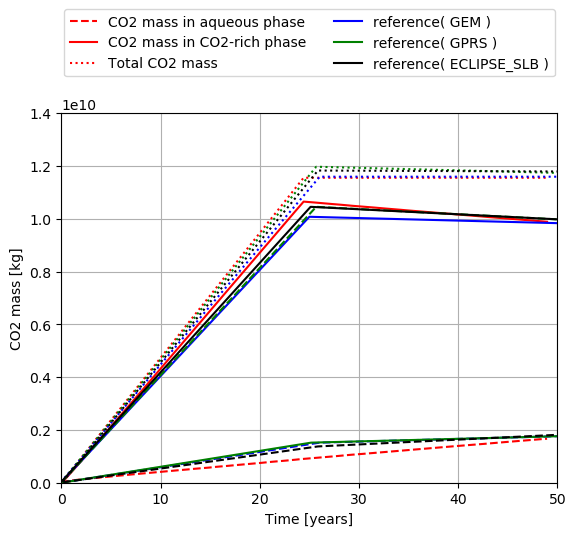
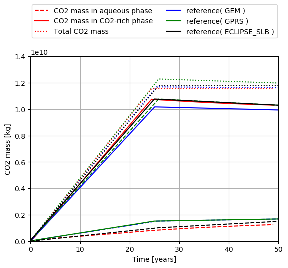

.. _ExampleIsothermalHystInjection:

#####################################################################
CO2 Plume Evolution With Hysteresis Effect on Relative Permeability
#####################################################################

**Context**

We consider a benchmark problem used in `(Class et al., 2009) <https://link.springer.com/article/10.1007/s10596-009-9146-x>`__
to compare a number of numerical models applied to CO2 storage in geological formations.
Using a simplified miscible two-phase setup, this test case illustrates the modeling of solubility trapping
(with CO2 dissolution in brine) and residual trapping
(with gas relative permeability hysteresis) in CO2-brine systems.

Our goal is to review the different sections of the XML file reproducing the benchmark configuration
and to demonstrate that the GEOS results (i.e., mass of CO2 dissolved and mobile for both hysteretic and non-hysteretic configurations) are in agreement with the reference
results published in `(Class et al., 2009) <https://link.springer.com/article/10.1007/s10596-009-9146-x>`__ Problems 3.1 and 3.2.

**Input file**

This benchmark test is based on the XML file located below:

.. code-block:: console

  ../../../../../../../inputFiles/compositionalMultiphaseWell/benchmarks/Class09Pb3/class09_pb3_smoke_3d.xml
  ../../../../../../../inputFiles/compositionalMultiphaseWell/benchmarks/Class09Pb3/class09_pb3_drainageOnly_iterative_base.xml

------------------------------------------------------------------------
Problem description
------------------------------------------------------------------------

The following text is adapted from the detailed description of the benchmark test case
presented in
`(Class et al., 2009) <https://link.springer.com/article/10.1007/s10596-009-9146-x>`__.

The setup is illustrated in the figure below.
The mesh can be found in `GEOSDATA <https://github.com/GEOS-DEV/GEOSDATA>`__ and
was provided for the benchmark. It discretizes the widely-used `Johansen` reservoir,
which consists in a tilted reservoir with a main fault.
The model domain has the following dimensions: 9600 x 8900 x [90-140] m.
Both porosity and permeability are heterogeneous and given at vertices.
A single CO2 injection well is located at (x,y) = (5440,3300) m with
perforations only in the bottom 50 m of the reservoir.
The injection takes place during the first 25 years of the 50-year
simulation at the constant rate of 15 kg/s.
A hydrostatic pressure gradient is imposed on the boundary faces
as well as a constant geothermal gradient of 0.03 K/m.

   .. _JohansenScenario: .. figure:: problem3.png
      :align: center
      :width: 500
      :figclass: align-center

The authors have used the following simplifying assumptions:

- The formation is isotropic.
- The temperature is constant in time.
- The pressure conditions at the lateral boundaries are constant over time, and equal to the initial hydrostatic condition.

------------------------------------------------------------------
Mesh and element regions
------------------------------------------------------------------

The proposed conforming discretization is fully hexahedral.
A VTK filter ``PointToCell`` is used to map properties from vertices to cells, which by default builds a uniform average of
values over the cell.
The structured mesh is generated using some helpers python scripts from the formatted Point/Cells list provided.
It is then imported using ``meshImport``

.. literalinclude:: ../../../../../../../inputFiles/compositionalMultiphaseWell/benchmarks/Class09Pb3/class09_pb3_smoke_3d.xml
    :language: xml
    :start-after: <!-- SPHINX_MESH -->
    :end-before: <!-- SPHINX_MESH_END -->

The central wellbore is discretized internally by GEOS  (see :ref:`TutorialCO2FieldCase`).
It includes five segments with a perforation in each segment. It has its own region ``wellRegion`` and control labeled ``wellControls``
defined and detailed respectively in **ElementRegions** and **Solvers** (see below).
In the **ElementRegions** block,

.. literalinclude:: ../../../../../../../inputFiles/compositionalMultiphaseWell/benchmarks/Class09Pb3/class09_pb3_drainageOnly_iterative_base.xml
    :language: xml
    :start-after: <!-- SPHINX_ER -->
    :end-before: <!-- SPHINX_ER_END -->

one single reservoir region labeled ``reservoir``.
A second region ``wellRegion`` is associated with the well.
All those regions define materials to be specified inside the **Constitutive** block.

------------------------
Coupled solver
------------------------

The simulation is performed by the GEOS coupled solver for multiphase
flow and well defined in the XML block **CompositionalMultiphaseReservoir**:

.. literalinclude:: ../../../../../../../inputFiles/compositionalMultiphaseWell/benchmarks/Class09Pb3/class09_pb3_drainageOnly_iterative_base.xml
    :language: xml
    :start-after: <!-- SPHINX_SOLVER_MP -->
    :end-before: <!-- SPHINX_SOLVER_MP_END -->

It references the two coupled solvers under the tags ``flowSolverName`` and ``wellSolverName``. These are defined inside the same **Solvers** block
following this coupled solver. It also defined non-linear, **NonlinearSolverParameters** and
and linear, **LinearSolverParameters**, strategies. 

The next two blocks are used to define our two coupled physics solvers ``compositionalMultiphaseFlow`` (of type **CompositionalMultiphaseFVM**)
and ``compositionalMultiphaseWell`` (of type **CompositionalMultiphaseWell**).

Flow solver
-------------

We use the ``targetRegions`` attribute to define the regions where the flow solver is applied.

.. literalinclude:: ../../../../../../../inputFiles/compositionalMultiphaseWell/benchmarks/Class09Pb3/class09_pb3_drainageOnly_iterative_base.xml
    :language: xml
    :start-after: <!-- SPHINX_SOLVER_MPWELL -->
    :end-before: <!-- SPHINX_SOLVER_MPWELL_END -->

The FV scheme discretization used is TPFA (which definition can be found nested in **NumericalMethods**/**FiniteVolume**)
and some parameter values.

Well solver
--------------

The well solver is applied on its own region ``wellRegion`` which consists of the five discretized segments.
It is also the place where the **WellControls** are set thanks to ``type``, ``control``, ``injectionStream`` ,
``injectionTemperature``, ``targetTotalRateTableName`` and, ``targetBHP`` for instance if we consider an injection well.

For more details on the wellbore modeling please refer to :ref:`CompositionalMultiphaseWell`.

.. literalinclude:: ../../../../../../../inputFiles/compositionalMultiphaseWell/benchmarks/Class09Pb3/class09_pb3_drainageOnly_iterative_base.xml
    :language: xml
    :start-after: <!-- SPHINX_SOLVER_WELL -->
    :end-before: <!-- SPHINX_SOLVER_WELL_END -->

------------------------------
Constitutive laws
------------------------------

This benchmark test involves a compositional mixture that defines two phases (CO2-rich and aqueous) labeled as
``gas`` and ``water`` which contain two components ``co2`` and ``water``. The miscibility of CO2 results in the
presence of CO2 in the aqueous phase. The vaporization of H2O in the CO2-rich phase is not considered here.

.. literalinclude:: ../../../../../../../inputFiles/compositionalMultiphaseWell/benchmarks/Class09Pb3/class09_pb3_drainageOnly_iterative_base.xml
    :language: xml
    :start-after: <!-- SPHINX_FLUID -->
    :end-before: <!-- SPHINX_FLUID_END -->

The brine properties are modeled using Ezrokhi correlation, hence the block name **CO2BrineEzrokhiFluid**.
The external PVT files *tables/pvtgas.txt* and *tables/pvtliquid_ex.txt* give access to the models considered
respectively for the computation of gas density and viscosity and the brine density and viscosity, along with pressure, temperature, salinity
discretization of the parameter space. The external file *tables/co2flash.txt* gives the same type of information for the `CO2Solubility`
model (see :ref:`CO2-EOS` for details).

The rock model defines a slightly compressible porous medium with a reference porosity equal to 0.1.

.. literalinclude:: ../../../../../../../inputFiles/compositionalMultiphaseWell/benchmarks/Class09Pb3/class09_pb3_drainageOnly_iterative_base.xml
    :language: xml
    :start-after: <!-- SPHINX_ROCK -->
    :end-before: <!-- SPHINX_ROCK_END -->

The relative permeability model is input through tables thanks to **TableRelativePermeability** block.

.. literalinclude:: ../../../../../../../inputFiles/compositionalMultiphaseWell/benchmarks/Class09Pb3/class09_pb3_drainageOnly_iterative_base.xml
    :language: xml
    :start-after: <!-- SPHINX_RELPERM -->
    :end-before: <!-- SPHINX_RELPERM_END -->

As this benchmark is testing the sensitivity of the plume dynamics to the relative permeability hysteresis modeling,
in commented block the **TableRelativePermeabilityHysteresis** block sets up bounding curves for imbibition and drainage
under ``imbibitionNonWettingRelPermTableName``, ``imbibitionWettingRelPermTableName`` and, ``drainageWettingNonWettingRelPermTableNames``
compared to the ``wettingNonWettingRelPermTableNames`` label of the drainage only **TableRelativePermeability** blocks.
Those link to **TableFunction** blocks in **Functions**, which define sample points for piecewise linear interpolation.
This feature is used and explained in more details in the following section dedicated to *Initial and Boundary conditions*.

See,

.. code-block:: console

  ../../../../../../../inputFiles/compositionalMultiphaseWell/benchmarks/Class09Pb3/class09_pb3_hystRelperm_iterative_base.xml

for the input base with relative permeability hysteresis setup.

.. literalinclude:: ../../../../../../../inputFiles/compositionalMultiphaseWell/benchmarks/Class09Pb3/class09_pb3_hystRelperm_iterative_base.xml
    :language: xml
    :start-after: <!-- SPHINX_RELPERM -->
    :end-before: <!-- SPHINX_RELPERM_END -->

.. note::
    ``wettingNonWettingRelPermTableNames`` in **TableRelativePermeability** and ``drainageWettingNonWettingRelPermTableNames`` in
    **TableRelativePermeabilityHysteresis** are identical.

Capillary pressure is also tabulated and defined in **TableCapillaryPressure**. No hysteresis is modeled yet on the capillary pressure.

.. literalinclude:: ../../../../../../../inputFiles/compositionalMultiphaseWell/benchmarks/Class09Pb3/class09_pb3_drainageOnly_iterative_base.xml
    :language: xml
    :start-after: <!-- SPHINX_CAP -->
    :end-before: <!-- SPHINX_CAP_END -->

-----------------------------------------------------------
Initial and boundary conditions
-----------------------------------------------------------

The domain is initially saturated with brine with a hydrostatic pressure field.
This is specified using the **HydrostaticEquilibrium** XML tag in the **FieldSpecifications** block.
The datum pressure and elevation used below are defined in
`(Class et al., 2009) <https://link.springer.com/article/10.1007/s10596-009-9146-x>`__).

.. literalinclude:: ../../../../../../../inputFiles/compositionalMultiphaseWell/benchmarks/Class09Pb3/class09_pb3_drainageOnly_iterative_base.xml
    :language: xml
    :start-after: <!-- SPHINX_HYDROSTATIC -->
    :end-before: <!-- SPHINX_HYDROSTATIC_END -->

In the **Functions** block, the **TableFunction** s named ``initCO2CompFracTable`` and ``initWaterCompFracTable``
define the brine-saturated initial state, while the **TableFunction** named ``initTempTable`` defines the temperature field as a function of depth to impose the geothermal gradient.
		 
The boundaries are set to have a constant 0.03 K/m temperature gradient as well as the hydrostatic pressure gradient.
We supplement that with water dominant content. Each block is linking a ``fieldName`` to a **TableFunction** tagged as
the value of ``functionName``. In order to have those imposed on the boundary faces, we provide ``faceManager`` as ``objectPath``.

.. literalinclude:: ../../../../../../../inputFiles/compositionalMultiphaseWell/benchmarks/Class09Pb3/class09_pb3_drainageOnly_iterative_base.xml
    :language: xml
    :start-after: <!-- SPHINX_BC -->
    :end-before: <!-- SPHINX_BC_END -->

---------------------------------
Outputing reservoir statistics
---------------------------------

In order to output partitioning of CO2 mass, we use reservoir statistics implemented in GEOS. This is done by defining a **Task**, with
``flowSolverName`` pointing to the dedicated solver and ``computeRegionStatistics`` set to 1 to compute statistics by regions.
The ``setNames`` field is set to 3 as it is its attribute tag in the input *vtu* mesh.

.. literalinclude:: ../../../../../../../inputFiles/compositionalMultiphaseWell/benchmarks/Class09Pb3/class09_pb3_smoke_3d.xml
    :language: xml
    :start-after: <!-- SPHINX_STATS -->
    :end-before: <!-- SPHINX_STATS_END -->

and an **Event** for this to occur recursively with a `forceDt` argument for the period over which statistics are output and
`target` pointing towards the aforementioned **Task**.

.. literalinclude:: ../../../../../../../inputFiles/compositionalMultiphaseWell/benchmarks/Class09Pb3/class09_pb3_smoke_3d.xml
    :language: xml
    :start-after: <!-- SPHINX_STAT_EV -->
    :end-before: <!-- SPHINX_STAT_EV_END -->

This is a sample of the output we will have in the log file.

.. code-block:: console

    compflowStatistics, reservoir: Pressure (min, average, max): 2.5139e+07, 2.93668e+07, 3.23145e+07 Pa
    compflowStatistics, reservoir: Delta pressure (min, max): -12157, 158134 Pa
    compflowStatistics, reservoir: Temperature (min, average, max): 293.15, 371.199, 379.828 K
    compflowStatistics, reservoir: Total dynamic pore volume: 1.57994e+09 rm^3
    compflowStatistics, reservoir: Phase dynamic pore volumes: { 1.00239e+06, 1.57894e+09 } rm^3
    compflowStatistics, reservoir: Phase mass (including both trapped and non-trapped): { 7.24891e+08, 1.6245e+12 } kg
    compflowStatistics, reservoir: Trapped phase mass: { 5.3075e+08, 3.2511e+11 } kg
    compflowStatistics, reservoir: Dissolved component mass: { { 7.13794e+08, 4.53966e+06 }, { 1.6338e+08, 1.62433e+12 } } kg
    compflowStatistics: Max phase CFL number: 65.1284
    compflowStatistics: Max component CFL number: 2.32854

.. note::

    The log file mentioned above could be an explicit printout of the stdio from MPI launch or the autogenerated output from
    a SLURM job *slurm.out* or similar

---------------------------------
Inspecting results
---------------------------------

We request VTK-format output files and use Paraview to visualize the results under the **Outputs** block.

The following figure shows the distribution of CO2 saturation thresholded above a significant value (here 0.001).
The displayed cells are colored with respect to the CO2 mass they contain. If the relative permeability for the gas phase
drops below 10e-7, the cell is displayed in black.

.. _pb3_drainOnly_CO2saturation:

   Plume of CO2 saturation for significant value where immobile CO2 is colored in black.

We observe the importance of hysteresis modeling in CO2 plume migration. Indeed, during the migration phase, the cells at
the tail of the plume are switching from drainage to imbibition and the residual CO2 is trapped. This results in a slower migration
and expansion of the plume.

To validate the GEOS results, we consider the metrics used in
`(Class et al., 2009) <https://link.springer.com/article/10.1007/s10596-009-9146-x>`__.
The reporting values are the dissolved and gaseous CO2 with respect to time using only the drainage relative permeability and using 
hysteretic relative permeabilities.

.. _pb3_dissolvedMobile_drainage:

      
   CO2 mass in aqueous and CO2-rich phases as a function of without relative permeability hysteresis

.. _pb3_dissolvedMobile_hysteresis:

   CO2 mass in aqueous and CO2-rich phases as a function of time with relative permeability hysteresis
	      

We can see that at the end of the injection period the mass of CO2 in the gaseous phase stops increasing and starts
decreasing due to dissolution of CO2 in the brine phase.
These curves confirm the agreement between GEOS and the results of `(Class et al., 2009) <https://link.springer.com/article/10.1007/s10596-009-9146-x>`__.

------------------------------------------------------------------
To go further
------------------------------------------------------------------

**Feedback on this example**

For any feedback on this example, please submit a `GitHub issue on the project's GitHub page <https://github.com/GEOS-DEV/GEOS/issues>`_.

