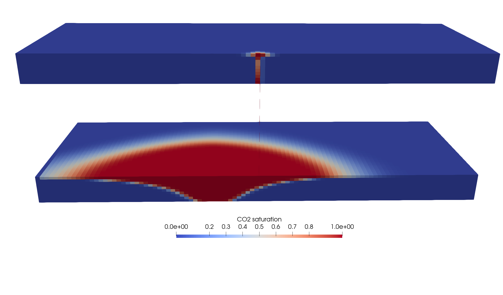
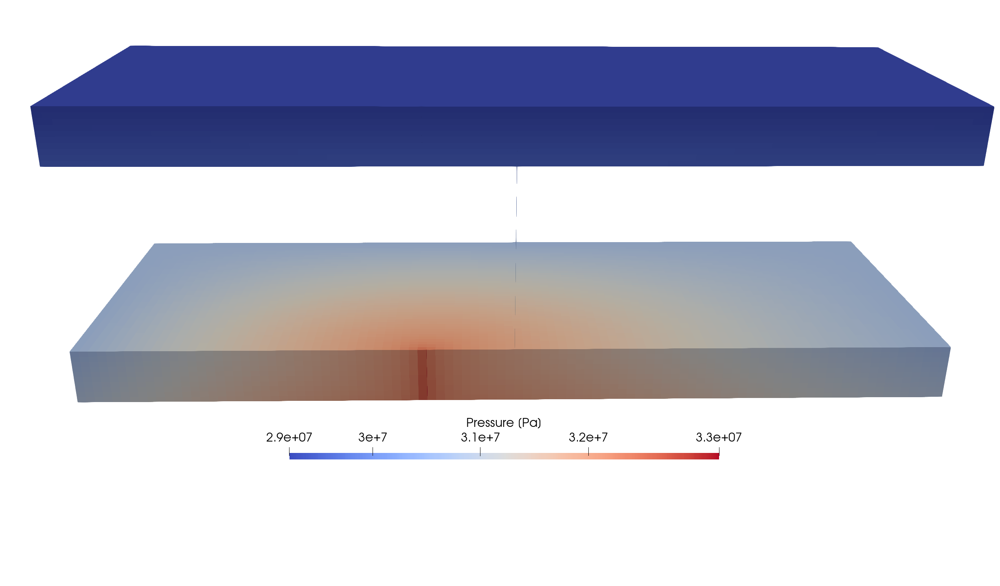
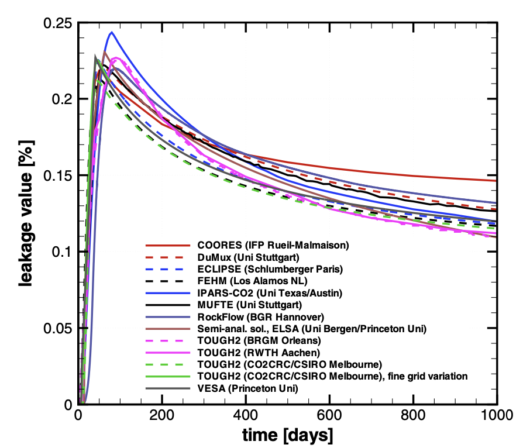

.. _ExampleIsothermalLeakyWell:

##########################################################
CO2 Plume Evolution and Leakage Through an Abandoned Well
##########################################################

**Context**

We consider a benchmark problem used in `(Class et al., 2009) <https://link.springer.com/article/10.1007/s10596-009-9146-x>`__
to compare a number of numerical models applied to CO2 storage in geological formations.
Using a simplified isothermal and immiscible two-phase setup, this test case addresses the
simulation of the advective spreading of CO2 injected into an aquifer and the leakage
of CO2 from the aquifer through an abandoned, leaky well.

Our goal is to review the different sections of the XML file reproducing the benchmark configuration
and to demonstrate that the GEOS results (i.e., arrival time of the CO2 plume at the leaky well
and leakage rate through the abandoned well) are in agreement with the reference results published in 
`(Class et al., 2009) <https://link.springer.com/article/10.1007/s10596-009-9146-x>`__.

The GEOS results obtained for the non-isothermal version of this test case (referred to as Problem 1.2 in
`(Class et al., 2009) <https://link.springer.com/article/10.1007/s10596-009-9146-x>`__) are 
presented in a separate documentation page.

**Input file**

This benchmark test is based on the XML file located below:

.. code-block:: console

  inputFiles/compositionalMultiphaseFlow/benchmarks/isothermalLeakyWell/isothermalLeakyWell_benchmark.xml

------------------------------------------------------------------------
Problem description
------------------------------------------------------------------------

The following text is adapted from the detailed description of the benchmark test case
presented in
`(Ebigbo, Class, Helmig, 2007) <https://link.springer.com/article/10.1007%2Fs10596-006-9033-7>`__
and
`(Class et al., 2009) <https://link.springer.com/article/10.1007/s10596-009-9146-x>`__.

The leakage scenario considered here involves one CO2 injection well, one leaky well,
two aquifers and an aquitard.
The setup is illustrated in the figure below.
The leaky well connects the two aquifers.
CO2 is injected into in the lower aquifer, comes in contact with the leaky well and rises
to the higher aquifer.
The advective flow (including the buoyancy effects) of CO2 in the initially brine-saturated
aquifers and through the leaky well is the most important process in this problem.

The model domain is located 2840 to 3000 m below the surface and has the following
dimensions: 1000 x 1000 x 160 m.
The distance between the injection and the leaky well is 100 m, and the injection rate of CO2
into the lower aquifer is constant (equal to 8.87 kg/s). 
The wells are described as cylinders with a 0.15 m radius and are treated as a porous medium
with a higher permeability than the aquifers (i.e., this problem does not require a well model).

   .. _isothermalLeakyWell_leakageScenario:
   .. figure:: leakageScenario.png
      :align: center
      :width: 500
      :figclass: align-center

      Leakage scenario (image taken from `(Ebigbo, Class, Helmig, 2007) <https://link.springer.com/article/10.1007%2Fs10596-006-9033-7>`__).

The authors have used the following simplifying assumptions:

- The formation is isotropic.
- All processes are isothermal.
- CO2 and brine are two separate and immiscible phases. Mutual dissolution is neglected.
- Fluid properties such as density and viscosity are constant.  
- The pressure conditions at the lateral boundaries are constant over time, and equal to the initial hydrostatic condition.
- Relative permeabilities are linear functions of saturation.
- Capillary pressure is negligible.

------------------------------------------------------------------
Mesh and element regions
------------------------------------------------------------------

The structured mesh is generated using the internal mesh generator as parameterized
in the **InternalMesh** block of the XML file. 
The mesh contains 112 x 101 x 60 hexahedral elements (``C3D8`` element type) in
the x, y, and z directions respectively.

The attributes ``nx``, ``ny``, ``nz``, and ``cellBlockNames`` are used to define 5 x 3 x 3 = 45 cell blocks.
Note that the cell block names listed in ``cellBlockNames`` are mapped to their corresponding
cell block using an k-j-i logic in which the k index is the fastest index, and the i index is the slowest index.    

.. literalinclude:: ../../../../../../../inputFiles/compositionalMultiphaseFlow/benchmarks/isothermalLeakyWell/isothermalLeakyWell_benchmark.xml
    :language: xml
    :start-after: <!-- SPHINX_MESH -->
    :end-before: <!-- SPHINX_MESH_END -->

.. note::
   In the GEOS input file, the two wells are defined as columns of hexahedral elements of individual size 0.2658 x 0.2658 x 1 m. The coefficient 0.2858 is chosen to ensure that the cross-section of the wells is equal to the one defined in the benchmark, in which wells are defined as cylinders with a radius of 0.15 m.   

The cell block names are used in the **ElementRegions** block to define element regions
in the aquifers and in the wells.
In the benchmark definition, the wells are treated as a porous medium with a higher
permeability and therefore the rock models are not the same in the aquifers (``rock``)
and in the wells (``rockWell``).
These names are defined in the **Constitutive** block.

.. literalinclude:: ../../../../../../../inputFiles/compositionalMultiphaseFlow/benchmarks/isothermalLeakyWell/isothermalLeakyWell_base_iterative.xml
    :language: xml
    :start-after: <!-- SPHINX_ELEMENT_REGIONS -->
    :end-before: <!-- SPHINX_ELEMENT_REGIONS_END -->

Defining these element regions allows the flow solver to be applied only to the top and bottom aquifers (and wells),
since we follow the approach of
`(Class et al., 2009) <https://link.springer.com/article/10.1007/s10596-009-9146-x>`__
and do not simulate flow in the aquitard, as we will see in the next section.

.. note::
   Since the two aquifer regions share the same material properties, they could have been defined as a single ``CellElementRegion`` for a more concise XML file producing the same results. The same is true for the two well regions.  

------------------------
Flow solver
------------------------

The isothermal immiscible simulation is performed by the GEOS general-purpose multiphase
flow solver based on a TPFA discretization defined in the XML block **CompositionalMultiphaseFVM**:

.. literalinclude:: ../../../../../../../inputFiles/compositionalMultiphaseFlow/benchmarks/isothermalLeakyWell/isothermalLeakyWell_base_iterative.xml
    :language: xml
    :start-after: <!-- SPHINX_SOLVER -->
    :end-before: <!-- SPHINX_SOLVER_END -->

We use the ``targetRegions`` attribute to define the regions where the flow solver is applied.
Here, we follow the approach described in
`(Class et al., 2009) <https://link.springer.com/article/10.1007/s10596-009-9146-x>`__
and do not simulate flow in the aquitard, considered as impermeable to flow.
We only simulate flow in the two aquifers (``aquiferTop`` and ``aquiferBottom``), in the bottom
part of the injection well (``injectionWell``), and in the leaky well connecting the two aquifers (``leakyWell``).

------------------------------
Constitutive laws
------------------------------

This benchmark test involves an immiscible, incompressible, two-phase model.
The best approach to represent this fluid behavior in GEOS is to use the **DeadOilFluid** model,
although this model was initially developed for simple isothermal oil-water or oil-gas systems
(note that this is also the approach used for the Eclipse simulator, as documented in
`(Class et al., 2009) <https://link.springer.com/article/10.1007/s10596-009-9146-x>`__). 

.. literalinclude:: ../../../../../../../inputFiles/compositionalMultiphaseFlow/benchmarks/isothermalLeakyWell/isothermalLeakyWell_base_iterative.xml
    :language: xml
    :start-after: <!-- SPHINX_FLUID -->
    :end-before: <!-- SPHINX_FLUID_END -->

The fluid properties (constant densities and constant viscosities) are those given in the
article documenting the benchmark.
To define an incompressible fluid, we set all the formation volume factors to 1.  
		 
The rock model defines an incompressible porous medium with a porosity equal to 0.15.
The relative permeability model is linear.
Capillary pressure is neglected.

-----------------------------------------------------------
Initial and boundary conditions
-----------------------------------------------------------

The domain is initially saturated with brine with a hydrostatic pressure field.
This is specified using the **HydrostaticEquilibrium** XML tag in the **FieldSpecifications** block.
The datum pressure and elevation used below are defined in
`(Class et al., 2009) <https://link.springer.com/article/10.1007/s10596-009-9146-x>`__).

.. literalinclude:: ../../../../../../../inputFiles/compositionalMultiphaseFlow/benchmarks/isothermalLeakyWell/isothermalLeakyWell_base_iterative.xml
    :language: xml
    :start-after: <!-- SPHINX_HYDROSTATIC -->
    :end-before: <!-- SPHINX_HYDROSTATIC_END -->

In the **Functions** block, the **TableFunction** s named ``initOilCompFracTable`` and ``initWaterCompFracTable``
define the brine-saturated initial state, while the **TableFunction** named ``initTempTable`` defines the
homogeneous temperature field (temperature is not used in this benchmark).   
		 
Since the fluid densities are constant for this simple incompressible fluid model, the same result
could have been achieved using a simpler table in a **FieldSpecification** tag, as explained
in :ref:`EquilibriumInitialCondition`. 
To impose the Dirichlet boundary conditions on the four sides of the aquifers, we use this simple
table-based approach as shown below:

.. literalinclude:: ../../../../../../../inputFiles/compositionalMultiphaseFlow/benchmarks/isothermalLeakyWell/isothermalLeakyWell_base_iterative.xml
    :language: xml
    :start-after: <!-- SPHINX_DIRICHLET_BC -->
    :end-before: <!-- SPHINX_DIRICHLET_BC_END -->

where the ``setNames = "{ east, west, south, north }"`` are defined using the **Box**
XML tags of the **Geometry** section, and where the tables are defined as **TableFunction**
in the **Functions** section.

To reproduce the behavior of a rate-controlled well, we use the **SourceFlux** tag on the
``source`` set (located in the ``injectionWell`` cell element region), with the injection rate
specified in the benchmark description (8.87 kg/s):

.. literalinclude:: ../../../../../../../inputFiles/compositionalMultiphaseFlow/benchmarks/isothermalLeakyWell/isothermalLeakyWell_base_iterative.xml
    :language: xml
    :start-after: <!-- SPHINX_SOURCE_BC -->
    :end-before: <!-- SPHINX_SOURCE_BC_END -->

.. note::		 
   If the ``setNames`` attribute of **SourceFlux** contains multiple cells (which is the case here), then the amount injected in each cell is equal to the total injection rate (specified with ``scale``) divided by the number of cells.

---------------------------------
Inspecting results
---------------------------------

We request VTK-format output files and use Paraview to visualize the results.
The following figure shows the distribution of CO2 saturation and pressure along the slice defined by x = 0 at t = 200 days.  

.. _isothermalLeakyWell_CO2saturation:

   CO2 saturation after 200 days

.. _isothermalLeakyWell_pressure:

   Pressure after 200 days
   
To validate the GEOS results, we consider the metrics used in
`(Class et al., 2009) <https://link.springer.com/article/10.1007/s10596-009-9146-x>`__.

First, we consider the arrival time of the CO2 plume at the leaky well.
As in `(Class et al., 2009) <https://link.springer.com/article/10.1007/s10596-009-9146-x>`__,
we use the leakage rate threshold of 0.005% to detect the arrival time.
Although the arrival time is highly dependent on the degree of spatial refinement in the
vicinity of the wells (not documented in 
`(Class et al., 2009) <https://link.springer.com/article/10.1007/s10596-009-9146-x>`__),
the next table shows that the GEOS arrival time at the leaky well (9.6 days) is in agreement with the values published in  
`(Class et al., 2009) <https://link.springer.com/article/10.1007/s10596-009-9146-x>`__.

+------------------+---------------------+
| Code             | Arrival             |
|                  | time [day]          |
+==================+=====================+
| GEOSX            |     9.6             | 
+------------------+---------------------+
| COORES           |     8               | 
+------------------+---------------------+
| DuMux            |     6               | 
+------------------+---------------------+
| ECLIPSE          |     8               | 
+------------------+---------------------+
| FEHM             |     4               | 
+------------------+---------------------+
| IPARS-CO2        |     10              | 
+------------------+---------------------+
| MUFTE            |     8               | 
+------------------+---------------------+
| RockFlow         |     19              | 
+------------------+---------------------+
| ELSA             |     14              | 
+------------------+---------------------+
| TOUGH2/ECO2N     |     4               | 
+------------------+---------------------+
| TOUGH2/ECO2N (2) |     10              | 
+------------------+---------------------+
| TOUGH2 (3)       |     9               | 
+------------------+---------------------+
| VESA             |     7               | 
+------------------+---------------------+

.. note::
   The time-stepping strategy used by the codes considered in `(Class et al., 2009) <https://link.springer.com/article/10.1007/s10596-009-9146-x>`__, as well as the meshes that have been used, are not documented in the benchmark description. Therefore, even on this simple test case, we cannot expect to obtain an exact match with the published results. 

Next, we measure the CO2 leakage rate through the leaky well, defined by the authors as the CO2 mass
flow at midway between top and bottom aquifers divided by the injection rate (8.87 kg/s), in percent.
The GEOS leakage rate is shown in the figure below:

.. plot:: docs/sphinx/advancedExamples/validationStudies/carbonStorage/isothermalLeakyWell/isothermalLeakyWellFigure.py

The leakage rates computed by the codes considered in
`(Class et al., 2009) <https://link.springer.com/article/10.1007/s10596-009-9146-x>`__
are shown in the figure below.
	
.. _isothermalLeakyWell_referenceLeakageRate:

   Leakage rates [%] obtained with the simulators considered in `(Class et al., 2009) <https://link.springer.com/article/10.1007/s10596-009-9146-x>`__.

The comparison between the previous two figures shows that GEOS can successfully reproduce the trend
in leakage rate observed in the published benchmark results.
To further validate the GEOS results, we reproduce below Table 8 of
`(Class et al., 2009) <https://link.springer.com/article/10.1007/s10596-009-9146-x>`__
to compare the maximum leakage rate, the time at which this maximum leakage rate is attained, and the
leakage rate at 1000 days.

+------------------+-------------------------+---------------------------+--------------------------+
| Code             | Max                     | Time at                   | Leakage at               |
|                  | leakage [%]             | max leakage [day]         | 1000 days [%]            |
+==================+=========================+===========================+==========================+
| GEOSX            |  0.219                  |    50.6                   |    0.1172                |
+------------------+-------------------------+---------------------------+--------------------------+
| COORES           |  0.219                  |    50                     |    0.146                 |
+------------------+-------------------------+---------------------------+--------------------------+
| DuMux            |  0.220                  |    61                     |    0.128                 |
+------------------+-------------------------+---------------------------+--------------------------+
| ECLIPSE          |  0.225                  |    48                     |    0.118                 |
+------------------+-------------------------+---------------------------+--------------------------+
| FEHM             |  0.216                  |    53                     |    0.119                 |
+------------------+-------------------------+---------------------------+--------------------------+
| IPARS-CO2        |  0.242                  |    80                     |    0.120                 |
+------------------+-------------------------+---------------------------+--------------------------+
| MUFTE            |  0.222                  |    58                     |    0.126                 |
+------------------+-------------------------+---------------------------+--------------------------+
| RockFlow         |  0.220                  |    74                     |    0.132                 |
+------------------+-------------------------+---------------------------+--------------------------+
| ELSA             |  0.231                  |    63                     |    0.109                 |
+------------------+-------------------------+---------------------------+--------------------------+
| TOUGH2/ECO2N     |  0.226                  |    93                     |    0.110                 |
+------------------+-------------------------+---------------------------+--------------------------+
| TOUGH2/ECO2N (2) |  0.212                  |    46                     |    0.115                 |
+------------------+-------------------------+---------------------------+--------------------------+
| TOUGH2 (3)       |  0.227                  |    89                     |    0.112                 |
+------------------+-------------------------+---------------------------+--------------------------+
| VESA             |  0.227                  |    41                     |    0.120                 |
+------------------+-------------------------+---------------------------+--------------------------+

This table confirms the agreement between GEOS and the results of `(Class et al., 2009) <https://link.springer.com/article/10.1007/s10596-009-9146-x>`__.
A particularly good match is obtained with Eclipse, FEHM, and TOUGH2/ECO2N (2).

------------------------------------------------------------------
To go further
------------------------------------------------------------------

The more complex, non-isothermal version of this test is in :ref:`ExampleThermalLeakyWell`.

**Feedback on this example**

For any feedback on this example, please submit a `GitHub issue on the project's GitHub page <https://github.com/GEOS-DEV/GEOS/issues>`_.

