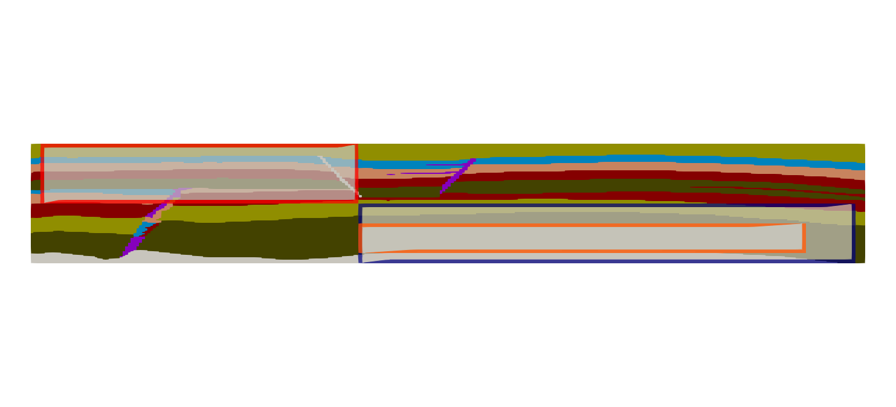
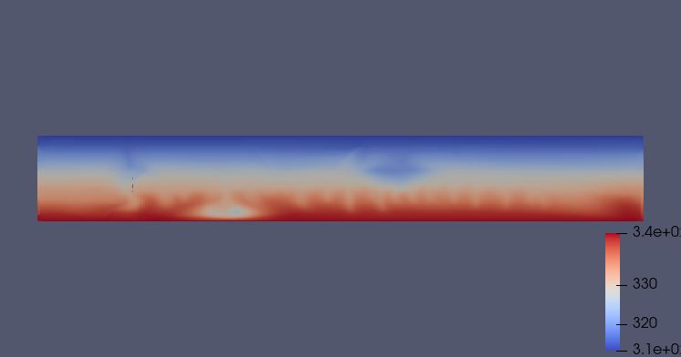
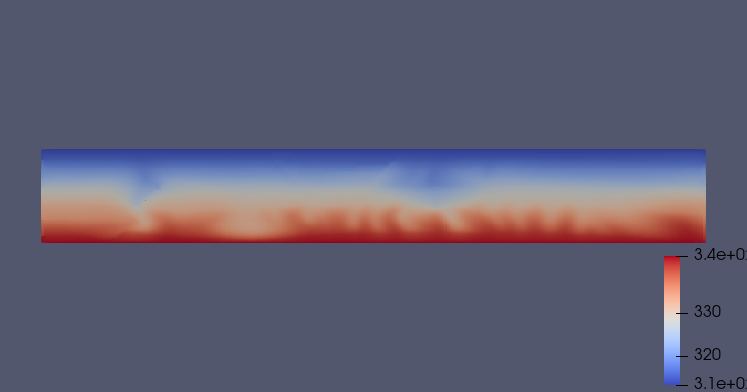
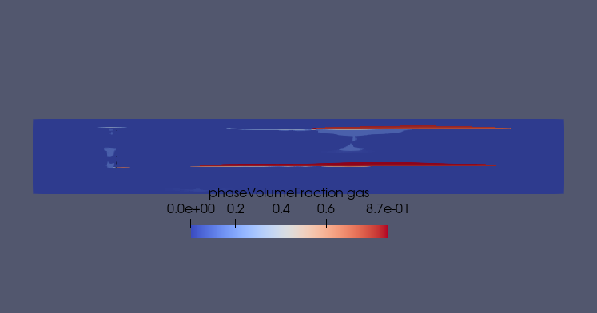
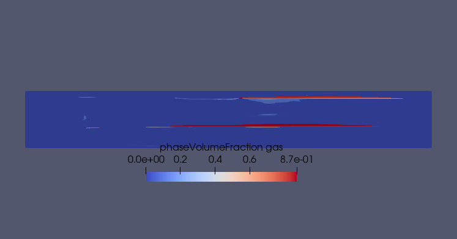
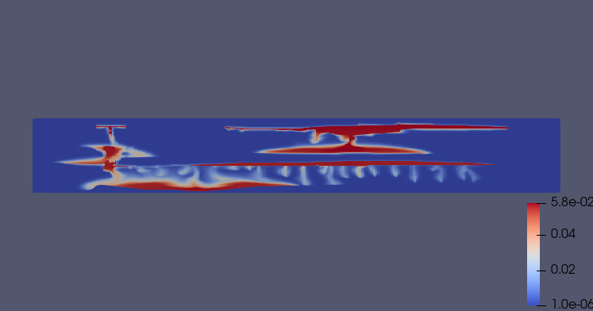
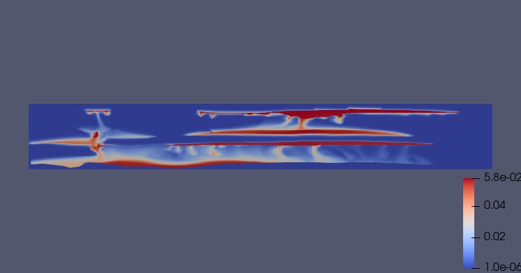

.. _ExampleSPE11b:

########################################################################
Assessment of CO2 Storage residual and dissolution trapping mechanism
########################################################################

**Context**

In this article, we consider the benchmark proposed in `(Nordbotten et al.,2024) <https://norceresearch.brage.unit.no/norceresearch-xmlui/bitstream/handle/11250/3137806/spe-218015-pa.pdf?sequence=1>__`
to showcase the effect of the convective mixing in addition to the usually considered residual trapping in a multi-facies resevoir.
Using a thermal formulation, the effect of injecting cold CO2 can be observed.

This example can serve as a guideline to set-up the input XML deck to reproduce the published results on `SPE11 CSP<https://github.com/Simulation-Benchmarks/11thSPE-CSP>__`.
The reader can also find `decks<https://github.com/Simulation-Benchmarks/11thSPE-CSP/tree/main/input_decks>__` for
other open-source simulators and can try to benchmark a subset of them,
even if the use of other simulators is not in the scope of this article.

.. note::
    Interested reader can refer to the `official comparative website <https://moyner.github.io/SPE11-plot-test-deploy/>__` to see all
    submitted results

------------------------------------------------------------------------
Brief case description
------------------------------------------------------------------------

As the detailed description is available in `(Nordbotten et al.,2024) <https://norceresearch.brage.unit.no/norceresearch-xmlui/bitstream/handle/11250/3137806/spe-218015-pa.pdf?sequence=1>__`,
we will only briefly mentioned data that will be referred to in the following sections and let the interested reader read
the full version.

The spe11-b is a reservoir-like 2D case rescale from the `FluidFlower <>https://arxiv.org/pdf/2302.10986>__` experiment.
As its precursor it is composed of 7 facies with different properties.

.. _spe11b_facies:

Here blue, red and orange boxes are materialization of the prescribed reporting boxes, respectively denoted box A , B and C in the description.
They are places for observing first anticline accumulation, top anticlines accumulation through heterogeneous structure's dripping and
convective mixing finger structures.

------------------------------------------------------------------------
Input base
------------------------------------------------------------------------

Here we will discuss general decomposition of the deck files.

------------------------------------------------------------------------
Constitutives and _includes
------------------------------------------------------------------------

Here we will show a part of the _includes\/_. Discussion about NIST

------------------------------------------------------------------------
Flow solver
------------------------------------------------------------------------

Here we will discuss experience of solver's tunning

------------------------------------------------------------------------
Initial and boundary conditions
------------------------------------------------------------------------

Here we will discuss equilibration period and buffers to mimic large connected aquifers

------------------------------------------------------------------------
Post-treating and prescribed reports
------------------------------------------------------------------------

First inspection of the results is done using Paraview as in the usual GEOS workflow. A short time after injection, the pressure
build up has been damped by the boundary *buffers* and is only inspected as a dynamic response.

Hereafter are reported respectively, temperature, saturation and dissolved CO2 fraction for 500 years and 1000 years.

.. _spe11b_T_500:

.. _spe11b_T_1000:

.. _spe11b_s_500:

.. _spe11b_s_1000:

.. _spe11b_x_500:

.. _spe11b_x_1000:

Firstly, saturation is showing that, for this mesh resolution, almost all gaseous CO2 is trapped then dissolved after 1000 years
of the injection scenario. Then the reporting of the dissolved fraction clearly shows evidence of on-set of convective mixing
fingers, with heavier CO2-saturated brine sinking. Reader can in particular focuse on the lower left part of the domain, perpendicular
to the first injector. Here dissolved CO2 will sink and accumulate. This observation is repeated looking at the temperature maps report.

Here we will draft base of reporting scripts ...

------------------------------------------------------------------
To go further
------------------------------------------------------------------

The more complex 3D case is presented in  :ref:`Placeholder`.

**Feedback on this example**

For any feedback on this example, please submit a `GitHub issue on the project's GitHub page <https://github.com/GEOS-DEV/GEOS/issues>`_.

