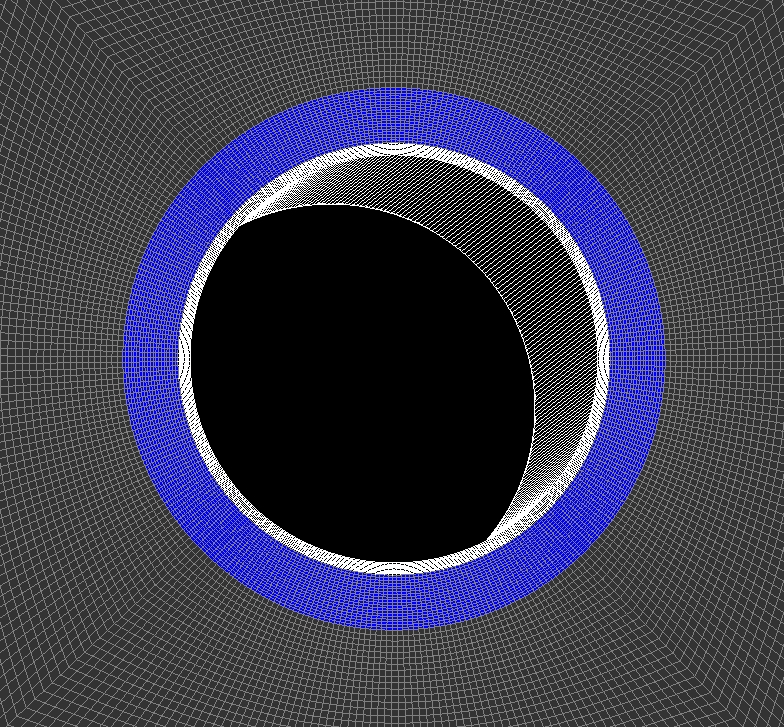

.. _AdvancedExampleCasedElasticWellbore:

####################################################
Cased Elastic Wellbore Problem
####################################################

------------------------------------------------------------------
Problem description
------------------------------------------------------------------

This example uses the solid mechanics solver to handle a cased wellbore problem subjected to a pressure test. The completed wellbore is composed of a steel casing, a cement sheath and rock formation. Isotropic linear elastic behavior is assumed for all the three materials. No separation is allowed for the casing-cement and cement-rock contact interfaces.

Analytical results of the radial and hoop stresses, :math:`\sigma_{rr}` and :math:`\sigma_{\theta\theta}`, in casing, cement sheath and rock are expressed as `(Hervé and Zaoui, 1995) <https://link.springer.com/chapter/10.1007%2F978-94-015-8494-4_55>`__ :

.. math::
   \sigma_{rr} = (2\lambda + 2G)A - \frac{2GB}{r^2}

.. math::
   \sigma_{\theta\theta} = (2\lambda + 2G)A + \frac{2GB}{r^2}

where :math:`\lambda` and :math:`G` are the Lamé moduli, :math:`r` is the radial coordinate, :math:`A` and :math:`B` are piecewise constants that are obtained by solving the boundary and interface conditions, as detailed in the post-processing script.

**Input file**

This benchmark example uses no external input files and everything required is
contained within two GEOSX xml files that are located at:

.. code-block:: console

  inputFiles/wellbore/CasedElasticWellbore_base.xml

and

.. code-block:: console

  inputFiles/wellbore/CasedElasticWellbore_benchmark.xml

The corresponding integrated test is

.. code-block:: console

  inputFiles/wellbore/CasedElasticWellbore_smoke.xml

In this example, we would focus our attention on the ``Solvers``, ``Mesh`` and ``Constitutive`` tags.

-----------------------------------------------------------
Solid mechanics solver
-----------------------------------------------------------

As fluid flow is not considered, only the solid mechanics ``SolidMechanicsLagrangianSSLE`` solver is required for solving this linear elastic problem. In this solver, the three regions and three materials associated to casing, cement sheath and rock are respectively defined by ``targetRegions`` and ``solidMaterialNames``.  

.. literalinclude:: ../../../../../../inputFiles/wellbore/CasedElasticWellbore_base.xml
  :language: xml
  :start-after: <!-- SPHINX_SolidMechanicsSolver -->
  :end-before: <!-- SPHINX_SolidMechanicsSolverEnd -->

--------------------------------------------------------------------
Cased wellbore mesh
--------------------------------------------------------------------

The internal wellbore mesh generator ``InternalWellbore`` is employed to create the mesh of this wellbore problem. The radii of the casing cylinder, the cement sheath cylinder and the far-field boundary of the surrounding rock formation are defined by a vector ``radius``. In the tangent direction, ``theta`` angle is specified from 0 to 360 degree for a full geometry of the domain. Note that a half or a quarter of the domain can be defined by a ``theta`` angle from 0 to 180 or 90 degree, respectively. The trajectory of the well is defined by ``trajectory``, which is vertical in this case. The ``autoSpaceRadialElems`` parameters allow optimally increasing the element size from local zone around the wellbore to the far-field zone. In this example, the auto spacing option is only applied for the rock formation. The ``useCartesianOuterBoundary`` transforms the far-field boundary to a squared shape to enforce a Cartesian aligned outer boundary, which eases the loading of the boundary conditions. The ``cellBlockNames`` and ``elementTypes`` define the regions and related element types associated to casing, cement sheath and rock. 
 
.. literalinclude:: ../../../../../../inputFiles/wellbore/CasedElasticWellbore_benchmark.xml
  :language: xml
  :start-after: <!-- SPHINX_WellboreMesh -->
  :end-before: <!-- SPHINX_WellboreMeshEnd -->

--------------------------------------------------------------------   
Steel, cement, and rock constitutive laws
--------------------------------------------------------------------

Isotropic linear elastic constitutive behavior is considered for all the three materials. Note that the default density is useless for this case.

.. literalinclude:: ../../../../../../inputFiles/wellbore/CasedElasticWellbore_base.xml
  :language: xml
  :start-after: <!-- SPHINX_Material -->
  :end-before: <!-- SPHINX_MaterialEnd -->

--------------------------------------------------------------------	       
Boundary conditions
--------------------------------------------------------------------

Far-field boundary are subjected to roller constraints. The normal traction on the inner face of the casing is defined by ``Traction`` field specification. The nodeset generated by the internal wellbore generator for this face is named as ``rneg``. The traction type is ``normal`` to mimic a casing test pressure that is applied normal to the casing inner face . The negative sign of the scale is attributed to the negative sign convention for compressive stress in GEOSX.

.. literalinclude:: ../../../../../../inputFiles/wellbore/CasedElasticWellbore_base.xml
  :language: xml
  :start-after: <!-- SPHINX_BoundaryConditions -->
  :end-before: <!-- SPHINX_BoundaryConditionsEnd -->

---------------------------------
Results and benchmark
---------------------------------

A good agreement between the GEOSX results and analytical results is shown in the figure below:

.. plot::

	import numpy as np
	import matplotlib.pyplot as plt

	def main():
		# Input geometric parameters
		r_casing_in  = 0.1 # meter
		r_casing_out = 0.106
		r_hole       = 0.133

		# Material properties
		G_casing = 80.8e9 # Pa
		K_casing = 175e9
		lambda_casing = K_casing - 2.0/3.0 * G_casing

		G_cement = 6.45e9
		K_cement = 10.3e9
		lambda_cement = K_cement - 2.0/3.0 * G_cement

		G_rock = 4.16667e9
		K_rock = 5.5556e9

		# Loading
		# Pressure applied on the inner face of the casing
		P0 = -10.0 # MPa

		# Analytical results
		# Rigidity of the casing-cement-rock system
		rigidity = np.array([ [r_casing_out, 1.0/r_casing_out, -r_casing_out, -1.0/r_casing_out, 0.0],
				              [2.0*(lambda_casing+G_casing), -2.0*G_casing/r_casing_out/r_casing_out, -2.0*(lambda_cement+G_cement), 2.0*G_cement/r_casing_out/r_casing_out, 0.0],
				              [0.0, 0.0, r_hole, 1.0/r_hole, -1.0/r_hole],
				              [0.0, 0.0, 2.0*(lambda_cement+G_cement), -2.0*G_cement/r_hole/r_hole, 2.0*G_rock/r_hole/r_hole],
				              [2.0*(lambda_casing+G_casing), -2.0*G_casing/r_casing_in/r_casing_in, 0.0, 0.0, 0.0] ])

		# Vector of force
		force = np.array([ 0.0, 0.0, 0.0, 0.0, P0 ])

		# Compute the coefficients describing the closed-form solutions of stress/strain
		vectorCoefficientAB = np.dot( np.linalg.inv( rigidity ), force )
		coeffA_cement = vectorCoefficientAB[2]
		coeffB_cement = vectorCoefficientAB[3]

		# Radial coordinate
		r_anal = np.arange( r_casing_out, r_hole, 0.01 * ( r_hole - r_casing_out ) )

		# Radial and hoop (tangent) stresses
		tmpVal1 = ( 2.0 * lambda_cement + 2.0 * G_cement ) * coeffA_cement
		tmpVal2 = 2.0 * G_cement * coeffB_cement / r_anal / r_anal

		sig_rr_anal = tmpVal1 - tmpVal2
		sig_tt_anal = tmpVal1 + tmpVal2

		# GEOSX results
		# Stresses are extracted along x-axis 
		# where radial stress coincides with stress_11 
		# and hoop stress coincides with stress_22

		# Radial stress, coordinates
		r_geosx, sig_rr_geosx = [], []

		for line in open('stress_11.curve', 'r' ):
			if not ( line.strip().startswith( "#" ) or line.strip()=='' ):
				values = [ float(s) for s in line.split() ]
				rVal = values[0]
				sigVal = values[1]*1e-6 # convert to MPa

				r_geosx.append( rVal )
				sig_rr_geosx.append( sigVal )

		# Tangent stress
		sig_tt_geosx = []
		for line in open( 'stress_22.curve', 'r' ):
			if not ( line.strip().startswith( "#" ) or line.strip()=='' ):
				values = [ float(s) for s in line.split() ]
				sigVal = values[1]*1e-6 # convert to MPa

				sig_tt_geosx.append( sigVal )

		# Plots
		fig = plt.figure( figsize=[ 13, 5 ] )

		plt.subplot( 121 )
		plt.plot( r_geosx, sig_rr_geosx, 'ko', label='GEOSX result' )
		plt.plot( r_anal, sig_rr_anal,  'k', linewidth=2, label='Analytic' )
		plt.xlim( r_casing_out, r_hole )
		plt.xlabel( "r (m)" )
		plt.ylabel( "Radial stress (MPa)" )

		plt.subplot( 122 )
		plt.plot( r_geosx, sig_tt_geosx, 'ko', label='GEOSX result' )
		plt.plot( r_anal, sig_tt_anal,  'k', linewidth=2, label='Analytic' )
		plt.xlim( r_casing_out, r_hole )
		plt.xlabel( "r (m)" )
		plt.ylabel( "Hoop stress (MPa)" )

		plt.legend()
		plt.show()

	if __name__ == "__main__":
		main()

------------------------------------------------------------------
To go further
------------------------------------------------------------------

**Feedback on this example**

This concludes the cased wellbore example.
For any feedback on this example, please submit a `GitHub issue on the project's GitHub page <https://github.com/GEOSX/GEOSX/issues>`_.
