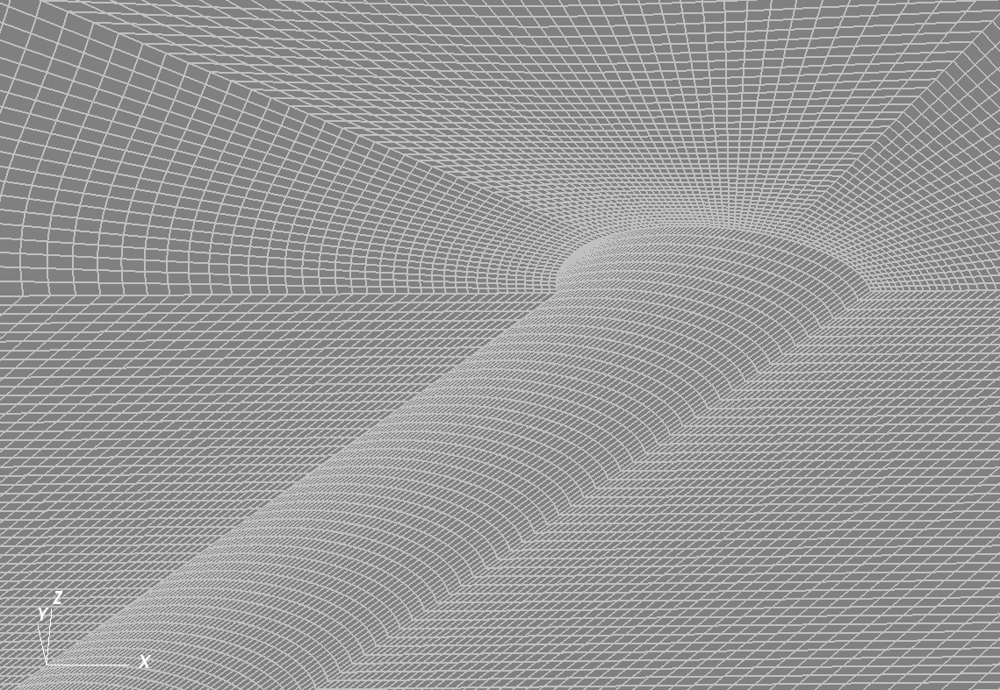

.. _AdvancedExampleDeviatedElasticWellbore:

####################################################
Deviated Elastic Wellbore Problem
####################################################

------------------------------------------------------------------
Problem description
------------------------------------------------------------------

This example uses the solid mechanics solver to handle a deviated wellbore problem with open hole completion. This wellbore is subjected to a mud pressure at wellbore wall and undrained condition is assumed (no fluid flow in the rock formation). A segment of the wellbore with isotropic linear elastic deformation is simulated in this case. Far field stresses and gravity effect are excluded. The main goal of this example is to validate the internal wellbore mesh generator and mechanics solver for the case of an inclined wellbore.

Analytical results of the radial and hoop stresses, :math:`\sigma_{rr}` and :math:`\sigma_{\theta\theta}`, around the wellbore are expressed as `(Detournay and Cheng, 1988) <https://www.sciencedirect.com/science/article/abs/pii/0148906288922991>`__ :

.. math::
   \sigma_{rr} = p_0 \frac{a^2}{r^2}

.. math::
   \sigma_{\theta\theta} = -p_0 \frac{a^2}{r^2}

where :math:`p_0` is the applied mud pressure at wellbore wall, :math:`a` is the wellbore radius and :math:`r` is the radial coordinate.

**Input file**

This benchmark example uses no external input files and everything required is
contained within two GEOSX xml files that are located at:

.. code-block:: console

  inputFiles/wellbore/DeviatedElasticWellbore_base.xml

and

.. code-block:: console

  inputFiles/wellbore/DeviatedElasticWellbore_benchmark.xml

The corresponding xml file for the integrated test is

.. code-block:: console

  inputFiles/wellbore/DeviatedElasticWellbore_smoke.xml

In this example, we would focus our attention on the ``Mesh`` tag.

-----------------------------------------------------------
Solid mechanics solver
-----------------------------------------------------------

As fluid flow is not considered, only the solid mechanics solver ``SolidMechanicsLagrangianSSLE`` is required for solving this wellbore problem.  

.. literalinclude:: ../../../../../../inputFiles/wellbore/DeviatedElasticWellbore_benchmark.xml
  :language: xml
  :start-after: <!-- SPHINX_SolidMechanicsSolver -->
  :end-before: <!-- SPHINX_SolidMechanicsSolverEnd -->

--------------------------------------------------------------------
Deviated wellbore mesh
--------------------------------------------------------------------

The internal wellbore mesh generator ``InternalWellbore`` is employed to create the mesh of this wellbore problem. The radius of the wellbore and the size of the surrounding rock formation are defined by a vector ``radius``. In the tangent direction, ``theta`` angle is specified from 0 to 180 degree for a half of the domain regarding its symmetry. Note that the whole domain could be specified with a ``theta`` angle from 0 to 360 degree, if modeling complicated scenarios. The trajectory of the well is defined by ``trajectory``. In this example, the wellbore is inclined in the x-z plane by an angle of 45 degree. The ``autoSpaceRadialElems`` parameter allows optimally increasing the element size from local zone around the wellbore to the far-field zone, which is set to 1 to activate this option. The ``useCartesianOuterBoundary`` transforms the far-field boundary to a squared shape to enforce a Cartesian aligned outer boundary, which eases the loading of the far-field boundary conditions. In this example, this value is set to 0 for the single region along the radial direction.  
 
.. literalinclude:: ../../../../../../inputFiles/wellbore/DeviatedElasticWellbore_benchmark.xml
  :language: xml
  :start-after: <!-- SPHINX_WellboreMesh -->
  :end-before: <!-- SPHINX_WellboreMeshEnd -->

--------------------------------------------------------------------   
Constitutive law
--------------------------------------------------------------------

Isotropic linear elastic constitutive behavior is considered for the rock around the wellbore. Note that the default density is useless in this specific example, as gravity effect is neglected.

.. literalinclude:: ../../../../../../inputFiles/wellbore/DeviatedElasticWellbore_base.xml
  :language: xml
  :start-after: <!-- SPHINX_Material -->
  :end-before: <!-- SPHINX_MaterialEnd -->

--------------------------------------------------------------------	       
Boundary conditions
--------------------------------------------------------------------

Far-field boundaries are subjected to roller constraints and in-situ stresses are not considered. The mud pressure on the wellbore wall is defined by ``Traction`` field specification. The nodeset generated by the internal wellbore generator for this face is named as ``rneg``. The traction type is ``normal`` to mimic a pressure that is applied normal to the wellbore wall. The negative sign of the scale is attributed to the negative sign convention for compressive stresses in GEOSX.

.. literalinclude:: ../../../../../../inputFiles/wellbore/DeviatedElasticWellbore_base.xml
  :language: xml
  :start-after: <!-- SPHINX_BoundaryConditions -->
  :end-before: <!-- SPHINX_BoundaryConditionsEnd -->

---------------------------------
Results and benchmark
---------------------------------

A good agreement between the GEOSX results and the corresponding analytical solutions is shown in the figure below:

.. plot::

	import numpy as np
	import matplotlib.pyplot as plt

	# Rotate a vector in local coodinate of an inclined borehole to the global coordinate
	# This function is useful for extracting field around an inclined wellbore in the radial direction
	def vectorRotation(x,y,z,phi_x,phi_z):
		rotx = np.array([[np.cos(phi_x), np.sin(phi_x),0.],[-np.sin(phi_x), np.cos(phi_x),0.],[0.,0.,1.]])
		rotz = np.array([[np.cos(phi_z),0., np.sin(phi_z)],[0.,1.,0.],[-np.sin(phi_z),0., np.cos(phi_z)]])

		localCoord = np.array([x,y,z])
		return np.dot( rotz, np.dot( rotx,localCoord ) )

	# Rotate stress from global coordinates system to the local coordinates of an inclined borehole
	# See the description in fig.1 in Abousleiman and Cui 1998
	def stressRotation(stress,phi_x,phi_z):
		rotx = np.array([[np.cos(phi_x), np.sin(phi_x),0.],[-np.sin(phi_x), np.cos(phi_x),0.],[0.,0.,1.]])
		rotz = np.array([[np.cos(phi_z),0., np.sin(phi_z)],[0.,1.,0.],[-np.sin(phi_z),0., np.cos(phi_z)]])

		return np.dot(np.dot(np.transpose(rotz),np.dot(np.dot(np.transpose(rotx),stress),rotx)),rotz)

	def analytic( a, p0 ):
		r_anal = np.arange(a, 10*a, 0.1*a)
		sig_rr_anal = p0*a*a/r_anal/r_anal
		sig_tt_anal = -p0*a*a/r_anal/r_anal
		return [ r_anal, sig_rr_anal, sig_tt_anal ]

	def main():
		a = 0.1
		p0 = -10.0

		K = 5.5556e9
		G = 4.16667e9

		#Deviation angles
		phi_x = 0.
		phi_z = 45./180.*3.1416

		fig = plt.figure(figsize=[13,10])

		# Compute analytical results
		r_anal, sig_rr_anal, sig_tt_anal = analytic( a, p0 )

		# Get stress_ij
		r, stress_11, stress_12, stress_13, stress_22, stress_23, stress_33 = [], [], [], [], [], [], []

		for line in open('stress_11.curve', 'r'):
			if not (line.strip().startswith("#") or line.strip()==''):
				values = [float(s) for s in line.split()]
				rval = values[0]
				sigVal = values[1]*1e-6 # convert to MPa
				r.append( rval )
				stress_11.append( sigVal )

		for line in open('stress_12.curve', 'r'):
			if not (line.strip().startswith("#") or line.strip()==''):
				values = [float(s) for s in line.split()]
				sigVal = values[1]*1e-6 # convert to MPa
				stress_12.append( sigVal )

		for line in open('stress_13.curve', 'r'):
			if not (line.strip().startswith("#") or line.strip()==''):
				values = [float(s) for s in line.split()]
				sigVal = values[1]*1e-6 # convert to MPa
				stress_13.append( sigVal )

		for line in open('stress_22.curve', 'r'):
			if not (line.strip().startswith("#") or line.strip()==''):
				values = [float(s) for s in line.split()]
				sigVal = values[1]*1e-6 # convert to MPa
				stress_22.append( sigVal )

		for line in open('stress_23.curve', 'r'):
			if not (line.strip().startswith("#") or line.strip()==''):
				values = [float(s) for s in line.split()]
				sigVal = values[1]*1e-6 # convert to MPa
				stress_23.append( sigVal )

		for line in open('stress_33.curve', 'r'):
			if not (line.strip().startswith("#") or line.strip()==''):
				values = [float(s) for s in line.split()]
				sigVal = values[1]*1e-6 # convert to MPa
				stress_33.append( sigVal )

		#Compute sig_rr, sig_tt
		sig_rr, sig_tt = [], []
		for i in range(len(stress_11)):
			stress = np.array([[stress_11[i],stress_12[i],stress_13[i]],\
							   [stress_12[i],stress_22[i],stress_23[i]],\
							   [stress_13[i],stress_23[i],stress_33[i]]])

			stressLocal = stressRotation(stress,phi_x,phi_z)
			sig_rr.append(stressLocal[0][0])
			sig_tt.append(stressLocal[1][1])

		plt.subplot(121)
		plt.plot(r, sig_rr, 'ko', label='GEOSX result')
		plt.plot(r_anal, sig_rr_anal,  'k', linewidth=2, label='Analytic')
		plt.ylabel('Radial stress (MPa)')
		plt.xlabel('r (m)')
		plt.xlim(a,3*a)

		plt.subplot(122)
		plt.plot(r, sig_tt, 'ko', label='GEOSX result')
		plt.plot(r_anal, sig_tt_anal,  'k', linewidth=2, label='Analytic')
		plt.ylabel('Hoop stress (MPa)')
		plt.xlabel('r (m)')
		plt.xlim(a,3*a)
		plt.legend()
		plt.show()

	if __name__ == "__main__":
		main()

------------------------------------------------------------------
To go further
------------------------------------------------------------------

**Feedback on this example**

This concludes the deviated elastic wellbore example.
For any feedback on this example, please submit a `GitHub issue on the project's GitHub page <https://github.com/GEOSX/GEOSX/issues>`_.
