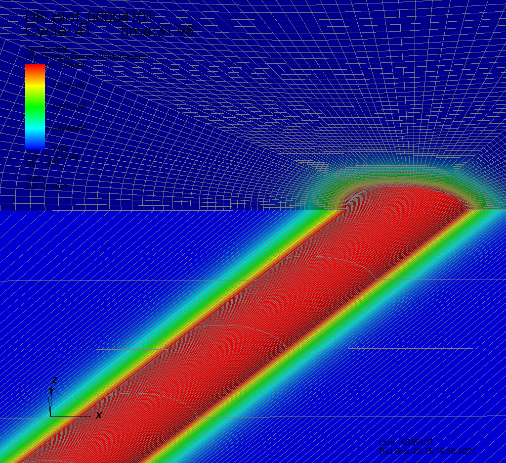

.. _AdvancedExampleDeviatedPoroElasticWellbore:

#################################################################
Deviated Poro-Elastic Wellbore Subjected to Fluid Injection
#################################################################

------------------------------------------------------------------
Problem description
------------------------------------------------------------------

This example aims to solve a typical injection problem of a deviated wellbore subjected to a fluid pressure loaded at wellbore wall. The problem geometry is generated with the internal wellbore mesh generator. Open hole completion and poroelastic deformation are assumed. The coupled poroelastic solver, which combines the solid mechanics solver and the single phase flow solver, is hereby employed to solve this specific problem. In-situ stresses and gravity effect are excluded from this example. Please refer to the case :ref:`AdvancedExampleDeviatedPoroElasticWellboreDrilling` for in-situ stresses and pore pressure effects.

Analytical solutions of the pore pressure, the radial and hoop stresses in the near wellbore region are expressed in the Laplace space as `(Detournay and Cheng, 1988) <https://www.sciencedirect.com/science/article/abs/pii/0148906288922991>`__ :

.. math::
    p = p_0 \frac{k_0(R \sqrt{s})}{s k_0(\sqrt{s})}

.. math::
    \sigma_{rr} = -b \frac{1-2\nu}{1-\nu} p_0 \frac{-R k_1(R \sqrt{s}) + k_1(\sqrt{s})}{R^2 \sqrt{s^3} k_0(\sqrt{s})}

.. math::
    \sigma_{\theta\theta} = -b \frac{1-2\nu}{1-\nu} p - \sigma_{rr}

where :math:`s` is the Laplace variable normalized by the fluid diffusion coefficient, :math:`k_0` and :math:`k_1` are respectively the modified Bessel functions of second kind of order 0 and 1, :math:`R` is the dimensionless radial coordinate that is defined by the radial coordinate normalized by the wellbore radius, :math:`\nu` is the Poisson ratio and :math:`b` is the Biot coefficient. Fluid pressure and stresses in time space are obtained from these analytical expressions by the inverse Laplace transform (see the attached Python script for more details).

**Input file**

Everything required is
contained within two GEOSX xml files that are located at:

.. code-block:: console

  inputFiles/wellbore/DeviatedPoroElasticWellbore_Injection_base.xml

.. code-block:: console

  inputFiles/wellbore/DeviatedPoroElasticWellbore_Injection_benchmark.xml

In this example, we would focus our attention on the ``Solvers`` and the ``Mesh`` tags.

-----------------------------------------------------------
Poroelastic solver
-----------------------------------------------------------

The coupled ``Poroelastic`` solver, that defines a coupling strategy between the solid mechanics solver ``SolidMechanicsLagrangianSSLE`` and the single phase flow solver ``SinglePhaseFVM``, is required for solving this wellbore problem.

.. literalinclude:: ../../../../../../inputFiles/wellbore/DeviatedPoroElasticWellbore_Injection_benchmark.xml
  :language: xml
  :start-after: <!-- SPHINX_PoroelasticSolver -->
  :end-before: <!-- SPHINX_PoroelasticSolverEnd -->

.. literalinclude:: ../../../../../../inputFiles/wellbore/DeviatedPoroElasticWellbore_Injection_benchmark.xml
  :language: xml
  :start-after: <!-- SPHINX_SolidMechanicsSolver -->
  :end-before: <!-- SPHINX_SolidMechanicsSolverEnd -->

.. literalinclude:: ../../../../../../inputFiles/wellbore/DeviatedPoroElasticWellbore_Injection_benchmark.xml
  :language: xml
  :start-after: <!-- SPHINX_SinglePhaseFVM -->
  :end-before: <!-- SPHINX_SinglePhaseFVMEnd -->

--------------------------------------------------------------------
Deviated wellbore mesh
--------------------------------------------------------------------

The internal wellbore mesh generator ``InternalWellbore`` is employed to create the mesh of this wellbore problem. The radius of the wellbore and the size of the surrounding rock formation are defined by a vector ``radius``. In the tangent direction, ``theta`` angle is specified from 0 to 180 degree for a half of the domain regarding its symmetry. Note that the whole domain could be specified with a ``theta`` angle from 0 to 360 degree, if modeling complicated scenarios. The trajectory of the well is defined by ``trajectory``. In this example, the wellbore is inclined in the x-z plane by an angle of 45 degree. The ``autoSpaceRadialElems`` parameter allows optimally increasing the element size from local zone around the wellbore to the far-field zone, which is set to 1 to activate this option. The ``useCartesianOuterBoundary`` transforms the far-field boundary to a squared shape to enforce a Cartesian aligned outer boundary, which eases the loading of the far-field boundary conditions. In this example, this value is set to 0 for the single region along the radial direction.  
 
.. literalinclude:: ../../../../../../inputFiles/wellbore/DeviatedPoroElasticWellbore_Injection_benchmark.xml
  :language: xml
  :start-after: <!-- SPHINX_WellboreMesh -->
  :end-before: <!-- SPHINX_WellboreMeshEnd -->

--------------------------------------------------------------------   
Constitutive law
--------------------------------------------------------------------

Isotropic elastic constitutive block ``ElasticIsotropic``, with the specified bulk and shear elastic moduli, is considered for the rock around the wellbore. Fluid properties, such as dynamic viscosity and compressibility, are given in the ``CompressibleSinglePhaseFluid`` constitutive block. The grain bulk modulus, that is required for computing the Biot coefficient, as well as the default porosity are located in the ``BiotPorosity`` block. The constant permeability is given in the ``ConstantPermeability`` block. 

.. literalinclude:: ../../../../../../inputFiles/wellbore/DeviatedPoroElasticWellbore_Injection_base.xml
  :language: xml
  :start-after: <!-- SPHINX_Material -->
  :end-before: <!-- SPHINX_MaterialEnd -->

--------------------------------------------------------------------	       
Boundary conditions
--------------------------------------------------------------------

Far-field boundaries are impermeable and subjected to roller constraints. The pressure on the wellbore wall is defined by face pressure field specification. The nodeset generated by the internal wellbore generator for this face is named as ``rneg``. The negative sign of the scale denotes the fluid injection. Initial fluid pressure and the corresponding initial porosity are also given for the computational domain. In this example, uniform isotropic permeability is assumed.

.. literalinclude:: ../../../../../../inputFiles/wellbore/DeviatedPoroElasticWellbore_Injection_base.xml
  :language: xml
  :start-after: <!-- SPHINX_BoundaryConditions -->
  :end-before: <!-- SPHINX_BoundaryConditionsEnd -->

---------------------------------
Results and benchmark
---------------------------------

Result of the fluid pressure distribution after 78 s injection is shown in the figure below:

A good agreement between the GEOSX results and the corresponding analytical solutions is shown in the figure below:

.. plot::

	from scipy.special import kn
	from math import factorial, floor
	import numpy as np
	import matplotlib.pyplot as plt
	import xml.etree.ElementTree as ElementTree

	def FFunction(s, R):
		P = kn(0,R * (s ** 0.5)) / (s * kn(0,s ** 0.5))
		U = -(R * kn(1,R * (s ** 0.5)) - kn(1,s ** 0.5)) / (s * R * (s ** 0.5) * kn(0,s ** 0.5))
		Srr = -(-R * kn(1,R * (s ** 0.5)) + kn(1,s ** 0.5)) / (R ** 2. * (s ** 1.5) * kn(0,s ** 0.5))
		Stt = -P - Srr

		return [P, U, Srr, Stt]

	def Vfunction(i, N):

		sum1 = 0.
		kmin = int(floor((i + 1.) / 2.))

		kmax = min(i, N)

		for k in range(kmin, kmax+1):
			sum1 = sum1 + (1.*(k**N) * factorial(2 * k) / (factorial(N - k) * factorial(k) * factorial(k - 1) * factorial(i - k) * factorial(2 * k - i)))

		return ((-1.)**(N + i)) * sum1

	def StehfestTransform(t, R):
		N = 5
		sum1 = 0.
		sum2 = 0.
		sum3 = 0.
		sum4 = 0.
		for j in range(1,2*N+1):
			Lresult = FFunction(j * np.log(2.) / t, R)
			sum1 = sum1 + Vfunction(j, N) * Lresult[0]
			sum2 = sum2 + Vfunction(j, N) * Lresult[1]
			sum3 = sum3 + Vfunction(j, N) * Lresult[2]
			sum4 = sum4 + Vfunction(j, N) * Lresult[3]

		return [sum1* np.log(2.) / t, sum2* np.log(2.) / t, sum3* np.log(2.) / t, sum4* np.log(2.) / t] 

	def dimensionlessTime(t, MBiot, bBiot, nu, K, G, a, permeability, fluidViscosity):
		eta =bBiot * (1.-2.*nu)/2./(1.-nu)
		kappa = permeability/fluidViscosity

		Ku = K + MBiot*(bBiot**2.)
		nuu = (3.*Ku - 2.*G) / (6.*Ku + 2.*G)

		BSkempton = 3.*(nuu-nu)/( bBiot*(1.-2.*nu)*(1.+nuu) )
		coefc = 2.*kappa*(BSkempton**2.)*G*(1.-nu)*( (1.+nuu)**2.)/9./(1.-nuu)/(nuu-nu)

		tstar=t*coefc/(a**2.)
		return tstar

	# Rotate a vector in local coodinate of an inclined borehole to the global coordinate
	def vectorRotation(x,y,z,phi_x,phi_z):
		rotx = np.array([[np.cos(phi_x), np.sin(phi_x),0.],[-np.sin(phi_x), np.cos(phi_x),0.],[0.,0.,1.]])
		rotz = np.array([[np.cos(phi_z),0., np.sin(phi_z)],[0.,1.,0.],[-np.sin(phi_z),0., np.cos(phi_z)]])

		localCoord = np.array([x,y,z])
		return np.dot( rotz, np.dot( rotx,localCoord ) )

	# Rotate stress from global coordinates system to the local coordinates of an inclined borehole
	# See the description in fig.1 in Abousleiman and Cui 1998
	def stressRotation(stress,phi_x,phi_z):
		rotx = np.array([[np.cos(phi_x), np.sin(phi_x),0.],[-np.sin(phi_x), np.cos(phi_x),0.],[0.,0.,1.]])
		rotz = np.array([[np.cos(phi_z),0., np.sin(phi_z)],[0.,1.,0.],[-np.sin(phi_z),0., np.cos(phi_z)]])

		return np.dot(np.dot(np.transpose(rotz),np.dot(np.dot(np.transpose(rotx),stress),rotx)),rotz)

	def getParametersFromXML( xmlFilePath ):
		tree = ElementTree.parse(xmlFilePath)

		elasticParam = tree.find('Constitutive/ElasticIsotropic')

		bulkModulus = float(elasticParam.get('defaultBulkModulus'))
		shearModulus = float(elasticParam.get('defaultShearModulus'))

		maxTime = float(tree.find('Events').get('maxTime'))

		fsParams = tree.findall( 'FieldSpecifications/FieldSpecification' )
		for fsParam in fsParams:
			if( (fsParam.get('fieldName') == "pressure") & (fsParam.get('initialCondition') != "1") ):
				pressure = float( fsParam.get( 'scale' ) )
				break

		porosity = float( tree.find('Constitutive/BiotPorosity').get('defaultReferencePorosity') )

		skeletonBulkModulus = float( tree.find('Constitutive/BiotPorosity').get('grainBulkModulus') )
		fluidCompressibility = float( tree.find('Constitutive/CompressibleSinglePhaseFluid').get('compressibility') )

		bBiot = 1.0 - bulkModulus / skeletonBulkModulus
		MBiot = 1.0 / ( porosity*fluidCompressibility + ( bBiot - porosity ) / skeletonBulkModulus )

		permParam = tree.find('Constitutive/ConstantPermeability').get('permeabilityComponents')
		permeability = float( permParam.replace('{','').replace('}','').strip().split(',')[0] )	

		viscosity = float( tree.find('Constitutive/CompressibleSinglePhaseFluid').get('defaultViscosity') )

		return [ maxTime, pressure, porosity, MBiot, bBiot, bulkModulus, shearModulus, permeability, viscosity ]

	def getWellboreGeometryFromXML( xmlFilePath ):
		tree = ElementTree.parse(xmlFilePath)

		meshParam = tree.find('Mesh/InternalWellbore')
		radius = float( meshParam.get("radius").replace('{','').replace('}','').strip().split(',')[0] )	

		# Wellbore deviation
		trajectoryParam = tree.find('Mesh/InternalWellbore').get('trajectory').replace(' ','').split('},')
		top = trajectoryParam[0].replace('{','').replace('}','').strip().split(',')
		bottom = trajectoryParam[1].replace('{','').replace('}','').strip().split(',')

		dx = float(top[0]) - float(bottom[0])
		dy = float(top[1]) - float(bottom[1])
		dz = float(top[2]) - float(bottom[2])
		dl = np.sqrt( dx*dx + dy*dy )

		phi_x = np.arctan( dy/dx )
		phi_z = np.arctan( -dl/dz )

		return [radius, phi_x, phi_z]

	def main():
		xmlFilePathPrefix = "../../../../../../inputFiles/wellbore/DeviatedPoroElasticWellbore_Injection"

		geometry = getWellboreGeometryFromXML( xmlFilePathPrefix + "_benchmark.xml" )
		parameters = getParametersFromXML( xmlFilePathPrefix + "_base.xml" )

		# Wellbore radius
		a = geometry[0]

		# Wellbore Deviation angles
		phi_x = geometry[1]
		phi_z = geometry[2]

		# Injection time
		t = parameters[0]

		# Injection pressure
		p0 = parameters[1]

		# Poroelastic properties
		phi = parameters[2]
		MBiot = parameters[3]
		bBiot = parameters[4]

		K = parameters[5]
		G = parameters[6]
		nu = ( 3.0*K - 2.0*G ) / ( 6.0*K + 2.0*G )

		permeability = parameters[7]
		fluidViscosity = parameters[8]

		T = dimensionlessTime(t, MBiot, bBiot, nu, K, G, a, permeability, fluidViscosity)

		listR = np.arange(1.,10.,0.01)
		listP = []
		listU = []
		listSrr = []
		listStt = []
		for R in listR:

			result = StehfestTransform(T, R)
			listP.append(result[0])
			listU.append(result[1])
			listSrr.append(result[2])
			listStt.append(result[3])

		listr = [R*a for R in listR]
		listp = [1e-6*P*p0 for P in listP]
		listUr = [1e6*U*a*p0*bBiot*(1.-2.*nu)/(2.*G*(1.-nu)) for U in listU]
		listSigrrTot = [1e-6*Srr*bBiot*(1.-2.*nu)/(1.-nu)*p0 for Srr in listSrr]
		listSigttTot = [1e-6*Stt*bBiot*(1.-2.*nu)/(1.-nu)*p0 for Stt in listStt]
		listSigrr = [bBiot*val1+val2 for val1,val2 in zip(listp, listSigrrTot)]
		listSigtt = [bBiot*val1+val2 for val1,val2 in zip(listp, listSigttTot)]

		# Get stress_ij and pore pressure
		# Data are extracted along the y-axis from the wellbore center
		r, pPore, stress_11, stress_12, stress_13, stress_22, stress_23, stress_33 = [], [], [], [], [], [], [], []
		for line in open('stress_11.curve', 'r'):
			if not (line.strip().startswith("#") or line.strip()==''):
				values = [float(s) for s in line.split()]
				rval = values[0]
				sigVal = values[1]*1e-6 # convert to MPa
				r.append( rval )
				stress_11.append( sigVal )

		for line in open('stress_12.curve', 'r'):
			if not (line.strip().startswith("#") or line.strip()==''):
				values = [float(s) for s in line.split()]
				sigVal = values[1]*1e-6 # convert to MPa
				stress_12.append( sigVal )

		for line in open('stress_13.curve', 'r'):
			if not (line.strip().startswith("#") or line.strip()==''):
				values = [float(s) for s in line.split()]
				sigVal = values[1]*1e-6 # convert to MPa
				stress_13.append( sigVal )

		for line in open('stress_22.curve', 'r'):
			if not (line.strip().startswith("#") or line.strip()==''):
				values = [float(s) for s in line.split()]
				sigVal = values[1]*1e-6 # convert to MPa
				stress_22.append( sigVal )

		for line in open('stress_23.curve', 'r'):
			if not (line.strip().startswith("#") or line.strip()==''):
				values = [float(s) for s in line.split()]
				sigVal = values[1]*1e-6 # convert to MPa
				stress_23.append( sigVal )

		for line in open('stress_33.curve', 'r'):
			if not (line.strip().startswith("#") or line.strip()==''):
				values = [float(s) for s in line.split()]
				sigVal = values[1]*1e-6 # convert to MPa
				stress_33.append( sigVal )

		for line in open('pressure.curve', 'r'):
			if not (line.strip().startswith("#") or line.strip()==''):
				values = [float(s) for s in line.split()]
				pPore.append(values[1]*1e-6)

		#Compute sig_rr, sig_tt
		sig_rr, sig_tt = [], []
		for i in range(len(stress_11)):
			stress = np.array([[stress_11[i],stress_12[i],stress_13[i]],\
						       [stress_12[i],stress_22[i],stress_23[i]],\
						       [stress_13[i],stress_23[i],stress_33[i]]])

			stressLocal = stressRotation(stress,phi_x,phi_z)
			sig_rr.append(stressLocal[1][1])
			sig_tt.append(stressLocal[0][0])

		fig = plt.figure(figsize=[13,10])

		plt.subplot(221)
		plt.plot(r, sig_rr, 'ko', label='GEOSX result')
		plt.plot(listr, listSigrr,  'k', linewidth=2, label='Analytic')
		plt.ylabel('Effectve radial stress (MPa)')
		plt.xlabel('r (m)')
		plt.xlim(a, 10*a)

		plt.subplot(222)
		plt.plot(r, sig_tt, 'ko', label='GEOSX result')
		plt.plot(listr, listSigtt,  'k', linewidth=2, label='Analytic')
		plt.ylabel('Effectve tangent stress (MPa)')
		plt.xlabel('r (m)')
		plt.xlim(a, 10*a)

		plt.subplot(223)
		plt.plot(r, pPore, 'ko', label='GEOSX result')
		plt.plot(listr,listp, 'k', linewidth=2, label='Analytic')
		plt.ylabel('Pore pressure (MPa)')
		plt.xlim(a, 10*a)
		plt.legend()

		plt.show()

	if __name__ == "__main__":
		main()

------------------------------------------------------------------
To go further
------------------------------------------------------------------

**Feedback on this example**

This concludes the deviated poro-elastic wellbore example.
For any feedback on this example, please submit a `GitHub issue on the project's GitHub page <https://github.com/GEOSX/GEOSX/issues>`_.
