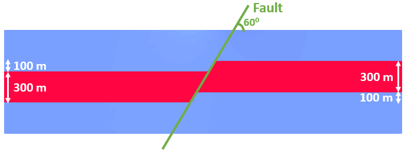
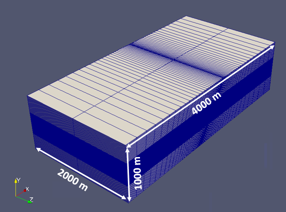
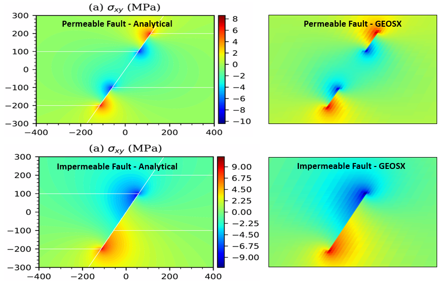

.. _faultVerification:

###########################################################
Verification of Induced Stresses Along a Fault
###########################################################

**Context**

In this example, we evaluate the induced stresses in a pressurized reservoir displaced by a normal fault (permeable or impermeable). This problem is solved using the poroelastic solver in GEOS to obtain the stress perturbations along the fault plane, which are verified against the corresponding analytical solution `(Wu et al., 2020)  <https://agupubs.onlinelibrary.wiley.com/doi/full/10.1029/2020JB020436>`__. 

**Input file**

The xml input files for the test case with impermeable fault are located at:

.. code-block:: console

  inputFiles/poromechanics/faultPoroelastic_base.xml
  inputFiles/poromechanics/impermeableFault_benchmark.xml

The xml input files for the test case with permeable fault are located at:

.. code-block:: console

  inputFiles/poromechanics/faultPoroelastic_base.xml
  inputFiles/poromechanics/permeableFault_benchmark.xml

A mesh file and a python script for post-processing the simulation results are also provided:

.. code-block:: console

  inputFiles/poromechanics/faultMesh.vtu

.. code-block:: console

  src/docs/sphinx/advancedExamples/validationStudies/faultMechanics/faultVerification/faultVerificationFigure.py

------------------------------------------------------------------
Description of the case
------------------------------------------------------------------

We simulate induced stresses along a normal fault in a pressurized reservoir and compare our results against an analytical solution.
In conformity to the analytical set-up, the reservoir is divided into two parts by an inclined fault. The fault crosses the entire domain, extending into the overburden and the underburden. The domain is horizontal, infinite, homogeneous, isotropic, and elastic. The reservoir is pressurized uniformely upon injection, and we neglect the transient effect of fluid flow. A pressure buildup is applied to: (i) the whole reservoir in the case of a permeable fault; (ii) the left compartment in the case of an impermeable fault. The overburden and underburden are impermeable (no pressure changes). Due to poromechanical effects, pore pressure changes in the reservoir cause a mechanical deformation of the entire domain. This deformation leads to a stress perturbation on the fault plane that could potentially trigger sliding of the fault. Here, the fault serves only as a flow boundary, and the mechanical separation of the fault plane (either by shear slippage or normal opening) is prohibited, like in the analytical example. For verification purposes, a plane strain deformation is considered in the numerical model.

.. _problemSketchFaultVerification:

   Sketch of the problem 

In this example, we set up and solve a poroelastic model to obtain the spatial solutions of displacement and stress fields across the domain upon pressurization. Changes of total stresses along the fault plane are evaluated and compared with the corresponding published work `(Wu et al., 2020)  <https://agupubs.onlinelibrary.wiley.com/doi/full/10.1029/2020JB020436>`__. 

For this example, we focus on the ``Mesh``,
the ``Constitutive``, and the ``FieldSpecifications`` tags.

------------------------------------------------------------------
Mesh
------------------------------------------------------------------

The following figure shows the mesh used in this problem.

.. _problemMeshFaultVerification:

   Imported mesh

Here, we load the mesh with ``VTKMesh``.
The syntax to import external meshes is simple: in the XML file,
the mesh file ``faultMesh.vtu`` is included with its relative or absolute path to the location of the GEOS XML file and a user-specified label (here ``FaultModel``) is given to the mesh object. This mesh contains quadrilateral elements and local refinement to conform with the fault geometry, and two reservoir compartments displaced by the fault. The size of the reservoir should be large enough to avoid boundary effects.

.. literalinclude:: ../../../../../../../inputFiles/poromechanics/impermeableFault_benchmark.xml
    :language: xml
    :start-after: <!-- SPHINX_MESH -->
    :end-before: <!-- SPHINX_MESH_END -->

--------------------------
Solid mechanics solver
--------------------------

GEOS is a multi-physics platform. Different combinations of
physics solvers available in the code can be applied
in different regions of the domain and be functional at different stages of the simulation.
The ``Solvers`` tag in the XML file is used to list and parameterize these solvers.

To specify a coupling between two different solvers, we define and characterize each single-physics solver separately.
Then, we customize a *coupling solver* between these single-physics
solvers as an additional solver.
This approach allows for generality and flexibility in constructing multi-physics solvers.
The order in which solvers are specified is not important in GEOS.
Note that end-users should give each single-physics solver a meaningful and distinct name, as GEOS will recognize these single-physics solvers based on their customized names to create the expected couplings.

As demonstrated in this example, to setup a poromechanical coupling, we need to define three different solvers in the XML file:

- the mechanics solver, a solver of type ``SolidMechanics_LagrangianFEM`` called here ``mechanicsSolver`` (more information here: :ref:`SolidMechanicsLagrangianFEM`),

.. literalinclude:: ../../../../../../../inputFiles/poromechanics/impermeableFault_benchmark.xml
  :language: xml
  :start-after: <!-- SPHINX_MECHANICALSOLVER -->
  :end-before: <!-- SPHINX_MECHANICALSOLVER_END -->

- the single-phase flow solver, a solver of type ``SinglePhaseFVM`` called here ``singlePhaseFlowSolver`` (more information on these solvers at :ref:`SinglePhaseFlow`),

.. literalinclude:: ../../../../../../../inputFiles/poromechanics/impermeableFault_benchmark.xml
  :language: xml
  :start-after: <!-- SPHINX_SINGLEPHASEFVM -->
  :end-before: <!-- SPHINX_SINGLEPHASEFVM_END -->

- the coupling solver (``SinglePhasePoromechanics``) that will bind the two single-physics solvers above, named ``poromechanicsSolver`` (more information at :ref:`PoroelasticSolver`).

.. literalinclude:: ../../../../../../../inputFiles/poromechanics/impermeableFault_benchmark.xml
  :language: xml
  :start-after: <!-- SPHINX_POROMECHANICSSOLVER -->
  :end-before: <!-- SPHINX_POROMECHANICSSOLVER_END -->

The two single-physics solvers are parameterized as explained
in their corresponding documents. 

In this example, let us focus on the coupling solver.
This solver (``poromechanicsSolver``) uses a set of attributes that specifically describe the coupling process within a poromechanical framework.
For instance, we must point this solver to the designated fluid solver (here: ``singlePhaseFlowSolver``) and solid solver (here: ``mechanicsSolver``).
These solvers are forced to interact with all the constitutive models in the target regions (here, we only have one, ``Domain``).
More parameters are required to characterize a coupling procedure (more information at :ref:`PoroelasticSolver`). This way, the two single-physics solvers will be simultaneously called and executed for solving the problem.

------------------------------------------------
Discretization methods for multiphysics solvers
------------------------------------------------

Numerical methods in multiphysics settings are similar to single physics numerical methods. In this problem, we use finite volume for flow and finite elements for solid mechanics. All necessary parameters for these methods are defined in the ``NumericalMethods`` section.

As mentioned before, the coupling solver and the solid mechanics solver require the specification of a discretization method called ``FE1``.
In GEOS, this discretization method represents a finite element method
using linear basis functions and Gaussian quadrature rules.
For more information on defining finite elements numerical schemes,
please see the dedicated :ref:`FiniteElement` section.

The finite volume method requires the specification of a discretization scheme.
Here, we use a two-point flux approximation scheme (``singlePhaseTPFA``), as described in the dedicated documentation (found here: :ref:`FiniteVolume`).

.. literalinclude:: ../../../../../../../inputFiles/poromechanics/faultPoroelastic_base.xml
  :language: xml
  :start-after: <!-- SPHINX_NUMERICAL -->
  :end-before: <!-- SPHINX_NUMERICAL_END -->

------------------------------
Constitutive laws
------------------------------

For this problem, a homogeneous and isotropic domain with one solid material is assumed for both the reservoir and its surroundings.  
The solid and fluid materials are named as ``rock`` and ``water`` respectively, and their mechanical properties are specified in the ``Constitutive`` section. ``PorousElasticIsotropic`` model is used to describe the linear elastic isotropic response of ``rock`` when subjected to fluid injection. And the single-phase fluid model ``CompressibleSinglePhaseFluid`` is selected to simulate the flow of ``water``.

.. literalinclude:: ../../../../../../../inputFiles/poromechanics/faultPoroelastic_base.xml
    :language: xml
    :start-after: <!-- SPHINX_MATERIAL -->
    :end-before: <!-- SPHINX_MATERIAL_END -->

All constitutive parameters such as density, viscosity, and Young's modulus are specified in the International System of Units.

-----------------------------------
Initial and boundary conditions
-----------------------------------

The next step is to specify fields, including:

  - The initial value (the in-situ stresses and pore pressure have to be initialized),
  - The boundary conditions (pressure buildup within the reservoir and constraints of the outer boundaries have to be set).

In this example, we need to specify isotropic horizontal total stress (:math:`\sigma_h` = -60.0 MPa and :math:`\sigma_H` = -60.0 MPa), vertical total stress (:math:`\sigma_v` = -70.0 MPa), and initial reservoir pressure (:math:`P_0` = 35.0 MPa). 
When initializing the model, a normal traction (``name="NormalTraction"``) of -70.0 MPa is imposed on the upper boundary (``setNames="{ 91 }"``) to reach mechanical equilibrium.
The lateral and lower boundaries are subjected to roller constraints.  
These boundary conditions are set up through the ``FieldSpecifications`` section.

.. literalinclude:: ../../../../../../../inputFiles/poromechanics/faultPoroelastic_base.xml
    :language: xml
    :start-after: <!-- SPHINX_BC -->
    :end-before: <!-- SPHINX_BC_END -->

In this example, the only difference between the impermeable fault and permeable fault cases is how to apply pressure buildup.
For the impermeable fault case, a constant pressure buildup is imposed to the left compartment of the reservoir (``objectPath="ElementRegions/Domain/97_hexahedra"``):

.. literalinclude:: ../../../../../../../inputFiles/poromechanics/impermeableFault_benchmark.xml
    :language: xml
    :start-after: <!-- SPHINX_INJECTION -->
    :end-before: <!-- SPHINX_INJECTION_END -->

For the permeable fault case, a constant pressure buildup is imposed to both compartments of the reservoir: (``objectPath="ElementRegions/Domain/97_hexahedra"`` and ``objectPath="ElementRegions/Domain/96_hexahedra"``): 

.. literalinclude:: ../../../../../../../inputFiles/poromechanics/permeableFault_benchmark.xml
    :language: xml
    :start-after: <!-- SPHINX_INJECTION -->
    :end-before: <!-- SPHINX_INJECTION_END -->

The parameters used in the simulation are summarized in the following table, which are specified in the
``Constitutive`` and ``FieldSpecifications`` sections. Note that stresses and traction have negative values, due to the negative sign convention for compressive stresses in GEOS.

+------------------+-----------------------------+------------------+--------------------+
| Symbol           | Parameter                   | Unit             | Value              |
+==================+=============================+==================+====================+
| :math:`E`        | Young's Modulus             | [GPa]            | 14.95              |
+------------------+-----------------------------+------------------+--------------------+
| :math:`\nu`      | Poisson's Ratio             | [-]              | 0.15               |
+------------------+-----------------------------+------------------+--------------------+
| :math:`\sigma_h` | Min Horizontal Stress       | [MPa]            | -60.0              |
+------------------+-----------------------------+------------------+--------------------+
| :math:`\sigma_H` | Max Horizontal Stress       | [MPa]            | -60.0              |
+------------------+-----------------------------+------------------+--------------------+
| :math:`\sigma_v` | Vertical Stress             | [MPa]            | -70.0              |
+------------------+-----------------------------+------------------+--------------------+
| :math:`p_0`      | Initial Reservoir Pressure  | [MPa]            | 35.0               |
+------------------+-----------------------------+------------------+--------------------+
| :math:`{\Delta}p`| Pressure Buildup            | [MPa]            | 20.0               |
+------------------+-----------------------------+------------------+--------------------+
| :math:`K_s`      | Grain Bulk Modulus          | [GPa]            | 71.2               |
+------------------+-----------------------------+------------------+--------------------+
| :math:`\theta`   | Fault Dip                   | [Degree]         | 60.0               |
+------------------+-----------------------------+------------------+--------------------+
| :math:`\kappa`   | Matrix Permeability         | [m\ :sup:`2`]    | 1.0*10\ :sup:`-18` |
+------------------+-----------------------------+------------------+--------------------+
| :math:`\phi`     | Porosity                    | [-]              | 0.3                |
+------------------+-----------------------------+------------------+--------------------+
| :math:`D_L`      | Domain Length               | [m]              | 4000.0             |
+------------------+-----------------------------+------------------+--------------------+
| :math:`D_W`      | Domain Width                | [m]              | 2000.0             |
+------------------+-----------------------------+------------------+--------------------+
| :math:`D_T`      | Domain Thickness            | [m]              | 1000.0             |
+------------------+-----------------------------+------------------+--------------------+
| :math:`Res_T`    | Reservoir Thickness         | [m]              | 300.0              |
+------------------+-----------------------------+------------------+--------------------+
| :math:`F_{off}`  | Fault Vertical Offset       | [m]              | 100.0              |
+------------------+-----------------------------+------------------+--------------------+

---------------------------------
Inspecting results
---------------------------------

We request VTK-format output files and use Paraview to visualize the results.
The following figure shows the distribution of resulting shear stress (:math:`\sigma_{xy}`) in the computational domain for two different cases (a permeable vs. an impermeable fault). Numerical solutions for both cases are also compared with the corresponding analytical solutions.

.. _problemFaultVerificationFig1:

   Simulation results of :math:`\sigma_{xy}`

The figure below compares the results from GEOS (marks) and the corresponding analytical solution (solid curves) for the change of total stresses (:math:`\sigma_{xx}`, :math:`\sigma_{yy}` and :math:`\sigma_{xy}`) along the fault plane. As shown, GEOS reliably captures the mechanical deformation of the faulted reservoir and shows excellent agreement with the analytical solutions for two different scenarios. Differences in the stress perturbations between the cases with permeable and impermeable fault are also noticeable, which suggests that fault permeability plays a crucial role in governing reservoir deformation for the problems with reservoir pressurization or depletion. 

.. plot:: docs/sphinx/advancedExamples/validationStudies/faultMechanics/faultVerification/faultVerificationFigure.py

------------------------------------------------------------------
To go further
------------------------------------------------------------------

**Feedback on this example**

For any feedback on this example, please submit a `GitHub issue on the project's GitHub page <https://github.com/GEOS-DEV/GEOS/issues>`_.
