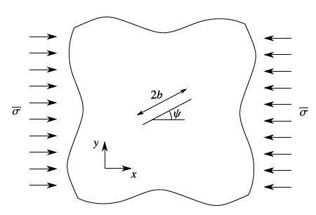
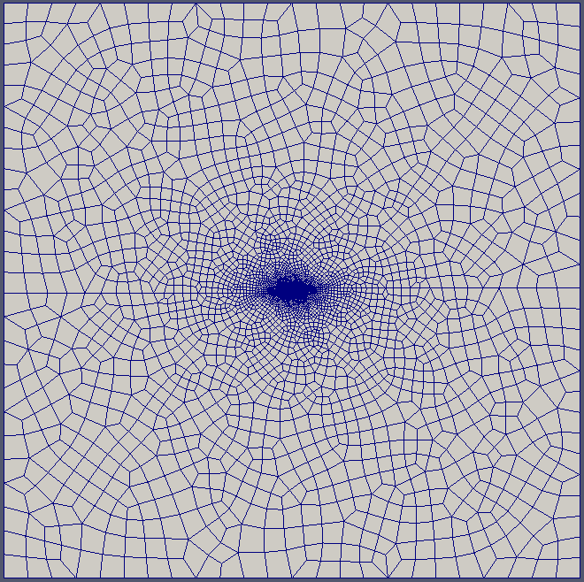
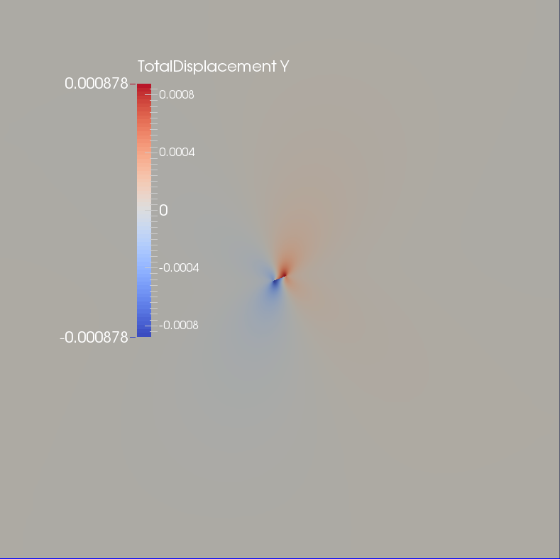
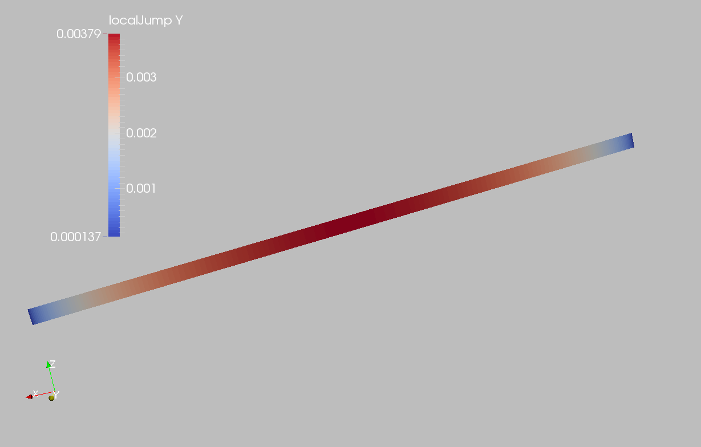

.. _ExamplesingleFracCompression:

####################################################
Single Fracture Under Shear Compression
####################################################

**Context**

In this example, a single fracture is simulated using a Lagrange contact model in a 2D infinite domain and subjected to a constant uniaxial compressive remote stress  `(Franceschini et al., 2020)  <https://www.sciencedirect.com/science/article/pii/S0045782520303467>`__. An analytical solution `(Phan et al., 2003)  <https://onlinelibrary.wiley.com/doi/10.1002/nme.707>`__ is available for verifying the accuracy of the numerical results, providing an analytical form for the normal traction and slip on the fracture surface due to frictional contact. In this example, the ``TimeHistory`` function and a Python script are used to output and postprocess multi-dimensional data (traction and displacement on the fracture surface).

**Input file**

Everything required is contained within these GEOS input files and one mesh file located at:

.. code-block:: console

  inputFiles/lagrangianContactMechanics/SingleFracCompression_base.xml

.. code-block:: console

  inputFiles/lagrangianContactMechanics/SingleFracCompression_benchmark.xml

.. code-block:: console

  inputFiles/lagrangianContactMechanics/ContactMechanics_SingleFracCompression_benchmark.xml

.. code-block:: console

  inputFiles/lagrangianContactMechanics/crackInPlane_benchmark.vtu

------------------------------------------------------------------
Description of the case
------------------------------------------------------------------

We simulate an inclined fracture under a compressive horizontal stress (:math:`\sigma`), as shown below. This fracture is placed in an infinite, homogeneous, isotropic, and elastic medium. Uniaxial compression and frictional contact on the fracture surface cause mechanical deformation to the surrounding rock and sliding along the fracture plane. For verification purposes, plane strain deformation and Coulomb failure criterion are considered in this numerical model.

.. _problemSketchSingleFracCompressionFig:

   Sketch of the problem 

To simulate this phenomenon, we use a Lagrange contact model. Displacement and stress fields on the fracture plane are calculated numerically. Predictions of the normal traction (:math:`t_N`) and slip (:math:`g_T`) on the fracture surface are compared with the corresponding analytical solution `(Phan et al., 2003)  <https://onlinelibrary.wiley.com/doi/10.1002/nme.707>`__. 

.. math::
   t_N = - \sigma {( \text{sin} \left( {\psi} \right) )}^{ 2 }

.. math::
   g_T = \frac{ 4 ( 1- {\nu}^{ 2 }) }{ E } {( \sigma \text{sin} \left( {\psi} \right) { ( \text{cos} \left( {\psi} \right) - \text{sin} \left( {\psi} \right) \text{tan} \left( {\theta} \right) )} )} \, \sqrt{ { b }^{ 2 } - { (b - \xi) }^{ 2 } }

where :math:`\psi` is the inclination angle, :math:`\nu` is Poisson's ratio, :math:`E` is Young's modulus, :math:`\theta` is the friction angle, :math:`b` is the fracture half-length, :math:`\xi` is a local coordinate on the fracture varying in the range [:math:`0`, :math:`2b`].

In this example, we focus our attention on the ``Mesh`` tags,
the ``Constitutive`` tags, and the ``FieldSpecifications`` tags.

------------------------------------------------------------------
Mesh
------------------------------------------------------------------

The following figure shows the mesh used in this problem.

.. _problemMeshSingleFracCompressionFig:

   Imported mesh

Here, we load the mesh with ``VTKMesh`` (see :ref:`ImportingExternalMesh`).
The syntax to import external meshes is simple: in the XML file,
the mesh file ``crackInPlane_benchmark.vtu`` is included with its relative or absolute path to the location of the GEOS XML file and a user-specified label (here ``CubeHex``) is given to the mesh object. This unstructured mesh contains quadrilaterals elements and interface elements. Refinement is performed to conform with the fracture geometry specified in the ``Geometry`` section.

.. literalinclude:: ../../../../../../../inputFiles/lagrangianContactMechanics/SingleFracCompression_benchmark.xml
    :language: xml
    :start-after: <!-- SPHINX_MESH -->
    :end-before: <!-- SPHINX_MESH_END -->

------------------------
Solid mechanics solver
------------------------

GEOS is a multi-physics platform. Different combinations of
physics solvers available in the code can be applied
in different regions of the domain and be functional at different stages of the simulation.
The ``Solvers`` tag in the XML file is used to list and parameterize these solvers.

To specify a coupling between two different solvers, we define and characterize each single-physics solver separately.
Then, we customize a *coupling solver* between these single-physics
solvers as an additional solver.
This approach allows for generality and flexibility in constructing multi-physics solvers.
Each single-physics solver should be given a meaningful and distinct name because GEOS recognizes these single-physics solvers
based on their given names to create the coupling.

To setup a coupling between rock and fracture deformations, we define three different solvers:

- For solving the frictional contact, we define a Lagrangian contact solver, called here ``lagrangiancontact``. In this solver, we specify ``targetRegions`` that includes both the continuum region ``Region`` and the discontinuum region ``Fracture``  where the solver is applied to couple rock and fracture deformation. The contact constitutive law used for the fracture elements is named ``fractureMaterial``,  and defined later in the ``Constitutive`` section. 

- Rock deformations are handled by a solid mechanics solver ``SolidMechanics_LagrangianFEM``. This solid mechanics solver (see :ref:`SolidMechanicsLagrangianFEM`) is based on the Lagrangian finite element formulation. The problem is run as ``QuasiStatic`` without considering inertial effects. The computational domain is discretized by ``FE1``, which is defined in the ``NumericalMethods`` section. The solid material is named ``rock``, and its mechanical properties are specified later in the ``Constitutive`` section. 

- The solver ``SurfaceGenerator`` defines the fracture region and rock toughness.

.. literalinclude:: ../../../../../../../inputFiles/lagrangianContactMechanics/ContactMechanics_SingleFracCompression_benchmark.xml
  :language: xml
  :start-after: <!-- SPHINX_SOLVER -->
  :end-before: <!-- SPHINX_SOLVER_END -->

------------------------------
Constitutive laws
------------------------------

For this specific problem, we simulate the elastic deformation and fracture slippage caused by uniaxial compression. A homogeneous and isotropic domain with one solid material is assumed, with mechanical properties specified in the ``Constitutive`` section. 

Fracture surface slippage is assumed to be governed by the Coulomb failure criterion. The contact constitutive behavior is named ``fractureMaterial`` in the ``Coulomb`` block, where cohesion ``cohesion="0.0"`` and friction coefficient ``frictionCoefficient="0.577350269"`` are specified. 

.. literalinclude:: ../../../../../../../inputFiles/lagrangianContactMechanics/SingleFracCompression_base.xml
    :language: xml
    :start-after: <!-- SPHINX_MATERIAL -->
    :end-before: <!-- SPHINX_MATERIAL_END -->

Recall that in the ``SolidMechanics_LagrangianFEM`` section, 
``rock`` is the material of the computational domain. 
Here, the isotropic elastic model ``ElasticIsotropic`` is used to simulate the mechanical behavior of ``rock``.

All constitutive parameters such as density, bulk modulus, and shear modulus are specified in the International System of Units.

------------------------------
Time history function
------------------------------

In the ``Tasks`` section, ``PackCollection`` tasks are defined to collect time history information from fields. 
Either the entire field or specified named sets of indices in the field can be collected. 
In this example, ``tractionCollection`` and ``displacementJumpCollection`` tasks are specified to output the local traction ``fieldName="traction"`` and relative displacement ``fieldName="displacementJump"`` on the fracture surface.

.. literalinclude:: ../../../../../../../inputFiles/lagrangianContactMechanics/SingleFracCompression_base.xml
    :language: xml
    :start-after: <!-- SPHINX_TASKS -->
    :end-before: <!-- SPHINX_TASKS_END -->

These two tasks are triggered using the ``Event`` management, with ``PeriodicEvent`` defined for these recurring tasks. 
GEOS writes two files named after the string defined in the ``filename`` keyword and formatted as HDF5 files (displacementJump_history.hdf5 and traction_history.hdf5). The TimeHistory file contains the collected time history information from each specified time history collector.
This information includes datasets for the simulation time, element center defined in the local coordinate system, and the time history information.
Then, a Python script is used to access and plot any specified subset of the time history data for verification and visualization. 

-----------------------------------------------------------
Initial and boundary conditions
-----------------------------------------------------------

The next step is to specify fields, including:

  - The initial value (the remote compressive stress needs to be initialized),
  - The boundary conditions (the constraints of the outer boundaries have to be set).

In this tutorial, we specify an uniaxial horizontal stress (:math:`\sigma_x` = -1.0e8 Pa).
The remaining parts of the outer boundaries are subjected to roller constraints.  
These boundary conditions are set up through the ``FieldSpecifications`` section.

.. literalinclude:: ../../../../../../../inputFiles/lagrangianContactMechanics/SingleFracCompression_base.xml
    :language: xml
    :start-after: <!-- SPHINX_BC -->
    :end-before: <!-- SPHINX_BC_END -->

Note that the remote stress has a negative value, due to the negative sign convention for compressive stresses in GEOS. 

 
The parameters used in the simulation are summarized in the following table.

+------------------+-------------------------+------------------+--------------------+
| Symbol           | Parameter               | Unit             | Value              |
+==================+=========================+==================+====================+
| :math:`K`        | Bulk Modulus            | [GPa]            | 16.67              |
+------------------+-------------------------+------------------+--------------------+
| :math:`G`        | Shear Modulus           | [GPa]            | 10.0               |
+------------------+-------------------------+------------------+--------------------+
| :math:`\sigma`   | Compressive Stress      | [MPa]            | -100.0             |
+------------------+-------------------------+------------------+--------------------+
| :math:`\theta`   | Friction Angle          | [Degree]         | 30.0               |
+------------------+-------------------------+------------------+--------------------+
| :math:`\psi`     | Inclination Angle       | [Degree]         | 20.0               |
+------------------+-------------------------+------------------+--------------------+
| :math:`b`        | Fracture Half Length    | [m]              | 1.0                |
+------------------+-------------------------+------------------+--------------------+

---------------------------------
Inspecting results
---------------------------------

We request VTK-format output files and use Paraview to visualize the results.
The following figure shows the distribution of :math:`u_{y}` in the computational domain.

.. _problemVerificationSingleFracCompressionFig1:

   Simulation result of :math:`u_{y}`

The next figure shows the distribution of relative shear displacement values on the fracture surface.

.. _problemVerificationSingleFracCompressionFig2:

   Simulation result of fracture slip 

The figure below shows a comparison between the numerical predictions (marks) and the corresponding analytical solutions (solid curves) for the normal traction (:math:`t_N`) and slip (:math:`g_T`) distributions on the fracture surface. One can observe that the numerical results obtained by GEOS and the analytical solutions are nearly identical.

.. plot:: docs/sphinx/advancedExamples/validationStudies/faultMechanics/singleFracCompression/singleFracCompressionFigure.py

------------------------------------------------------------------
To go further
------------------------------------------------------------------

**Feedback on this example**

For any feedback on this example, please submit a `GitHub issue on the project's GitHub page <https://github.com/GEOS-DEV/GEOS/issues>`_.

