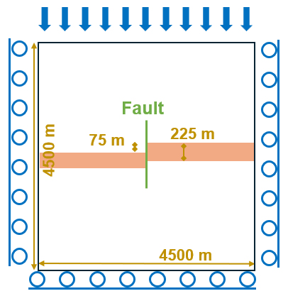
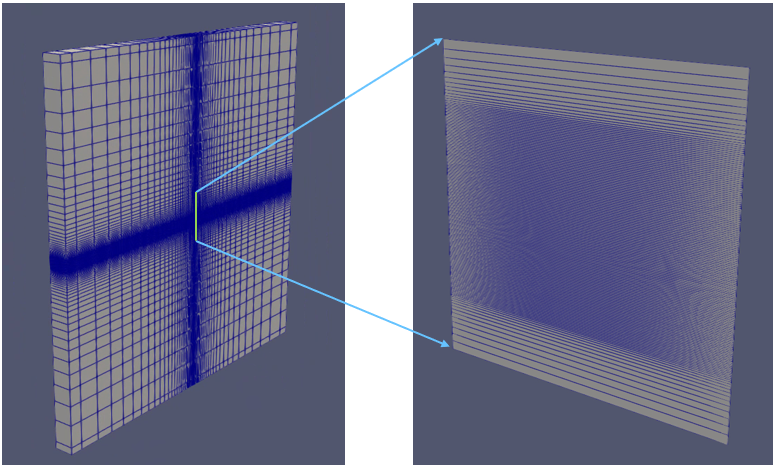
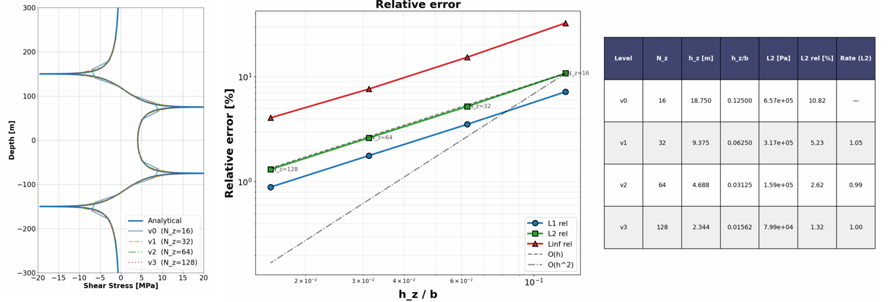

.. _stableVerticalFault:

###########################################################
Shear Stress Along a Stable Vertical Fault
###########################################################

**Context**

In this example, the Augmented Lagrangian Method (ALM) `(Frigo et al., 2026)  <https://www.sciencedirect.com/science/article/abs/pii/S0021999126003414>`__ is applied to solve a friction and stable fault contact problem in a depleted reservoir. This approach employs conformal discretization where discontinuities are explicitly represented by 2D interface elements placed between 3D continuum elements. The formulation overcomes the inf-sup instability of low-order discretizations by satisfying the Babuška–Brezzi condition via displacement enrichment with bubble functions and is coupled with a Coulomb friction law. Implemented in GEOS, the model computes stress perturbations (normal and shear components) along the stable fault, which are subsequently verified against the corresponding analytical solution `(Jansen and Meulenbroek, 2022)  <https://njgjournal.nl/index.php/njg/article/view/11453/17972>`__. This comparison confirms the accuracy of our fault contact model and coupled poroelastic formulation.

**Input file**

The xml input files for the test case with external workflow are located at:

.. code-block:: console

  inputFiles/poromechanicsFractures/Contact/AugmentedLagrangianMultipliers/ALM_verticalFault_base.xml
  inputFiles/poromechanicsFractures/Contact/AugmentedLagrangianMultipliers/verticalFault_stable_ESG_benchmark.xml

The xml input files for the test case with internal workflow are located at:

.. code-block:: console

  inputFiles/poromechanicsFractures/Contact/AugmentedLagrangianMultipliers/ALM_verticalFault_base.xml
  inputFiles/poromechanicsFractures/Contact/AugmentedLagrangianMultipliers/verticalFault_stable_ISG_benchmark.xml

Corresponding mesh files and a python script for post-processing the simulation results are also provided:

.. code-block:: console

  inputFiles/poromechanicsFractures/MESH

.. code-block:: console

  src/docs/sphinx/advancedExamples/validationStudies/faultMechanics/stableVerticalFault/stableFaultFigure.py

------------------------------------------------------------------
Description of the case
------------------------------------------------------------------

We simulate induced stresses and shear slip along a vertical fault in a depleted reservoir and compare our results against an analytical solution.
In conformity to the analytical set-up, the reservoir is divided into two parts by a vertical fault. The fault crosses and offsets the entire reservoir layer and well contained with the domain. The domain is infinite, homogeneous, isotropic, and elastic. The reservoir is depressurized uniformely upon depletion, and we neglect the transient effect of fluid flow. A pressure drop is applied to the reservoir layer located in the center of the domain. The overburden and underburden are impermeable, and no pressure changes occur in these layers. Due to poromechanical effects, pore pressure changes in the reservoir cause a mechanical deformation of the entire domain. This deformation leads to a stress (normal and shear) perturbation on the fault plane, potentially leading to fault reactivation. For verification, the numerical model considers plane strain deformation and the Coulomb failure criterion.

.. _problemSketchStableVerticalFault:

   Sketch of the problem 

In this example, a poroelastic model is established to evaluate the spatial evolution of displacement and stress fields associated with reservoir depletion. 
A stable fault regime is enforced by assigning friction and cohesion parameters that inhibit fault reactivation. 
Depletion induces stress changes along fault planes in contact with the reservoir, with stress concentrations observed at the interface between the reservoir layers and the overburden and underburden.
Simulations are performed using two distinct GEOS workflows, and the results are validated against the study of `(Jansen and Meulenbroek, 2022)  <https://njgjournal.nl/index.php/njg/article/view/11453/17972>`__

For this example, we focus on the ``Mesh``,
the ``Constitutive``, and the ``FieldSpecifications`` tags.

------------------------------------------------------------------
Mesh
------------------------------------------------------------------

The following figure shows the mesh used in this problem.
The domain modeled here measures 4,500 m x 4,500 m x 500 m and is discretized into 17,220 hexahedral elements. 
The vertical fault plane is divided into 156 surface elements. The mesh is refined locally to match the geometry of the two reservoir compartments displaced by the vertical fault. The reservoir has a thickness of 225 m, and the fault throw is 75 m.

.. _problemStableVerticalFault:

   Imported mesh

Here, we load the mesh with ``VTKMesh``.

For the external workflow, the mesh file ``verticalFault_ESG_benchmark.vtm`` is included with its relative or absolute path to the location of the GEOS XML file and a user-specified label (here ``mesh1``) is given to the mesh object. 

.. literalinclude:: ../../../../../../../inputFiles/poromechanicsFractures/Contact/AugmentedLagrangianMultipliers/verticalFault_stable_ESG_benchmark.xml
    :language: xml
    :start-after: <!-- SPHINX_MESH -->
    :end-before: <!-- SPHINX_MESH_END -->

The vtm file ``verticalFault_ESG_benchmark.vtm`` references two separate mesh files: the damain mesh ``Domain_verticalFault_benchmark.vtu`` and the fault mesh ``Fault_verticalFault_benchmark.vtu``, which are generated prior to running the GEOS simulation. The ``mesh doctor`` module provides a convenient way to prepare these meshes. For this case, functions ``generateFractures`` and ``generateGlobalIds`` are used (more information here: `mesh doctor  <https://geosx-geosx.readthedocs-hosted.com/projects/geosx-geospythonpackages/en/latest/mesh-doctor.html#>`__).

For internal workflow, only the domain mesh file ``verticalFault_ISG_benchmark.vtu`` is imported

.. literalinclude:: ../../../../../../../inputFiles/poromechanicsFractures/Contact/AugmentedLagrangianMultipliers/verticalFault_stable_ISG_benchmark.xml
    :language: xml
    :start-after: <!-- SPHINX_MESH -->
    :end-before: <!-- SPHINX_MESH_END -->

The fault mesh is then generated within GEOS using ``SurfaceGenerator``

.. literalinclude:: ../../../../../../../inputFiles/poromechanicsFractures/Contact/AugmentedLagrangianMultipliers/verticalFault_stable_ISG_benchmark.xml
    :language: xml
    :start-after: <!-- SPHINX_SURFACEGENERATOR -->
    :end-before: <!-- SPHINX_SURFACEGENERATOR_END -->

Note that the attribute ``nodesetNames="{ faultNodes }"`` must be included in the domain mesh file to define the location and extent of the fault plane. The ``ruptureState`` condition must be specified for this area in the following ``FieldSpecification`` block:

.. literalinclude:: ../../../../../../../inputFiles/poromechanicsFractures/Contact/AugmentedLagrangianMultipliers/verticalFault_stable_ISG_benchmark.xml
    :language: xml
    :start-after: <!-- SPHINX_FAULT -->
    :end-before: <!-- SPHINX_FAULT_END -->

--------------------------
Solid mechanics solver
--------------------------

GEOS is a multi-physics platform. Different combinations of
physics solvers available in the code can be applied
in different regions of the domain and be functional at different stages of the simulation.
The ``Solvers`` tag in the XML file is used to list and parameterize these solvers.

To specify a coupling between two different solvers, we define and characterize each single-physics solver separately.
Then, we customize a *coupling solver* between these single-physics
solvers as an additional solver.
This approach allows for generality and flexibility in constructing multi-physics solvers.
The order in which solvers are specified is not important in GEOS.
Note that end-users should give each single-physics solver a meaningful and distinct name, as GEOS will recognize these single-physics solvers based on their customized names to create the expected couplings.

As demonstrated in this example, to setup a poromechanical coupling, we need to define three different solvers in the XML file:

- the mechanics solver, a solver of type ``SolidMechanicsAugmentedLagrangianContact`` called here ``fractureMechSolver``, is applied to solve the frictional contact and rock deformations. In this solver, we specify ``targetRegions`` that include both the continuum region ``Region`` and the discontinuum region ``Fault``  where the solver is applied to couple rock and fracture deformations. The contact constitutive law used for the fault elements is named ``fractureContact``,  and is defined later in the ``Constitutive`` section. 

.. literalinclude:: ../../../../../../../inputFiles/poromechanicsFractures/Contact/AugmentedLagrangianMultipliers/ALM_verticalFault_base.xml
  :language: xml
  :start-after: <!-- SPHINX_MECHANICALSOLVER -->
  :end-before: <!-- SPHINX_MECHANICALSOLVER_END -->

- the single-phase flow solver, a solver of type ``SinglePhaseFVM`` called here ``singlePhaseFlowSolver`` (more information on these solvers at :ref:`SinglePhaseFlow`),

.. literalinclude:: ../../../../../../../inputFiles/poromechanicsFractures/Contact/AugmentedLagrangianMultipliers/ALM_verticalFault_base.xml
  :language: xml
  :start-after: <!-- SPHINX_SINGLEPHASEFVM -->
  :end-before: <!-- SPHINX_SINGLEPHASEFVM_END -->

- the coupling solver (``SinglePhasePoromechanicsConformingFracturesALM``) that will bind the two single-physics solvers above, named ``poroFractureSolver`` (more information at :ref:`PoroelasticSolver`).

.. literalinclude:: ../../../../../../../inputFiles/poromechanicsFractures/Contact/AugmentedLagrangianMultipliers/ALM_verticalFault_base.xml
  :language: xml
  :start-after: <!-- SPHINX_POROMECHANICSSOLVER -->
  :end-before: <!-- SPHINX_POROMECHANICSSOLVER_END -->

The two single-physics solvers are parameterized as explained
in their corresponding documents. 

In this example, let us focus on the coupling solver.
This solver (``poroFractureSolver``) uses a set of attributes that specifically describe the coupling process within a poromechanical framework.
For instance, we must point this solver to the designated fluid solver (here: ``singlePhaseFlowSolver``) and solid solver (here: ``fractureMechSolver``).
These solvers are forced to interact with all the constitutive models in the target regions (here, we only two, ``Region`` and ``Fault``).
More parameters are required to characterize a coupling procedure (more information at :ref:`PoroelasticSolver`). This way, the two single-physics solvers will be simultaneously called and executed for solving the problem.

------------------------------------------------
Discretization methods for multiphysics solvers
------------------------------------------------

Numerical methods in multiphysics settings are similar to single physics numerical methods. In this problem, we use finite volume for flow and finite elements for solid mechanics. All necessary parameters for these methods are defined in the ``NumericalMethods`` section.

As mentioned before, the coupling solver and the solid mechanics solver require the specification of a discretization method called ``FE1``.
In GEOS, this discretization method represents a finite element method
using linear basis functions and Gaussian quadrature rules.
For more information on defining finite elements numerical schemes,
please see the dedicated :ref:`FiniteElement` section.

The finite volume method requires the specification of a discretization scheme.
Here, we use a two-point flux approximation scheme (``singlePhaseTPFA``), as described in the dedicated documentation (found here: :ref:`FiniteVolume`).

.. literalinclude:: ../../../../../../../inputFiles/poromechanicsFractures/Contact/AugmentedLagrangianMultipliers/ALM_verticalFault_base.xml
  :language: xml
  :start-after: <!-- SPHINX_NUMERICAL -->
  :end-before: <!-- SPHINX_NUMERICAL_END -->

------------------------------
Constitutive laws
------------------------------

For this problem, a homogeneous and isotropic domain with one solid material is assumed for both the reservoir and its surroundings.  
The solid and fluid materials are named as ``rock`` and ``water`` respectively, and their mechanical properties are specified in the ``Constitutive`` section. ``PorousElasticIsotropic`` model is used to describe the linear elastic isotropic response of ``rock`` when subjected to reservoir depletion. And the single-phase fluid model ``CompressibleSinglePhaseFluid`` is selected to simulate the flow of ``water``.

.. literalinclude:: ../../../../../../../inputFiles/poromechanicsFractures/Contact/AugmentedLagrangianMultipliers/verticalFault_stable_ESG_benchmark.xml
    :language: xml
    :start-after: <!-- SPHINX_MATERIAL -->
    :end-before: <!-- SPHINX_MATERIAL_END -->

All constitutive parameters such as density, viscosity, and Young's modulus are specified in the International System of Units.

-----------------------------------
Initial and boundary conditions
-----------------------------------

The next step is to specify fields, including:

  - The initial value (the in-situ stresses and pore pressure have to be initialized),
  - The boundary conditions (pressure drop within the reservoir and constraints of the outer boundaries have to be set).

In this example, we need to specify isotropic horizontal total stress (:math:`\sigma_h` = -60.0 MPa and :math:`\sigma_H` = -60.0 MPa), vertical total stress (:math:`\sigma_v` = -70.0 MPa), and initial reservoir pressure (:math:`P_0` = 35.0 MPa). 
When initializing the model, a normal traction (``name="NormalTraction"``) of -70.0 MPa is imposed on the upper boundary (``setNames="{ zposFace }"``) to reach mechanical equilibrium.
The lateral and lower boundaries are subjected to roller constraints.  
These boundary conditions are set up through the ``FieldSpecifications`` section.

.. literalinclude:: ../../../../../../../inputFiles/poromechanicsFractures/Contact/AugmentedLagrangianMultipliers/ALM_verticalFault_base.xml
    :language: xml
    :start-after: <!-- SPHINX_BC -->
    :end-before: <!-- SPHINX_BC_END -->

The parameters used in the simulation are summarized in the following table, which are specified in the
``Constitutive`` and ``FieldSpecifications`` sections. Note that stresses and traction have negative values, due to the negative sign convention for compressive stresses in GEOS.

+------------------+-----------------------------+------------------+--------------------+
| Symbol           | Parameter                   | Unit             | Value              |
+==================+=============================+==================+====================+
| :math:`E`        | Young's Modulus             | [GPa]            | 14.95              |
+------------------+-----------------------------+------------------+--------------------+
| :math:`\nu`      | Poisson's Ratio             | [-]              | 0.15               |
+------------------+-----------------------------+------------------+--------------------+
| :math:`\sigma_h` | Min Horizontal Stress       | [MPa]            | -60.0              |
+------------------+-----------------------------+------------------+--------------------+
| :math:`\sigma_H` | Max Horizontal Stress       | [MPa]            | -60.0              |
+------------------+-----------------------------+------------------+--------------------+
| :math:`\sigma_v` | Vertical Stress             | [MPa]            | -70.0              |
+------------------+-----------------------------+------------------+--------------------+
| :math:`p_0`      | Initial Reservoir Pressure  | [MPa]            | 35.0               |
+------------------+-----------------------------+------------------+--------------------+
| :math:`{\Delta}p`| Pressure Drop               | [MPa]            | 25.0               |
+------------------+-----------------------------+------------------+--------------------+
| :math:`K_s`      | Grain Bulk Modulus          | [GPa]            | 71.2               |
+------------------+-----------------------------+------------------+--------------------+
| :math:`\theta`   | Fault Dip                   | [Degree]         | 0.0                |
+------------------+-----------------------------+------------------+--------------------+
| :math:`\kappa`   | Matrix Permeability         | [m\ :sup:`2`]    | 1.0*10\ :sup:`-18` |
+------------------+-----------------------------+------------------+--------------------+
| :math:`\phi`     | Porosity                    | [-]              | 0.15               |
+------------------+-----------------------------+------------------+--------------------+
| :math:`D_L`      | Domain Length               | [m]              | 4500.0             |
+------------------+-----------------------------+------------------+--------------------+
| :math:`D_W`      | Domain Width                | [m]              | 4500.0             |
+------------------+-----------------------------+------------------+--------------------+
| :math:`D_T`      | Domain Thickness            | [m]              | 500.0              |
+------------------+-----------------------------+------------------+--------------------+
| :math:`Res_T`    | Reservoir Thickness         | [m]              | 225.0              |
+------------------+-----------------------------+------------------+--------------------+
| :math:`F_{off}`  | Fault Vertical Offset       | [m]              | 75.0               |
+------------------+-----------------------------+------------------+--------------------+
| :math:`\mu`      | Friction Coefficient        | [-]              | 1.0                |
+------------------+-----------------------------+------------------+--------------------+
| :math:`c`        | Cohesion                    | [MPa]            | 5.0                |
+------------------+-----------------------------+------------------+--------------------+

---------------------------------
Inspecting results
---------------------------------

The figure below compares GEOS simulations (dashed lines) with analytical solutions (solid curves) for shear stress along a stable fault plane. The results show that GEOS accurately reproduces the mechanical response of the faulted reservoir and exhibits excellent agreement with the analytical solutions for both workflows. 

.. plot:: docs/sphinx/advancedExamples/validationStudies/faultMechanics/stableVerticalFault/stableFaultFigure.py

A convergence study is also performed. For isotropic meshes (aspect ratio ≈ 1 in the x–z plane), the L2 error norm closely follows the theoretical rate, validating the accuracy of the ALM solver.

.. _problemSketchStableVerticalFaultFig1:

   Convergence of the relative 𝐿2-error for shear stress

------------------------------------------------------------------
To go further
------------------------------------------------------------------

**Feedback on this example**

For any feedback on this example, please submit a `GitHub issue on the project's GitHub page <https://github.com/GEOS-DEV/GEOS/issues>`_.
