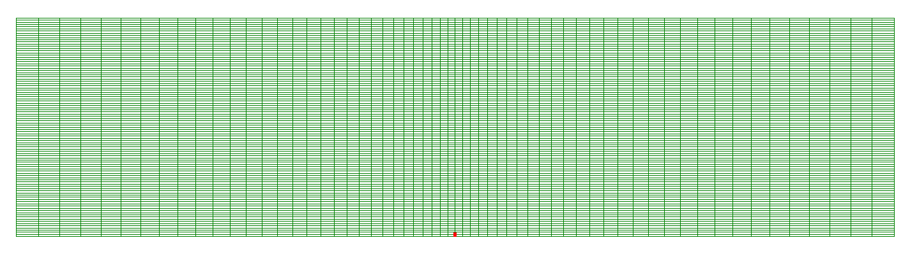

.. _kgdToughnessDominated:

#######################################################
Toughness dominated KGD hydraulic fracture
#######################################################

------------------------------------------------------------------
Description of the case
------------------------------------------------------------------

In this example, we consider a plane-strain hydraulic fracture propagating in an infinite, homogeneous and elastic medium,  due to fluid injection at a rate :math:`Q_0` during a period from 0 to :math:`t_{max}`. Two dimensional KGD fracture is characterized as a vertical fracture with a rectangle-shaped cross section. For verification purpose, the presented numerical model is restricted to the assumptions used to analytically solve this problem `(Bunger et al., 2005) <https://link.springer.com/article/10.1007%2Fs10704-005-0154-0>`__. Vertical and impermeable fracture surface is assumed, which eliminate the effect of fracture plane inclination and fluid leakoff. The injected fluid flows within the fracture, which is assumed to be governed by the lubrication equation resulting from the mass conservation and the Poiseuille law. Fracture profile is related to fluid pressure distribution, which is mainly dictated by fluid viscosity :math:`\mu`. In addition, fluid pressure contributes to the fracture development through the mechanical deformation of the solid matrix, which is characterized by rock elastic properties, including the Young modulus :math:`E`, and the Poisson ratio :math:`\nu`.

For toughness-dominated fractures, more work is spent to split the intact rock than that applied to move the fracturing fluid. To make the case identical to the toughness dominated asymptotic solution, incompressible fluid with an ultra-low viscosity of 0.001 cp and medium rock toughness should be defined. Fracture is propagating with the creation of new surface if the stress intensity factor exceeds rock toughness :math:`K_{Ic}`.

In toughness-storage dominated regime, asymptotic solutions of the fracture length :math:`\ell`, the net pressure :math:`p_0` and the fracture aperture :math:`w_0` at the injection point for the KGD fracture are provided by `(Bunger et al., 2005) <https://link.springer.com/article/10.1007%2Fs10704-005-0154-0>`__:

.. math::
   \ell = 0.9324 X^{ -1/6 } (\frac{ E_p Q_0^3 }{ 12\mu })^{ 1/6 } t^{ 2/3 }

   w_0^2 = 0.5 X^{ 1/2 } (\frac{ 12\mu Q_0 }{ E_p })^{ 1/2 } \ell

   w_0 p_0 = 0.125 X^{ 1/2 } (12\mu Q_0 E_p)^{ 1/2 }

where the plane modulus :math:`E_p` is defined by

.. math:: E_p = \frac{ E }{ 1-\nu^2 }

and the term :math:`X` is given as:

.. math:: X = \frac{ 256 }{ 3 \pi^2 } \frac{ K_{Ic}^4 }{ \mu Q_0 {E_p}^3 }

**Input file**

The input xml files for this test case are located at:

.. code-block:: console

  inputFiles/hydraulicFracturing/kgdToughnessDominated_base.xml

and

.. code-block:: console

  inputFiles/hydraulicFracturing/kgdToughnessDominated_benchmark.xml

The corresponding integrated test with coarser mesh and smaller injection duration is also prepared:

.. code-block:: console

  inputFiles/hydraulicFracturing/kgdToughnessDominated_Smoke.xml

Python scripts for post-processing and visualizing the simulation results are also prepared:

.. code-block:: console

  inputFiles/hydraulicFracturing/scripts/hydrofractureQueries.py

.. code-block:: console

  inputFiles/hydraulicFracturing/scripts/hydrofractureFigure.py

-----------------------------------------------------------
Mechanics solvers
-----------------------------------------------------------

The solver ``SurfaceGenerator`` defines rock toughness :math:`K_{Ic}` as:

.. literalinclude:: ../../../../../../../inputFiles/hydraulicFracturing/kgdToughnessDominated_base.xml
  :language: xml
  :start-after: <!-- Sphinx_Solvers_SurfaceGenerator -->
  :end-before:  <!-- Sphinx_Solvers_SurfaceGenerator_End -->

Rock and fracture deformation are modeled by the solid mechanics solver ``SolidMechanicsLagrangianSSLE``. In this solver, we define ``targetRegions`` that includes both the continuum region and the fracture region. The name of the contact constitutive behavior is also specified in this solver by the ``contactRelationName``, besides the ``solidMaterialNames``.

.. literalinclude:: ../../../../../../../inputFiles/hydraulicFracturing/kgdToughnessDominated_base.xml
  :language: xml
  :start-after: <!-- Sphinx_Solvers_SolidMechanicsLagrangianSSLE -->
  :end-before:  <!-- Sphinx_Solvers_SolidMechanicsLagrangianSSLE_End -->

The single phase fluid flow inside the fracture is solved by the finite volume method in the solver ``SinglePhaseFVM`` as:

.. literalinclude:: ../../../../../../../inputFiles/hydraulicFracturing/kgdToughnessDominated_base.xml
  :language: xml
  :start-after: <!-- Sphinx_Solvers_SinglePhaseFVM -->
  :end-before:  <!-- Sphinx_Solvers_SinglePhaseFVM_End -->

All these elementary solvers are combined in the solver ``Hydrofracture`` to model the coupling between fluid flow within the fracture, rock deformation, fracture opening/closure and propagation. A fully coupled scheme is defined by setting a flag ``FIM`` for ``couplingTypeOption``.

.. literalinclude:: ../../../../../../../inputFiles/hydraulicFracturing/kgdToughnessDominated_base.xml
  :language: xml
  :start-after: <!-- Sphinx_Solvers_Hydrofracture -->
  :end-before:  <!-- Sphinx_Solvers_Hydrofracture_End -->

-----------------------------------------------------------
The constitutive laws
-----------------------------------------------------------

The constitutive law ``CompressibleSinglePhaseFluid`` defines the default and reference fluid viscosity, compressibility and density. For this toughness dominated example, ultra low fluid viscosity is used:

.. literalinclude:: ../../../../../../../inputFiles/hydraulicFracturing/kgdToughnessDominated_base.xml
  :language: xml
  :start-after: <!-- Sphinx_Constitutive_CompressibleSinglePhaseFluid -->
  :end-before:  <!-- Sphinx_Constitutive_CompressibleSinglePhaseFluid_End -->

The isotropic elastic Young modulus and Poisson ratio are defined in the ``ElasticIsotropic`` block. The density of rock defined in this block is useless, as gravity effect is ignored in this example.

.. literalinclude:: ../../../../../../../inputFiles/hydraulicFracturing/kgdToughnessDominated_base.xml
  :language: xml
  :start-after: <!-- Sphinx_Constitutive_ElasticIsotropic -->
  :end-before:  <!-- Sphinx_Constitutive_ElasticIsotropic_End -->

-----------------------------------------------------------
Mesh
-----------------------------------------------------------

Internal mesh generator is used to generate the geometry of this example. The domain size is large enough comparing to the final size of the fracture. A sensitivity analysis has shown that the domain size in the direction perpendicular to the fracture plane, i.e. x-axis, must be at least ten times of the final fracture half-length to minimize the boundary effect. However, smaller size along the fracture plane, i.e. y-axis, of only two times the fracture half-length is good enough. It is also important to note that at least two layers are required in z-axis to ensure a good match between the numerical results and analytical solutions, due to the node based fracture propagation criterion. Also in x-axis, bias parameter ``xBias`` is added for optimizing the mesh by refining the elements near the fracture plane.

.. literalinclude:: ../../../../../../../inputFiles/hydraulicFracturing/kgdToughnessDominated_benchmark.xml
  :language: xml
  :start-after: <!-- Sphinx_Mesh_InternalMesh -->
  :end-before:  <!-- Sphinx_Mesh_InternalMesh_End -->

-----------------------------------------------------------
Defining the initial fracture
-----------------------------------------------------------

The initial fracture is defined by a nodeset occupying a small area where the KGD fracture starts to propagate:

.. literalinclude:: ../../../../../../../inputFiles/hydraulicFracturing/kgdToughnessDominated_benchmark.xml
  :language: xml
  :start-after: <!-- Sphinx_Geometry_InitFracture -->
  :end-before:  <!-- Sphinx_Geometry_InitFracture_End -->

This initial ``ruptureState`` condition must be specified for this area in the following ``FieldSpecification`` block:

.. literalinclude:: ../../../../../../../inputFiles/hydraulicFracturing/kgdToughnessDominated_base.xml
  :language: xml
  :start-after: <!-- Sphinx_FieldSpecifications_InitFracture -->
  :end-before:  <!-- Sphinx_FieldSpecifications_InitFracture_End -->

-----------------------------------------------------------
Defining the fracture plane
-----------------------------------------------------------

The plane within which the KGD fracture propagates is predefined to reduce the computational cost. The fracture plane is outlined by a separable nodeset by the following initial ``FieldSpecification`` condition:

.. literalinclude:: ../../../../../../../inputFiles/hydraulicFracturing/kgdToughnessDominated_benchmark.xml
  :language: xml
  :start-after: <!-- Sphinx_Geometry_FracturePlane -->
  :end-before:  <!-- Sphinx_Geometry_FracturePlane_End -->

.. literalinclude:: ../../../../../../../inputFiles/hydraulicFracturing/kgdToughnessDominated_base.xml
  :language: xml
  :start-after: <!-- Sphinx_FieldSpecifications_FracturePlane -->
  :end-before:  <!-- Sphinx_FieldSpecifications_FracturePlane_End -->

-----------------------------------------------------------
Defining the injection rate
-----------------------------------------------------------

Fluid is injected into a sub-area of the initial fracture. Only half of the injection rate is defined in this boundary condition because only half-wing of the KGD fracture is modeled regarding its symmetry. Hereby, the mass injection rate is actually defined, instead of the volume injection rate. More precisely, the value given for ``scale`` is :math:`Q_0 \rho_f/2` (not :math:`Q_0 /2`).

.. literalinclude:: ../../../../../../../inputFiles/hydraulicFracturing/kgdToughnessDominated_base.xml
  :language: xml
  :start-after: <!-- Sphinx_SourceFlux_InjSource -->
  :end-before:  <!-- Sphinx_SourceFlux_InjSource_End -->

------------------------------
Time history function
------------------------------

In the ``Tasks`` section, ``PackCollection`` tasks are defined to collect time history information from fields. 
Either the entire field or specified named sets of indices in the field can be collected.
In this example, ``pressureCollection``, ``apertureCollection``, ``hydraulicApertureCollection`` and ``areaCollection`` are specified to output the time history of fracture characterisctics (pressure, width and area). 
``objectPath="ElementRegions/Fracture/FractureSubRegion"`` indicates that these ``PackCollection`` tasks are applied to the fracure element subregion.

.. literalinclude:: ../../../../../../../inputFiles/hydraulicFracturing/kgdToughnessDominated_base.xml
    :language: xml
    :start-after: <!-- SPHINX_TASKS -->
    :end-before: <!-- SPHINX_TASKS_END -->

These tasks are triggered using the ``Event`` manager with a ``PeriodicEvent`` defined for the recurring tasks. 
GEOS writes one file named after the string defined in the ``filename`` keyword and formatted as a HDF5 file (``kgdToughnessDominated_output.hdf5``). This TimeHistory file contains the collected time history information from specified time history collector.
This file includes datasets for the simulation time, fluid pressure, element aperture, hydraulic aperture and element area for the propagating hydraulic fracture.
A Python script is prepared to read and query any specified subset of the time history data for verification and visualization. 

The parameters used in the simulation are summarized in the following table.

  +----------------+-----------------------+--------------------+-------------------+
  | Symbol         | Parameter             | Units              | Value             |
  +================+=======================+====================+===================+
  | :math:`Q_0`    | Injection rate        | [m\ :sup:`3`/s]    | 10\ :sup:`-4`     |
  +----------------+-----------------------+--------------------+-------------------+
  | :math:`E`      | Young's modulus       | [GPa]              | 30                |
  +----------------+-----------------------+--------------------+-------------------+
  | :math:`\nu`    | Poisson's ratio       | [ - ]              | 0.25              |
  +----------------+-----------------------+--------------------+-------------------+
  | :math:`\mu`    | Fluid viscosity       | [Pa.s]             | 10\ :sup:`-6`     |
  +----------------+-----------------------+--------------------+-------------------+
  | :math:`K_{Ic}` | Rock toughness        | [MPa.m\ :sup:`1/2`]| 1                 |
  +----------------+-----------------------+--------------------+-------------------+

---------------------------------
Inspecting results
---------------------------------

Fracture propagation during the fluid injection period is shown in the figure below.

First, by running the query script 

.. code-block:: console

   python ./hydrofractureQueries.py kgdToughnessDominated

the HDF5 output is postprocessed and temporal evolution of fracture characterisctics (fluid pressure and fracture width at fluid inlet and fracure half length) are saved into a txt file ``model-results.txt``, which can be used for verification and visualization:

.. code-block:: console
		
  [['      time', '  pressure', '  aperture', '    length']]
           2 4.086e+05 8.425e-05         2
           4 3.063e+05 0.0001021         3
           6 3.121e+05 0.0001238       3.5
           8 2.446e+05 0.0001277       4.5
          10 2.411e+05 0.0001409         5

Note: GEOS python tools ``geosx_xml_tools`` should be installed to run the query script (See `Python Tools Setup <https://geosx-geosx.readthedocs-hosted.com/projects/geosx-geospythonpackages/en/latest/>`_ for details). 

A good agreement between GEOS results and analytical solutions is shown in the comparison below, which is generated using the visualization script:

.. code-block:: console

   python ./kgdToughnessDominatedFigure.py

.. plot:: docs/sphinx/advancedExamples/validationStudies/hydraulicFracture/kgdToughnessDominated/kgdToughnessDominatedFigure.py

------------------------------------------------------------------
To go further
------------------------------------------------------------------

**Feedback on this example**

This concludes the toughness dominated KGD example.
For any feedback on this example, please submit a `GitHub issue on the project's GitHub page <https://github.com/GEOS-DEV/GEOS/issues>`_.
