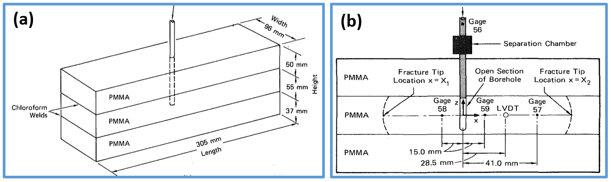

.. _kgdExperimentValidation:

####################################################
Validating KGD Hydraulic Fracture with Experiment
####################################################

**Context**

In this example, we use GEOS to model a planar hydraulic fracture propagating in a finite domain subject to traction-free external boundaries. Contrary to the classic KGD problems, we do not assume an infinite rock domain. Existing analytical solutions cannot model fracture behavior in this scenario, so this problem is solved using the hydrofracture solver in GEOS. We validate the simulation results against a benchmark experiment `(Rubin, 1983)  <http://citeseerx.ist.psu.edu/viewdoc/download;jsessionid=BBFD63D08B444221B5546F7AAC3FC159?doi=10.1.1.1052.2551&rep=rep1&type=pdf>`__. 

**Input file**

This example uses no external input files. Everything we need is contained within two GEOS input files:

.. code-block:: console

  inputFiles/hydraulicFracturing/kgdValidation_base.xml

.. code-block:: console

  inputFiles/hydraulicFracturing/kgdValidation_benchmark.xml

Python scripts for post-processing and visualizing the simulation results are also prepared:

.. code-block:: console

  src/docs/sphinx/advancedExamples/validationStudies/hydraulicFracture/kgdValidation/kgdValidationQueries.py

.. code-block:: console

  src/docs/sphinx/advancedExamples/validationStudies/hydraulicFracture/kgdValidation/kgdValidationFigure.py

------------------------------------------------------------------
Description of the case
------------------------------------------------------------------

We simulate a hydraulic fracturing experiment within a finite domain made of three layers of polymethylmethacrylate (PMMA). As shown below, we inject viscous fluid to create a single planar fracture in the middle layer. The target layer is bonded weakly to the adjacent layers, so a vertical fracture develops inside the middle layer. Four pressure gages are placed to monitor wellbore pressure (gage 56) and fluid pressure along the fracture length (gage 57, 58, and 59). A linear variable differential transducer (LVDT) measures the fracture aperture at 28.5 mm away from the wellbore. Images are taken at regular time intervals to show the temporal evolution of the fracture extent. All experimental measurements for the time history of pressure, aperture, and length are reported in `Rubin (1983)  <http://citeseerx.ist.psu.edu/viewdoc/download;jsessionid=BBFD63D08B444221B5546F7AAC3FC159?doi=10.1.1.1052.2551&rep=rep1&type=pdf>`__. We use GEOS to reproduce the conditions of this test, including material properties and pumping parameters. In the experiment, the upper and lower layers are used only to restrict the fracture height growth, they are therefore not simulated in GEOS but are present as boundary conditions. Given the vertical plane of symmetry, only half of the middle layer is modeled. For verification purposes, a plane strain deformation and zero fluid leak-off are considered in the numerical model.

.. _problemSketchKGDFig:

   Sketch of the problem

In this example, we solve the hydraulic fracturing problem with the ``hydrofrac`` solver to obtain the temporal solution of the fracture characteristics (length, aperture and pressure). These modeling predictions are compared with the corresponding experimental results `(Rubin, 1983)  <http://citeseerx.ist.psu.edu/viewdoc/download;jsessionid=BBFD63D08B444221B5546F7AAC3FC159?doi=10.1.1.1052.2551&rep=rep1&type=pdf>`__. 

For this example, we focus on the ``Mesh``,
the ``Constitutive``, and the ``FieldSpecifications`` tags.

------------------------------------------------------------------
Mesh
------------------------------------------------------------------

The following figure shows the mesh used in this problem.

.. _problemMeshKGDFig:

   Generated mesh

We use the internal mesh generator to create a computational domain
(:math:`0.1525\, m \, \times 0.096 \,  m \, \times 0.055 \, m`), as parametrized in the ``InternalMesh`` XML tag. 
The structured mesh contains 80 x 18 x 10 eight-node brick elements in the x, y, and z directions respectively. 
Such eight-node hexahedral elements are defined as ``C3D8`` elementTypes, and their collection forms a mesh
with one group of cell blocks named here ``cb1``. Along the y-axis, refinement is performed for the elements in the vicinity of the fracture plane.

.. literalinclude:: ../../../../../../../inputFiles/hydraulicFracturing/kgdValidation_benchmark.xml
    :language: xml
    :start-after: <!-- SPHINX_MESH -->
    :end-before: <!-- SPHINX_MESH_END -->

The fracture plane is defined by a nodeset occupying a small region within the computation domain, where the fracture tends to open and propagate upon fluid injection:

.. literalinclude:: ../../../../../../../inputFiles/hydraulicFracturing/kgdValidation_benchmark.xml
  :language: xml
  :start-after: <!-- SPHINX_FRACPLANE -->
  :end-before: <!-- SPHINX_FRACPLANE_END -->

------------------------
Solid mechanics solver
------------------------

GEOS is a multi-physics platform. Different combinations of
physics solvers available in the code can be applied
in different regions of the domain and be functional at different stages of the simulation.
The ``Solvers`` tag in the XML file is used to list and parameterize these solvers.

Three elementary solvers are combined in the solver ``Hydrofracture`` to model the coupling between fluid flow within the fracture, rock deformation, fracture deformation and propagation:

.. literalinclude:: ../../../../../../../inputFiles/hydraulicFracturing/kgdValidation_base.xml
  :language: xml
  :start-after: <!-- SPHINX_HYDROFRACSOLVER -->
  :end-before: <!-- SPHINX_HYDROFRACSOLVER_END -->

- Rock and fracture deformation are modeled by the solid mechanics solver ``SolidMechanicsLagrangianSSLE``. In this solver, we define ``targetRegions`` that includes both the continuum region and the fracture region. The name of the contact constitutive behavior is specified in this solver by the ``contactRelationName``.

.. literalinclude:: ../../../../../../../inputFiles/hydraulicFracturing/kgdValidation_base.xml
  :language: xml
  :start-after: <!-- SPHINX_MECHANICALSOLVER -->
  :end-before: <!-- SPHINX_MECHANICALSOLVER_END -->

- The single-phase fluid flow inside the fracture is solved by the finite volume method in the solver ``SinglePhaseFVM``.

.. literalinclude:: ../../../../../../../inputFiles/hydraulicFracturing/kgdValidation_base.xml
  :language: xml
  :start-after: <!-- SPHINX_SINGLEPHASEFVM -->
  :end-before: <!-- SPHINX_SINGLEPHASEFVM_END -->

- The solver ``SurfaceGenerator`` defines the fracture region and rock toughness. With ``nodeBasedSIF="0"``, edge-based Stress Intensity Factor (SIF) calculation is chosen for the fracture propagation criterion. 

.. literalinclude:: ../../../../../../../inputFiles/hydraulicFracturing/kgdValidation_base.xml
  :language: xml
  :start-after: <!-- SPHINX_SURFACEGENERATOR -->
  :end-before: <!-- SPHINX_SURFACEGENERATOR_END -->

------------------------------
Constitutive laws
------------------------------

For this problem, a homogeneous and isotropic domain with one solid material is assumed, and its mechanical properties and associated fluid rheology are specified in the ``Constitutive`` section. 
``ElasticIsotropic`` model is used to describe the mechanical behavior of ``rock``, when subjected to fluid injection. The single-phase fluid model ``CompressibleSinglePhaseFluid`` is selected to simulate the response of ``water`` upon fracture propagation.

.. literalinclude:: ../../../../../../../inputFiles/hydraulicFracturing/kgdValidation_base.xml
    :language: xml
    :start-after: <!-- SPHINX_MATERIAL -->
    :end-before: <!-- SPHINX_MATERIAL_END -->

All constitutive parameters such as density, viscosity, bulk modulus, and shear modulus are specified in the International System of Units.

------------------------------
Time history function
------------------------------

In the ``Tasks`` section, ``PackCollection`` tasks are defined to collect time history information from fields. 
Either the entire field or specified named sets of indices in the field can be collected.
In this example, ``pressureCollection``, ``apertureCollection``, ``hydraulicApertureCollection`` and ``areaCollection`` are specified to output the time history of fracture characterisctics (pressure, width and area). 
``objectPath="ElementRegions/Fracture/FractureSubRegion"`` indicates that these ``PackCollection`` tasks are applied to the fracure element subregion.

.. literalinclude:: ../../../../../../../inputFiles/hydraulicFracturing/kgdValidation_base.xml
    :language: xml
    :start-after: <!-- SPHINX_TASKS -->
    :end-before: <!-- SPHINX_TASKS_END -->

These tasks are triggered using the ``Event`` manager with a ``PeriodicEvent`` defined for the recurring tasks. 
GEOS writes one file named after the string defined in the ``filename`` keyword and formatted as a HDF5 file (``KGD_validation_output.hdf5``). This TimeHistory file contains the collected time history information from specified time history collector.
This file includes datasets for the simulation time, fluid pressure, element aperture, hydraulic aperture and element area for the propagating hydraulic fracture.
A Python script is prepared to read and query any specified subset of the time history data for verification and visualization. 

-----------------------------------------------------------
Initial and boundary conditions
-----------------------------------------------------------

The next step is to specify fields, including:

  - The initial values: the ``waterDensity``, ``separableFace`` and the ``ruptureState`` of the propagating fracture have to be initialized,
  - The boundary conditions: fluid injection rates and the constraints of the outer boundaries have to be set.

In this example, a mass injection rate ``SourceFlux`` (``scale="-0.0000366"``) is applied at the surfaces of the initial fracture. Only half of the injection rate is defined in this boundary condition because only a half-wing of the fracture is modeled (the problem is symmetric). The value given for ``scale`` is :math:`Q_0 \rho_f/2` (not :math:`Q_0 /2`). 
The lateral surfaces (``xpos``, ``ypos`` and ``yneg``) are traction free. 
The remaining parts of the outer boundaries are subjected to roller constraints.  
These boundary conditions are set up through the ``FieldSpecifications`` section.

.. literalinclude:: ../../../../../../../inputFiles/hydraulicFracturing/kgdValidation_base.xml
    :language: xml
    :start-after: <!-- SPHINX_BC -->
    :end-before: <!-- SPHINX_BC_END -->

Note that the applied traction has a negative value, due to the negative sign convention for compressive stresses in GEOS. 

 
The parameters used in the simulation are summarized in the following table.

+------------------+-------------------------+--------------------+--------------------+
| Symbol           | Parameter               | Unit               | Value              |
+==================+=========================+====================+====================+
| :math:`K`        | Bulk Modulus            | [GPa]              | 4.11               |
+------------------+-------------------------+--------------------+--------------------+
| :math:`G`        | Shear Modulus           | [GPa]              | 1.2                |
+------------------+-------------------------+--------------------+--------------------+
| :math:`K_{Ic}`   | Rock Toughness          | [MPa.m\ :sup:`1/2`]| 1.2                |
+------------------+-------------------------+--------------------+--------------------+
| :math:`\mu`      | Fluid Viscosity         | [Pa.s]             | 97.7               |
+------------------+-------------------------+--------------------+--------------------+
| :math:`Q_0`      | Injection Rate          | [m\ :sup:`3`/s]    | 73.2x10\ :sup:`-9` |
+------------------+-------------------------+--------------------+--------------------+
| :math:`t_{inj}`  | Injection Time          | [s]                | 100                |
+------------------+-------------------------+--------------------+--------------------+
| :math:`h_f`      | Fracture Height         | [mm]               | 55                 |
+------------------+-------------------------+--------------------+--------------------+

---------------------------------
Inspecting results
---------------------------------

The following figure shows the distribution of :math:`\sigma_{yy}` at :math:`t=100 s` within the computational domain..

.. _problemVerificationKGDFig1:

   Simulation result of :math:`\sigma_{xx}` at :math:`t=100 s`

By running the query script ``kgdValidationQueries.py``, the HDF5 output is postprocessed and temporal evolution of fracture characterisctics (fluid pressure and fracture width at fluid inlet and fracure half length) are saved into a txt file ``model-results.txt``, which can be used for verification and visualization:

.. code-block:: console
		
  [['      time', ' wpressure', '58pressure', '57pressure', ' Laperture', '      area']]
            0          0          0          0          0  0.0001048
          0.1  1.515e+07          0          0          0  0.0003145
          0.2  1.451e+07          0          0          0  0.0003774
          0.3  1.349e+07          0          0          0  0.0004194
          0.4  1.183e+07          0          0          0  0.0005662
          0.5  1.125e+07          0          0          0  0.0005662

Note: GEOS python tools ``geosx_xml_tools`` should be installed to run the query script (See `Python Tools Setup <https://geosx-geosx.readthedocs-hosted.com/projects/geosx-geospythonpackages/en/latest/>`_ for details). 
 
The figure below shows simulation results of the fracture extent at the end of the injection, which is generated using the visualization script ``kgdValidationFigure.py``. The temporal evolution of the fracture characteristics (length, aperture and pressure) from the GEOS simulation are extracted and compared with the experimental data gathered at specific locations. As observed, the time history plots of the modelling predictions (green curves) for the pressure at three gage locations, the fracture length, and the fracture aperture at LVDT location correlate well with the experimental data (blue circles).  

.. plot:: docs/sphinx/advancedExamples/validationStudies/hydraulicFracture/kgdValidation/kgdValidationFigure.py

------------------------------------------------------------------
To go further
------------------------------------------------------------------

**Feedback on this example**

For any feedback on this example, please submit a `GitHub issue on the project's GitHub page <https://github.com/GEOS-DEV/GEOS/issues>`_.
