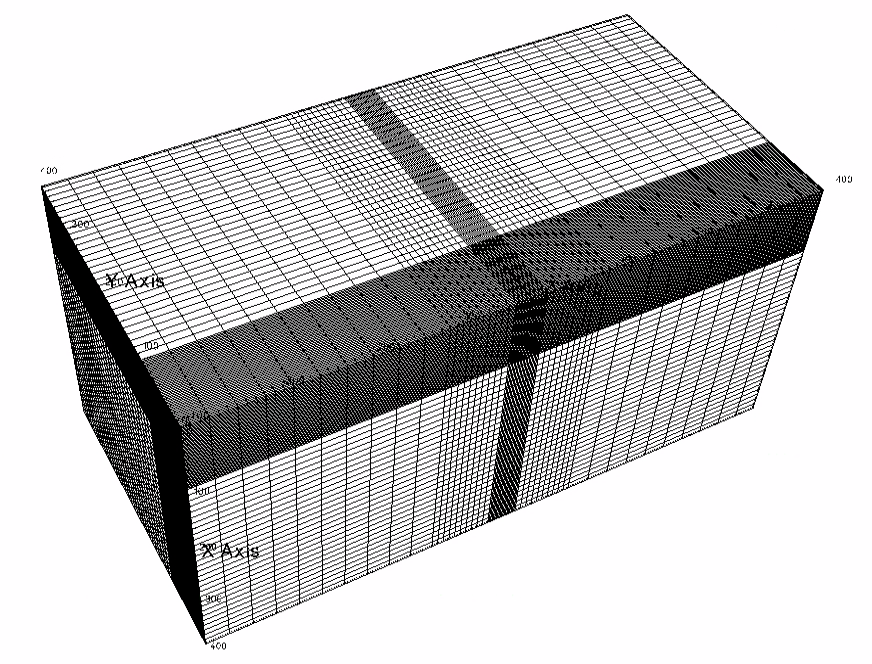

.. _pennyFracViscosityDominated:

###########################################################
Viscosity-Storage-Dominated Penny Shaped Hydraulic Fracture
###########################################################

**Context**

In this example, we simulate the propagation of a radial hydraulic fracture in viscosity-storage-dominated regime, another classic benchmark in hydraulic fracturing `(Settgast et al., 2016)  <https://onlinelibrary.wiley.com/doi/full/10.1002/nag.2557>`__. The fracture develops as a planar fracture with an elliptical cross-section perpendicular to the fracture plane and a circular fracture tip. Unlike the toughness-storage-dominated fractures, fluid frictional loss during the transport of viscous fracturing fluids governs the growth of viscosity-storage-dominated fractures. We solve this problem using the hydrofracture solver in GEOS. We simulate the change in length, aperture, and pressure of the fracture, and compare them against the corresponding analytical solutions `(Savitski and Detournay, 2002)  <https://www.sciencedirect.com/science/article/pii/S0020768302004924>`__. 

**Input file**

This example uses no external input files. Everything we need is contained within two GEOS input files:

.. code-block:: console

  inputFiles/hydraulicFracturing/pennyShapedViscosityDominated_base.xml

.. code-block:: console

  inputFiles/hydraulicFracturing/pennyShapedViscosityDominated_benchmark.xml

Python scripts for post-processing and visualizing the simulation results are also prepared:

.. code-block:: console

  inputFiles/hydraulicFracturing/scripts/hydrofractureQueries.py

.. code-block:: console

  inputFiles/hydraulicFracturing/scripts/hydrofractureFigure.py

------------------------------------------------------------------
Description of the case
------------------------------------------------------------------

We model a radial fracture emerging from a point source and forming a perfect circular shape in an infinite, isotropic, and homogenous elastic domain. As with the viscosity-dominated KGD problem, we restrict the model to a radial fracture developed in a viscosity-storage-dominated propagation regime. For viscosity-dominated fractures, more energy is applied to move the fracturing fluid than to split the intact rock. If we neglect fluid leak-off, the storage-dominated propagation occurs from most of the injected fluid confined within the opened surfaces. We use a low rock toughness (:math:`0.3 MPa { \sqrt{m} }`), and the slickwater we inject has a constant viscosity value (:math:`1.0 cp`) and zero compressibility. In addition, we assume that the fracture surfaces are impermeable, thus eliminating fluid leak-off. With this configuration, our GEOS simulations meet the requirements of the viscosity-storage-dominated assumptions.

The fluid injected in the fracture follows the lubrication equation resulting from mass conservation and Poiseuille's law. The fracture propagates by creating new surfaces if the stress intensity factor exceeds the local rock toughness :math:`K_{IC}`. By symmetry, the simulation is reduced to a quarter-scale to save computational cost. For verification purposes, a plane strain deformation is considered in the numerical model. 

We set up and solve a hydraulic fracture model to obtain the evolution with time of the fracture radius :math:`R`, the net pressure :math:`p_0` and the fracture aperture :math:`w_0` at the injection point for the penny-shaped fracture developed in viscosity-storage-dominated regime. `Savitski and Detournay (2002)  <https://www.sciencedirect.com/science/article/pii/S0020768302004924>`__ presented the corresponding asymptotic solutions, used here to validate the results of our GEOS simulations:

.. math:: R(t) = 0.6955 (\frac{ E_p Q_0^3 t^4 }{ M_p })^{ 1/9 }

.. math:: w_0(t) = 1.1977 (\frac{ M_p^2 Q_0^3 t }{ E_p^2 })^{ 1/9 } 

.. math:: p_0( \Pi, t ) = {\Pi}_{mo} (\xi) (\frac{ E_p^2 M_p }{ t })^{ 1/3 } 

where the plane modulus :math:`E_p` is related to Young's modulus :math:`E` and Poisson's ratio :math:`\nu`:

.. math:: E_p = \frac{ E }{ 1-\nu^2 }

The term :math:`M_p` is proportional to the fluid viscosity :math:`\mu`:

.. math:: M_p = 12 \mu

The viscosity scaling function :math:`{\Pi}_{mo}` is given as:

.. math:: {\Pi}_{mo} (\xi) = A_1 [ 2.479 - \frac{ 2 }{ 3 ( 1 - \xi )^{ 1/3 } } ] - B [ \text{ln}(\frac{ \xi }{ 2 }) + 1] 

with :math:`A_1 = 0.3581`, :math:`B = 0.09269`, :math:`c_1 = 0.6846`, :math:`c_2 = 0.07098`, and :math:`\xi = r/R(t)` denoting a dimensionless radial coordinate along the fracture.

For this example, we focus on the ``Mesh``,
the ``Constitutive``, and the ``FieldSpecifications`` tags.

------------------------------------------------------------------
Mesh
------------------------------------------------------------------

The following figure shows the mesh used in this problem.

.. _problemSketchPennyShapedViscosityDominatedFig:

   Generated mesh

We use the internal mesh generator to create a computational domain
(:math:`400\, m \, \times 400 \,  m \, \times 800 \, m`), as parametrized in the ``InternalMesh`` XML tag. 
The structured mesh contains 80 x 80 x 60 eight-node brick elements in the x, y, and z directions respectively. 
Such eight-node hexahedral elements are defined as ``C3D8`` elementTypes, and their collection forms a mesh
with one group of cell blocks named here ``cb1``. Local refinement is performed for the elements in the vicinity of the fracture plane. 

Note that the domain size in the direction perpendicular to the fracture plane, i.e. z-axis, must be at least ten times of the final fracture radius to minimize possible boundary effects. 

.. literalinclude:: ../../../../../../../inputFiles/hydraulicFracturing/pennyShapedViscosityDominated_benchmark.xml
    :language: xml
    :start-after: <!-- SPHINX_MESH -->
    :end-before: <!-- SPHINX_MESH_END -->

The fracture plane is defined by a nodeset occupying a small region within the computation domain, where the fracture tends to open and propagate upon fluid injection:

.. literalinclude:: ../../../../../../../inputFiles/hydraulicFracturing/pennyShapedViscosityDominated_benchmark.xml
  :language: xml
  :start-after: <!-- SPHINX_FRACPLANE -->
  :end-before: <!-- SPHINX_FRACPLANE_END -->

------------------------
Solid mechanics solver
------------------------

GEOS is a multi-physics platform. Different combinations of
physics solvers available in the code can be applied
in different regions of the domain and be functional at different stages of the simulation.
The ``Solvers`` tag in the XML file is used to list and parameterize these solvers.

Three elementary solvers are combined in the solver ``Hydrofracture`` to model the coupling between fluid flow within the fracture, rock deformation, fracture deformation and propagation:

.. literalinclude:: ../../../../../../../inputFiles/hydraulicFracturing/pennyShapedViscosityDominated_benchmark.xml
  :language: xml
  :start-after: <!-- SPHINX_HYDROFRACSOLVER -->
  :end-before: <!-- SPHINX_HYDROFRACSOLVER_END -->

- Rock and fracture deformation are modeled by the solid mechanics solver ``SolidMechanicsLagrangianSSLE``. In this solver, we define ``targetRegions`` that includes both the continuum region and the fracture region. The name of the contact constitutive behavior is specified in this solver by the ``contactRelationName``.

.. literalinclude:: ../../../../../../../inputFiles/hydraulicFracturing/pennyShapedViscosityDominated_benchmark.xml
  :language: xml
  :start-after: <!-- SPHINX_MECHANICALSOLVER -->
  :end-before: <!-- SPHINX_MECHANICALSOLVER_END -->

- The single-phase fluid flow inside the fracture is solved by the finite volume method in the solver ``SinglePhaseFVM``.

.. literalinclude:: ../../../../../../../inputFiles/hydraulicFracturing/pennyShapedViscosityDominated_benchmark.xml
  :language: xml
  :start-after: <!-- SPHINX_SINGLEPHASEFVM -->
  :end-before: <!-- SPHINX_SINGLEPHASEFVM_END -->

- The solver ``SurfaceGenerator`` defines the fracture region and rock toughness ``rockToughness="0.3e6"``. With ``nodeBasedSIF="1"``, a node-based Stress Intensity Factor (SIF) calculation is chosen for the fracture propagation criterion. 

.. literalinclude:: ../../../../../../../inputFiles/hydraulicFracturing/pennyShapedViscosityDominated_benchmark.xml
  :language: xml
  :start-after: <!-- SPHINX_SURFACEGENERATOR -->
  :end-before: <!-- SPHINX_SURFACEGENERATOR_END -->

------------------------------
Constitutive laws
------------------------------

For this problem, a homogeneous and isotropic domain with one solid material is assumed. Its mechanical properties and associated fluid rheology are specified in the ``Constitutive`` section. 
The ``ElasticIsotropic`` model is used to describe the mechanical behavior of ``rock`` when subjected to fluid injection.
The single-phase fluid model ``CompressibleSinglePhaseFluid`` is selected to simulate the response of ``water`` upon fracture propagation.

.. literalinclude:: ../../../../../../../inputFiles/hydraulicFracturing/pennyShapedViscosityDominated_base.xml
    :language: xml
    :start-after: <!-- SPHINX_MATERIAL -->
    :end-before: <!-- SPHINX_MATERIAL_END -->

All constitutive parameters such as density, viscosity, bulk modulus, and shear modulus are specified in the International System of Units.

------------------------------
Time history function
------------------------------

In the ``Tasks`` section, ``PackCollection`` tasks are defined to collect time history information from fields. 
Either the entire field or specified named sets of indices in the field can be collected.
In this example, ``pressureCollection``, ``apertureCollection``, ``hydraulicApertureCollection`` and ``areaCollection`` are specified to output the time history of fracture characterisctics (pressure, width and area). 
``objectPath="ElementRegions/Fracture/FractureSubRegion"`` indicates that these ``PackCollection`` tasks are applied to the fracure element subregion.

.. literalinclude:: ../../../../../../../inputFiles/hydraulicFracturing/pennyShapedViscosityDominated_base.xml
    :language: xml
    :start-after: <!-- SPHINX_TASKS -->
    :end-before: <!-- SPHINX_TASKS_END -->

These tasks are triggered using the ``Event`` manager with a ``PeriodicEvent`` defined for the recurring tasks. 
GEOS writes one file named after the string defined in the ``filename`` keyword and formatted as a HDF5 file (``pennyShapedViscosityDominated_output.hdf5``). This TimeHistory file contains the collected time history information from specified time history collector.
This file includes datasets for the simulation time, fluid pressure, element aperture, hydraulic aperture and element area for the propagating hydraulic fracture.
A Python script is prepared to read and query any specified subset of the time history data for verification and visualization. 

-----------------------------------------------------------
Initial and boundary conditions
-----------------------------------------------------------

Next, we specify initial and boundary conditions:

  - Initial values: the ``waterDensity``, ``separableFace`` and the ``ruptureState`` of the propagating fracture have to be initialized,
  - Boundary conditions: fluid injection rates and the constraints of the outer boundaries have to be set.

In this example, a mass injection rate ``SourceFlux`` (``scale="-6.625"``) is applied at the surfaces of the initial fracture. Only one fourth of the total injection rate is defined in this boundary condition because only a quarter of the fracture is modeled (the problem is symmetric). The value given for ``scale`` is :math:`Q_0 \rho_f/4` (not :math:`Q_0 /4`). 
All the outer boundaries are subject to roller constraints. 
These boundary conditions are set through the ``FieldSpecifications`` section.

.. literalinclude:: ../../../../../../../inputFiles/hydraulicFracturing/pennyShapedViscosityDominated_base.xml
    :language: xml
    :start-after: <!-- SPHINX_BC -->
    :end-before: <!-- SPHINX_BC_END -->

The parameters used in the simulation are summarized in the following table.

+------------------+-------------------------+--------------------+--------------------+
| Symbol           | Parameter               | Unit               | Value              |
+==================+=========================+====================+====================+
| :math:`K`        | Bulk Modulus            | [GPa]              | 20.0               |
+------------------+-------------------------+--------------------+--------------------+
| :math:`G`        | Shear Modulus           | [GPa]              | 12.0               |
+------------------+-------------------------+--------------------+--------------------+
| :math:`K_{IC}`   | Rock Toughness          | [MPa.m\ :sup:`1/2`]| 0.3                |
+------------------+-------------------------+--------------------+--------------------+
| :math:`\mu`      | Fluid Viscosity         | [Pa.s]             | 1.0x10\ :sup:`-3`  |
+------------------+-------------------------+--------------------+--------------------+
| :math:`Q_0`      | Injection Rate          | [m\ :sup:`3`/s]    | 0.0265             |
+------------------+-------------------------+--------------------+--------------------+
| :math:`t_{inj}`  | Injection Time          | [s]                | 400                |
+------------------+-------------------------+--------------------+--------------------+

---------------------------------
Inspecting results
---------------------------------

The following figure shows the distribution of :math:`\sigma_{zz}` at :math:`t=400 s` within the computational domain..

.. _problemVerificationPennyShapedViscosityDominatedFig:

   Simulation result of :math:`\sigma_{zz}` at :math:`t=400 s`

First, by running the query script 

.. code-block:: console

   python ./hydrofractureQueries.py pennyShapedViscosityDominated

the HDF5 output is postprocessed and temporal evolution of fracture characterisctics (fluid pressure and fracture width at fluid inlet and fracure radius) are saved into a txt file ``model-results.txt``, which can be used for verification and visualization:

.. code-block:: console
		
  [['      time', '  pressure', '  aperture', '    length']]
           2 1.654e+06 0.0006768     8.137
           4 1.297e+06  0.000743     10.59
           6 1.115e+06 0.0007734     12.36
           8 1.005e+06 0.0007918     13.73
          10 9.482e+05 0.0008189     15.14

Note: GEOS python tools ``geosx_xml_tools`` should be installed to run the query script (See `Python Tools Setup <https://geosx-geosx.readthedocs-hosted.com/projects/geosx-geospythonpackages/en/latest/>`_ for details). 
 
Next, GEOS simulation results (markers) and asymptotic solutions (curves) for the case with viscosity-storage
dominated assumptions are plotted together in the following figure, which is generated using the visualization script:

.. code-block:: console

   python ./pennyShapedViscosityDominatedFigure.py

As seen, GEOS predictions of the temporal evolution of fracture radius, wellbore aperture and pressure at fluid inlet are nearly identical to the asymptotic solutions.

.. plot:: docs/sphinx/advancedExamples/validationStudies/hydraulicFracture/pennyFracViscosityDominated/pennyShapedViscosityDominatedFigure.py

------------------------------------------------------------------
To go further
------------------------------------------------------------------

**Feedback on this example**

For any feedback on this example, please submit a `GitHub issue on the project's GitHub page <https://github.com/GEOS-DEV/GEOS/issues>`_.
