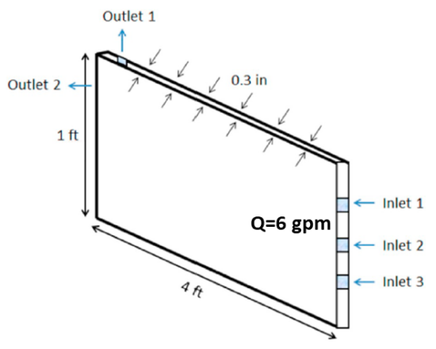
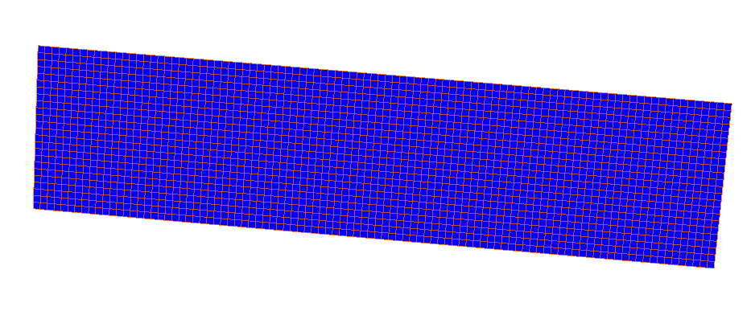
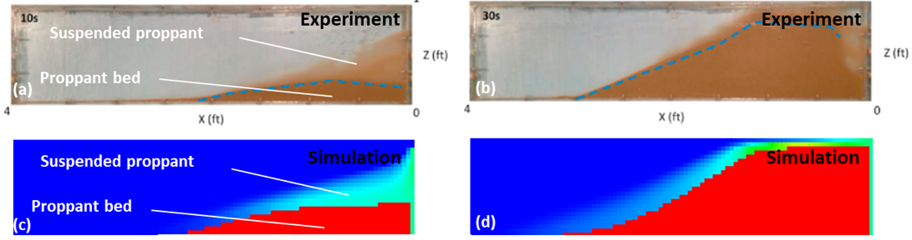

.. _ExampleProppantTest:

####################################################
Proppant Slot Test
####################################################

**Context**

In this example, a simulation is built up to model a proppant slot test. In this way, the implemented proppant model is validated by comparing numerical results with the corresponding experimental data. Furthermore, this calibrated proppant model can allow field engineers to customize stimulation design and optimize field operations in multiple engineering aspects `(Huang et al., 2021) <https://onepetro.org/ARMAUSRMS/proceedings/ARMA21/All-ARMA21/ARMA-2021-1248/467980>`__.

**Input file**

This example uses no external input files and everything is
contained within a single xml file that is located at:

.. code-block:: console

  inputFiles/proppant/ProppantSlotTest_base.xml

.. code-block:: console

  inputFiles/proppant/ProppantSlotTest_benchmark.xml

------------------------------------------------------------------
Description of the case
------------------------------------------------------------------

`Chun et al. (2020) <https://www.sciencedirect.com/science/article/pii/S0920410519309441>`__ conducted slot tests on proppant transport with slickwater. As shown below, a 4 ft X 1 ft slot with 0.3 in gap width was constructed. Three fluid inlets with 0.5 in inner diameter were placed at the right side of the slot, which were three inches away from each other. One outlet was placed on the top side to allow pressure relief. The other one was located on the left side acting as a fluid sink. In their tests, to resemble a slickwater fracturing treatment, the proppant concentration was kept at 1.5 ppg and the viscosity of carrying fluid was approximately 1 cp. The slurry was mixed well and then injected into the flow channel at a constant injection rate of 6 gpm. A simulation case with the same settings is built up to mimic these slot tests. A vertical and impermeable fracture surface is assumed in this case, which eliminates the effect of fracture plane inclination and fluid leak-off. A static fracture with an uniform aperture of 0.3 in is defined and fracture propagation is not involved. 30/50 mesh proppant is injected via the three inlets and is flowed through the slot for 30 seconds.

.. _problemSketchProppantSlotFig:

   Configuration of the slot for proppant transport experiment (after `Chun et al., 2020 <https://www.sciencedirect.com/science/article/pii/S0920410519309441>`__)

To simulate proppant transport phenomenon, a proppant solver based on the assumption of multi-component single phase flow is used in this example. Proppant concentration and distribution within the slot are numerically calculated by solving the equations of proppant transport in hydraulic fractures. These numerical predictions are then validated against the corresponding testing results `(Chun et al., 2020)  <https://www.sciencedirect.com/science/article/pii/S0920410519309441>`__.

In this example, we focus our attention on the ``Solvers``, ``Constitutive`` and ``FieldSpecifications`` tags.

------------------------------
Mesh
------------------------------

The following figure shows the mesh used for solving this problem.

.. _problemMeshProppantSlotFig:

   Mesh for simulating the proppant slot tests.

We use the internal mesh generator ``InternalMesh`` to create a computational domain. 
This mesh contains 2 x 97 x 24 eight-node brick elements in the x, y and z directions, respectively. 
Here, a structured three-dimensional mesh is generated with ``C3D8`` as the elementTypes (eight-node hexahedral elements). 
This mesh is defined as a cell block with the name ``cb1``.

.. literalinclude:: ../../../../../../../inputFiles/proppant/ProppantSlotTest_benchmark.xml
  :language: xml
  :start-after: <!-- SPHINX_PROPPANT_MESH -->
  :end-before: <!-- SPHINX_PROPPANT_MESH_END -->

---------------------------
Proppant transport solver
---------------------------

GEOS is a multi-physics platform. Different combinations of physics solvers available in the code can be applied in different regions of the domain and be functional at different stages of the simulation. The ``Solvers`` tag in the XML file is used to define these solvers.

To specify a coupling between two different solvers, we define and characterize each single-physics solver separately.
Then, we customize a *coupling solver* between these single-physics
solvers as an additional solver.
This approach allows for generality and flexibility in constructing multi-physics solvers.
The order of specifying these solvers is not restricted in GEOS.
Note that end-users should give each single-physics solver a meaningful and distinct name, as GEOS will recognize these single-physics solvers based on their customized names and create user-expected coupling.

As demonstrated in this example, to setup a coupled proppant transport solver, we need to define three different solvers in the XML file:

- the proppant transport solver for the fracture region, a solver of type ``ProppantTransport`` called here ``ProppantTransport`` (see :ref:`ProppantTransport` for more information),

.. literalinclude:: ../../../../../../../inputFiles/proppant/ProppantSlotTest_benchmark.xml
  :language: xml
  :start-after: <!-- SPHINX_PROPPANT_PROPPANTSOLVER -->
  :end-before: <!-- SPHINX_PROPPANT_PROPPANTSOLVER_END -->

- the single-phase flow solver, a solver of type ``SinglePhaseProppantFVM`` called here ``SinglePhaseFVM``,

.. literalinclude:: ../../../../../../../inputFiles/proppant/ProppantSlotTest_benchmark.xml
  :language: xml
  :start-after: <!-- SPHINX_PROPPANT_FLOWSOLVER -->
  :end-before: <!-- SPHINX_PROPPANT_FLOWSOLVER_END -->

- the coupling solver (``FlowProppantTransport``) that binds the two single-physics solvers above, which is named as ``FlowProppantTransport``

.. literalinclude:: ../../../../../../../inputFiles/proppant/ProppantSlotTest_benchmark.xml
  :language: xml
  :start-after: <!-- SPHINX_PROPPANT_COUPLEDSOLVER -->
  :end-before: <!-- SPHINX_PROPPANT_COUPLEDSOLVER_END -->

In this example, let us focus on the coupling solver.
This solver (``FlowProppantTransport``) describes the coupling process between proppant and flow transport within the ``Fracture`` region. In this way, the two single-physics solvers (``ProppantTransport`` and ``SinglePhaseFVM``) are sequentially called to solve the sub-problems (proppant transport and pressure problem, respectively) involved in this test case.

------------------------------
Constitutive laws
------------------------------

For this slot test, 30/50 mesh proppant is injected via the three inlets and flowing through the slot for 30 seconds. 
The viscosity of carrying fluid is 0.001 Pa.s to resemble slickwater fracturing. In this example, the solid and fluid materials are named as ``sand`` and ``water`` respectively. 
Proppant characterization and fluid rheology are specified in the ``Constitutive`` section: 

.. literalinclude:: ../../../../../../../inputFiles/proppant/ProppantSlotTest_base.xml
    :language: xml
    :start-after: <!-- SPHINX_PROPPANT_MATERIAL -->
    :end-before: <!-- SPHINX_PROPPANT_MATERIAL_END -->

The constitutive parameters such as proppant density and proppant diameter are specified in the International System of Units.

-----------------------------------------------------------
Initial and boundary conditions
-----------------------------------------------------------

The next step is to specify fields, including:

  - The initial value (fracture aperture, fluid pressure and proppant concentration within the fracture have to be initialized)
  - The boundary conditions (fluid pressure and proppant concentration at fluid inlets and outlets)
 
These boundary conditions are set up through the ``FieldSpecifications`` section.
At a constant injection rate, the slurry is equally flowing into the open channel through three inlets.

.. literalinclude:: ../../../../../../../inputFiles/proppant/ProppantSlotTest_base.xml
    :language: xml
    :start-after: <!-- SPHINX_PROPPANT_BC -->
    :end-before: <!-- SPHINX_PROPPANT_BC_END -->

Note: For static (non-propagating) fracture problems, the fields ``ruptureState`` and ``elementAperture`` should be provided in the initial conditions. 
``FieldName="pressure"`` here means that the source flux term is added to the mass balance equation for pressure.

The parameters used in the simulation are summarized in the following table.

+------------------+----------------------------------+------------------+---------------+
| Symbol           | Parameter                        | Unit             | Value         |
+==================+==================================+==================+===============+
| :math:`d_p`      | Proppant Diameter                | [m]              | 0.00045       |
+------------------+----------------------------------+------------------+---------------+
| :math:`f`        | Darcy Friction Coefficient       | [-]              | 0.04          |
+------------------+----------------------------------+------------------+---------------+
| :math:`N_{sh}`   | Critical Shields Number          | [-]              | 0.0           |
+------------------+----------------------------------+------------------+---------------+
| :math:`c_s`      | Max Fraction of Proppant         | [-]              | 0.62          |
+------------------+----------------------------------+------------------+---------------+
| :math:`\rho_f`   | Fluid Density                    | [kg/m^3]         | 1000          |
+------------------+----------------------------------+------------------+---------------+
| :math:`\mu_f`    | Fluid Viscosity                  | [Pa*s]           | 0.001         |
+------------------+----------------------------------+------------------+---------------+
| :math:`\rho_p`   | Proppant Density                 | [kg/m^3]         | 2550          |
+------------------+----------------------------------+------------------+---------------+
| :math:`\lambda_s`| Hindered Settling Coefficient    | [-]              | 4.5           |
+------------------+----------------------------------+------------------+---------------+
| :math:`c_p`      | Proppant Concentration in Slurry | [m^3/m^3]        | 0.07          |
+------------------+----------------------------------+------------------+---------------+
| :math:`L`        | Fracture Length                  | [m]              | 1.219         |
+------------------+----------------------------------+------------------+---------------+
| :math:`H`        | Fracture Height                  | [m]              | 0.3048        |
+------------------+----------------------------------+------------------+---------------+
| :math:`a`        | Fracture Aperture                | [m]              | 0.00762       |
+------------------+----------------------------------+------------------+---------------+
| :math:`Q`        | Injection Rate                   | [m^3/s]          | 0.0003785     |
+------------------+----------------------------------+------------------+---------------+

---------------------------------
Inspecting results
---------------------------------

The following figure shows the modelling prediction of proppant distribution at 10 s and 30 s, which are compared with the experiments in `(Chun et al., 2020)  <https://www.sciencedirect.com/science/article/pii/S0920410519309441>`__. Due to proppant settling in low viscosity fluid, a heterogeneous proppant distribution is obtained, which evolves with injection time. Three different zones (immobile proppant bed, suspended proppant and clean fluid) are visually identified for both the presented experiment and simulation. 

.. _problemVerificationProppantSlotFig:

   Proppant distribution profile

As shown below, consistently, the modelling predictions (green curve) on proppant transport and distribution show a good agreement with the reported experimental data (red dot) at each time. 

.. plot:: docs/sphinx/advancedExamples/validationStudies/hydraulicFracture/proppantSlotTest/proppantSlotTestFigure.py

------------------------------------------------------------------
To go further
------------------------------------------------------------------

**Feedback on this example**

This concludes the example on simulating a proppant slot test.
For any feedback on this example, please submit a `GitHub issue on the project's GitHub page <https://github.com/GEOS-DEV/GEOS/issues>`_.

**For more details**

  - More on proppant solver, please see :ref:`ProppantTransport`.
